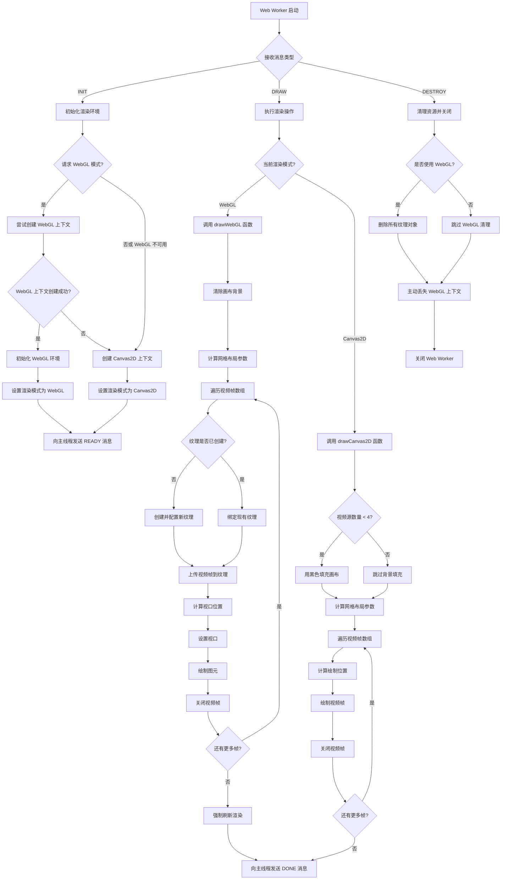

# WebGL Worker 执行流程图

## 详细说明

### 1. 消息处理流程
Web Worker 通过 `self.onmessage` 监听来自主线程的消息，根据不同消息类型执行不同操作：
- `INIT`: 初始化渲染环境
- `DRAW`: 执行渲染操作
- `DESTROY`: 清理资源并关闭 Worker

### 2. 初始化过程
当收到 `INIT` 消息时：
1. 首先检查是否请求 WebGL 模式
2. 如果是，则尝试创建 WebGL 上下文（优先 WebGL2，回退到 WebGL1）
3. 如果 WebGL 不可用或未请求，则创建 Canvas2D 上下文
4. 成功初始化后，向主线程发送 READY 消息

### 3. 渲染过程
当收到 `DRAW` 消息时：
1. 根据当前渲染模式选择 WebGL 或 Canvas2D 渲染路径
2. WebGL 渲染：
   - 清除画布背景
   - 计算网格布局（支持多路视频源）
   - 对每帧视频：
     * 检查并创建纹理（如需要）
     * 上传视频帧到纹理
     * 计算并设置视口位置
     * 绘制图元
     * 关闭视频帧以释放内存
   - 强制刷新渲染
3. Canvas2D 渲染：
   - 必要时填充背景
   - 计算网格布局
   - 对每帧视频：
     * 计算绘制位置
     * 绘制视频帧
     * 关闭视频帧以释放内存

### 4. 资源清理过程
当收到 `DESTROY` 消息时：
1. 如果使用了 WebGL，删除所有创建的纹理对象
2. 主动丢失 WebGL 上下文以释放 GPU 资源
3. 关闭 Web Worker