# MediaEffectsComposer · 项目学习手册

> 面向新人的架构学习手册。从整体到局部,用 Mermaid 图讲清楚"为什么这么设计"。
>
> 阅读顺序建议:先看【第 1 章 一图看懂】,再按章节顺序往下读,最后看【第 10 章 潜在架构问题】。

---

## 目录

1. [一图看懂(60 秒上手)](#1-一图看懂60-秒上手)
2. [整体架构](#2-整体架构)
3. [模块职责](#3-模块职责)
4. [模块依赖关系](#4-模块依赖关系)
5. [数据流向](#5-数据流向)
6. [初始化流程](#6-初始化流程)
7. [核心业务流程](#7-核心业务流程)
8. [核心类图](#8-核心类图)
9. [时序图](#9-时序图)
10. [设计模式](#10-设计模式)
11. [潜在架构问题](#11-潜在架构问题)
12. [新人快速上手清单](#12-新人快速上手清单)

---

## 1. 一图看懂(60 秒上手)

MediaEffectsComposer 是一个**多路音视频合成器(Mixer)**:把 N 路 `MediaStream`(最多 9 路)拼成一路新的 `MediaStream`,供 WebRTC 下游发送。

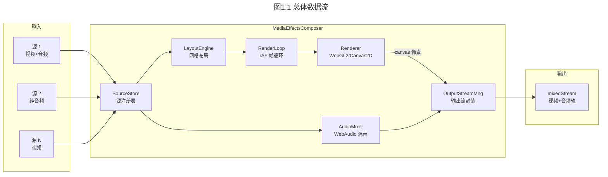

**一句话总结**:多路 in → SourceStore 管理 → LayoutEngine 算坐标 → RenderLoop 用 Renderer 画到一张离屏 canvas → OutputStreamManager 把 canvas 导出成 MediaStream;音频侧 AudioMixer 用 WebAudio 把各路音频混成一路。

---

## 2. 整体架构

### 2.1 分层视图

整个模块严格遵循**分层 + 单一职责**,自上而下分为四层:

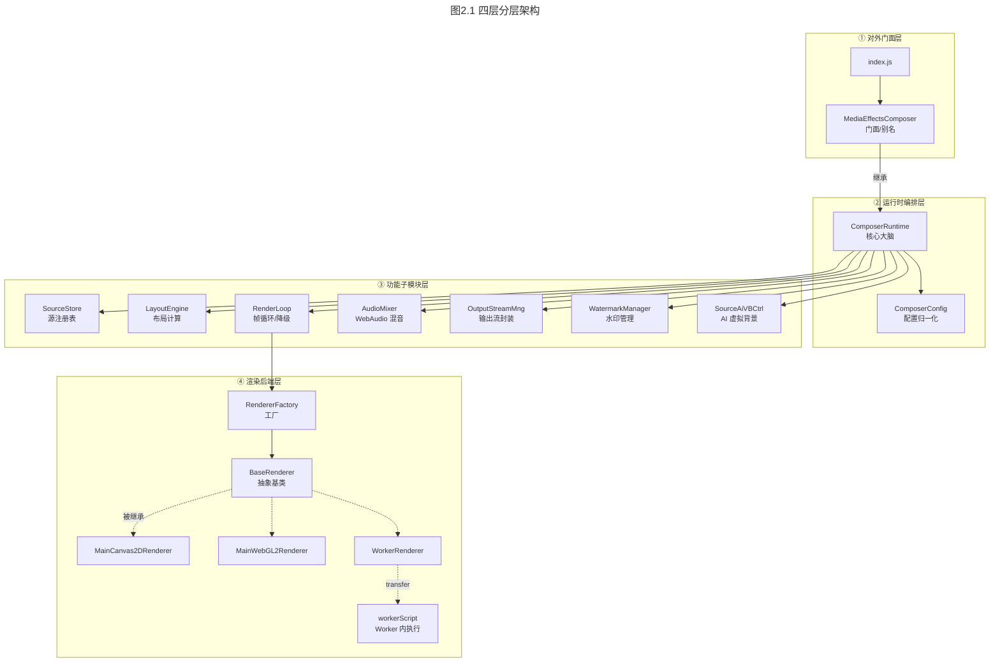

### 2.2 设计基调(为什么是这个形状)

| 设计选择 | 背后的原因 |
|---|---|
| **一张固定的离屏 canvas**(默认 1280×720) | 不随源数量变化;坐标计算稳定;captureStream/Insertable 都认这一张 canvas |
| **布局计算与绘制完全解耦** | LayoutEngine 只产 `{items:[{draw:{x,y,w,h}}]}`,四种渲染器(Canvas2D/WebGL2×主/Worker)共用同一份布局结果 |
| **渲染后端"可插拔 + 自动降级"** | 浏览器能力差异巨大(OffscreenCanvas、WebGL2、Worker),需要运行时探测+故障降级链 |
| **ComposerRuntime 是"薄编排者"** | 它只做组装和委派,真正干活的是子模块 |
| **纯函数配置归一化(ComposerConfig)** | 所有 `normalize*` 都是纯函数,易于测试、防御性编程 |
| **统一 Issue 上报通道** | 所有子模块通过注入的 `onIssue` 回调上报问题,汇聚到一处再冒泡到 RTCSession 事件 |

---

## 3. 模块职责

> 文件清单与行数(总计约 1.4 万行):

```
MediaEffectsComposer/
├── index.js                      4 行   公共入口,require 转发
├── MediaEffectsComposer.js      21 行   门面类(仅别名)
├── ComposerRuntime.js         1870 行   ★ 核心:初始化、编排、公开 API
├── ComposerConfig.js           232 行   纯函数配置归一化
├── SourceStore.js              464 行   源注册表(增删查改、slot 分配)
├── LayoutEngine.js             447 行   网格布局 + draw rect 计算
├── RenderLoop.js               807 行   rAF 帧循环 + 渲染降级调度
├── OutputStreamManager.js      991 行   canvas→MediaStream 输出封装
├── AudioMixer.js              1976 行   WebAudio 混音(最大模块)
├── WatermarkManager.js         688 行   水印配置/加载/布局
├── Renderers/
│   ├── BaseRenderer.js         151 行   渲染器抽象基类
│   ├── RendererFactory.js      220 行   渲染器工厂(含降级链)
│   ├── MainCanvas2DRenderer.js 420 行   主线程 Canvas2D(最终兜底)
│   ├── MainWebGL2Renderer.js   742 行   主线程 WebGL2
│   ├── WorkerRenderer.js       850 行   Worker 渲染代理
│   ├── workerScript.js        1360 行   Worker 内实际渲染脚本
│   ├── color.js                127 行   颜色解析工具
│   └── gl.js                    87 行   WebGL 工具
└── AIVirtualBackground/
    ├── SourceAiVBController.js 1281 行  源级 AiVB 生命周期控制
    ├── MediaPipeSegmenterRuntime.js 655 行  MediaPipe 分割器封装
    ├── AiVBAssetLoader.js      275 行   MediaPipe 运行时懒加载
    ├── AiVBConfig.js           305 行   AiVB 配置归一化
    └── AiVBSegmentationCommon.js 179 行 分割通用工具
```

### 各模块职责一句话

| 模块 | 职责 |
|---|---|
| **MediaEffectsComposer** | 门面,把 `appendStream/removeStream/clearStreams` 别名到 Runtime 的方法(向后兼容旧 API) |
| **ComposerRuntime** | 核心大脑。构造所有子模块、编排公开 API、提供"委派 get 属性"让旧代码访问子模块状态 |
| **ComposerConfig** | 纯函数集:`create/normalize*`,把外部杂乱配置统一成内部规范对象 |
| **SourceStore** | 输入源的"真相之源"。维护源列表、分配 slot、生成 ID、提供 `onBeforeRemove/onAfterRemove` 回调钩子 |
| **LayoutEngine** | 按 slot + 画布比例算出网格(cols×rows),为每路视频算等比缩放的 draw rect;纯几何,不碰渲染 |
| **RenderLoop** | `requestAnimationFrame` 驱动;fps 节流;按需 `ensureRenderer()`;检测渲染器故障并触发降级链 |
| **Renderer 系列** | 把 LayoutEngine 产出的 payload 真正画到 canvas。4 个实现 + 1 个工厂 + 1 个基类 |
| **AudioMixer** | WebAudio API:每路源独立 GainNode,汇总到 `MediaStreamAudioDestinationNode`;支持子混音(submix) |
| **OutputStreamManager** | canvas 像素 → MediaStream。优先 Insertable Streams(`VideoTrackGenerator`),回退 `captureStream(0)+requestFrame` |
| **WatermarkManager** | 水印配置归一化、图片异步加载、按 output/source 两种目标算绘制矩形 |
| **SourceAiVBController** | 每路源的 AI 虚拟背景(人像分割 + 背景替换/模糊/纯色)生命周期管理;用 WeakMap 存状态 |
| **MediaPipeSegmenterRuntime** | 封装 MediaPipe `ImageSegmenter`,逐帧分割产 alpha 遮罩 |
| **AiVBAssetLoader** | 通过注入 `<script type=module>` 懒加载 MediaPipe Tasks 运行时,全局去重 |

---

## 4. 模块依赖关系

### 4.1 依赖方向图(谁依赖谁)

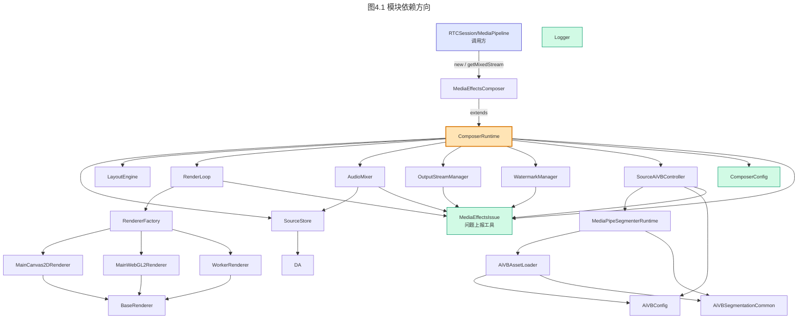

### 4.2 依赖关系要点

1. **依赖单向向下**:门面 → Runtime → 子模块 → 渲染器。没有反向依赖、没有循环依赖。
2. **ComposerRuntime 是唯一"全知"节点**:它构造所有子模块,子模块之间**不互相 new**,而是通过 Runtime 注入的回调(`getSources`、`createRenderPayload` 等)协作。
3. **MediaEffectsIssue 是横切关注点**:几乎所有子模块都依赖它做问题上报,但它本身是个无状态工具模块(纯函数),不构成耦合负担。
4. **SourceStore 是数据的单一来源**:AudioMixer 直接持有 `sourceRegistry` 引用查询源信息,而不是 Runtime 传给它。
5. **AiVB 子树自闭环**:`SourceAiVBController → MediaPipeSegmenterRuntime → AiVBAssetLoader`,对外只暴露 Controller 一个入口。

---

## 5. 数据流向

### 5.1 视频数据流(最核心)

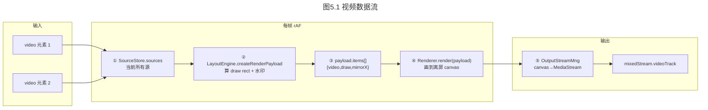

**关键点**:视频数据是"拉"模型——每帧由 rAF 主动从 `video` 元素读当前帧(通过 `drawImage` / 纹理上传 / `VideoFrame` 抽取),而不是源推送。

### 5.2 音频数据流

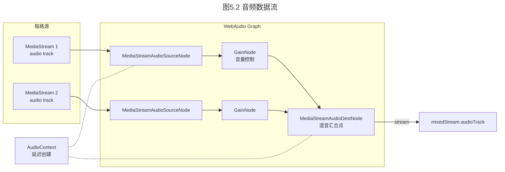

**关键点**:音频是"连接"模型——通过 WebAudio 节点图把各路源连到同一个 destination,音频样本在引擎内部流动,JS 层不接触。

### 5.3 控制流(Issue 上报)

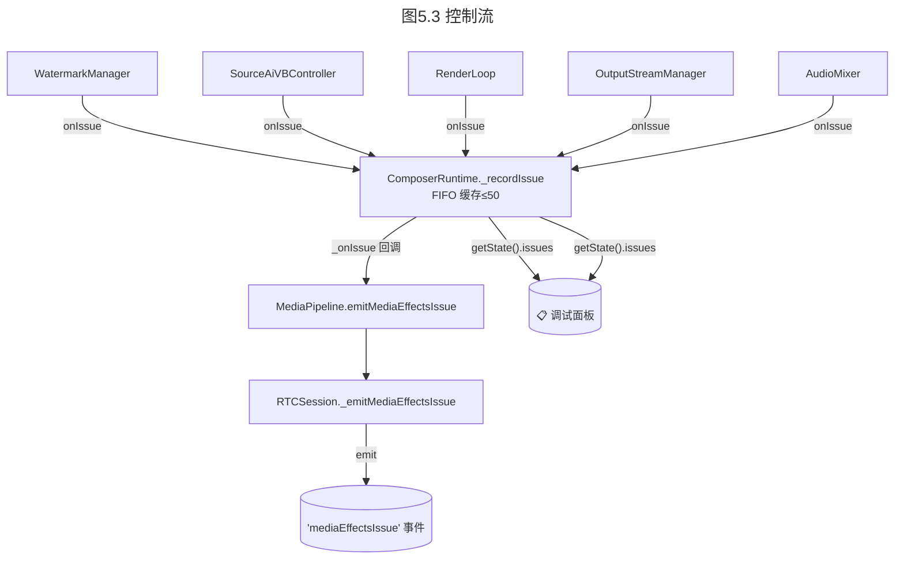

**关键点**:所有子模块通过构造时注入的 `onIssue: this._recordIssue.bind(this)` 获得上报能力,形成单一汇合点。FIFO 缓存防内存膨胀,深拷贝防外部篡改。

---

## 6. 初始化流程

### 6.1 构造函数时序

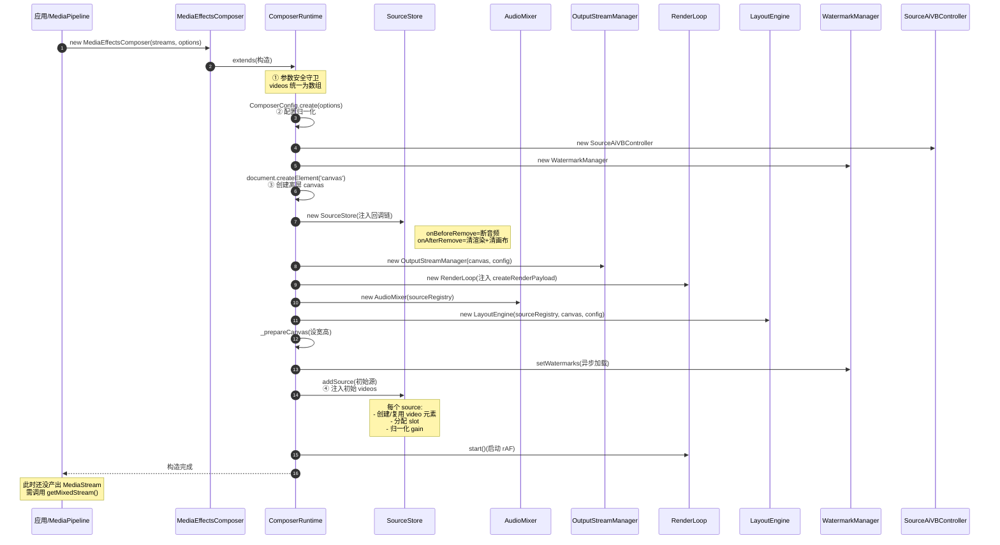

### 6.2 构造阶段的几个关键决策

1. **配置归一化前置**:任何非法值在 `ComposerConfig.create` 阶段就被拍成默认值,后续代码可以信任 config 的类型(`ComposerConfig.js:46`)。
2. **SourceStore 的回调链设计**:`onBeforeRemove`(断音频)→ `onAfterRemove`(清渲染/清画布)。这个顺序很关键:先断音频避免残留噪声,再清视频资源(`ComposerRuntime.js:360`)。
3. **Renderer 延迟创建**:构造时不创建 Renderer,第一次真正 `renderFrame` 时才 `ensureRenderer()`。好处是空源时不浪费 GPU 资源(`RenderLoop.js:182`)。
4. **水印异步加载不阻塞构造**:`setWatermarks` 返回 Promise,构造函数里只 `then` 后画一帧,失败也只上报不中断。
5. **AudioContext 延迟到首次 `getAudioStream`**:浏览器要求用户交互后才能创建/启动 AudioContext,所以构造时绝不碰它(`AudioMixer.js:57`)。

---

## 7. 核心业务流程

### 7.1 流程①:取流 `getMixedStream()`(最常用)

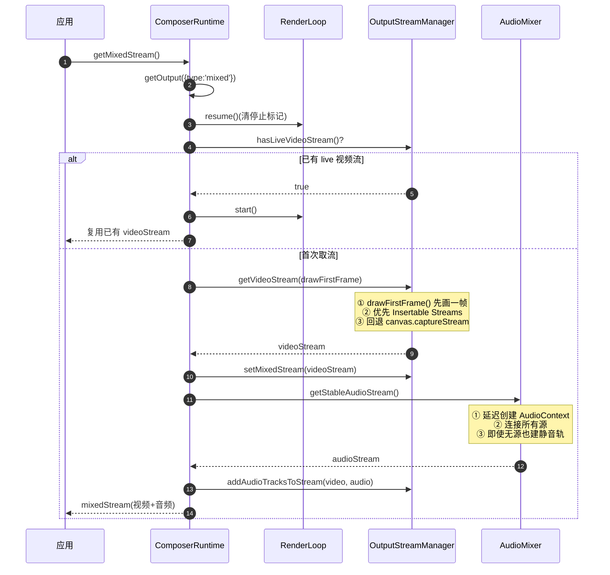

**两个值得注意的设计**:
- **`getStableAudioStream`** 保证了即使首次取流时还没有音频源,也会先创建一条"稳定的静音 destination track",后续新增源只更新 WebAudio graph,**不再向已返回的流追加第二条音轨**(避免下游混乱,`AudioMixer.js:219`)。
- **`ensureMixedStreamAudioTrack`** 处理"先取流、后加源"的延迟场景(`OutputStreamManager.js:818`)。

### 7.2 流程②:渲染一帧(每 fps 一次)

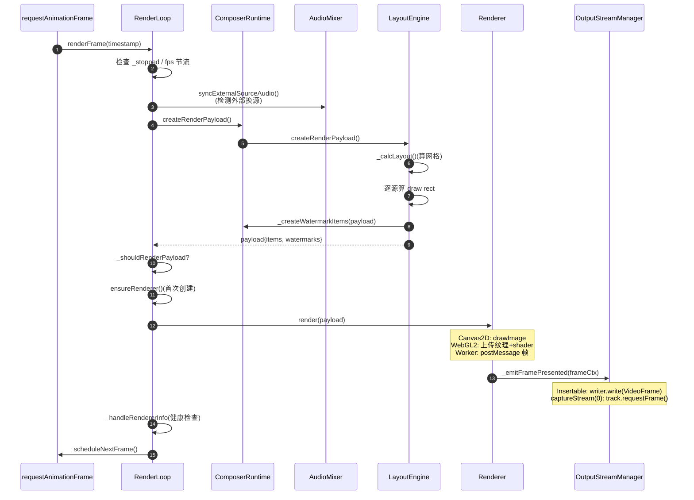

**节流与健康检查**:
- `_renderFrameInterval = 1000/fps`,不到间隔直接跳过绘制但继续 rAF(`RenderLoop.js:287`)。
- `_handleRendererInfo` 检测 Worker 渲染器是否报告 `worker-failed`,连续 2 次触发降级(`RenderLoop.js:642`)。

### 7.3 流程③:动态增删源

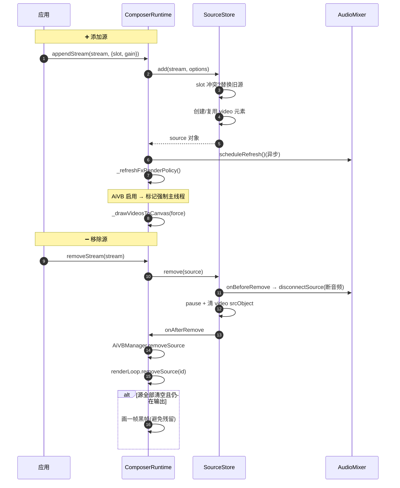

### 7.4 流程④:渲染后端自动降级(健壮性核心)

降级链是这个模块的"灵魂",保证在任何浏览器能力下都能出画面:

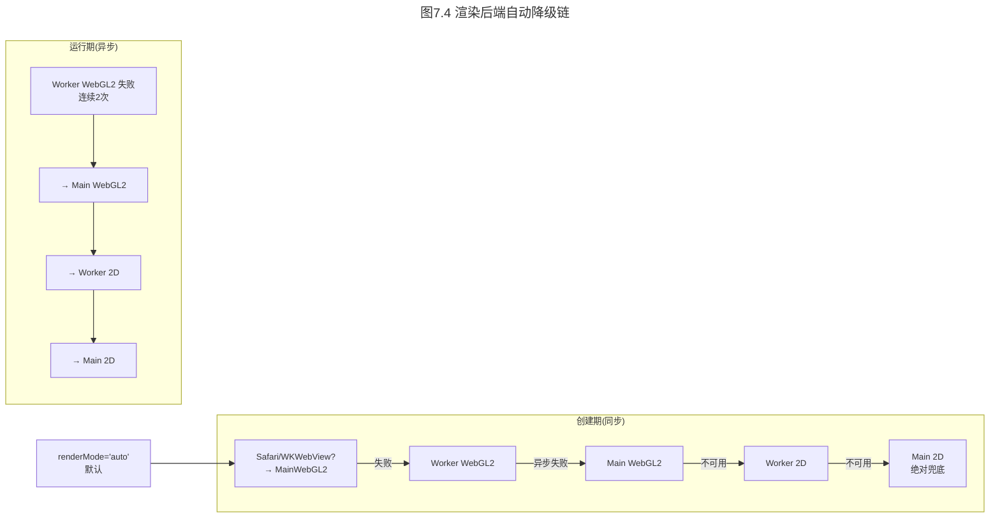

**两个层次的降级**:
1. **创建期(同步)**:`RendererFactory.createRenderer` 按顺序 try-catch,任何一个抛错就尝试下一个(`RendererFactory.js:32`)。
2. **运行期(异步)**:`RenderLoop.fallbackRenderer` 在 Worker 运行中报告 fatal 时触发,链是 `worker-webgl2 → main-webgl2 → worker-2d → main-2d`(`RenderLoop.js:357`)。

### 7.5 流程⑤:输出路径选择(Insertable vs captureStream)

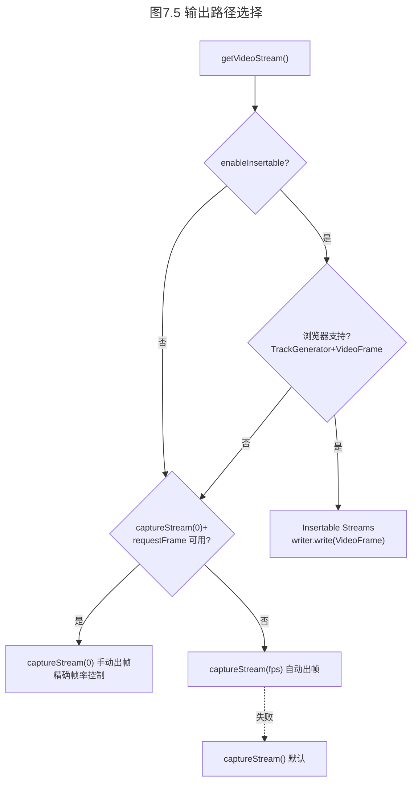

**为什么有两条路径**:
- **Insertable Streams**(`VideoTrackGenerator`):直接以 `VideoFrame` 对象喂给 track,延迟更低、与 WebRTC 编码管线衔接更顺,但浏览器支持有限。
- **`captureStream(0)+requestFrame`**:精确控制"每画完一帧才推一帧",避免浏览器自己按 fps 抽帧造成重复/丢帧。配合一个隐藏的"保活 video"规避 Chromium 在无人消费时降质的 bug(`OutputStreamManager.js:385`)。

---

## 8. 核心类图

### 8.1 整体类图

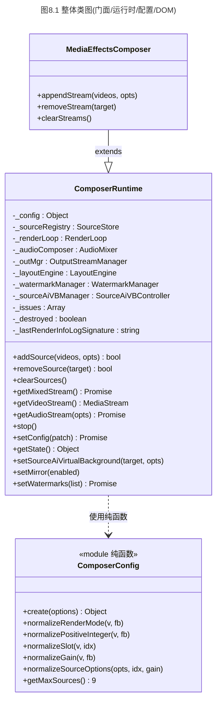

### 8.2 渲染器类层级(策略模式)

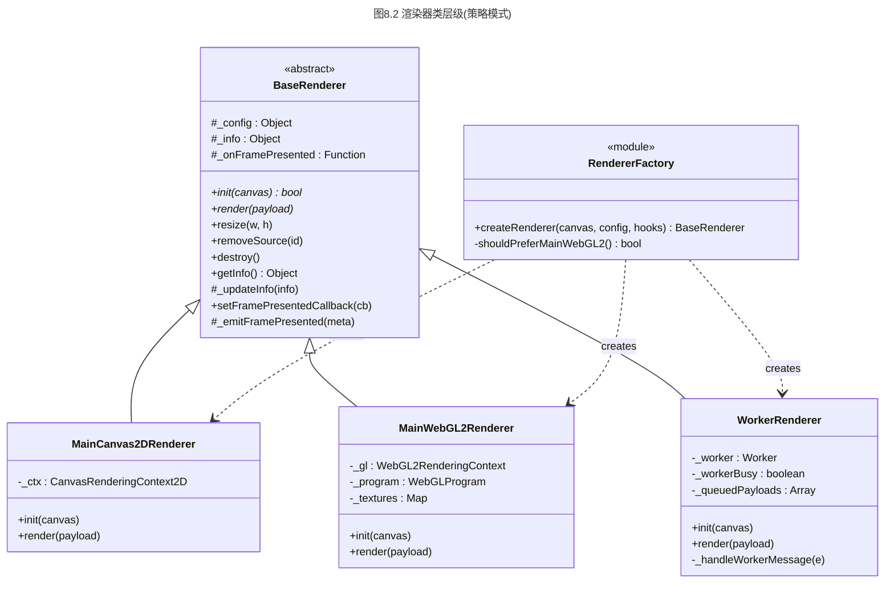

### 8.3 SourceStore / Source 数据模型

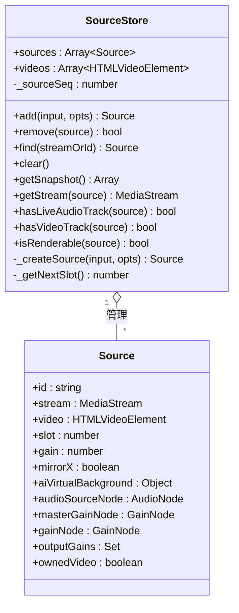

---

## 9. 时序图

### 9.1 完整生命周期(从 new 到 stop)

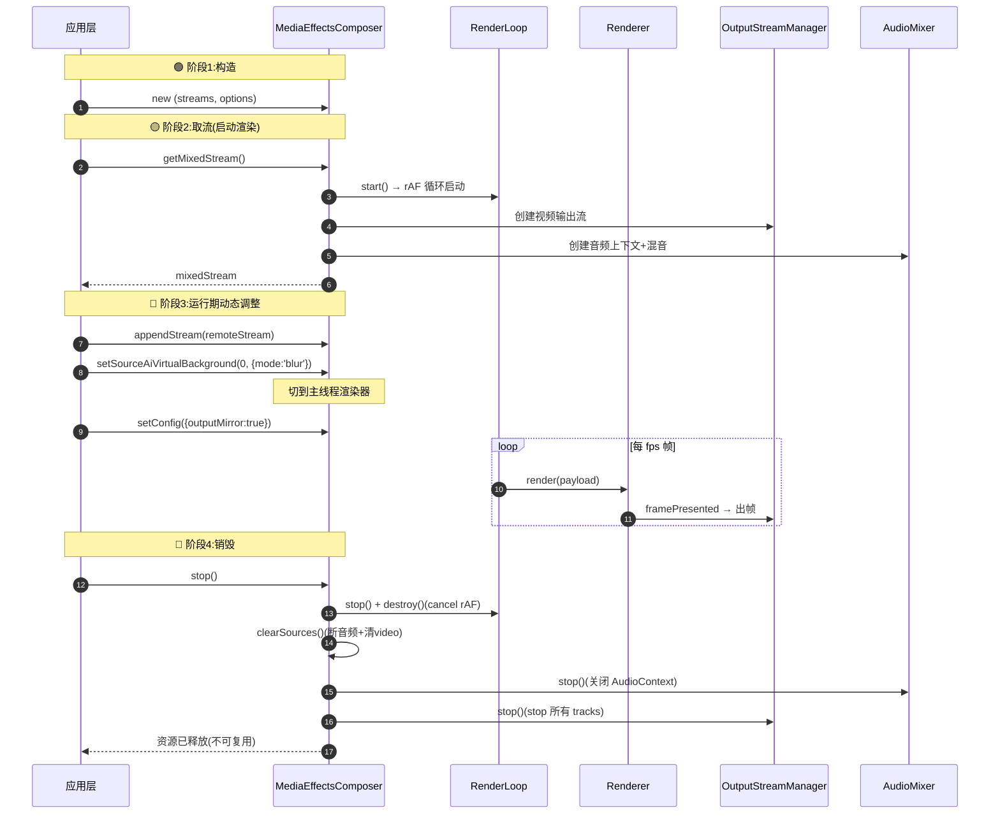

### 9.2 渲染降级时序(Worker 失败场景)

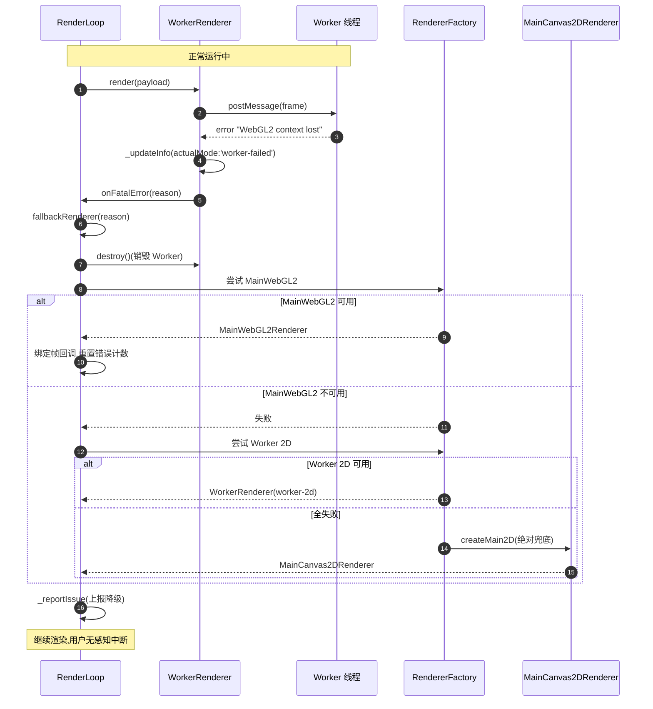

---

## 10. 设计模式

### 10.1 模式一览

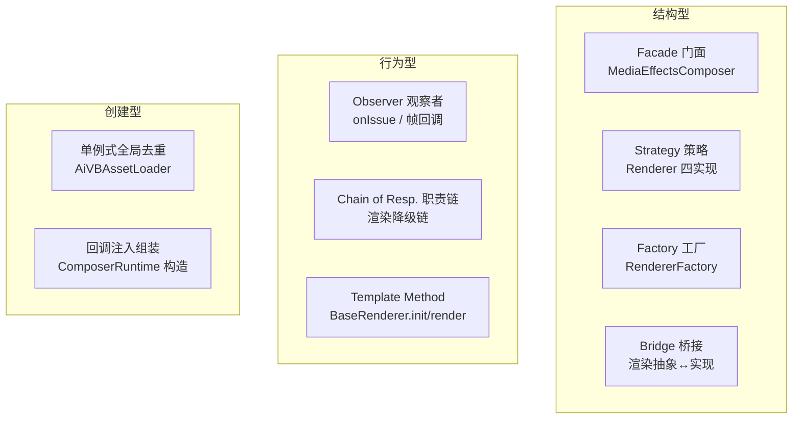

### 10.2 关键模式详解

#### ① 门面模式(Facade)— `MediaEffectsComposer`
`MediaEffectsComposer` 只是个 21 行的别名层,把旧 API(`appendStream/removeStream/clearStreams`)映射到 Runtime 的新 API(`addSource/removeSource/clearSources`)。这样既向后兼容,又允许内部重构命名。

#### ② 策略 + 工厂 + 模板方法 — 渲染器三件套
这是整个模块最精彩的设计:
- **`BaseRenderer`** 定义抽象接口(`init/render/resize/removeSource/destroy`)——**模板方法**。
- **4 个具体策略**(`MainCanvas2DRenderer`/`MainWebGL2DRenderer`/`WorkerRenderer`)——**策略**。
- **`RendererFactory.createRenderer`** 根据配置+能力探测选择策略——**工厂**。
- 上层(`RenderLoop`)只面向 `BaseRenderer` 编程,完全不关心具体是哪种后端——**桥接**。

> 这套设计让"在 Worker 里画 WebGL2"和"在主线程画 Canvas2D"对上层完全透明,布局结果(payload)可以原样复用。

#### ③ 职责链(Chain of Responsibility)— 渲染降级链
`RenderLoop.fallbackRenderer` 实现了一条明确的降级链:
```
worker-webgl2 → main-webgl2 → worker-2d → main-2d
```
每一级失败就把请求传给下一级,直到 `main-2d` 这个"绝对兜底"(Canvas2D 几乎所有浏览器都支持)。这是职责链的典型应用:**保证最终一定有人能处理**。

#### ④ 观察者(Observer)— Issue 上报 + 帧回调
两个方向的事件流都用观察者:
- **Issue 上报**:子模块 → Runtime → MediaPipeline → RTCSession 事件。所有子模块构造时注入 `onIssue` 回调,形成发布-订阅。
- **帧输出回调**:`Renderer._emitFramePresented` → `RenderLoop` → `OutputStreamManager.onFramePresented`。渲染器画完一帧就通知输出层"可以取帧了"。

#### ⑤ 观察者(Observer)— Issue 上报 + 帧回调
两个方向的事件流都用观察者:
- **Issue 上报**:子模块 → Runtime → MediaPipeline → RTCSession 事件。所有子模块构造时注入 `onIssue` 回调,形成发布-订阅。各子模块的 `_reportIssue` 直接透传 issue 到 `ComposerRuntime._recordIssue` 中央处理,避免多层归一化。
- **帧输出回调**:`Renderer._emitFramePresented` → `RenderLoop` → `OutputStreamManager.onFramePresented`。渲染器画完一帧就通知输出层"可以取帧了"。

#### ⑥ 状态聚合 — `getState()`
状态分散在多个子模块里(SourceStore 有源列表、RenderLoop 有渲染信息、AudioMixer 有音频状态)。`ComposerRuntime.getState()` 直接向各子模块收集数据并返回统一只读快照(不再通过独立的 `ComposerState` 类中转)。

#### ⑦ 全局去重(单例式)— `AiVBAssetLoader`
MediaPipe 运行时通过 `<script type=module>` 注入,挂在 `window.CRTCAiVBVisionTasks`。多个 AiVB 实例并发时,`AiVBAssetLoader` 用一个模块级 Map(`moduleUrl → Promise`)去重,**保证全局只加载一次**。这是"单例"思想在资源加载上的变体。

---

## 11. 潜在架构问题

> 以下是基于源码的客观观察,不是代码风格问题。每条都给出**现象 → 影响 → 建议**。

### 11.1 ⚠️ `ComposerRuntime` 承担过多职责(God Class 倾向)

**现象**:单个文件 1870 行,既管初始化、又管公开 API、又管镜像策略、又管 AiVB 策略、又管源移除回调链。还有一长串"委派 get 属性"(`_sources`/`_renderer`/`_audioSources`/`_videoStream` 等)纯粹是为了让旧代码访问子模块。

**影响**:
- 单一文件改动影响面大,merge 冲突概率高。
- "委派 get"暴露了内部子模块引用,外部理论上能 `composer._audioComposer.xxx` 穿透访问,破坏封装。

**建议**:把"镜像策略""AiVB 策略""输出编排"拆成独立协作者类(如 `MirrorPolicyResolver`、`EffectPolicyResolver`),Runtime 只保留编排骨架。委派 get 属性标 `@deprecated` 并逐步移除。

### 11.2 ⚠️ `AudioMixer` 单文件 1976 行,逻辑高度耦合

**现象**:AudioMixer 同时管:默认混音、按 slot 组合的 submix bus、独立 AudioContext 的 isolated submix、外部换源检测、批量刷新去重。这些职责挤在一个类里。

**影响**:子混音逻辑复杂,状态字段多(`_audioBuses`/`_isolatedSubmixes`/`_audioRefreshPromise`/`_audioRefreshScheduled`/`_audioRefreshPending`),新人难以快速理清"一次刷新会触发哪些副作用"。

**建议**:按职责拆分为 `DefaultMixer` / `SubmixBusManager` / `IsolatedSubmixManager`,共享一个 `AudioContextHolder`。

### 11.3 ⚠️ Worker 渲染路径的帧抽取开销

**现象**:`WorkerRenderer` 每帧要从主线程的 `video` 元素抽取 `VideoFrame`/`ImageBitmap` 再 `postMessage`(transfer)到 Worker,Worker 画完再用 `transferToImageBitmap` 传回,主线程再 `drawImage` 到输出 canvas(`WorkerRenderer.js` 注释明确说明这个设计)。

**影响**:
- 跨线程数据搬运有固有延迟,在低端机或高分辨率下可能抵消 Worker 带来的主线程解放收益。
- 设计上"不 transfer 输出 canvas 本身"是为了兼容性,但付出了"主线程仍要画一次"的代价。

**建议**:针对明确支持 `transferControlToOffscreen` 的高端浏览器(Chrome),提供一条"直接 transfer 输出 canvas"的快速路径,把主线程的最终 drawImage 也省掉。需要权衡 Insertable 输出路径的兼容性。

### 11.4 ⚠️ 异步竞态点多,缺少统一的取消机制

**现象**:多处异步操作通过 `generation` 计数器(`SourceAiVBController` 的 `state.generation += 1`)或 `_destroyed` 标志位来让"旧回调失效"。例如水印异步加载、AiVB 运行时初始化、音频刷新。

**影响**:
- 每个异步点都要手动维护"代数/标志",容易遗漏。一旦遗漏,会出现"stop 后旧 Promise 仍执行"的幽灵操作。
- 测试覆盖这些竞态成本高。

**建议**:引入一个统一的 `AbortController`/`CancellationToken` 抽象,在 `stop()` 时统一 abort,各异步点检查 token 而非各自的标志位。

### 11.5 ⚠️ "最大源数 = 9" 是硬编码常量

**现象**:`ComposerConfig.getMaxSources()` 返回写死的 `9`,且 `LayoutEngine._calcLayout` 的网格算法(1/2/4/6/9 分档)也是为 ≤9 设计的。

**影响**:
- 无法支持"1 大 N 小"之类的非对称布局(常见于会议的演讲者布局)。
- 超过 9 路直接截断,调用方只在日志里看到 warning。

**建议**:布局策略抽象成可插拔的 `LayoutStrategy` 接口,内置网格策略,允许业务注入自定义布局(如 `speakerLayout`、`galleryLayout`)。`maxSources` 改为配置项。

### 11.6 ⚠️ Issue 上报可能形成事件噪声

**现象**:降级链每一级失败都上报 issue(创建期 + 运行期),一个 Worker 故障可能触发 `renderer-fallback-requested` + `renderer-fallback-main-webgl2` + 可能的 `-failed` 多条。`MAX_REPORTED_ISSUES=50` 的 FIFO 缓存可能很快被同类问题填满。

**影响**:
- 调试面板看到的 issues 可能被同一故障的连锁上报刷屏,淹没真正的问题。
- 上层 `mediaEffectsIssue` 事件可能高频触发。

**建议**:对同类 issue 做去重/聚合(如相同 `stage` 在 N 秒内只上报一次 + 计数),类似 `_collectRenderInfo` 已有的签名去重机制,推广到 issue 通道。

### 11.7 ⚠️ 输出 canvas 的"保活 video"是脆弱的兼容手段

**现象**:`OutputStreamManager._ensureActiveCaptureSink` 会创建一个隐藏的 `<video>` 元素持续播放 captureStream 的输出,纯粹为了规避"Chromium 在无人消费时对 captureStream 降质/丢帧"(参考 `_createSinkVideoElement` 方法)。

**影响**:
- 多消耗一份解码资源(虽然隐藏,但仍在解码)。
- 这类浏览器兼容 hack 散落在业务代码里,随浏览器升级可能失效或变得多余,难以追踪。

**建议**:把所有"浏览器兼容补丁"集中到一个 `BrowserCompat` 模块并打上版本/UA 标注,定期清理。对这个具体补丁,加一个特性探测(检测是否真的会降质)而非无脑启用。

### 11.8 ⚠️ `ComposerRuntime` 与子模块双向回调耦合

**现象**:Runtime 向子模块注入大量回调(`getSources`、`createRenderPayload`、`syncExternalSourceAudio`、`prepareCanvas`、`resizeRenderer`、`createWatermarkItems`、`resolveMirrorX`……),子模块也向 Runtime 注入回调(`onBeforeRemove`、`onAfterRemove`、`onFramePresented`、`onIssue`……)。

**影响**:
- 双向依赖虽然没形成循环(都是 Runtime 主动注入),但回调接口多,改动一个子模块签名要在 Runtime 同步改。
- 时序耦合:SourceStore 的 `onAfterRemove` 注释明确提到"不直接访问 `this._sourceRegistry`,以减少时序耦合",说明作者已经意识到这个问题。

**建议**:定义清晰的"事件接口"(如 `ComposerEvents`),用单一事件总线替代零散回调;子模块只发事件不直接调 Runtime 方法。

---

## 12. 新人快速上手清单

### 12.1 推荐阅读顺序(由浅入深)

| 顺序 | 文件 | 目的 | 预计耗时 |
|---|---|---|---|
| 1 | `MediaEffectsComposer.js` + `index.js` | 知道入口长啥样(25 行) | 2 分钟 |
| 2 | `ComposerConfig.js` | 理解配置归一化的防御式编程风格 | 10 分钟 |
| 3 | `SourceStore.js` | 理解"源"的数据模型和生命周期 | 20 分钟 |
| 4 | `LayoutEngine.js` | 理解布局如何与渲染解耦 | 15 分钟 |
| 5 | `BaseRenderer.js` + `RendererFactory.js` | 理解策略+工厂+降级链 | 15 分钟 |
| 6 | `RenderLoop.js` | 理解 rAF 循环和健康检查 | 25 分钟 |
| 7 | `ComposerRuntime.js` | 串起所有子模块(核心,最难) | 60 分钟 |
| 8 | `OutputStreamManager.js` | 理解 Insertable vs captureStream | 30 分钟 |
| 9 | `AudioMixer.js` | 理解 WebAudio 混音(按需) | 40 分钟 |
| 10 | `AIVirtualBackground/*` | 理解 AI 虚拟背景(按需) | 40 分钟 |

### 12.2 调试时的常用入口

- **"现在走了哪条渲染路径?"** → `composer.getRenderInfo()`,看 `actualMode`/`isFallback`/`reason`。
- **"出问题了吗?"** → `composer.getIssues()` 或监听 session 的 `mediaEffectsIssue` 事件。
- **"整体状态快照"** → `composer.getState()`,含 sources/render/audio/config/issues。
- **"能力报告"** → `composer.getCapabilityReport()`,看支持的功能和限制。

### 12.3 改动时的检查清单

修改本模块代码时,自问以下问题:

- [ ] 我的改动会影响**初始化时序**吗?(构造函数里子模块创建顺序敏感)
- [ ] 我新增的异步操作,在 `stop()` 后会被正确取消吗?(检查 `_destroyed`/generation)
- [ ] 我改的是哪个渲染后端?四种(Canvas2D/WebGL2 × 主/Worker)都要同步改吗?
- [ ] 我的错误处理有**降级方案**吗?(本模块的哲学:任何失败都要能继续出画面)
- [ ] 我的新配置字段,在 `ComposerConfig.create` 里归一化了吗?
- [ ] 我的问题需要通过 `onIssue` 上报吗?(影响"降级/退化"的要上报)

---

### 📎 附:模块在整体 SDK 中的位置

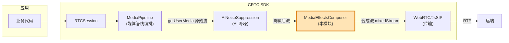

MediaEffectsComposer 位于**媒体管线的最后一站**:接收前序处理(降噪)后的流,完成视频合成/特效/水印,产出最终的发送流。理解这一点,就能明白为什么它的健壮性(降级链)如此重要——它失败了,通话视频就断了。

---

*本手册基于源码分析生成,涵盖 MediaEffectsComposer 模块约 1.4 万行代码。如有疑问,优先对照源码注释(本项目注释质量很高,几乎每个方法都有详细 JSDoc)。*
