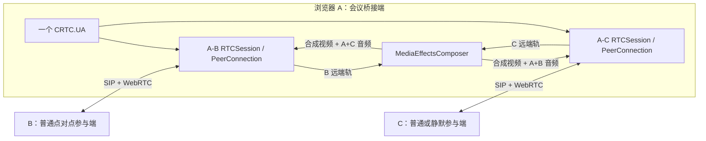
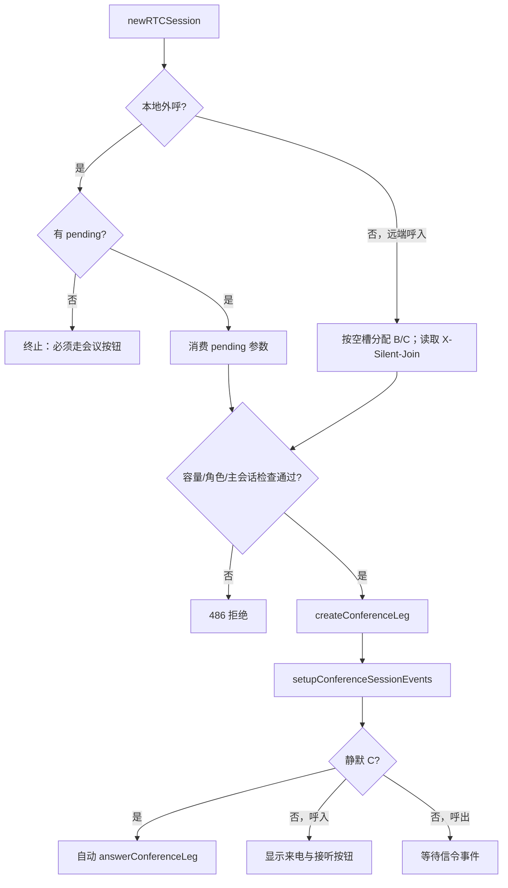

# `app-conference.js` 三方会议实现详解

本文档用于解释 [`demo/base-js/js/app-conference.js`](../demo/base-js/js/app-conference.js) 实现了什么、为什么这样实现，以及页面操作最终如何进入 CRTC SDK。阅读完后，应能独立回答以下问题：

- A、B、C 分别是什么角色，为什么 A 是“浏览器侧桥接端”。
- 两路 `RTCSession`、两个 `RTCPeerConnection` 和一个/两个 `MediaEffectsComposer` 如何配合。
- 普通 C 与静默 C 的呼叫、接听和媒体路由有什么区别。
- B、C 分别会听到什么、看到什么，如何避免音频回送。
- 来电如何分配 B/C 角色，什么情况下会被拒绝或自动接听。
- 定向屏幕共享为什么要单独增加 video m-line，并通过 SIP INFO 传递 MID。
- 成员挂断或 composer 失败后，代码如何恢复为仍可继续的点对点通话。

> 本文针对当前源码版本。`app-conference.js` 是 Demo 层实现，不是 SDK 内置的会议服务器或 MCU/SFU 功能。

## 1. 一句话理解整体设计

A 页面同时维护 A-B、A-C 两路独立的 SIP/WebRTC 通话，并在浏览器中把 A、B、C 的媒体送入 `MediaEffectsComposer`。合成器输出一条合成视频和按接收方定制的音频子混音，再通过两路 `RTCRtpSender` 分别发给 B、C。



这里没有建立一条真正的“三方 RTCSession”。从 SDK 角度看，A 只是同时进行两通电话；三方能力来自 Demo 对两通电话的会话管理和媒体桥接。

## 2. 文件位置、加载顺序与模块边界

页面脚本按以下顺序加载：

1. [`app-media-effects.js`](../demo/base-js/js/app-media-effects.js)：生成 composer、AiNS 等媒体配置。
2. [`app.sdk-helper.js`](../demo/base-js/js/app.sdk-helper.js)：设备约束、状态提示、媒体元素和弹窗辅助函数。
3. [`app.js`](../demo/base-js/js/app.js)：UA 配置、点对点通话和页面公共状态。
4. [`app-conference.js`](../demo/base-js/js/app-conference.js)：三方会议逻辑。
5. [`app.ui-bindings.js`](../demo/base-js/js/app.ui-bindings.js)：把页面按钮绑定到上述全局函数。

`app-conference.js` 没有模块导入/导出，而是依赖同一页面全局作用域中的变量和函数。主要外部依赖如下：

| 来源 | 被会议模块使用的内容 | 用途 |
| --- | --- | --- |
| `app.js` | `ua`、`rtcSession`、`statsSession`、`appMode`、`pcConfig`、`extraFeatures`、`sipDomain`、`xdata`、`noremb`、`camFlag` | 注册状态、当前会话、网络配置、SIP 地址和兼容开关 |
| `app.js` | `localVideo`、`remoteVideo` | A 本地预览和 B/C 远端主画面 |
| `app-media-effects.js` | `buildCallComposerOptions()`、`buildCallAiNsOptions()`、`handleSessionMediaEffectsIssue()` | 复用页面选择的镜像、水印、虚拟背景和 AiNS 配置 |
| `app.sdk-helper.js` | `buildSelectedAudioConstraints()`、`buildSelectedVideoConstraints()` | 获取页面当前选择的麦克风和摄像头约束 |
| `app.sdk-helper.js` | `setStatus()`、`bindMediaStreamIfChanged()`、来电通知和共享弹窗函数 | 页面反馈和媒体渲染 |
| CRTC SDK | `CRTC.UA`、`RTCSession`、`CRTC.Utils.getStreams()`、`closeMediaStream()` | SIP 会话、WebRTC 和资源释放 |
| 浏览器 API | `MediaStream`、`RTCPeerConnection`、`RTCRtpSender`、`getDisplayMedia()` | 轨道组合、替换和屏幕采集 |

会议模块并不自行监听 UA。`initializeDemoMode('conference')` 在 [`app.js`](../demo/base-js/js/app.js#L2788) 中创建唯一的 `CRTC.UA`，并将其 `newRTCSession` 事件绑定到 `handleConferenceNewRTCSession`。因此同一页面只会进入点对点处理器或会议处理器中的一个。

## 3. 角色、容量和两种 C

### 3.1 角色定义

| 角色 | 含义 | 会话 |
| --- | --- | --- |
| A | 当前选择“三方”模式的浏览器页面；固定为媒体桥接端 | 同时持有 A-B、A-C 两路会话 |
| B | 第一个会议成员，也是普通三方模式下 composer 的宿主 | A-B `RTCSession` |
| C | 第二个会议成员 | A-C `RTCSession` |

最多只允许两个成员 leg，即 B + C，常量 `CONFERENCE_MAX_LEGS` 固定为 `2`。

角色不是由远端传来的 `X-Conference-Role` 决定。代码使用 `getConferenceNextRole()` 按当前空槽分配：没有 B 时返回 B；已有 B 时返回 C。测试也明确保证外呼头中不发送角色头。

### 3.2 普通 C

普通 C 与 A 建立 `sendrecv` 音视频通话。A 会把 C 的远端音视频加入 A-B 主 composer：

- 视频输出：A + B + C 合成画面。
- 发给 B 的音频：A + C，即 slot `[0, 2]`。
- 发给 C 的音频：A + B，即 slot `[0, 1]`。

这样 B 不会收到自己的声音，C 也不会收到自己的声音。视频没有按接收方排除自身，两边收到的是同一条合成视频轨。

### 3.3 静默 C

静默 C 是 Demo 的观察/旁听模式：

- C 端在“点对点”模式点击“静默呼叫 A”。
- C 的呼叫方向为 `recvonly`，不采集、不发送音视频。
- 呼叫附带 `X-Silent-Join: true`。
- A 将其识别为第二路静默 C，并以本端 `sendonly` 自动接听。
- 静默 C 使用 A-C 会话自己的 composer，输出 A+B 给 C。
- A-B 主会话保持原始 A-B 媒体，不因静默 C 加入而改变。

静默身份只由 `X-Silent-Join` 判断。即使 SDP 自己包含 `a=recvonly`，没有该头部仍会被当作普通 C。

## 4. 核心状态模型

### 4.1 页面级会议状态

| 状态 | 类型 | 作用 |
| --- | --- | --- |
| `conferenceLegs` | `Map<session.id, leg>` | 保存所有 B/C 会话，是会议状态的主索引 |
| `conferencePendingOutgoing` | `object \| null` | 外呼创建期间的占位和参数交接对象，防止重复点击 |
| `conferenceSelectedLegId` | `string \| null` | 当前被统计面板和通话控制栏操作的成员 |
| `conferenceComposer` | composer/null | 当前活跃的会议 composer 缓存 |
| `conferenceComposerHostId` | session id/null | 当前 composer 属于哪条会话 |
| `conferenceScreenStream` | `MediaStream \| null` | 当前屏幕共享采集流 |
| `conferenceScreenStarting` | boolean | 防止并发启动屏幕共享 |
| `conferenceSyncQueue` | Promise | 串行执行合成同步，避免并发改 source/sender |
| `conferenceSyncTimer` | timer/null | 将同一轮连续 track 变化合并为一次同步 |
| `conferenceComposerSyncSignature` | string | 轨道没有变化时跳过重复同步 |

`conferencePendingOutgoing` 不只是“加载中”标志。`ua.call()` 触发 `newRTCSession` 时，`resolveConferenceSessionOptions()` 会消费这个对象，把之前准备好的 C 合成流、降级流等信息交给新 leg。

### 4.2 每个成员的 leg

`createConferenceLeg()` 为每条 `RTCSession` 创建一个 leg。字段可按职责分为五组：

| 分组 | 字段 | 含义 |
| --- | --- | --- |
| 身份 | `session`、`role`、`remoteNo`、`originator` | SDK 会话、B/C、号码、呼入或呼出 |
| 方向/生命周期 | `localDirection`、`silent`、`confirmed`、`answering`、`answerTimer`、`signalingStage`、`autoAnswer`、`ended` | 媒体方向、静默标志和会话阶段 |
| 远端媒体 | `remoteMainStream`、`remoteMainAudioTrack`、`remoteMainVideoTrack`、`audioElement` | 收集并播放远端主音视频 |
| composer/降级 | `original*Sender`、`original*Track`、`fallbackLocalStream`、`normalComposerHostId`、`composerSourceStream`、`conferenceAudioStream` | 合成、sender 替换和失败恢复 |
| 屏幕共享 | `screenTransceiver`、`screenSender`、`screenMid`、`screenActive`、`screenTarget` | 每路 PeerConnection 的共享 m-line 状态 |
| UI/统计 | `trackListenerAttached`、`latestStatsReport` | 防重复监听和保存最新统计报告 |

`originalAudioTrack`/`originalVideoTrack` 只在第一次发现 sender 时保存。后续即使 sender 已被 `replaceTrack()` 替换成混音轨，也不会覆盖原始快照，否则失败时无法恢复。

## 5. 从页面初始化到新会话

### 5.1 选择三方模式

页面点击 `#initializeConference` 后：

```text
app.ui-bindings.js
  → initializeDemoMode('conference')
    → new CRTC.WebSocketInterface(signalingUrl)
    → new CRTC.UA(configuration)
    → bindCommonUaEvents()
    → ua.on('newRTCSession', handleConferenceNewRTCSession)
    → updateAppModeUi()
    → ua.start()
```

模式选定后不能在当前页面切换；需要刷新页面。`updateAppModeUi()` 会展开会议面板、禁用点对点专属按钮，并调用 `updateConferenceUi()`。

### 5.2 `newRTCSession` 准入逻辑

所有呼入和呼出最终都进入 `handleConferenceNewRTCSession()`。检查顺序如下：

1. 本地外呼如果没有 `conferencePendingOutgoing`，说明不是从会议“添加成员”入口发起，立即终止。
2. 已有两个 leg 时，以 `486 Conference Full` 拒绝额外会话。
3. 本地外呼从 pending 对象取角色和媒体准备结果；远端呼入按空槽分配 B/C。
4. 角色重复时，以 `486 Conference Role Busy` 拒绝。
5. 第一通来电如果携带静默头，即“静默 B”，以 `486 Conference Host Not Ready` 拒绝。
6. 第二路 C 到达时，如果 B 不存在或尚未 `confirmed`，同样以 486 拒绝。
7. 合法会话创建 leg、绑定事件并刷新 UI。
8. 普通来电等待用户点击“接听来电”；静默 C 通过零延时任务自动调用 `answerConferenceLeg()`。



## 6. 外呼调用逻辑

### 6.1 添加 B

点击“添加成员”且当前没有 B 时：

```text
#conferenceCallVideo.onclick
  → getConferenceNextRole()                     // B
  → callConferenceVideo({ role: 'B' })
    → 检查三方模式、注册状态、容量、号码
    → 设置 conferencePendingOutgoing
    → buildConferenceCallOptions('B')
      → 使用页面选中的麦克风/摄像头约束
      → mediaEffectsComposer.enableInsertable = true
      → 配置 AiNS（如果页面启用）
      → 从 extraFeatures 移除 BFCP
    → ua.call('号码@域', callOptions)
    → newRTCSession
    → pending 参数转成 B leg
```

强制 `enableInsertable = true` 的原因是：即使页面没有选择任何媒体特效，B 会话也必须提前拥有 composer，后续 C 加入时才能动态追加 B/C 远端源。

### 6.2 添加普通 C

C 的外呼比 B 多出“信令前准备媒体”阶段：

```text
callConferenceVideo({ role: 'C' })
  → 要求 B 已 confirmed
  → 立即设置 pending，锁住重复点击
  → prepareNormalCComposerOutput(B)
    → ensureConferenceHostComposer(B)
    → cloneConferenceFallbackLocalStream(B)
    → 把 B 远端流放入 composer slot 1
    → 取得稳定合成视频轨
    → 取得给 C 的音频 [0,1] = A+B
    → 取得给 B 的音频 [0,2] = A+C（C 尚未到达时等价于 A）
    → 用后者替换 B 的 audio sender
    → 返回 C 的 mediaStream 和降级信息
  → buildConferenceCallOptions('C', output)
    → mediaStream = composer 视频 + A+B 音频
    → mediaConstraints = { audio: true, video: true }
  → ua.call(...)
```

这里把 composer 输出在 INVITE 创建前就绑定到 C 会话。C 确认后只需把 C 的远端源加进现有 canvas/audio graph，通常无需再次替换 C 的 sender，减少二次协商和轨道切换风险。

`mediaConstraints` 明确传 `{ audio: true, video: true }` 是为了让 SDK 保留自定义 `mediaStream` 中已有轨道，同时避免重复 `getUserMedia`。传 `false` 会移除轨道，省略又可能让约束处理收到 `undefined`。

如果媒体准备或 `ua.call()` 失败，`rollbackNormalCComposerOutput()` 会移除 B source、恢复 B 原始 sender、释放音频子混音，并关闭克隆的降级流。

### 6.3 静默 C 从另一个页面呼叫 A

静默 C 必须在另一个 Base JS Demo 页面选择“点对点”模式，然后点击“静默呼叫 A”：

```text
callConferenceAsSilentC()
  → mediaConstraints = { audio: false, video: false }
  → rtcOfferConstraints = { receiveAudio: true, receiveVideo: true }
  → X-Direction: recvonly
  → X-Silent-Join: true
  → ua.call(A)
```

C 端会监听 PeerConnection 的 `track` 和会话 `confirmed`，在 A 的合成轨到达后刷新点对点主画面。

## 7. 呼入与接听逻辑

`answerConferenceLeg()` 只处理 `originator === 'remote'`、尚未确认且不在接听中的 leg。

| 来电类型 | 接听媒体准备 | answer 方向 | composer |
| --- | --- | --- | --- |
| B | 页面选择的设备流 | `sendrecv` | B 会话独立创建，强制 insertable |
| 普通 C | 先执行 `prepareNormalCComposerOutput(B)` | `sendrecv` | 不为 C 新建 composer，直接使用 B composer 输出流 |
| 静默 C | 页面选择的 A 设备流 | `sendonly` | 在 A-C 会话上创建独立 composer |

接听后会按 `ua.configuration.no_answer_timeout` 设置保护定时器，缺省回退为 60 秒。如果会话没有进入 `accepted`/`confirmed`，将以 480 终止，避免 INVITE 长时间挂起。

普通 C 接听过程失败时，会回滚已经对 B composer 和 sender 做的修改。静默 C 自动接听失败时也会终止该会话。

## 8. 三方媒体合成核心

### 8.1 slot 约定

普通三方固定使用以下槽位：

| slot | 输入 | 来源 |
| ---: | --- | --- |
| 0 | A 原始摄像头/麦克风 | B 会话 composer 的初始输入 |
| 1 | B 远端音视频 | A-B PeerConnection 的 remote tracks |
| 2 | C 远端音视频 | A-C PeerConnection 的 remote tracks |

输出关系：

| 接收方 | 视频 | 音频 | 目的 |
| --- | --- | --- | --- |
| B | composer 合成视频 A+B+C | `[0,2]` = A+C | 排除 B 自己的声音 |
| C | composer 合成视频 A+B+C | `[0,1]` = A+B | 排除 C 自己的声音 |

### 8.2 合成触发和串行化

远端轨到达、轨结束、会话确认等场景都会调用 `scheduleConferenceSync()`。它有三层保护：

1. `setTimeout(..., 0)` 把同一事件循环内的连续变化防抖成一次。
2. `conferenceSyncQueue.then(syncConferenceComposer)` 保证 composer source 和 sender 修改串行执行。
3. `getConferenceComposerSyncSignature()` 用两条会话 ID、C 类型以及四条远端轨的 `id/readyState` 构建签名，没有变化则跳过。

### 8.3 普通 C 同步

`syncConferenceComposer()` 在 B、C 都 `confirmed` 后执行：

1. 使用 B 会话 composer。
2. 补齐 B/C 当前已有的远端轨。
3. slot 1 放 B，slot 2 放 C；旧 source 先移除再替换。
4. 取得 composer 视频轨。
5. 复用信令前已创建的 B/C 音频子混音。
6. 确认 B 的 audio sender 使用 A+C 音轨。
7. 如果 C 原本绑定的是当前 B composer，不替换 C sender；canvas/audio graph 内容会自动更新。
8. 如果是“旧 B 已挂断、保留普通 C、又补入新 B”的宿主切换场景，则把 C sender 切换到新 B composer，并重新保存一份 A 原始轨克隆作为降级流。

### 8.4 静默 C 同步

静默 C 不能使用 B 会话 composer，否则一旦把 B 加入主 composer，B 自己正在接收的画面也会变成 A+B。代码改为：

1. 使用静默 C 会话自己的 composer。
2. 该 composer 的 slot 0 已是 A 本地设备流。
3. 只把 B 远端流加入 slot 1。
4. composer 的稳定输出自动变成 A+B，并只通过 A-C 会话发送。
5. 不调用任何 B 或 C sender 的 `replaceTrack()`。

### 8.5 composer 与页面媒体效果

`getConferenceMediaEffectsComposer()` 优先返回当前会议 composer。`app-media-effects.js` 的媒体效果面板会先调用它，再回退到全局 `rtcSession.getMediaEffectsComposer()`。因此三方模式下镜像、水印、虚拟背景等操作会落到会议实际使用的 composer。

需要注意：静默 C 场景的“当前会议 composer”会切换到 A-C 会话的独立 composer；普通三方则是 A-B 主 composer。

## 9. RTCSession 事件与媒体轨管理

### 9.1 会话事件

`setupConferenceSessionEvents()` 监听的主要事件如下：

| 事件 | 处理 |
| --- | --- |
| `sending`、`trying`、`progress`、`connecting` | 更新 `signalingStage` 和页面状态 |
| `sdp` | 记录 SDP 阶段；若启用 `noremb`，删除 goog-remb 和 transport-cc 反馈行 |
| `remoteSupportsVideo` | 提示远端支持视频 |
| `accepted` | 清除接听中状态和接听超时 |
| `confirmed` | 标记确认、收集远端轨、保存原始 sender、刷新 UI、调度合成 |
| `cameraChanged`、`localMediastreamUpdate` | 刷新 A 本地预览 |
| `hold`、`unhold`、`muted`、`unmuted` | 更新页面状态 |
| `refer` | 三方期间拒绝远端 REFER |
| 多个 PeerConnection/SDP 失败事件 | 记录失败阶段并提示媒体协商失败 |
| `failed`、`ended` | 清除定时器并进入 `cleanupConferenceLeg()` |
| `mediaEffectsIssue` | 呼入会话手工绑定公共媒体效果错误处理器 |
| `stats:detailed-report` | 缓存和渲染当前选中会话统计 |

### 9.2 远端轨收集

`attachConferenceTrackListener()` 每个 leg 只绑定一次 `RTCPeerConnection.track`：

- 首条 live audio/video track 分别保存到 `remoteMainAudioTrack`、`remoteMainVideoTrack`。
- 两者加入同一个 `remoteMainStream`，供 composer 作为一个 source 使用。
- 音频另建隐藏 `<audio autoplay>` 播放，视频交给页面预览函数。
- 轨道 `ended` 时从 stream 移除、清空字段并重新调度合成。

`hydrateConferenceRemoteMainStream()` 是补偿路径：它通过 `CRTC.Utils.getStreams(connection, 'remote')` 获取可能已经存在的远端轨，覆盖 early media 或 `track` 监听绑定稍晚的情况。

### 9.3 页面预览

- `remoteVideo` 优先显示 B。
- `#conferenceRemoteVideoC` 显示普通 C。
- B 没有视频时，普通 C 自动占用主区域。
- 静默 C 本来不上传视频，因此不会保留空白的 C 预览区域。
- `localVideo` 优先显示 B 会话 `getComposerInputStream()` 中 A 的原始视频，而不是合成输出；没有 composer 输入时才回退到本地 stream。

## 10. 选中成员、通话控制和统计

三方模式下 `rtcSession` 不再表示“唯一会话”，而是被 `selectConferenceLeg()` 更新为当前选中的 B 或 C。`statsSession` 同步指向同一会话。

动态成员列表中，每个 leg 有三个按钮：

1. 成员按钮：选中该会话，并切换统计和通用控制目标。
2. 屏幕按钮：切换 `screenTarget`。
3. 挂断按钮：只终止该成员。

`bindConferenceSelectedSessionControls()` 将公共控制栏重绑定到当前成员，覆盖：

- 挂断。
- 麦克风/摄像头 mute、unmute。
- hold/unhold。
- RFC2833 DTMF。
- SIP INFO。
- 前后摄像头切换并重新协商。
- `setVideoContentHint()`。

统计来自每条 `RTCSession` 的 `stats:detailed-report`：

- 连接状态、ICE、DTLS。
- 上下行实际/可用码率。
- RTT 和上下行网络质量等级。
- 音视频 codec、MID、码率、抖动、丢包。
- 视频分辨率、FPS、编码/解码耗时和质量限制原因。
- SDK `quality.issues` 的中文映射和严重级别。

非当前选中 leg 的统计只缓存到 `latestStatsReport`，切换成员后立即渲染，不需要等待下一次统计事件。

## 11. 定向屏幕共享

### 11.1 为什么不用 BFCP

三方共享为每条目标 PeerConnection 自己增加第二条 video m-line，并通过 re-INVITE 协商，因此 `buildConferenceExtraFeatures()` 会从 `extraFeatures` 中移除 BFCP，避免 SDK 再插入无用的 BFCP 占位轨。

### 11.2 发起流程

用户先在成员列表选择一个或两个共享目标，再点击“开始共享”：

```text
startConferenceScreenShare()
  → getDisplayMedia(video: max 1920x1080 @ 15fps, audio: false)
  → contentHint = 'detail'
  → 对每个 screenTarget 顺序执行 shareConferenceScreenToLeg()
    → 有可复用 screenSender + screenMid：replaceTrack(screenTrack)
    → 否则 connection.addTransceiver(screenTrack, sendonly)
    → session.renegotiate({ useUpdate: false, terminateOnFailure: false })
    → 等待 transceiver.mid
    → SIP INFO: { event: 'screen-share', action: 'start', mid }
```

`renegotiateConferenceScreen()` 有两段超时：

- 最长 10 秒等待会话可发起 re-INVITE，每 100ms 重试。
- re-INVITE 发起后最长 15 秒等待回调。

协商完成后再最多等待 3 秒取得 MID。

如果复用旧 sender 的 `replaceTrack()` 因编码范围不兼容而失败，代码会先把旧 sender 置空，再创建新 transceiver 和新 m-line。单个目标失败不会阻止其他目标继续；只要至少一个成功，共享就保留。

### 11.3 接收端如何识别共享轨

B/C 使用点对点模式的 [`app.js`](../demo/base-js/js/app.js#L500) 接收共享：

1. `track` 事件按 transceiver MID 缓存所有远端视频轨。
2. `newInfo` 收到 `screen-share/start` 后记录共享 MID。
3. 若 INFO 先到，等待轨到达；若轨先到，等待 INFO 到达。
4. MID 与轨匹配后，将该轨渲染到 `#remoteVideo2` 并打开共享浮层。
5. `screen-share/stop` 或轨 `ended` 时清空共享画面。

这套双向缓存解决了 SIP INFO 与 WebRTC track 到达顺序不固定的问题。

### 11.4 停止流程

`stopConferenceScreenShare()` 对所有 `screenActive` leg：

1. 发送 `screen-share/stop` INFO。
2. `screenSender.replaceTrack(null)` 停止发送，但保留 m-line 供下次复用。
3. 清空本地共享预览和弹窗。
4. 如果不是由系统共享按钮触发的 track `ended`，主动停止采集流中的轨。

共享过程中不能改变目标；UI 会禁用成员的共享目标按钮。

## 12. 挂断、清理与失败降级

### 12.1 单 leg 清理

`cleanupConferenceLeg()` 只执行一次，主要步骤为：

1. 标记 `ended`，清除接听定时器。
2. 停止该 leg 的屏幕 sender。
3. 移除隐藏的远端音频元素。
4. 关闭该 leg 的 `fallbackLocalStream`。
5. 从 `conferenceLegs` 删除。
6. 按 B/C 类型决定剩余会话是否保留。
7. 从 composer 移除 source，恢复 sender，释放子混音。
8. 选择下一个可用成员或重置统计面板。
9. 刷新本地/远端画面和会议按钮。

### 12.2 不同挂断场景

| 场景 | 结果 |
| --- | --- |
| C 挂断，B 保留 | B sender 恢复原始 A 媒体，会议退化为 A-B |
| B 挂断，C 为静默 C | 自动终止静默 C，因为它离开 B 后没有独立通话意义 |
| B 挂断，C 为普通 C | 保留 A-C；C sender 切回预先克隆的 A 原始音视频 |
| 普通 C 保留后加入新 B | 新 B 成为 composer 宿主，C sender 切到新 composer，重新形成三方 |
| 最后一条会话结束 | 停止屏幕共享，清空本地和远端主画面 |

### 12.3 为什么需要 fallback 克隆流

普通 C 的 sender 使用 B 会话 composer 输出。B 会话结束时，其会话级 composer 会被 SDK 销毁，composer 输出轨也随之失效。创建 C 之前，代码会通过 `getComposerInputStream()` 取得 A 原始流并逐轨 `clone()`，保存到 C leg。

B 结束后，`restoreConferenceLegOriginalMedia(C, endedBId)` 使用克隆轨替换 C sender，使 A-C 继续通话。不能直接复用 B composer 的输入轨，因为它的所有权和生命周期仍属于 B 会话。

### 12.4 composer 同步失败

任何 `syncConferenceComposer()` 异常都会被队列统一捕获：

- 从 composer 移除所有 leg source。
- 清空同步签名。
- 恢复各会话的原始 sender 或 fallback sender。
- 释放 `[0,2]`、`[0]`、`[0,1]` 子混音输出。
- 保留仍然存在的点对点会话，不主动挂断。

这体现了该 Demo 的核心降级原则：媒体特效/合成失败时优先保住基础通话。

## 13. SIP 头和页面内部协议

### 13.1 呼叫/接听头部

| 场景 | 头部 |
| --- | --- |
| A 呼叫普通 B/C | `X-Data`、`X-UA`、`X-Direction: sendrecv` |
| 静默 C 呼叫 A | 上述业务头 + `X-Direction: recvonly` + `X-Silent-Join: true` |
| A 接听普通 B/C | `X-Direction: sendrecv` |
| A 接听静默 C | `X-Direction: sendonly` |

`isConferenceHeaderEnabled()` 接受 `true`、`1`、`yes`，忽略大小写和分号后的参数。

### 13.2 屏幕共享 INFO

内容类型为 `application/json`：

```json
{
  "event": "screen-share",
  "action": "start",
  "mid": "2"
}
```

停止时 `action` 为 `stop`。接收端只依赖 `event`、`action`、`mid`。

## 14. REFER 行为

三方激活时不支持 REFER：

- 本地 REFER 按钮被禁用。
- 收到远端 `refer` 事件时调用 `data.reject()`。

只有 `conferenceLegs.size === 1` 且该 leg 已确认时，`referConferenceTwoPartyCall()` 才允许执行：先 hold 当前会话，再调用 `session.refer()`；REFER 失败时恢复 unhold，成功接受后终止原会话。

“取消呼转”通过 `sendInfo('text/plain', JSON.stringify({ event: 'cancel' }))` 通知远端。

## 15. 主要 SDK/浏览器 API 调用表

| API | 在本文件中的用途 |
| --- | --- |
| `ua.call(target, options)` | 创建 A-B/A-C 外呼，或静默 C 呼叫 A |
| `session.answer(options)` | 接听 B/C 来电 |
| `session.terminate()` | 挂断、拒绝或超时关闭会话 |
| `session.getMediaEffectsComposer()` | 取得当前会话 composer |
| `session.updateMediaEffectsComposer()` | B composer 不存在时运行时创建 |
| `session.getComposerInputStream()` | 获取 A 原始输入，用于预览和 fallback 克隆 |
| `composer.addSource/removeSource()` | 动态加入/移除 B、C 远端流 |
| `composer.getVideoStream()` | 取得稳定的合成视频轨 |
| `composer.getAudioStream({ slots })` | 创建给 B/C 的定制音频子混音 |
| `composer.releaseSubmixAudioStream()` | 释放对应 slots 的音频输出资源 |
| `sender.replaceTrack()` | 切换混音、fallback 或屏幕共享轨 |
| `connection.addTransceiver()` | 为定向屏幕共享新增 sendonly video m-line |
| `session.renegotiate()` | 通过完整 re-INVITE 协商屏幕 m-line |
| `session.sendInfo()` | 发送共享 start/stop 和取消呼转信息 |
| `session.mute/unmute/hold/unhold()` | 当前选中成员的通话控制 |
| `session.sendDTMF()` | 发送 RFC2833 DTMF |
| `navigator.mediaDevices.getDisplayMedia()` | 获取 A 的屏幕轨 |
| `CRTC.Utils.getStreams()` | 从 PeerConnection 补齐本地/远端轨 |
| `CRTC.Utils.closeMediaStream()` | 停止 fallback 或共享流 |

## 16. UI 状态规则

`updateConferenceUi()` 是会议面板的统一刷新入口：

- 有待手工接听的普通来电时才显示“接听来电”。
- pending 外呼存在或成员已满时隐藏“添加成员”。
- 下一角色为 C 但 B 尚未确认时，禁用“添加成员”。
- 没有任何成员时禁用“全部挂断”。
- 至少选择一个已确认的共享目标后才能开始共享。
- 共享启动中或已经共享时不能再次开始。
- 共享活动期间显示“停止共享”，隐藏“开始共享”。
- 三方激活时禁用 REFER 和取消 REFER。

`conferencePendingOutgoing` 会在 C 媒体准备开始前立即设置，因此用户快速双击“添加成员”不会创建两路相同 C 会话。

## 17. 设计限制与接入注意事项

1. **这是固定三方 Demo，不是通用 N 方会议。** 容量和 B/C slot 都是硬编码的，扩展到更多成员需要重新设计音频排除、视频布局和会话管理。
2. **A 是单点桥接瓶颈。** A 同时编码/发送两路通话并进行 canvas/audio 混合，CPU、上行带宽和页面生命周期都会影响整场会议。
3. **A 页面关闭后会议结束。** B、C 之间没有直接 SIP/WebRTC 会话。
4. **角色依赖到达顺序。** 第一成员是 B，第二成员是 C，不依赖远端声明。
5. **C 必须等待 B confirmed。** 这是准入硬条件，不支持两路并行建链后再合并。
6. **静默模式是 Demo 私有约定。** 依赖 `X-Silent-Join` 和接收端页面逻辑，第三方终端不会自动理解。
7. **视频不排除自己。** 普通 B/C 都接收 A+B+C 合成视频；只有音频按接收方排除了自身。
8. **屏幕共享依赖 SIP INFO + MID。** 远端必须实现对应 INFO 解析和第二视频轨渲染。
9. **屏幕不含系统音频。** `getDisplayMedia` 明确使用 `audio: false`。
10. **页面全局变量耦合较强。** 抽到业务项目时应明确传入依赖，但不应改变 SDK 的会话和媒体时序。
11. **自动播放可能受浏览器策略限制。** 代码对 `play()` 失败静默处理，真实产品应提供明确的用户交互恢复入口。
12. **浏览器兼容需实机验证。** 多 PeerConnection、同一屏幕轨发给多个 sender、动态 transceiver、re-INVITE 和 composer 都属于高风险 WebRTC 路径。

## 18. 排查问题的推荐顺序

### 18.1 C 无法加入

1. 确认 A 页面选择的是三方模式且已注册。
2. 确认 B leg 存在并已收到 `confirmed`。
3. 检查是否已有 pending 外呼或两个 leg 已满。
4. 查看 `[conference] ... stage=...` 日志，判断停在 INVITE、SDP、accepted 还是 confirmed。
5. 普通 C 检查 `prepareNormalCComposerOutput()` 是否取得 composer 视频和两条音频子混音。
6. 静默 C 检查 `X-Silent-Join: true` 是否到达 A；只发 recvonly SDP 不够。

### 18.2 B/C 没有声音

1. 检查 A、B、C 远端 audio track 是否为 `live`。
2. 检查 composer slot：A=0、B=1、C=2。
3. B 应使用 `[0,2]`，C 应使用 `[0,1]`。
4. 检查 `originalAudioSender.track` 当前是否已经替换为预期子混音轨。
5. 查看 `stats:detailed-report` 的 outbound/inbound 音频码率、丢包和抖动。
6. 若出现“三方媒体合成失败，已保留原始通话”，说明代码已经进入降级路径，应继续检查 composer 异常。

### 18.3 屏幕共享不显示

1. A 端确认目标 leg 已 `confirmed` 且 `screenTarget=true`。
2. 检查 `addTransceiver()` 和 re-INVITE 是否成功。
3. 检查 `screenTransceiver.mid` 是否在 3 秒内产生。
4. 检查 SIP INFO 是否携带相同 MID。
5. B/C 端检查 `newInfo` 与 `track` 两条路径是否都触发。
6. 检查 MID 对应 receiver track 是否 `live`，以及 `#remoteVideo2` 是否绑定成功。

### 18.4 B 挂断后 C 也没有媒体

1. 确认 C 是普通 C；静默 C 本来就会随 B 自动结束。
2. 检查 C leg 是否保存了 `fallbackLocalStream`。
3. 检查 `normalComposerHostId` 是否等于已结束 B 的 session ID。
4. 检查 `restoreConferenceLegOriginalMedia()` 是否把 C sender 替换为 fallback 克隆轨。

## 19. 现有测试覆盖

专项测试位于 [`test/test-conference.js`](../test/test-conference.js)，覆盖的关键行为包括：

- 页面只选择一个 `newRTCSession` 处理器。
- B/C 按槽位顺序分配。
- 只有 `X-Silent-Join` 能标记静默 C。
- B 未准备好、会议已满时的 486 拒绝。
- 静默 C 的 recvonly 呼叫参数。
- 统计面板与当前 PeerConnection 标签。
- C 媒体准备期间防止重复添加。
- 原始 sender 快照不会被混音轨覆盖。
- 普通 C 在信令前绑定 A-B composer 输出。
- 普通 C 加入时复用预绑定 sender，不做多余替换。
- 静默 C 使用独立 composer，B 保持原始媒体。
- B 挂断时终止静默 C、保留普通 C。
- composer 宿主 B 结束后，普通 C 使用 A 克隆轨降级。
- 接听阶段的同步/异步 PeerConnection 与 SDP 失败处理。

## 20. 函数阅读索引

建议按“入口 → 会话 → 媒体 → 清理 → UI”阅读，而不是从第一行顺序读到底。

### 20.1 入口与会话

| 函数 | 作用 |
| --- | --- |
| `handleConferenceNewRTCSession` | 所有会议新会话的准入和分类入口 |
| `resolveConferenceSessionOptions` | 将 pending 外呼或呼入请求解析成 leg 参数 |
| `createConferenceLeg` | 创建并注册 B/C 状态对象 |
| `setupConferenceSessionEvents` | 绑定 RTCSession 全生命周期事件 |
| `callConferenceVideo` | A 添加普通 B/C |
| `callConferenceAsSilentC` | 点对点页面作为静默 C 呼叫 A |
| `answerConferenceLeg` | A 接听普通/静默 B/C |

### 20.2 composer 与媒体

| 函数 | 作用 |
| --- | --- |
| `buildConferenceComposerOptions` | 强制创建可动态插源的 composer |
| `ensureConferenceHostComposer` | 确保 B 会话存在 composer |
| `prepareNormalCComposerOutput` | 在 C 信令前生成稳定的 composer 输出 |
| `rollbackNormalCComposerOutput` | C 创建失败时恢复 B |
| `scheduleConferenceSync` | 防抖并串行调度合成 |
| `syncConferenceComposer` | 普通/静默三方合成核心 |
| `updateConferenceComposerSource` | 安全替换某 leg 的 composer source |
| `rememberConferenceOriginalSenders` | 保存首次 sender/track 快照 |
| `restoreConferenceLegOriginalMedia` | 恢复原始或 fallback 轨 |
| `releaseConferenceComposerOutputs` | 释放子混音并清空 composer 缓存 |

### 20.3 远端轨、预览和统计

| 函数 | 作用 |
| --- | --- |
| `attachConferenceTrackListener` | 监听并维护远端主轨 |
| `hydrateConferenceRemoteMainStream` | 从 PeerConnection 补齐已有远端轨 |
| `bindConferenceRemoteAudio` | 为每个 leg 创建隐藏音频播放器 |
| `renderConferenceMainVideo` | B/C 远端画面布局 |
| `renderConferenceLocalVideo` | A 原始输入预览 |
| `selectConferenceLeg` | 切换当前会话和统计目标 |
| `bindConferenceStatsEvents` | 消费 SDK 详细统计事件 |
| `renderConferenceStatsReport` | 渲染连接、质量和媒体指标 |

### 20.4 屏幕、控制和清理

| 函数 | 作用 |
| --- | --- |
| `startConferenceScreenShare` | 获取屏幕并向选中成员发送 |
| `shareConferenceScreenToLeg` | 为单个 leg 复用/新建屏幕 sender |
| `renegotiateConferenceScreen` | 发起并等待共享 re-INVITE |
| `sendConferenceScreenInfo` | 通过 INFO 通知共享 MID 和动作 |
| `stopConferenceScreenShare` | 停止所有目标的屏幕发送 |
| `cleanupConferenceLeg` | 单 leg 完整资源清理和降级 |
| `terminateConferenceLeg` | 挂断指定成员 |
| `terminateConference` | 挂断全部成员并取消 pending |
| `bindConferenceSelectedSessionControls` | 让公共控制栏操作当前成员 |
| `updateConferenceUi` | 统一刷新成员、接听、共享、REFER 等按钮 |

## 21. 最短阅读路线

如果只想快速掌握主干，依次阅读以下函数即可：

```text
initializeDemoMode（app.js）
  → handleConferenceNewRTCSession
  → createConferenceLeg
  → setupConferenceSessionEvents
  → callConferenceVideo / answerConferenceLeg
  → prepareNormalCComposerOutput
  → syncConferenceComposer
  → cleanupConferenceLeg
  → updateConferenceUi
```

掌握这条链后，再分别阅读 `callConferenceAsSilentC()` 和屏幕共享函数，即可覆盖该文件绝大多数功能。
