# 三方会议、屏幕标注与共享白板实现详解

本文档用于解释 [`demo/base-js/js/app-conference.js`](../demo/base-js/js/app-conference.js) 和 [`demo/base-js/js/app-annotation.js`](../demo/base-js/js/app-annotation.js) 实现了什么、为什么这样实现，以及页面操作最终如何进入 CRTC SDK。阅读完后，应能独立回答以下问题：

- A、B、C 分别是什么角色，为什么 A 是“浏览器侧桥接端”。
- 两路 `RTCSession`、两个 `RTCPeerConnection` 和一个/两个 `MediaEffectsComposer` 如何配合。
- 普通 C 与静默 C 的呼叫、接听和媒体路由有什么区别。
- B、C 分别会听到什么、看到什么，如何避免音频回送。
- 来电如何分配 B/C 角色，什么情况下会被拒绝或自动接听。
- 定向屏幕共享如何通过 SDK `RTCSession.share()` 为每条会话发送独立辅流。
- 屏幕标注和共享白板如何通过 SIP INFO 同步，以及 B 的操作如何经 A 转发给 C。
- 成员挂断或 composer 失败后，代码如何恢复为仍可继续的点对点通话。

> 本文针对当前源码版本。会议桥接、标注和白板均为 Demo 层实现，不是 SDK 内置的会议服务器、MCU/SFU 或白板服务。

### 图中标识

| 标识 | 含义 |
| --- | --- |
| 📞 | SIP 信令、UA 或 RTCSession |
| 🎥 | MediaStream、音视频轨或屏幕轨 |
| 🎛️ | MediaEffectsComposer、slot 或子混音 |
| 🛡️ | 失败回滚、fallback 或资源清理 |

## 1. 一句话理解整体设计

A 页面同时维护 A-B、A-C 两路独立的 SIP/WebRTC 通话，并在浏览器中把 A、B、C 的媒体送入 `MediaEffectsComposer`。合成器输出一条合成视频和按接收方定制的音频子混音，再通过两路 `RTCRtpSender` 分别发给 B、C。

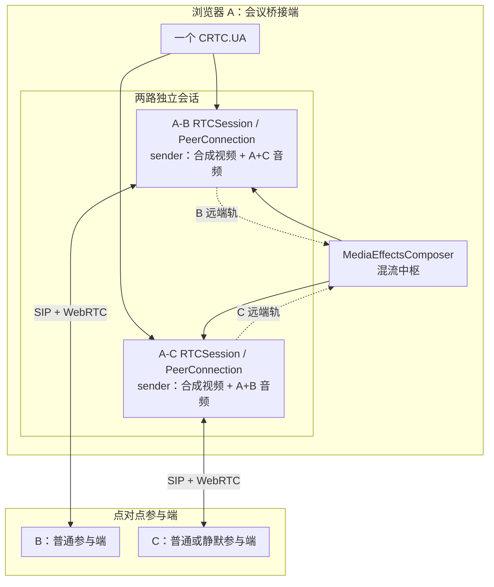
```mermaid
%%{init: {"flowchart": {"curve": "basis", "nodeSpacing": 28, "rankSpacing": 56, "padding": 10}}}%%
flowchart TB
  subgraph A["浏览器 A：会议桥接端"]
    direction TB
    UA["一个 CRTC.UA"]

    subgraph SESSIONS["两路独立会话"]
      direction LR
      AB["A-B RTCSession / PeerConnection<br/>sender：合成视频 + A+C 音频"]
      AC["A-C RTCSession / PeerConnection<br/>sender：合成视频 + A+B 音频"]
    end

    MEC["MediaEffectsComposer<br/>混流中枢"]

    UA --> AB
    UA --> AC

    AB -.->|"B 远端轨"| MEC
    AC -.->|"C 远端轨"| MEC

    MEC --> AB
    MEC --> AC
  end

  subgraph MEMBERS["点对点参与端"]
    direction LR
    B["B：普通参与端"]
    C["C：普通或静默参与端"]
  end

  AB <-->|"SIP + WebRTC"| B
  AC <-->|"SIP + WebRTC"| C
```

这里没有建立一条真正的“三方 RTCSession”。从 SDK 角度看，A 只是同时进行两通电话；三方能力来自 Demo 对两通电话的会话管理和媒体桥接。

## 2. 文件位置、加载顺序与模块边界

页面脚本按以下顺序加载：

1. [`app-effects.js`](../demo/base-js/js/app-effects.js)：生成 composer、AiNS 等媒体配置。
2. [`app-helper.js`](../demo/base-js/js/app-helper.js)：设备约束、状态提示、媒体元素和弹窗辅助函数。
3. [`app-call.js`](../demo/base-js/js/app-call.js)：UA 配置、点对点通话和页面公共状态。
4. [`app-conference.js`](../demo/base-js/js/app-conference.js)：三方会议逻辑。
5. [`app-annotation.js`](../demo/base-js/js/app-annotation.js)：屏幕标注、共享白板和 INFO 同步逻辑。
6. [`app-events.js`](../demo/base-js/js/app-events.js)：把页面按钮绑定到上述全局函数。

`app-conference.js` 没有模块导入/导出，而是依赖同一页面全局作用域中的变量和函数。主要外部依赖如下：

| 来源 | 被会议模块使用的内容 | 用途 |
| --- | --- | --- |
| `app-call.js` | `ua`、`rtcSession`、`statsSession`、`appMode`、`pcConfig`、`extraFeatures`、`sipDomain`、`xdata`、`noremb`、`camFlag` | 注册状态、当前会话、网络配置、SIP 地址和兼容开关 |
| `app-call.js` | `localVid`、`remoteVid` | A 本地预览和 B/C 远端主画面 |
| `app-effects.js` | `getFxOpts()`、`getNsOpts()`、`onFxIssue()` | 复用页面选择的镜像、水印、虚拟背景和 AiNS 配置 |
| `app-helper.js` | `getAudioOpts()`、`getVideoOpts()` | 获取页面当前选择的麦克风和摄像头约束 |
| `app-helper.js` | `setStatus()`、`setMedia()`、`onTrackEnd()`、来电通知和共享弹窗函数 | 页面反馈、媒体渲染和通用轨道生命周期监听 |
| `app-annotation.js` | `bindInk()`、`sendSnapshot()`、`isBoardOpen()` | 标注会话绑定、白板成员状态和快照同步 |
| CRTC SDK | `CRTC.UA`、`RTCSession`、`CRTC.Utils.getStreams()`、`closeMediaStream()` | SIP 会话、WebRTC 和资源释放 |
| 浏览器 API | `MediaStream`、`RTCPeerConnection`、`RTCRtpSender`、`getDisplayMedia()` | 轨道组合、替换和屏幕采集 |

会议模块并不自行监听 UA。`initMode('conference')` 在 [`app-call.js`](../demo/base-js/js/app-call.js) 中创建唯一的 `CRTC.UA`，并将其 `newRTCSession` 事件绑定到 `onConfSession`。因此同一页面只会进入点对点处理器或会议处理器中的一个。

## 3. 角色、容量和两种 C

### 3.1 角色定义

| 角色 | 含义 | 会话 |
| --- | --- | --- |
| A | 当前选择“三方”模式的浏览器页面；固定为媒体桥接端 | 同时持有 A-B、A-C 两路会话 |
| B | 第一个会议成员，也是普通三方模式下 composer 的宿主 | A-B `RTCSession` |
| C | 第二个会议成员 | A-C `RTCSession` |

最多只允许两个成员 leg，即 B + C，常量 `CONFERENCE_MAX_LEGS` 固定为 `2`。

角色不是由远端传来的 `X-Conference-Role` 决定。代码使用 `getNextRole()` 按当前空槽分配：没有 B 时返回 B；已有 B 时返回 C。测试也明确保证外呼头中不发送角色头。

### 3.2 普通 C

普通 C 与 A 建立 `sendrecv` 音视频通话。A 会把 C 的远端音视频加入 A-B 主 composer：

- 视频输出：A + B + C 合成画面。
- 发给 B 的音频：A + C，即 slot `[0, 2]`。
- 发给 C 的音频：A + B，即 slot `[0, 1]`。

这样 B 不会收到自己的声音，C 也不会收到自己的声音。视频没有按接收方排除自身，两边收到的是同一条合成视频轨。

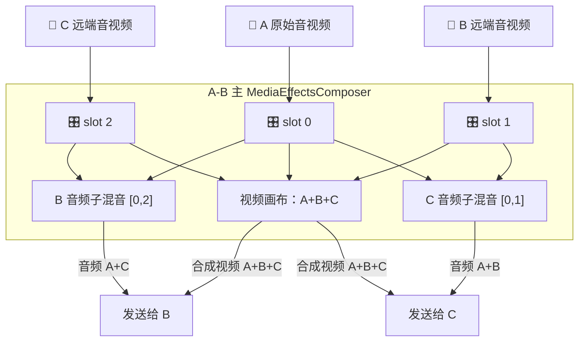
```mermaid
flowchart TB
  subgraph MEC["A-B 主 MediaEffectsComposer"]
    S2["🎛️ slot 2"]
    S0["🎛️ slot 0"]
    S1["🎛️ slot 1"]
    MB["B 音频子混音 [0,2]"]
    V["视频画布：A+B+C"]
    MC["C 音频子混音 [0,1]"]
    S2 --> MB
    S0 --> MB
    S2 --> V
    S0 --> V
    S1 --> V
    S0 --> MC
    S1 --> MC
  end

  C["🎥 C 远端音视频"] --> S2
  A["🎥 A 原始音视频"] --> S0
  B["🎥 B 远端音视频"] --> S1
  V -->|"合成视频 A+B+C"| OB["发送给 B"]
  MB -->|"音频 A+C"| OB
  V -->|"合成视频 A+B+C"| OC["发送给 C"]
  MC -->|"音频 A+B"| OC
```

### 3.3 静默 C

静默 C 是 Demo 的观察/旁听模式：

- C 端在“点对点”模式点击“静默呼叫 A”。
- C 的呼叫方向为 `recvonly`，不采集、不发送音视频。
- 呼叫附带 `X-Silent-Join: true`。
- A 将其识别为第二路静默 C，并以本端 `sendonly` 自动接听。
- 静默 C 使用 A-C 会话自己的 composer，输出 A+B 给 C。
- A-B 主会话保持原始 A-B 媒体，不因静默 C 加入而改变。

静默身份只由 `X-Silent-Join` 判断。即使 SDP 自己包含 `a=recvonly`，没有该头部仍会被当作普通 C。

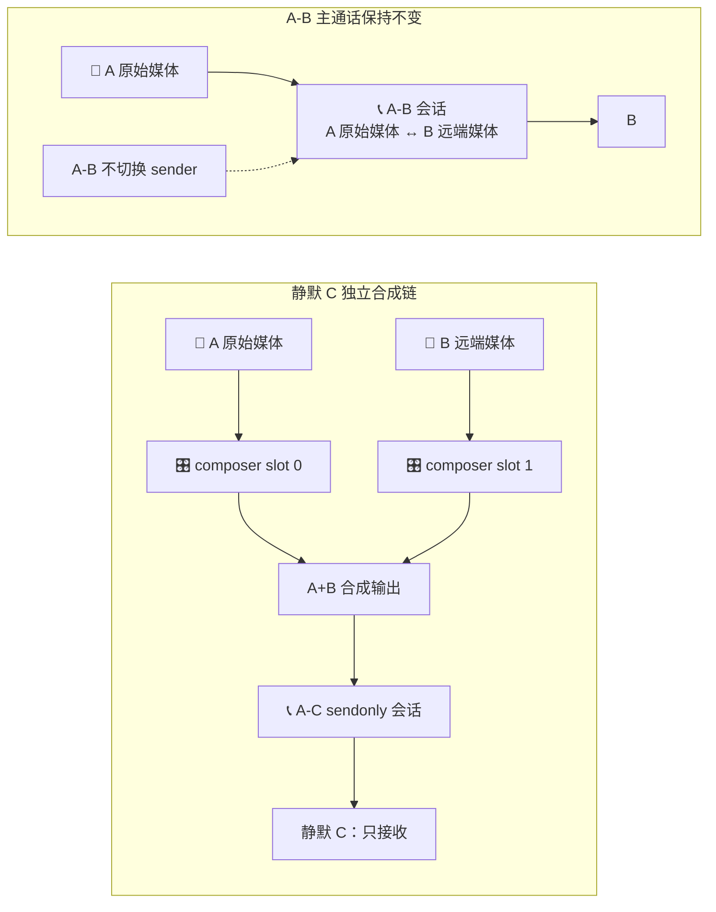
```mermaid
flowchart TB
  subgraph MAIN_CALL["A-B 主通话保持不变"]
    direction LR
    A_CALL["🎥 A 原始媒体"] --> AB["📞 A-B 会话<br/>A 原始媒体 ↔ B 远端媒体"]
    AB --> B_CALL["B"]
    KEEP["A-B 不切换 sender"] -.-> AB
  end

  subgraph SILENT_MIX["静默 C 独立合成链"]
    direction TB
    A_SOURCE["🎥 A 原始媒体"] --> S0["🎛️ composer slot 0"]
    B_SOURCE["🎥 B 远端媒体"] --> S1["🎛️ composer slot 1"]
    S0 --> MIX["A+B 合成输出"]
    S1 --> MIX
    MIX --> AC["📞 A-C sendonly 会话"]
    AC --> C["静默 C：只接收"]
  end

  MAIN_CALL ~~~ SILENT_MIX
```

## 4. 核心状态模型

### 4.1 页面级会议状态

| 状态 | 类型 | 作用 |
| --- | --- | --- |
| `conferenceLegs` | `Map<session.id, leg>` | 保存所有 B/C 会话，是会议状态的主索引 |
| `conferencePendingOutgoing` | `object \| null` | 外呼创建期间的占位和参数交接对象，防止重复点击 |
| `conferenceSelectedLegId` | `string \| null` | 当前被统计面板和通话控制栏操作的成员 |
| `conferenceComposer` | composer/null | 当前活跃的会议 composer 缓存 |
| `conferenceComposerHostId` | session id/null | 当前 composer 属于哪条会话 |
| `conferenceScreenStream` | `MediaStream \| null` | 当前屏幕共享采集流 |
| `conferenceScreenStarting` | boolean | 防止并发启动屏幕共享 |
| `conferenceSyncQueue` | Promise | 串行执行合成同步，避免并发改 source/sender |
| `conferenceSyncTimer` | timer/null | 将同一轮连续 track 变化合并为一次同步 |
| `conferenceComposerSyncSignature` | string | 轨道没有变化时跳过重复同步 |

`conferencePendingOutgoing` 不只是“加载中”标志。`ua.call()` 触发 `newRTCSession` 时，`getSessOpts()` 会消费这个对象，把之前准备好的 C 合成流、降级流等信息交给新 leg。

### 4.2 每个成员的 leg

`addLeg()` 为每条 `RTCSession` 创建一个 leg。字段可按职责分为五组：

| 分组 | 字段 | 含义 |
| --- | --- | --- |
| 身份 | `session`、`role`、`remoteNo`、`originator` | SDK 会话、B/C、号码、呼入或呼出 |
| 方向/生命周期 | `direction`、`silent`、`confirmed`、`answering`、`answerTimer`、`stage`、`autoAnswer`、`ended` | 媒体方向、静默标志和会话阶段 |
| 远端媒体 | `rStream`、`rAudio`、`rVideo`、`audioEl` | 收集并播放远端主音视频 |
| composer/降级 | `original*Sender`、`original*Track`、`backupStream`、`mixerHostId`、`mixSource`、`conferenceAudioStream` | 合成、sender 替换和失败恢复 |
| 屏幕共享 | `sharingScreen`、`shareTarget` | 页面记录的共享目标和活跃状态；sender/MID 由 SDK 管理 |
| UI/统计 | `tracksBound`、`stats` | 防重复监听和保存最新统计报告 |

`audioTrack`/`videoTrack` 只在第一次发现 sender 时保存。后续即使 sender 已被 `replaceTrack()` 替换成混音轨，也不会覆盖原始快照，否则失败时无法恢复。

## 5. 从页面初始化到新会话

### 5.1 选择三方模式

页面点击 `#initConf` 后：

```text
app-events.js
  → initMode('conference')
    → new CRTC.WebSocketInterface(signalingUrl)
    → new CRTC.UA(configuration)
    → bindCommonUaEvents()
    → ua.on('newRTCSession', onConfSession)
    → updateMode()
    → ua.start()
```

模式选定后不能在当前页面切换；需要刷新页面。`updateMode()` 会展开会议面板、禁用点对点专属按钮，并调用 `updateConfUi()`。

### 5.2 `newRTCSession` 准入逻辑

所有呼入和呼出最终都进入 `onConfSession()`。检查顺序如下：

1. 本地外呼如果没有 `conferencePendingOutgoing`，说明不是从会议“添加成员”入口发起，立即终止。
2. 已有两个 leg 时，以 `486 Conference Full` 拒绝额外会话。
3. 本地外呼从 pending 对象取角色和媒体准备结果；远端呼入按空槽分配 B/C。
4. 角色重复时，以 `486 Conference Role Busy` 拒绝。
5. 第一通来电如果携带静默头，即“静默 B”，以 `486 Conference Host Not Ready` 拒绝。
6. 第二路 C 到达时，如果 B 不存在或尚未 `confirmed`，同样以 486 拒绝。
7. 合法会话创建 leg、绑定事件并刷新 UI。
8. 普通来电等待用户点击“接听来电”；静默 C 通过零延时任务自动调用 `answerLeg()`。

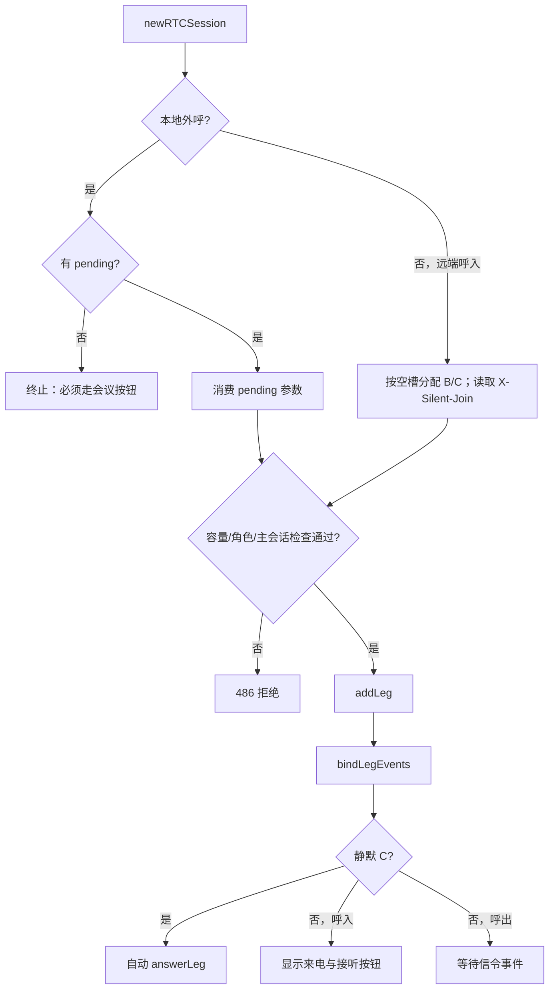
```mermaid
flowchart TD
  N["newRTCSession"] --> L{"本地外呼?"}
  L -->|"是"| P{"有 pending?"}
  P -->|"否"| R0["终止：必须走会议按钮"]
  P -->|"是"| O["消费 pending 参数"]
  L -->|"否，远端呼入"| A["按空槽分配 B/C；读取 X-Silent-Join"]
  O --> F{"容量/角色/主会话检查通过?"}
  A --> F
  F -->|"否"| R1["486 拒绝"]
  F -->|"是"| C["addLeg"]
  C --> E["bindLegEvents"]
  E --> S{"静默 C?"}
  S -->|"是"| AA["自动 answerLeg"]
  S -->|"否，呼入"| UI["显示来电与接听按钮"]
  S -->|"否，呼出"| W["等待信令事件"]
```

## 6. 外呼调用逻辑

### 6.1 添加 B

点击“添加成员”且当前没有 B 时：

```text
#confCall.onclick
  → getNextRole()                     // B
  → callConf({ role: 'B' })
    → 检查三方模式、注册状态、容量、号码
    → 设置 conferencePendingOutgoing
    → buildCallOpts('B')
      → 使用页面选中的麦克风/摄像头约束
      → mediaEffectsComposer = buildMixOpts()（始终传入配置对象，无特效时为空对象）
      → 配置 AiNS（如果页面启用）
      → 从 extraFeatures 移除 BFCP
    → ua.call('号码@域', callOptions)
    → newRTCSession
    → pending 参数转成 B leg
```

B 的呼叫始终传入 composer 配置对象（即使页面没有选择任何媒体特效，`buildMixOpts()` 也会兜底为空配置对象）：SDK 收到非空配置即创建 composer，B 会话因此提前持有合成器，后续 C 加入时才能动态追加 B/C 远端源。

### 6.2 添加普通 C

C 的外呼比 B 多出“信令前准备媒体”阶段：

```text
callConf({ role: 'C' })
  → 要求 B 已 confirmed
  → 立即设置 pending，锁住重复点击
  → prepCOutput(B)
    → ensureMixer(B)
    → cloneHost(B)
    → 把 B 远端流放入 composer slot 1
    → 取得稳定合成视频轨
    → 取得给 C 的音频 [0,1] = A+B
    → 取得给 B 的音频 [0,2] = A+C（C 尚未到达时等价于 A）
    → 用后者替换 B 的 audio sender
    → 返回 C 的 mediaStream 和降级信息
  → buildCallOpts('C', output)
    → mediaStream = composer 视频 + A+B 音频
    → mediaConstraints = { audio: true, video: true }
  → ua.call(...)
```

这里把 composer 输出在 INVITE 创建前就绑定到 C 会话。C 确认后只需把 C 的远端源加进现有 canvas/audio graph，通常无需再次替换 C 的 sender，减少二次协商和轨道切换风险。

`mediaConstraints` 明确传 `{ audio: true, video: true }` 是为了让 SDK 保留自定义 `mediaStream` 中已有轨道，同时避免重复 `getUserMedia`。传 `false` 会移除轨道，省略又可能让约束处理收到 `undefined`。

如果媒体准备或 `ua.call()` 失败，`undoCOutput()` 会移除 B source、恢复 B 原始 sender、释放音频子混音，并关闭克隆的降级流。

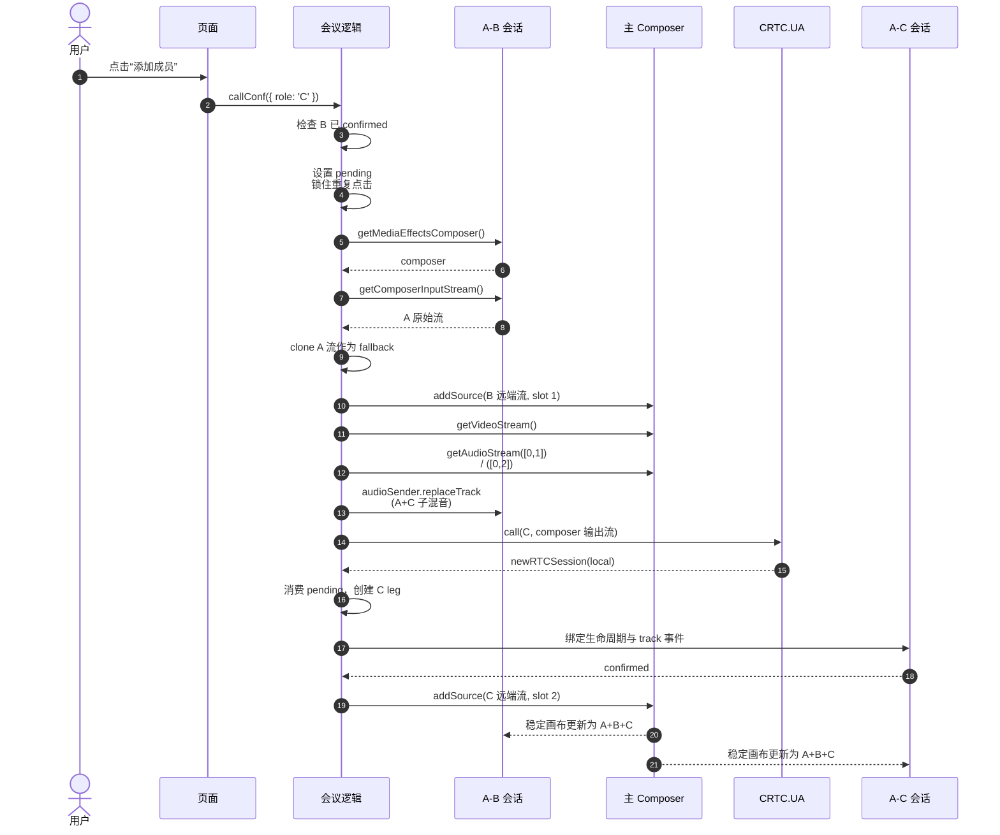
```mermaid
sequenceDiagram
  autonumber
  actor User as 用户
  participant UI as 页面
  participant Conf as 会议逻辑
  participant BSession as A-B 会话
  participant Composer as 主 Composer
  participant UA as CRTC.UA
  participant CSession as A-C 会话

  User->>UI: 点击“添加成员”
  UI->>Conf: callConf({ role: 'C' })
  Conf->>Conf: 检查 B 已 confirmed
  Conf->>Conf: 设置 pending<br/>锁住重复点击
  Conf->>BSession: getMediaEffectsComposer()
  BSession-->>Conf: composer
  Conf->>BSession: getComposerInputStream()
  BSession-->>Conf: A 原始流
  Conf->>Conf: clone A 流作为 fallback
  Conf->>Composer: addSource(B 远端流, slot 1)
  Conf->>Composer: getVideoStream()
  Conf->>Composer: getAudioStream([0,1])<br/>/ ([0,2])
  Conf->>BSession: audioSender.replaceTrack<br/>(A+C 子混音)
  Conf->>UA: call(C, composer 输出流)
  UA-->>Conf: newRTCSession(local)
  Conf->>Conf: 消费 pending，创建 C leg
  Conf->>CSession: 绑定生命周期与 track 事件
  CSession-->>Conf: confirmed
  Conf->>Composer: addSource(C 远端流, slot 2)
  Composer-->>BSession: 稳定画布更新为 A+B+C
  Composer-->>CSession: 稳定画布更新为 A+B+C
```

### 6.3 静默 C 从另一个页面呼叫 A

静默 C 必须在另一个 Base JS Demo 页面选择“点对点”模式，然后点击“静默呼叫 A”：

```text
callSilentC()
  → mediaConstraints = { audio: false, video: false }
  → rtcOfferConstraints = { receiveAudio: true, receiveVideo: true }
  → X-Direction: recvonly
  → X-Silent-Join: true
  → ua.call(A)
```

C 端会监听 PeerConnection 的 `track` 和会话 `confirmed`，在 A 的合成轨到达后刷新点对点主画面。

## 7. 呼入与接听逻辑

`answerLeg()` 只处理 `originator === 'remote'`、尚未确认且不在接听中的 leg。

| 来电类型 | 接听媒体准备 | answer 方向 | composer |
| --- | --- | --- | --- |
| B | 页面选择的设备流 | `sendrecv` | B 会话独立创建 composer（始终传入配置对象） |
| 普通 C | 先执行 `prepCOutput(B)` | `sendrecv` | 不为 C 新建 composer，直接使用 B composer 输出流 |
| 静默 C | 页面选择的 A 设备流 | `sendonly` | 在 A-C 会话上创建独立 composer |

接听后会按 `ua.configuration.no_answer_timeout` 设置保护定时器，缺省回退为 60 秒。如果会话没有进入 `accepted`/`confirmed`，将以 480 终止，避免 INVITE 长时间挂起。

普通 C 接听过程失败时，会回滚已经对 B composer 和 sender 做的修改。静默 C 自动接听失败时也会终止该会话。

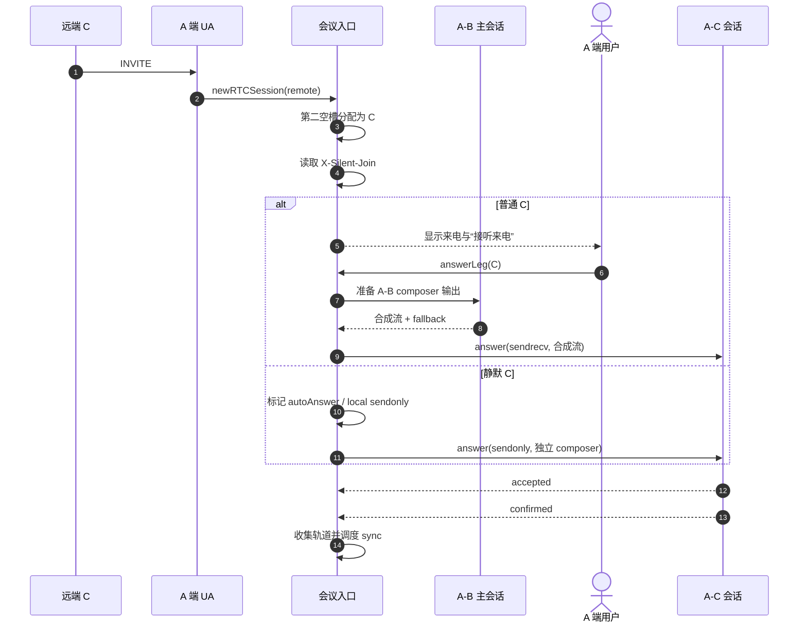
```mermaid
sequenceDiagram
  autonumber
  participant C as 远端 C
  participant UA as A 端 UA
  participant Handler as 会议入口
  participant Host as A-B 主会话
  actor User as A 端用户
  participant AC as A-C 会话

  C->>UA: INVITE
  UA->>Handler: newRTCSession(remote)
  Handler->>Handler: 第二空槽分配为 C
  Handler->>Handler: 读取 X-Silent-Join

  alt 普通 C
    Handler-->>User: 显示来电与“接听来电”
    User->>Handler: answerLeg(C)
    Handler->>Host: 准备 A-B composer 输出
    Host-->>Handler: 合成流 + fallback
    Handler->>AC: answer(sendrecv, 合成流)
  else 静默 C
    Handler->>Handler: 标记 autoAnswer / local sendonly
    Handler->>AC: answer(sendonly, 独立 composer)
  end

  AC-->>Handler: accepted
  AC-->>Handler: confirmed
  Handler->>Handler: 收集轨道并调度 sync
```

## 8. 三方媒体合成核心

### 8.1 slot 约定

普通三方固定使用以下槽位：

| slot | 输入 | 来源 |
| ---: | --- | --- |
| 0 | A 原始摄像头/麦克风 | B 会话 composer 的初始输入 |
| 1 | B 远端音视频 | A-B PeerConnection 的 remote tracks |
| 2 | C 远端音视频 | A-C PeerConnection 的 remote tracks |

输出关系：

| 接收方 | 视频 | 音频 | 目的 |
| --- | --- | --- | --- |
| B | composer 合成视频 A+B+C | `[0,2]` = A+C | 排除 B 自己的声音 |
| C | composer 合成视频 A+B+C | `[0,1]` = A+B | 排除 C 自己的声音 |

### 8.2 合成触发和串行化

远端轨到达、轨结束、会话确认等场景都会调用 `queueMix()`。它有三层保护：

1. `setTimeout(..., 0)` 把同一事件循环内的连续变化防抖成一次。
2. `conferenceSyncQueue.then(syncMixer)` 保证 composer source 和 sender 修改串行执行。
3. `getMixKey()` 用两条会话 ID、C 类型以及四条远端轨的 `id/readyState` 构建签名，没有变化则跳过。

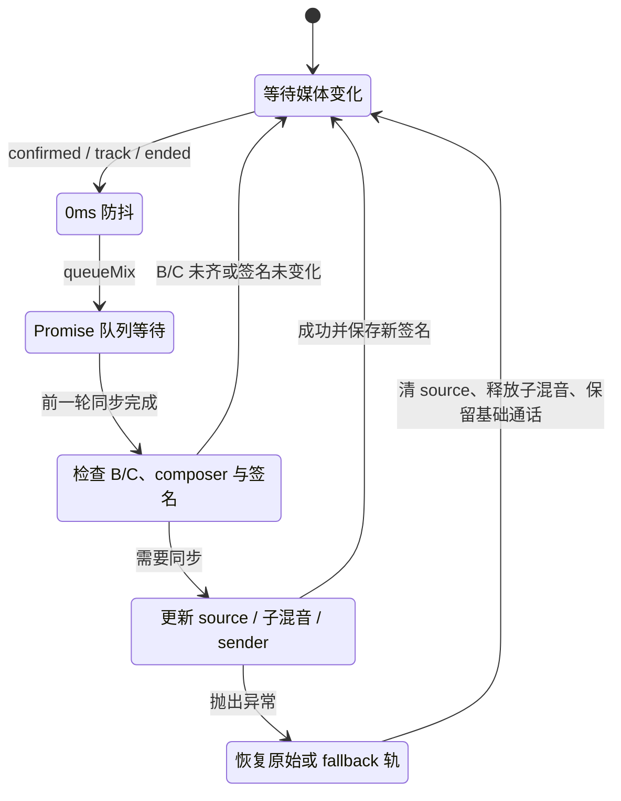
```mermaid
stateDiagram-v2
  state "等待媒体变化" as Idle
  state "0ms 防抖" as Debounce
  state "Promise 队列等待" as Queue
  state "检查 B/C、composer 与签名" as Check
  state "更新 source / 子混音 / sender" as Apply
  state "恢复原始或 fallback 轨" as Fallback

  [*] --> Idle
  Idle --> Debounce: confirmed / track / ended
  Debounce --> Queue: queueMix
  Queue --> Check: 前一轮同步完成
  Check --> Idle: B/C 未齐或签名未变化
  Check --> Apply: 需要同步
  Apply --> Idle: 成功并保存新签名
  Apply --> Fallback: 抛出异常
  Fallback --> Idle: 清 source、释放子混音、保留基础通话
```

### 8.3 普通 C 同步

`syncMixer()` 在 B、C 都 `confirmed` 后执行：

1. 使用 B 会话 composer。
2. 补齐 B/C 当前已有的远端轨。
3. slot 1 放 B，slot 2 放 C；旧 source 先移除再替换。
4. 取得 composer 视频轨。
5. 复用信令前已创建的 B/C 音频子混音。
6. 确认 B 的 audio sender 使用 A+C 音轨。
7. 如果 C 原本绑定的是当前 B composer，不替换 C sender；canvas/audio graph 内容会自动更新。
8. 如果是“旧 B 已挂断、保留普通 C、又补入新 B”的宿主切换场景，则把 C sender 切换到新 B composer，并重新保存一份 A 原始轨克隆作为降级流。

### 8.4 静默 C 同步

静默 C 不能使用 B 会话 composer，否则一旦把 B 加入主 composer，B 自己正在接收的画面也会变成 A+B。代码改为：

1. 使用静默 C 会话自己的 composer。
2. 该 composer 的 slot 0 已是 A 本地设备流。
3. 只把 B 远端流加入 slot 1。
4. composer 的稳定输出自动变成 A+B，并只通过 A-C 会话发送。
5. 不调用任何 B 或 C sender 的 `replaceTrack()`。

### 8.5 composer 与页面媒体效果

`getConfMixer()` 优先返回当前会议 composer。`app-effects.js` 的媒体效果面板会先调用它，再回退到全局 `rtcSession.getMediaEffectsComposer()`。因此三方模式下镜像、水印、虚拟背景等操作会落到会议实际使用的 composer。

需要注意：静默 C 场景的“当前会议 composer”会切换到 A-C 会话的独立 composer；普通三方则是 A-B 主 composer。

## 9. RTCSession 事件与媒体轨管理

### 9.1 会话事件

`bindLegEvents()` 监听的主要事件如下：

| 事件 | 处理 |
| --- | --- |
| `sending`、`trying`、`progress`、`connecting` | 更新 `stage` 和页面状态 |
| `sdp` | 记录 SDP 阶段；若启用 `noremb`，删除 goog-remb 和 transport-cc 反馈行 |
| `remoteSupportsVideo` | 提示远端支持视频 |
| `accepted` | 清除接听中状态和接听超时 |
| `confirmed` | 标记确认、收集远端轨、保存原始 sender、刷新 UI、调度合成 |
| `cameraChanged`、`localMediastreamUpdate` | 刷新 A 本地预览 |
| `hold`、`unhold`、`muted`、`unmuted` | 更新页面状态 |
| `refer` | 三方模式始终拒绝远端 REFER |
| 多个 PeerConnection/SDP 失败事件 | 记录失败阶段并提示媒体协商失败 |
| `failed`、`ended` | 清除定时器并进入 `removeLeg()` |
| `mediaEffectsIssue` | 呼入会话手工绑定公共媒体效果错误处理器 |
| `stats:detailed-report` | 缓存和渲染当前选中会话统计 |

### 9.2 远端轨收集

`bindTracks()` 每个 leg 只绑定一次 `RTCPeerConnection.track`：

- 首条 live audio/video track 分别保存到 `rAudio`、`rVideo`。
- 两者加入同一个 `rStream`，供 composer 作为一个 source 使用。
- 音频另建隐藏 `<audio autoplay>` 播放，视频交给页面预览函数。
- 轨道 `ended` 时从 stream 移除、清空字段并重新调度合成。

`loadRemote()` 是补偿路径：它通过 `CRTC.Utils.getStreams(connection, 'remote')` 获取可能已经存在的远端轨，覆盖 early media 或 `track` 监听绑定稍晚的情况。

### 9.3 页面预览

- `remoteVid` 优先显示 B。
- `#confVideoC` 显示普通 C。
- B 没有视频时，普通 C 自动占用主区域。
- 静默 C 本来不上传视频，因此不会保留空白的 C 预览区域。
- `localVid` 优先显示 B 会话 `getComposerInputStream()` 中 A 的原始视频，而不是合成输出；没有 composer 输入时才回退到本地 stream。

## 10. 选中成员、通话控制和统计

三方模式下 `rtcSession` 不再表示“唯一会话”，而是被 `selectLeg()` 更新为当前选中的 B 或 C。`statsSession` 同步指向同一会话。

动态成员列表中，每个 leg 有三个按钮：

1. 成员按钮：选中该会话，并切换统计和通用控制目标。
2. 共享目标按钮：切换 `shareTarget`；屏幕共享和共享白板复用同一组选中目标。
3. 挂断按钮：只终止该成员。

`bindControls()` 将公共控制栏重绑定到当前成员，覆盖：

- 挂断。
- 麦克风/摄像头 mute、unmute。
- hold/unhold。
- RFC2833 DTMF。
- SIP INFO。
- 前后摄像头切换并重新协商。
- `setVideoContentHint()`。

统计来自每条 `RTCSession` 的 `stats:detailed-report`：

- 连接状态、ICE、DTLS。
- 上下行实际/可用码率。
- RTT 和上下行网络质量等级。
- 音视频 codec、MID、码率、抖动、丢包。
- 视频分辨率、FPS、编码/解码耗时和质量限制原因。
- SDK `quality.issues` 的中文映射和严重级别。

非当前选中 leg 的统计只缓存到 `stats`，切换成员后立即渲染，不需要等待下一次统计事件。

## 11. 定向屏幕共享

### 11.1 为什么不用 BFCP

三方模式同时维护 A-B、A-C 两条独立 PeerConnection。每条会话都通过 `RTCSession.share()` 的 `auxiliary` 模式增加自己的第二条 video m-line，不需要 BFCP floor 控制，因此 `getConfFx()` 会从 `extraFeatures` 中移除 BFCP，避免同时启用两套共享机制。

### 11.2 发起流程

用户先在成员列表选择一个或两个共享目标，再点击“开始共享屏幕”：

```text
shareConf()
  → getDisplayMedia(video: max 1920x1080 @ 15fps, audio: false)
  → contentHint = 'detail'
  → 对每个 shareTarget 调用 session.share('screen', options)
    → mode: 'auxiliary'
    → mediaStream: 同一个 screenStream
    → stopStreamOnUnShare: false
```

Demo 只负责选择目标、复用屏幕流、本地预览和部分失败提示。以下细节由 SDK 处理：

- 复用已有 sender/MID，或创建 `sendonly` transceiver。
- 发起 `terminateOnFailure:false` 的 re-INVITE。
- 等待 MID 并发送 `screen-share/start` INFO。
- 复用失败时回退到新 transceiver。
- 重协商失败时仅回滚共享，不终止原通话。

单个目标失败不会阻止其他目标继续；只要至少一个 `session.share()` 成功，共享就保留。外部传入的 `screenStream` 不归任何单条 RTCSession 所有，避免 B 挂断时误停仍发送给 C 的屏幕源。

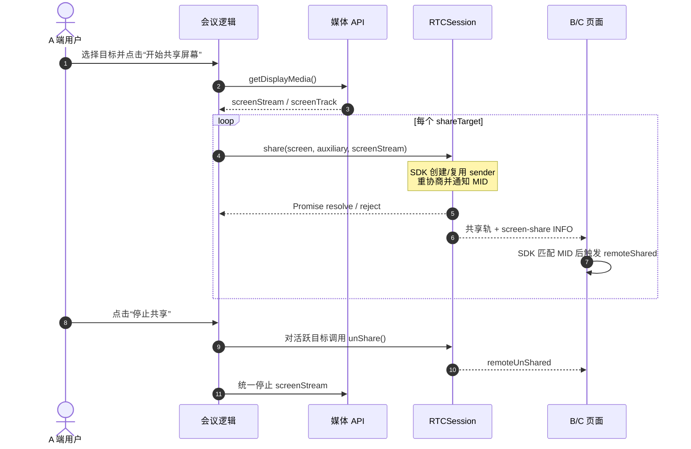
```mermaid
sequenceDiagram
  autonumber
  actor User as A 端用户
  participant Conf as 会议逻辑
  participant Browser as 媒体 API
  participant Session as RTCSession
  participant Remote as B/C 页面

  User->>Conf: 选择目标并点击“开始共享屏幕”
  Conf->>Browser: getDisplayMedia()
  Browser-->>Conf: screenStream / screenTrack

  loop 每个 shareTarget
    Conf->>Session: share(screen, auxiliary, screenStream)
    Note over Session: SDK 创建/复用 sender<br/>重协商并通知 MID
    Session-->>Conf: Promise resolve / reject
    Session-->>Remote: 共享轨 + screen-share INFO
    Remote->>Remote: SDK 匹配 MID 后触发 remoteShared
  end

  User->>Conf: 点击“停止共享”
  Conf->>Session: 对活跃目标调用 unShare()
  Session-->>Remote: remoteUnShared
  Conf->>Browser: 统一停止 screenStream
```

### 11.3 接收端如何识别共享轨

B/C 的 `RTCSession` 内部同时监听 INFO 和 PeerConnection `track`：

1. `track` 事件按 transceiver MID 缓存所有远端视频轨。
2. `newInfo` 收到 `screen-share/start` 后记录共享 MID。
3. 若 INFO 先到，等待轨到达；若轨先到，等待 INFO 到达。
4. MID 与轨匹配后触发 `remoteShared`。
5. `screen-share/stop` 或轨 `ended` 时触发 `remoteUnShared`。

[`app-call.js`](../demo/base-js/js/app-call.js) 只监听这两个 SDK 事件更新 `#shareVid`，不再读取 MID 或直接监听共享 track。

### 11.4 停止流程

`unshareConf()` 对所有 `sharingScreen` leg：

1. 调用对应 `session.unShare()`，SDK 负责 INFO 和 sender 清理。
2. 清空本地共享预览和弹窗。
3. 如果不是由系统共享按钮触发的 track `ended`，统一停止共享流。

共享过程中不能改变目标；UI 会禁用成员的共享目标按钮。

屏幕共享只能由发起方停止。接收端共享浮层右上角仅提供“最小化”，不会调用 `unShare()`；A 端可通过会议面板的“停止共享”按钮或浏览器原生停止共享入口结束屏幕辅流。

### 11.5 屏幕标注

本端和接收端都可以在共享浮层点击“开启标注”。标注层由 Konva 绘制在共享视频上方，画笔、箭头、矩形、椭圆和橡皮操作会保存为归一化矢量数据，因此不同分辨率的页面可以按各自画布尺寸还原；标注不会烧录进屏幕视频轨。

每次完成绘制后，`app-annotation.js` 才通过 `session.sendInfo()` 发送一条 `shape:add`，不会在每次 `pointermove` 时发送信令。三方模式下，A 会把从一条会话收到的操作转发给另一条已确认会话。例如 B 的标注同步给 C 的路径是：

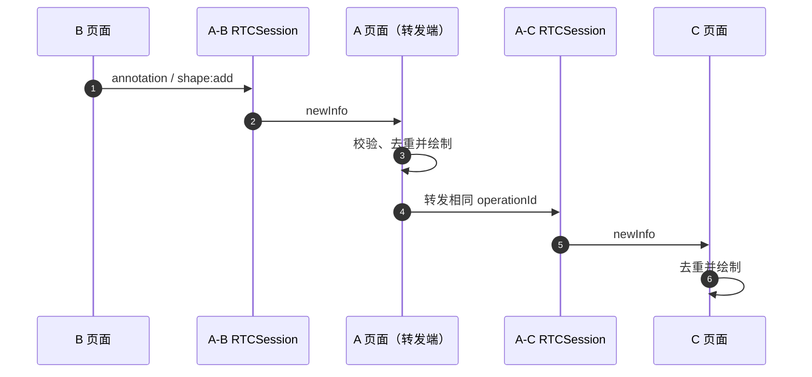
```mermaid
sequenceDiagram
  autonumber
  participant B as B 页面
  participant AB as A-B RTCSession
  participant A as A 页面（转发端）
  participant AC as A-C RTCSession
  participant C as C 页面

  B->>AB: annotation / shape:add
  AB->>A: newInfo
  A->>A: 校验、去重并绘制
  A->>AC: 转发相同 operationId
  AC->>C: newInfo
  C->>C: 去重并绘制
```

参与者颜色和身份规则如下：

- `senderId` 默认取当前 UA 的 SIP 用户名，`senderLabel` 当前与其相同。
- 页面按 `senderId` 稳定映射一个默认颜色，不同账号通常得到不同颜色；用户仍可在工具栏修改“我的颜色”。
- 每个 shape 都带有 `authorId` 和 `authorLabel`，远端图例使用“颜色 + 参与者”标明是谁绘制。
- 撤销从全部图形中查找当前账号最后绘制的一项，重做栈也只保存当前账号撤销的图形；其他参与者继续绘制不会清掉本地重做栈。
- 清空发送 `author:clear`，只清除当前账号的图形；收到 `shape:remove` 时还会校验图形的 `authorId` 必须与操作 `senderId` 一致。
- 每位参与者的图形使用独立 Konva 缓存组绘制，因此橡皮的 `destination-out` 只擦除同一参与者自己的图形。
- 点击“关闭标注”时发送 `author:clear`，自动删除并同步清除当前账号自己的标注，不影响其他参与者已经绘制的内容。

### 11.6 定向共享白板

共享白板只在三方 A 端的会议面板发起，入口位于“开始共享屏幕”旁边。A 先用成员列表中的共享目标按钮选中 B、C 或其中一人，再点击“开始共享白板”。白板复用屏幕共享的目标选择，但不调用 `getDisplayMedia()`、`session.share()` 或 re-INVITE；它显示独立网格画布，并通过标注 INFO 协议同步矢量操作。

白板开始后，`boardLegs` 保存本次选中的会话集合，目标按钮会被锁定。A 向目标发送 `board:open` 和当前 `snapshot`。如果 B、C 都被选中，B 的操作按以下路径到达 C：

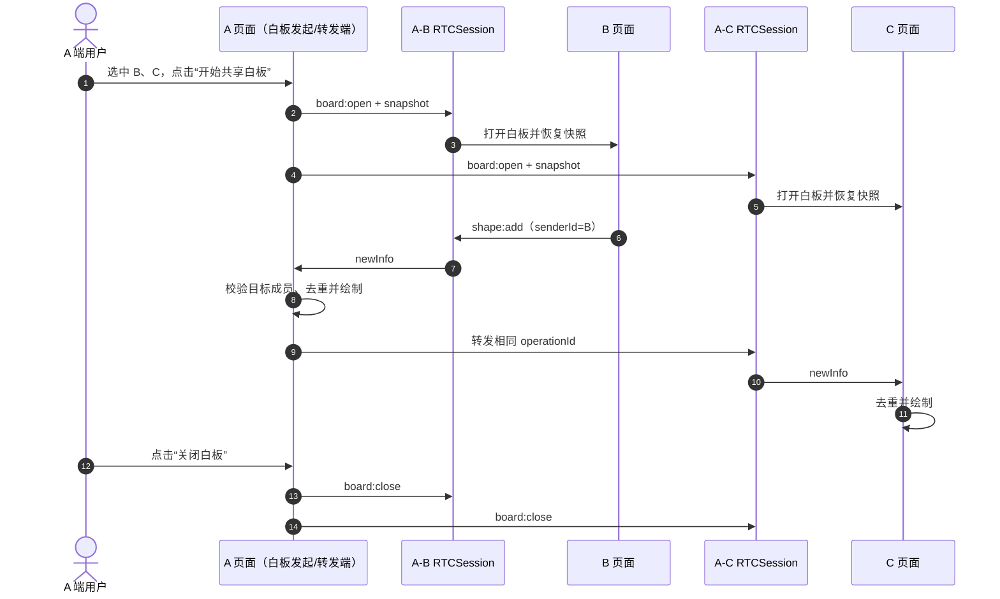
```mermaid
sequenceDiagram
  autonumber
  actor User as A 端用户
  participant A as A 页面（白板发起/转发端）
  participant AB as A-B RTCSession
  participant B as B 页面
  participant AC as A-C RTCSession
  participant C as C 页面

  User->>A: 选中 B、C，点击“开始共享白板”
  A->>AB: board:open + snapshot
  AB->>B: 打开白板并恢复快照
  A->>AC: board:open + snapshot
  AC->>C: 打开白板并恢复快照

  B->>AB: shape:add（senderId=B）
  AB->>A: newInfo
  A->>A: 校验目标成员、去重并绘制
  A->>AC: 转发相同 operationId
  AC->>C: newInfo
  C->>C: 去重并绘制

  User->>A: 点击“关闭白板”
  A->>AB: board:close
  A->>AC: board:close
```

如果 A 只选中 B，C 不会收到 `board:open`、快照或后续绘制。`boardUserId` 记录白板发起方，只有发起方显示“关闭白板”按钮并可以广播 `board:close`；B/C 只能最小化浮层，A 也会忽略非发起方伪造的关闭操作。

## 12. 挂断、清理与失败降级

### 12.1 单 leg 清理

`removeLeg()` 只执行一次，主要步骤为：

1. 标记 `ended`，清除接听定时器。
2. 停止该 leg 的屏幕 sender。
3. 移除隐藏的远端音频元素。
4. 关闭该 leg 的 `backupStream`。
5. 从 `conferenceLegs` 删除。
6. 按 B/C 类型决定剩余会话是否保留。
7. 从 composer 移除 source，恢复 sender，释放子混音。
8. 选择下一个可用成员或重置统计面板。
9. 刷新本地/远端画面和会议按钮。

### 12.2 不同挂断场景

| 场景 | 结果 |
| --- | --- |
| C 挂断，B 保留 | B sender 恢复原始 A 媒体，会议退化为 A-B |
| B 挂断，C 为静默 C | 自动终止静默 C，因为它离开 B 后没有独立通话意义 |
| B 挂断，C 为普通 C | 保留 A-C；C sender 切回预先克隆的 A 原始音视频 |
| 普通 C 保留后加入新 B | 新 B 成为 composer 宿主，C sender 切到新 composer，重新形成三方 |
| 最后一条会话结束 | 停止屏幕共享，清空本地和远端主画面 |

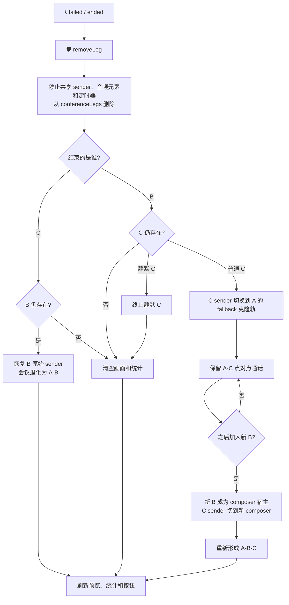
```mermaid
flowchart TD
  END["📞 failed / ended"] --> CLEAN["🛡️ removeLeg"]
  CLEAN --> COMMON["停止共享 sender、音频元素和定时器<br/>从 conferenceLegs 删除"]
  COMMON --> ROLE{"结束的是谁?"}

  ROLE -->|"C"| KEEP_B{"B 仍存在?"}
  KEEP_B -->|"是"| RESTORE_B["恢复 B 原始 sender<br/>会议退化为 A-B"]
  KEEP_B -->|"否"| EMPTY["清空画面和统计"]

  ROLE -->|"B"| HAS_C{"C 仍存在?"}
  HAS_C -->|"否"| EMPTY
  HAS_C -->|"静默 C"| STOP_C["终止静默 C"]
  STOP_C --> EMPTY
  HAS_C -->|"普通 C"| FALLBACK["C sender 切换到 A 的 fallback 克隆轨"]
  FALLBACK --> AC["保留 A-C 点对点通话"]
  AC --> NEW_B{"之后加入新 B?"}
  NEW_B -->|"是"| REHOST["新 B 成为 composer 宿主<br/>C sender 切到新 composer"]
  REHOST --> THREE["重新形成 A-B-C"]
  NEW_B -->|"否"| AC

  RESTORE_B --> UI["刷新预览、统计和按钮"]
  EMPTY --> UI
  THREE --> UI
```

### 12.3 为什么需要 fallback 克隆流

普通 C 的 sender 使用 B 会话 composer 输出。B 会话结束时，其会话级 composer 会被 SDK 销毁，composer 输出轨也随之失效。创建 C 之前，代码会通过 `getComposerInputStream()` 取得 A 原始流并逐轨 `clone()`，保存到 C leg。

B 结束后，`restoreMedia(C, endedBId)` 使用克隆轨替换 C sender，使 A-C 继续通话。不能直接复用 B composer 的输入轨，因为它的所有权和生命周期仍属于 B 会话。

### 12.4 composer 同步失败

任何 `syncMixer()` 异常都会被队列统一捕获：

- 从 composer 移除所有 leg source。
- 清空同步签名。
- 恢复各会话的原始 sender 或 fallback sender。
- 释放 `[0,2]`、`[0]`、`[0,1]` 子混音输出。
- 保留仍然存在的点对点会话，不主动挂断。

这体现了该 Demo 的核心降级原则：媒体特效/合成失败时优先保住基础通话。

## 13. SIP 头和页面内部协议

### 13.1 呼叫/接听头部

| 场景 | 头部 |
| --- | --- |
| A 呼叫普通 B/C | `X-Data`、`X-UA`、`X-Direction: sendrecv` |
| 静默 C 呼叫 A | 上述业务头 + `X-Direction: recvonly` + `X-Silent-Join: true` |
| A 接听普通 B/C | `X-Direction: sendrecv` |
| A 接听静默 C | `X-Direction: sendonly` |

`getSessOpts()` 在读取 `X-Silent-Join` 后直接识别 `true`、`1`、`yes`，忽略大小写和分号后的参数。

### 13.2 屏幕共享 INFO

该协议由 `RTCSession.share()` 内部发送和消费，Demo 不直接构造。内容类型为 `application/json`：

```json
{
  "event": "screen-share",
  "action": "start",
  "mid": "2"
}
```

停止时 `action` 为 `stop`。接收端只依赖 `event`、`action`、`mid`。

### 13.3 标注与白板 INFO

标注和白板是 Demo 协议，不由 SDK 自动解释。`app-annotation.js` 在每条 `RTCSession` 上监听 `newInfo`，只处理内容类型 `application/vnd.crtc.annotation+json`。典型操作如下：

```json
{
  "event": "annotation",
  "version": 1,
  "action": "shape:add",
  "boardId": "whiteboard",
  "operationId": "7302-1780000000000-12",
  "senderId": "7302",
  "senderLabel": "7302",
  "sequence": 12,
  "payload": {
    "shape": {
      "id": "shape-7302-1780000000000-11",
      "type": "pen",
      "authorId": "7302",
      "authorLabel": "7302",
      "color": "#2563eb",
      "widthNorm": 0.006,
      "points": [[0.2, 0.3], [0.4, 0.5]]
    }
  }
}
```

| `action` | 含义 |
| --- | --- |
| `shape:add` / `shape:remove` | 添加发送方图形，或按 ID 删除发送方自己的图形 |
| `author:clear` | 只清除 `senderId` 对应参与者的图形 |
| `clear` | 旧版兼容操作；接收时同样只清除 `senderId` 对应参与者的图形 |
| `snapshot` | 向新加入的目标同步屏幕标注和白板快照 |
| `board:open` / `board:close` | 打开或关闭共享白板 |

接收端会校验协议版本、`boardId`、action、操作 ID 和 shape 字段。单条消息上限为 64 KiB，每块画布最多保留 500 个图形，单条自由线最多 1200 个归一化点。A 转发时保留原 `operationId`，各端使用最近操作集合去重，避免三方转发形成重复绘制。

## 14. REFER 行为

三方模式始终不支持 REFER，不区分当前是一名还是两名会议成员：

- 页面保留呼转区域，但号码输入框、“呼转”和“取消”按钮均被禁用。
- 收到远端 `refer` 事件时调用 `data.reject()`。

会议模块不绑定本地 REFER 操作，也不会调用 `session.hold()`、`session.refer()` 或发送取消呼转 INFO。点对点模式仍由 `app-call.js` 保留原有呼转能力。

## 15. 主要 SDK/浏览器 API 调用表

| API | 在本文件中的用途 |
| --- | --- |
| `ua.call(target, options)` | 创建 A-B/A-C 外呼，或静默 C 呼叫 A |
| `session.answer(options)` | 接听 B/C 来电 |
| `session.terminate()` | 挂断、拒绝或超时关闭会话 |
| `session.getMediaEffectsComposer()` | 取得当前会话 composer |
| `session.getComposerInputStream()` | 获取 A 原始输入，用于预览和 fallback 克隆 |
| `composer.addSource/removeSource()` | 动态加入/移除 B、C 远端流 |
| `composer.getVideoStream()` | 取得稳定的合成视频轨 |
| `composer.getAudioStream({ slots })` | 创建给 B/C 的定制音频子混音 |
| `composer.releaseSubmixStream()` | 释放对应 slots 的音频输出资源 |
| `sender.replaceTrack()` | 切换混音或 fallback 轨；共享 sender 由 SDK 管理 |
| `session.share('screen', { mode: 'auxiliary' })` | 向一条会话发送独立屏幕辅流 |
| `session.unShare()` | 停止该会话的共享，保留可复用 m-line |
| `session.sendInfo()` | 发送取消呼转，以及 Demo 层的标注/白板操作；屏幕共享 INFO 仍由 SDK 内部发送 |
| `session.mute/unmute/hold/unhold()` | 当前选中成员的通话控制 |
| `session.sendDTMF()` | 发送 RFC2833 DTMF |
| `navigator.mediaDevices.getDisplayMedia()` | 获取 A 的屏幕轨 |
| `CRTC.Utils.getStreams()` | 从 PeerConnection 补齐本地/远端轨 |
| `CRTC.Utils.closeMediaStream()` | 停止 fallback 或共享流 |

## 16. UI 状态规则

`updateConfUi()` 是会议面板的统一刷新入口：

- 有待手工接听的普通来电时才显示“接听来电”。
- pending 外呼存在或成员已满时隐藏“添加成员”。
- 下一角色为 C 但 B 尚未确认时，禁用“添加成员”。
- 没有任何成员时禁用“全部挂断”。
- 至少选择一个已确认的共享目标后，才能开始共享屏幕或共享白板。
- 屏幕共享启动中、已共享或白板已打开时，不能再次开始屏幕共享。
- 屏幕共享活动期间显示“停止共享”，隐藏“开始共享屏幕”。
- 白板打开后锁定共享目标；只有白板发起方显示“关闭白板”，接收端只能最小化。
- 三方激活时禁用 REFER 和取消 REFER。

`conferencePendingOutgoing` 会在 C 媒体准备开始前立即设置，因此用户快速双击“添加成员”不会创建两路相同 C 会话。

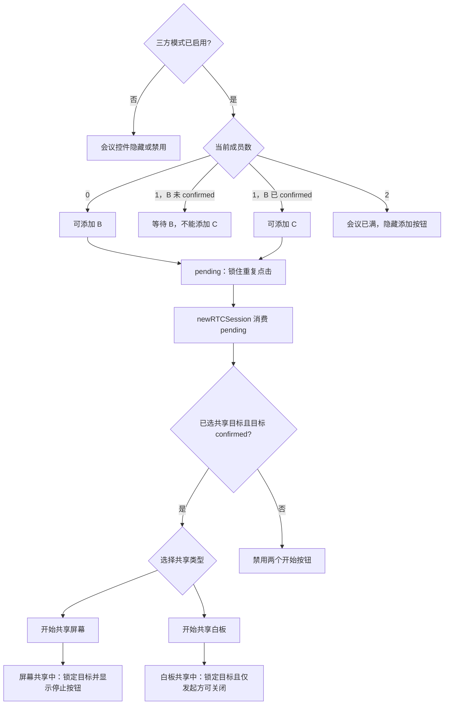
```mermaid
flowchart TB
  MODE{"三方模式已启用?"} -->|"否"| DISABLED["会议控件隐藏或禁用"]
  MODE -->|"是"| MEMBER{"当前成员数"}
  MEMBER -->|"0"| ADD_B["可添加 B"]
  MEMBER -->|"1，B 未 confirmed"| WAIT_B["等待 B，不能添加 C"]
  MEMBER -->|"1，B 已 confirmed"| ADD_C["可添加 C"]
  MEMBER -->|"2"| FULL["会议已满，隐藏添加按钮"]

  ADD_B --> PENDING["pending：锁住重复点击"]
  ADD_C --> PENDING
  PENDING --> SESSION["newRTCSession 消费 pending"]

  SESSION --> TARGET{"已选共享目标且目标 confirmed?"}
  TARGET -->|"是"| TYPE{"选择共享类型"}
  TARGET -->|"否"| NO_START["禁用两个开始按钮"]
  TYPE --> SCREEN["开始共享屏幕"]
  TYPE --> BOARD["开始共享白板"]
  SCREEN --> ACTIVE["屏幕共享中：锁定目标并显示停止按钮"]
  BOARD --> BOARD_ACTIVE["白板共享中：锁定目标且仅发起方可关闭"]
```

## 17. 设计限制与接入注意事项

1. **这是固定三方 Demo，不是通用 N 方会议。** 容量和 B/C slot 都是硬编码的，扩展到更多成员需要重新设计音频排除、视频布局和会话管理。
2. **A 是单点桥接瓶颈。** A 同时编码/发送两路通话并进行 canvas/audio 混合，CPU、上行带宽和页面生命周期都会影响整场会议。
3. **A 页面关闭后会议结束。** B、C 之间没有直接 SIP/WebRTC 会话。
4. **角色依赖到达顺序。** 第一成员是 B，第二成员是 C，不依赖远端声明。
5. **C 必须等待 B confirmed。** 这是准入硬条件，不支持两路并行建链后再合并。
6. **静默模式是 Demo 私有约定。** 依赖 `X-Silent-Join` 和接收端页面逻辑，第三方终端不会自动理解。
7. **视频不排除自己。** 普通 B/C 都接收 A+B+C 合成视频；只有音频按接收方排除了自身。
8. **屏幕共享依赖 SIP INFO + MID。** 远端必须实现对应 INFO 解析和第二视频轨渲染。
9. **屏幕不含系统音频。** `getDisplayMedia` 明确使用 `audio: false`。
10. **标注和白板依赖 Demo INFO 协议。** 它们是叠加在页面上的矢量数据，不会进入屏幕视频；第三方终端需要实现相同内容类型、消息校验和渲染逻辑。
11. **三方白板依赖 A 转发。** B、C 之间没有直接会话，A 页面离线后无法继续同步；该实现也不提供服务端持久化、离线恢复或并发冲突合并。
12. **页面全局变量耦合较强。** 抽到业务项目时应明确传入依赖，但不应改变 SDK 的会话和媒体时序。
13. **自动播放可能受浏览器策略限制。** 代码对 `play()` 失败静默处理，真实产品应提供明确的用户交互恢复入口。
14. **浏览器兼容需实机验证。** 多 PeerConnection、同一屏幕轨发给多个 sender、动态 transceiver、re-INVITE 和 composer 都属于高风险 WebRTC 路径。

## 18. 排查问题的推荐顺序

### 18.1 C 无法加入

1. 确认 A 页面选择的是三方模式且已注册。
2. 确认 B leg 存在并已收到 `confirmed`。
3. 检查是否已有 pending 外呼或两个 leg 已满。
4. 查看 `[conference] ... stage=...` 日志，判断停在 INVITE、SDP、accepted 还是 confirmed。
5. 普通 C 检查 `prepCOutput()` 是否取得 composer 视频和两条音频子混音。
6. 静默 C 检查 `X-Silent-Join: true` 是否到达 A；只发 recvonly SDP 不够。

### 18.2 B/C 没有声音

1. 检查 A、B、C 远端 audio track 是否为 `live`。
2. 检查 composer slot：A=0、B=1、C=2。
3. B 应使用 `[0,2]`，C 应使用 `[0,1]`。
4. 检查 `audioSender.track` 当前是否已经替换为预期子混音轨。
5. 查看 `stats:detailed-report` 的 outbound/inbound 音频码率、丢包和抖动。
6. 若出现“三方媒体合成失败，已保留原始通话”，说明代码已经进入降级路径，应继续检查 composer 异常。

### 18.3 屏幕共享不显示

1. A 端确认目标 leg 已 `confirmed` 且 `shareTarget=true`。
2. 检查 `session.share()` Promise 是否成功以及 SDK 日志中的重协商错误。
3. 检查共享 video sender 是否存在 MID、轨道是否为 `live`。
4. B/C 端检查是否触发 `remoteShared`，停止时是否触发 `remoteUnShared`。
5. 检查 `#shareVid` 是否绑定了 `sharedStream.videoStream`。

### 18.4 B 挂断后 C 也没有媒体

1. 确认 C 是普通 C；静默 C 本来就会随 B 自动结束。
2. 检查 C leg 是否保存了 `backupStream`。
3. 检查 `mixerHostId` 是否等于已结束 B 的 session ID。
4. 检查 `restoreMedia()` 是否把 C sender 替换为 fallback 克隆轨。

### 18.5 标注或白板不同步

1. 确认 `app-annotation.js` 已在 `app-conference.js` 之后、`app-events.js` 之前加载。
2. 检查各条会话是否执行 `bindInk()`，并收到内容类型为 `application/vnd.crtc.annotation+json` 的 `newInfo`。
3. 白板场景确认 A 发起前已选中目标，且目标会话存在于 `boardLegs`。
4. B 能画但 C 看不到时，检查 A 是否收到 B 的 `operationId`，并通过 A-C 会话转发了同一操作 ID。
5. 颜色或参与者名称不正确时，检查 UA SIP 用户名以及 shape 中的 `authorId`、`authorLabel`。

## 19. 现有测试覆盖

专项测试位于 [`test/test-conference.js`](../test/test-conference.js)，覆盖的关键行为包括：

- 页面只选择一个 `newRTCSession` 处理器。
- B/C 按槽位顺序分配。
- 只有 `X-Silent-Join` 能标记静默 C。
- B 未准备好、会议已满时的 486 拒绝。
- 静默 C 的 recvonly 呼叫参数。
- 统计面板与当前 PeerConnection 标签。
- C 媒体准备期间防止重复添加。
- 原始 sender 快照不会被混音轨覆盖。
- 普通 C 在信令前绑定 A-B composer 输出。
- 普通 C 加入时复用预绑定 sender，不做多余替换。
- 静默 C 使用独立 composer，B 保持原始媒体。
- B 挂断时终止静默 C、保留普通 C。
- composer 宿主 B 结束后，普通 C 使用 A 克隆轨降级。
- 接听阶段的同步/异步 PeerConnection 与 SDP 失败处理。

## 20. 函数阅读索引

建议按“入口 → 会话 → 媒体 → 清理 → UI”阅读，而不是从第一行顺序读到底。

### 20.1 入口与会话

| 函数 | 作用 |
| --- | --- |
| `onConfSession` | 所有会议新会话的准入和分类入口 |
| `getSessOpts` | 将 pending 外呼或呼入请求解析成 leg 参数 |
| `addLeg` | 创建并注册 B/C 状态对象 |
| `bindLegEvents` | 绑定 RTCSession 全生命周期事件 |
| `callConf` | A 添加普通 B/C |
| `callSilentC` | 点对点页面作为静默 C 呼叫 A |
| `answerLeg` | A 接听普通/静默 B/C |

### 20.2 composer 与媒体

| 函数 | 作用 |
| --- | --- |
| `buildMixOpts` | 构建 composer 配置（无特效时兜底为空配置对象） |
| `ensureMixer` | 确保 B 会话存在 composer，不存在时直接抛错 |
| `prepCOutput` | 在 C 信令前生成稳定的 composer 输出 |
| `undoCOutput` | C 创建失败时恢复 B |
| `queueMix` | 防抖并串行调度合成 |
| `syncMixer` | 普通/静默三方合成核心 |
| `setMixSource` | 安全替换某 leg 的 composer source |
| `saveMedia` | 保存首次 sender/track 快照 |
| `restoreMedia` | 恢复原始或 fallback 轨 |
| `releaseMixer` | 释放子混音并清空 composer 缓存 |

### 20.3 远端轨、预览和统计

| 函数 | 作用 |
| --- | --- |
| `bindTracks` | 监听并维护远端主轨 |
| `loadRemote` | 从 PeerConnection 补齐已有远端轨 |
| `bindAudio` | 为每个 leg 创建隐藏音频播放器 |
| `showMain` | B/C 远端画面布局 |
| `showLocal` | A 原始输入预览 |
| `selectLeg` | 切换当前会话和统计目标 |
| `bindLegStats` | 消费 SDK 详细统计事件 |
| `renderStats` | 渲染连接、质量和媒体指标 |

### 20.4 屏幕、标注、白板、控制和清理

| 函数 | 作用 |
| --- | --- |
| `shareConf` | 获取一次屏幕流，并对选中成员调用 SDK `share()` |
| `getShareLegs` | 取得已确认且被选为共享目标的 leg |
| `unshareConf` | 对活跃目标调用 SDK `unShare()` 并统一停止屏幕流 |
| `bindInk` | 监听标注 INFO，并在三方 A 端转发操作 |
| `openBoard` | 固定目标集合，广播打开操作和当前快照 |
| `onInkInfo` | 校验、去重、应用并按需转发标注/白板操作 |
| `sendSnapshot` | 向指定白板目标同步当前画布状态 |
| `closeBoard` | 仅允许发起方广播关闭白板 |
| `removeLeg` | 单 leg 完整资源清理和降级 |
| `updateConfUi` 中的成员挂断事件 | 直接调用目标会话的 `terminate()` |
| `endConf` | 挂断全部成员并取消 pending |
| `bindControls` | 让公共控制栏操作当前成员 |
| `updateConfUi` | 统一刷新成员、接听、共享、REFER 等按钮 |

## 21. 最短阅读路线

如果只想快速掌握主干，依次阅读以下函数即可：

```text
initMode（app-call.js）
  → onConfSession
  → addLeg
  → bindLegEvents
  → callConf / answerLeg
  → prepCOutput
  → syncMixer
  → removeLeg
  → updateConfUi
```

掌握这条链后，再分别阅读 `callSilentC()`、屏幕共享函数，以及 `app-annotation.js` 中的 `bindInk()`、`onInkInfo()` 和 `openBoard()`，即可覆盖会议、标注和白板的主干流程。

## 22. `app-conference.js` 完整方法调用图

本节覆盖 `app-conference.js` 当前声明的 37 个顶层函数，并补充它与 `app-helper.js`、`app-annotation.js` 的跨文件调用关系。图中：

- 实线箭头表示函数直接调用另一个函数。
- 虚线箭头表示页面绑定、SDK 事件或异步回调触发。
- “外部”节点表示定义在 `app-call.js`、`app-events.js`、浏览器或 SDK 中的入口。
- 为保持可读性，同一个公共函数可能出现在多张图中。

### 22.1 页面、UA 与会议总入口

这张图先说明哪些外部动作会进入会议模块，以及会议模块对外提供了哪些主要入口。

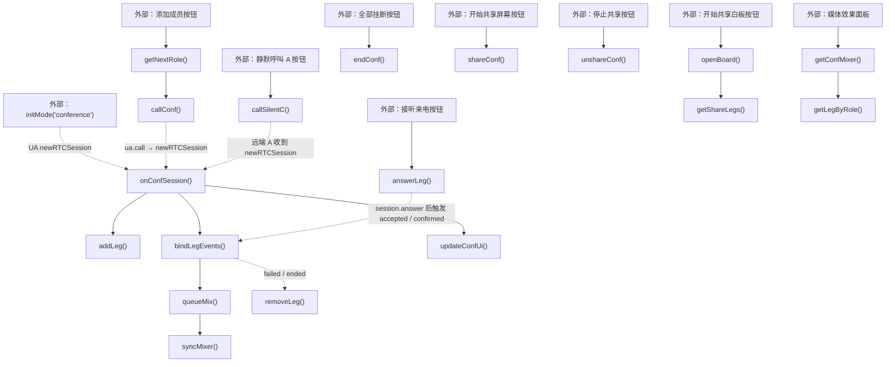
```mermaid
flowchart TD
  MODE["外部：initMode('conference')"] -.->|"UA newRTCSession"| NEW["onConfSession()"]

  ADD["外部：添加成员按钮"] --> NEXT["getNextRole()"]
  NEXT --> CALL["callConf()"]

  SILENT["外部：静默呼叫 A 按钮"] --> SCALL["callSilentC()"]
  ANSWER["外部：接听来电按钮"] --> ALEG["answerLeg()"]
  HANGALL["外部：全部挂断按钮"] --> TERMALL["endConf()"]

  STARTUI["外部：开始共享屏幕按钮"] --> START["shareConf()"]
  STOPUI["外部：停止共享按钮"] --> STOP["unshareConf()"]
  BOARDUI["外部：开始共享白板按钮"] --> OPENBOARD["openBoard()"]
  OPENBOARD --> TARGETBOARD["getShareLegs()"]

  EFFECTS["外部：媒体效果面板"] --> GETMEC["getConfMixer()"]
  GETMEC --> BYROLE["getLegByRole()"]

  NEW --> LEG["addLeg()"]
  NEW --> EVENTS["bindLegEvents()"]
  NEW --> UI["updateConfUi()"]
  CALL -.->|"ua.call → newRTCSession"| NEW
  SCALL -.->|"远端 A 收到 newRTCSession"| NEW
  ALEG -.->|"session.answer 后触发 accepted / confirmed"| EVENTS

  EVENTS --> SYNC["queueMix()"]
  SYNC --> MIX["syncMixer()"]
  EVENTS -.->|"failed / ended"| CLEAN["removeLeg()"]
```

### 22.2 呼叫、来电分类与接听调用图

这张图展开 `newRTCSession`、添加 B/C、静默 C 和接听四条路径。

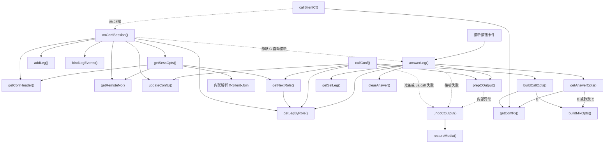
```mermaid
flowchart TD
  NEW["onConfSession()"] --> RESOLVE["getSessOpts()"]
  NEW --> BYROLE["getLegByRole()"]
  NEW --> REQHEAD["getConfHeader()"]
  NEW --> REMOTE["getRemoteNo()"]
  NEW --> CREATE["addLeg()"]
  NEW --> SETUP["bindLegEvents()"]
  NEW --> UI["updateConfUi()"]
  NEW -.->|"静默 C 自动接听"| ANSWER["answerLeg()"]

  RESOLVE --> NEXT["getNextRole()"]
  RESOLVE --> REQHEAD
  RESOLVE --> ENABLED["内联解析 X-Silent-Join"]
  RESOLVE --> REMOTE
  NEXT --> BYROLE

  CALL["callConf()"] --> NEXT
  CALL --> BYROLE
  CALL --> UI
  CALL --> PREPARE["prepCOutput()"]
  CALL --> BUILD_CALL["buildCallOpts()"]
  CALL -.->|"准备或 ua.call 失败"| ROLLBACK["undoCOutput()"]
  BUILD_CALL --> EXTRA["getConfFx()"]
  BUILD_CALL -->|"B"| COMPOSER_OPT["buildMixOpts()"]

  SILENT["callSilentC()"] --> EXTRA
  SILENT -.->|"ua.call()"| NEW

  PENDING["接听按钮事件"] --> ANSWER
  ANSWER --> SELECTED["getSelLeg()"]
  ANSWER --> BYROLE
  ANSWER --> PREPARE
  ANSWER --> BUILD_ANSWER["getAnswerOpts()"]
  ANSWER --> CLEAR["clearAnswer()"]
  ANSWER -.->|"接听失败"| ROLLBACK
  BUILD_ANSWER --> EXTRA
  BUILD_ANSWER -->|"B 或静默 C"| COMPOSER_OPT

  PREPARE -.->|"内部异常"| ROLLBACK
  ROLLBACK --> RESTORE_ONE["restoreMedia()"]
```

### 22.3 RTCSession 事件、远端轨与预览调用图

`bindLegEvents()` 是事件分发中心；图中虚线边表示某个 SDK 事件触发对应处理路径。

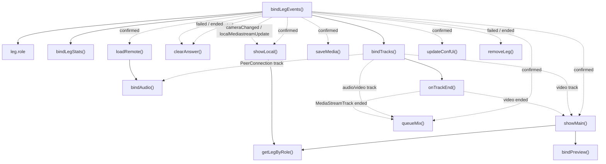
```mermaid
flowchart TD
  SETUP["bindLegEvents()"] --> DISPLAY["leg.role"]
  SETUP --> STATS["bindLegStats()"]
  SETUP --> ATTACH["bindTracks()"]

  SETUP -.->|"accepted"| CLEAR["clearAnswer()"]
  SETUP -.->|"confirmed"| HYDRATE["loadRemote()"]
  SETUP -.->|"confirmed"| REMEMBER["saveMedia()"]
  SETUP -.->|"confirmed"| LOCAL["showLocal()"]
  SETUP -.->|"confirmed"| MAIN["showMain()"]
  SETUP -.->|"confirmed"| UI["updateConfUi()"]
  SETUP -.->|"confirmed"| SCHEDULE["queueMix()"]

  SETUP -.->|"cameraChanged / localMediastreamUpdate"| LOCAL
  SETUP -.->|"failed / ended"| CLEAR
  SETUP -.->|"failed / ended"| CLEAN["removeLeg()"]

  ATTACH -.->|"PeerConnection track"| AUDIO["bindAudio()"]
  ATTACH -.->|"video track"| MAIN
  ATTACH -.->|"audio/video track"| SCHEDULE
  ATTACH --> ENDED["onTrackEnd()"]
  ENDED -.->|"MediaStreamTrack ended"| SCHEDULE
  ENDED -.->|"video ended"| MAIN

  HYDRATE --> AUDIO
  MAIN --> BYROLE["getLegByRole()"]
  MAIN --> PREVIEW["bindPreview()"]
  LOCAL --> BYROLE
```

### 22.4 composer、子混音、同步与降级调用图

这张图包含普通 C 信令前媒体准备、实际三方同步以及失败恢复，是媒体链路的完整函数级调用图。为避免跨分支长距离回折，共用辅助函数会就近重复显示；同名节点仍表示同一个函数。

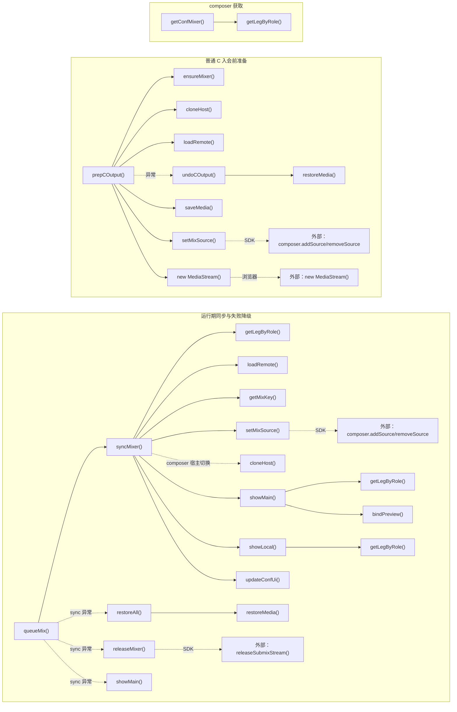
```mermaid
flowchart TB
  subgraph LOOKUP_FLOW["composer 获取"]
    direction LR
    GET["getConfMixer()"] --> BYROLE_GET["getLegByRole()"]
  end

  subgraph PREP_FLOW["普通 C 入会前准备"]
    direction LR
    PREPARE["prepCOutput()"] --> ENSURE["ensureMixer()"]
    PREPARE --> CLONE_PREP["cloneHost()"]
    PREPARE --> HYDRATE_PREP["loadRemote()"]
    PREPARE --> SOURCE_PREP["setMixSource()"]
    PREPARE --> REMEMBER["saveMedia()"]
    PREPARE --> OUTPUT["new MediaStream()"]
    PREPARE -.->|"异常"| ROLLBACK["undoCOutput()"]
    ROLLBACK --> RESTORE_ONE_PREP["restoreMedia()"]
    SOURCE_PREP -.->|"SDK"| ADDREMOVE_PREP["外部：composer.addSource/removeSource"]
    OUTPUT -.->|"浏览器"| STREAM["外部：new MediaStream()"]
  end

  subgraph SYNC_FLOW["运行期同步与失败降级"]
    direction LR
    SCHEDULE["queueMix()"] --> SYNC["syncMixer()"]
    SCHEDULE -.->|"sync 异常"| RESTORE_ALL["restoreAll()"]
    SCHEDULE -.->|"sync 异常"| RELEASE["releaseMixer()"]
    SCHEDULE -.->|"sync 异常"| MAIN_FAIL["showMain()"]
    SYNC --> BYROLE_SYNC["getLegByRole()"]
    SYNC --> HYDRATE_SYNC["loadRemote()"]
    SYNC --> SIGN["getMixKey()"]
    SYNC --> SOURCE_SYNC["setMixSource()"]
    SYNC -.->|"composer 宿主切换"| CLONE_SYNC["cloneHost()"]
    SYNC --> LOCAL_SYNC["showLocal()"]
    SYNC --> MAIN_SYNC["showMain()"]
    SYNC --> UI["updateConfUi()"]
    RESTORE_ALL --> RESTORE_ONE_SYNC["restoreMedia()"]
    RELEASE -.->|"SDK"| SUBMIX["外部：releaseSubmixStream()"]
    SOURCE_SYNC -.->|"SDK"| ADDREMOVE_SYNC["外部：composer.addSource/removeSource"]
    MAIN_SYNC --> BYROLE_MAIN["getLegByRole()"]
    MAIN_SYNC --> PREVIEW["bindPreview()"]
    LOCAL_SYNC --> BYROLE_LOCAL["getLegByRole()"]
  end

  LOOKUP_FLOW ~~~ PREP_FLOW
  PREP_FLOW ~~~ SYNC_FLOW
```

### 22.5 当前成员、统计面板与公共控制调用图

这张图覆盖统计格式化小函数，也展示成员选择如何改变 `rtcSession`、`statsSession` 和公共控制栏的操作目标。

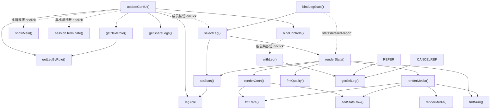
```mermaid
flowchart TD
  UI["updateConfUi()"] --> BYROLE["getLegByRole()"]
  UI --> DISPLAY["leg.role"]
  UI -.->|"成员按钮 onclick"| SELECT["selectLeg()"]
  UI -.->|"成员按钮 onclick"| MAIN["showMain()"]
  UI -.->|"单成员挂断 onclick"| TERM["session.terminate()"]
  UI --> NEXT["getNextRole()"]
  UI --> TARGETS["getShareLegs()"]
  UI --> BINDCTRL["bindControls()"]

  NEXT --> BYROLE
  SELECT --> TEXT["setStats()"]
  SELECT --> REPORT["renderStats()"]
  TEXT --> DISPLAY

  BINDSTATS["bindLegStats()"] -.->|"stats:detailed-report"| REPORT
  BINDSTATS --> SELECT
  REPORT --> CONNECTION["renderConn()"]
  REPORT --> STREAMS["renderMedia()"]
  REPORT --> NUMBER["fmtNum()"]
  REPORT --> QUALITY["fmtQuality()"]
  REPORT --> TEXT

  CONNECTION --> BITRATE["fmtRate()"]
  CONNECTION --> ROW["addStatsRow()"]
  STREAMS --> NAME["renderMedia()"]
  STREAMS --> BITRATE
  STREAMS --> NUMBER
  STREAMS --> ROW

  BINDCTRL -.->|"各公共按钮 onclick"| WITH["withLeg()"]
  WITH --> CURRENT["getSelLeg()"]
  REFER --> CURRENT
  CANCELREF --> CURRENT
```

### 22.6 定向屏幕共享完整调用图

图中展示 Demo 的多会话编排边界；sender 复用、re-INVITE、MID 和共享 INFO 均封装在 SDK `share/unShare` 内。

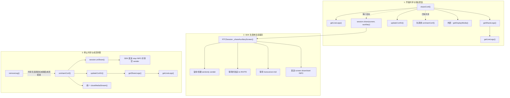
```mermaid
flowchart TB
  subgraph START_FLOW["1. 开始共享与目标筛选"]
    direction LR
    START["shareConf()"] --> CONFIRMED_DIRECT["getLiveLegs()"]
    START --> TARGETS["getShareLegs()"]
    TARGETS --> CONFIRMED_TARGETS["getLiveLegs()"]
    START --> UI_START["updateConfUi()"]
    START -.->|"已有共享"| STOP_ENTRY["先调用 unshareConf()"]
    START --> GDM["外部：getDisplayMedia()"]
    START -.->|"每个目标"| SHARE_ENTRY["session.share(screen, auxiliary)"]
  end

  subgraph SHARE_FLOW["2. SDK 负责单会话辅流"]
    direction LR
    SHARE_ENTRY --> SDK_SHARE["RTCSession._shareAuxiliaryScreen()"]
    SDK_SHARE --> SENDER["复用/创建 sendonly sender"]
    SDK_SHARE --> RENEGO["等待并发起 re-INVITE"]
    SDK_SHARE --> MID["等待 transceiver.mid"]
    SDK_SHARE --> INFO["发送 screen-share/start INFO"]
  end

  subgraph STOP_FLOW["3. 停止共享与成员清理"]
    direction LR
    CLEAN["removeLeg()"] -.->|"共享无活跃目标或最后成员结束"| STOP["unshareConf()"]
    STOP --> UNSHARE["session.unShare()"]
    STOP --> UI_STOP["updateConfUi()"]
    UNSHARE --> SDK_STOP["SDK 发送 stop INFO 并清空 sender"]
    STOP --> CLOSE_STREAM["统一 closeMediaStream()"]
    UI_STOP --> TARGETS_STOP["getShareLegs()"]
    TARGETS_STOP --> CONFIRMED_STOP["getLiveLegs()"]
  end

  START_FLOW ~~~ SHARE_FLOW
  SHARE_FLOW ~~~ STOP_FLOW
```

### 22.7 挂断、资源清理与 REFER 调用图

最后一张图展示所有结束入口如何汇入统一清理，以及清理过程会调用哪些恢复和 UI 函数。

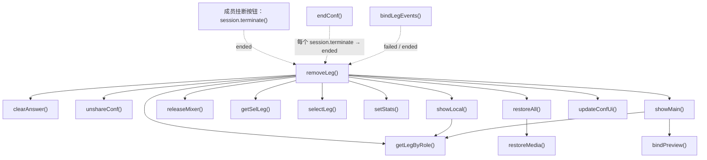
```mermaid
flowchart TD
  TERMONE["成员挂断按钮：session.terminate()"] -.->|"ended"| CLEAN["removeLeg()"]
  TERMALL["endConf()"] -.->|"每个 session.terminate → ended"| CLEAN
  EVENTS["bindLegEvents()"] -.->|"failed / ended"| CLEAN

  CLEAN --> BYROLE["getLegByRole()"]
  CLEAN --> CLEAR["clearAnswer()"]
  CLEAN --> STOPSCREEN["unshareConf()"]
  CLEAN --> RESTORE["restoreAll()"]
  CLEAN --> RELEASE["releaseMixer()"]
  CLEAN --> CURRENT["getSelLeg()"]
  CLEAN --> SELECT["selectLeg()"]
  CLEAN --> TEXT["setStats()"]
  CLEAN --> LOCAL["showLocal()"]
  CLEAN --> MAIN["showMain()"]
  CLEAN --> UI["updateConfUi()"]

  RESTORE --> RESTORE_ONE["restoreMedia()"]
  LOCAL --> BYROLE
  MAIN --> BYROLE
  MAIN --> PREVIEW["bindPreview()"]
```

### 22.8 标注与共享白板跨文件调用图

屏幕标注和白板不修改 SDK 媒体链路。会议模块提供会话与目标集合，标注模块通过 `RTCSession.sendInfo()` 发送操作，并消费 `newInfo` 完成校验、绘制和三方转发。

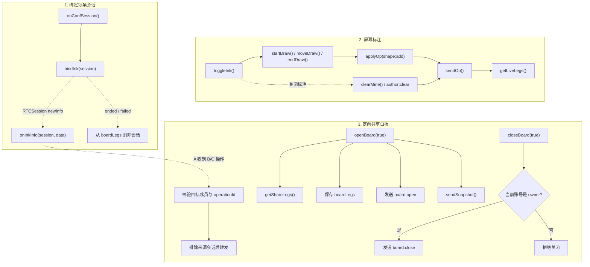
```mermaid
flowchart TB
  subgraph BIND_FLOW["1. 绑定每条会话"]
    direction LR
    NEW["onConfSession()"] --> BIND["bindInk(session)"]
    BIND -.->|"RTCSession newInfo"| HANDLE["onInkInfo(session, data)"]
    BIND -.->|"ended / failed"| REMOVE["从 boardLegs 删除会话"]
  end

  subgraph SCREEN_FLOW["2. 屏幕标注"]
    direction LR
    TOGGLE["toggleInk()"] --> DRAW["startDraw() / moveDraw() / endDraw()"]
    DRAW --> APPLY_SCREEN["applyOp(shape:add)"]
    APPLY_SCREEN --> SEND_SCREEN["sendOp()"]
    SEND_SCREEN --> CONFIRMED["getLiveLegs()"]
    TOGGLE -.->|"关闭标注"| CLEAR_OWN["clearMine() / author:clear"]
    CLEAR_OWN --> SEND_SCREEN
  end

  subgraph BOARD_FLOW["3. 定向共享白板"]
    direction LR
    OPEN["openBoard(true)"] --> TARGETS["getShareLegs()"]
    OPEN --> MEMBERS["保存 boardLegs"]
    OPEN --> OPEN_OP["发送 board:open"]
    OPEN --> SNAPSHOT["sendSnapshot()"]
    HANDLE -.->|"A 收到 B/C 操作"| CHECK["校验目标成员与 operationId"]
    CHECK --> FORWARD["排除来源会话后转发"]
    CLOSE["closeBoard(true)"] --> OWNER{"当前账号是 owner?"}
    OWNER -->|"是"| CLOSE_OP["发送 board:close"]
    OWNER -->|"否"| REJECT["拒绝关闭"]
  end

  BIND_FLOW ~~~ SCREEN_FLOW
  SCREEN_FLOW ~~~ BOARD_FLOW
```

### 22.9 如何沿调用图定位问题

| 现象 | 先看哪张图 | 建议从哪个函数开始 |
| --- | --- | --- |
| 点击添加成员没有发起呼叫 | 22.1、22.2 | `callConf()` |
| 来电被错误分成 B/C 或静默状态 | 22.2 | `getSessOpts()` |
| confirmed 后没有远端画面 | 22.3 | `bindTracks()` |
| 三方声音路由错误或合成失败 | 22.4 | `syncMixer()` |
| 统计或控制操作了错误成员 | 22.5 | `selectLeg()` |
| 屏幕共享没有第二路视频 | 22.6 | `shareConf()` 与 SDK `share()` 日志 |
| 标注没有显示参与者颜色 | 22.8 | `getInkColor()` 与 shape 的 author 字段 |
| B 的白板操作无法到达 C | 22.8 | `onInkInfo()` 与 `boardLegs` |
| 成员挂断后剩余会话没有恢复 | 22.7 | `removeLeg()` |
