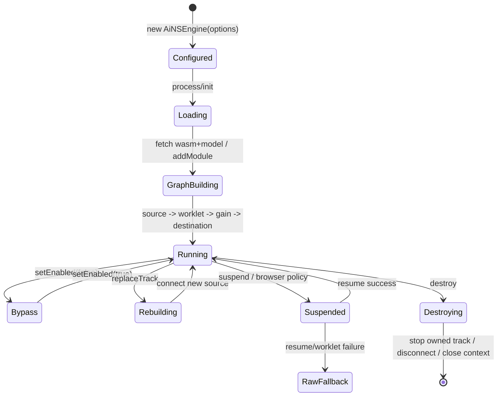

# AiNoiseSuppression 深度代码审查

> 返回：[审查总览](./README.md)
> 源码目录：[`lib/AiNoiseSuppression/`](../../../lib/AiNoiseSuppression/)
> RTCSession 集成：[`MediaPipeline.applyAiNoiseSuppressionOnSdkGumStream()`](../../../lib/RTCSession/MediaPipeline.js#L510)
> 专项测试：[`test/test-ains.js`](../../../test/test-ains.js)、[`test/test-rtcsession-media-effects-pipeline.js`](../../../test/test-rtcsession-media-effects-pipeline.js)
> 修复状态：本文问题已处理；本分册保留修复前证据与调用链，实施结果和最新测试见[总览第 4、8 节](./README.md#4-修复实施结果)。

## 1. 结论摘要

AiNS 的普通初始化路径简洁：配置归一化、加载 WASM/model、注册 Worklet、建立 WebAudio graph、输出 destination track。高风险集中在“初始化成功之后”的运行期：

1. `AudioContext.resume()`失败被吞掉，可能返回 live 但无声的处理流。
2. process、replace、destroy 和 RTCSession 应用没有异步所有权，快速换设备时存在旧请求覆盖新请求。
3. Worklet 的模型处理异常既没有 processor 内 fallback，也没有主线程 `processorerror`恢复。
4. bypass、输入 ended、响应体 timeout 和 teardown 等生命周期边界不完整。

## 2. AudioGraph 生命周期



当前实现缺少图中的 `RawFallback`运行期状态和 `Destroying`所有权锁，因此出现 AINS-001～AINS-004。

## 3. 详细问题

<a id="ains-001"></a>
### AINS-001：AudioContext resume 失败仍返回处理流

| 字段 | 内容 |
|---|---|
| 严重级别 | P1 |
| 可信度 | 确认 |
| 影响范围 | Safari、移动端 Chrome/WebView、需要用户手势恢复音频的环境 |
| 主要证据 | [`ensureGraph()`](../../../lib/AiNoiseSuppression/AiNSEngine.js#L433)、[`MediaPipeline.applyAiNoiseSuppressionOnSdkGumStream()`](../../../lib/RTCSession/MediaPipeline.js#L510) |

**结论**

`ensureGraph()`在 AudioContext 非 running 时调用 `resume()`；失败后只报告 warning，随后继续创建 Worklet、gain 和 destination，并返回处理流。MediaPipeline 只在 engine 抛异常时回退原始流，因此 suspended context 产生的 destination track 被当成成功结果。

**完整调用链**

```text
RTCSession/MediaPipeline
→ new AiNSEngine()
→ engine.process(stream)
→ init({inputStream})
→ setInput()
→ ensureGraph()
→ new AudioContext({sampleRate})
→ audioContext.resume() reject
→ catch: reportIssue(warn)，不 throw
→ initialize worklet / connect graph / rebuildStream()
→ 返回 processedStream
→ RTCRtpSender 收到 live 但可能无采样的 destination track
```

**外部表现与状态**

- UI、Promise 和 track.readyState 都可能显示成功/live。
- 实际对端听不到声音。
- RTCStats 可能只看到发送音频能量为零，无法知道 AiNS 是根因。

**现有测试为何遗漏**

测试 AudioContext mock 的 `resume()`总是成功，没有模拟浏览器自动播放策略拒绝，也没有读取输出 PCM/音量。

**最小修复方向与伪代码**

```js
if (audioContext.state !== 'running') {
  try { await audioContext.resume(); }
  catch (error) {
    await teardownGraph();
    throw markAsFallbackRequired(error, 'audio-context-resume');
  }
}

if (audioContext.state !== 'running') {
  throw new Error('AiNS AudioContext is not running');
}
```

由 MediaPipeline 现有 catch 返回原始 stream，保持通话继续。若产品需要等待用户手势，应由上层显式重试，不应把未运行 graph 当成功。

**回归测试与审查**

- [ ] `resume()`reject 时返回原始 stream。
- [ ] `resume()`resolve 但 state 仍为 suspended 时同样回退。
- [ ] 失败 graph 的节点和 Context 全部释放。
- [ ] issue 标明 `fallbackApplied=true`，但不打印鉴权/资源敏感信息。

<a id="ains-002"></a>
### AINS-002：process/换轨/销毁缺少并发所有权

| 字段 | 内容 |
|---|---|
| 严重级别 | P1 |
| 可信度 | 高 |
| 影响范围 | 快速设备切换、重复更新 AiNS、呼叫结束与初始化并发 |
| 主要证据 | [`init()`](../../../lib/AiNoiseSuppression/AiNSEngine.js#L148)、[`replaceTrack()`](../../../lib/AiNoiseSuppression/AiNSEngine.js#L195)、[`ensureGraph()`](../../../lib/AiNoiseSuppression/AiNSEngine.js#L433)、[`AiNSWorkletRuntime.initialize()`](../../../lib/AiNoiseSuppression/AiNSWorkletRuntime.js#L179) |

**竞争链**

```text
请求 A: process(streamA)
  → runtime.initialize() 下载中
请求 B: replace/process(streamB)
  → 改写 originalTrack/originalStream
  → 第二次 initialize()/create node
请求 C: destroy()
  → disconnect/close
请求 A 恢复
  → 基于已被 B/C 改写的字段继续建图并提交 outputStream
```

RTCSession 进一步放大此问题：`applyAiNoiseSuppressionOnSdkGumStream()`先把新 engine 写入 `session._sessionAiNSEngine`，await 后又继续使用共享 session 字段。并发调用可让第一个调用在第二个调用销毁/替换实例后返回旧流或泄漏 loser engine。

**最小修复伪代码**

```js
async process(stream) {
  const generation = ++this._generation;
  const operation = this._buildGraphFor(stream);
  this._operation = operation;
  const owned = await operation;

  if (generation !== this._generation || this._destroyed) {
    await owned.dispose();
    throw new StaleOperationError();
  }
  this._commitOwnedGraph(owned);
  return this.processedStream;
}
```

RTCSession 同样保存 request token；只有最新 token 可写 `_sessionAiNSEngine`和 `_aiNSInputStream`。旧任务只释放自己创建的实例，不能停止最新实例。

**回归测试与审查**

- [ ] 两次 process 延迟反序完成，最终只保留第二次输入和输出。
- [ ] replace 与 destroy 并发，旧 Promise 不会重建已销毁 graph。
- [ ] runtime initialize 并发只下载/注册一次，或每个 loser 明确释放。
- [ ] 快速切麦不停止新输入流。

<a id="ains-003"></a>
### AINS-003：Worklet 运行期异常没有回退路径

| 字段 | 内容 |
|---|---|
| 严重级别 | P1 |
| 可信度 | 确认 |
| 主要证据 | [`DeepFilterAudioProcessor.process()`](../../../lib/AiNoiseSuppression/AiNSWorkletSource.js#L536)、[`createNode()`](../../../lib/AiNoiseSuppression/AiNSWorkletRuntime.js#L244) |

`ans_process_frame()`没有 try/catch。主线程只处理 port 上的 `INIT_FAILED`和 `UNSUPPORTED_CHANNEL_LAYOUT`，没有设置 `workletNode.onprocessorerror`。模型运行期异常可能终止 processor，但 destination track 仍保持 live。

**建议双层保护**

```js
// Processor 内：当前帧失败后切到永久 bypass，并通知主线程。
try { processed = ans_process_frame(handle, frame); }
catch (error) {
  this.bypass = true;
  this.clearRingBuffers();
  this.port.postMessage({ type: 'runtime-failed', message: safeMessage(error) });
  return passthrough(...);
}

// 主线程：processorerror 是最终兜底。
node.onprocessorerror = (event) => requestRawAudioFallback(event);
```

RTCSession 需要能把 sender 替回原始音频；只在 issue 中写“已降级”但不替换轨道并不够。

**回归测试与审查**

- [ ] `ans_process_frame`第二帧抛错后输出原始 PCM，而不是静音。
- [ ] runtime-failed/processorerror 只触发一次降级。
- [ ] 已停止会话收到迟到错误时不重新 replaceTrack。

<a id="ains-004"></a>
### AINS-004：teardownGraph 不是逐资源异常安全

| 字段 | 内容 |
|---|---|
| 严重级别 | P2 |
| 可信度 | 确认 |
| 主要证据 | [`teardownGraph()`](../../../lib/AiNoiseSuppression/AiNSEngine.js#L530)、[`AiNSWorkletRuntime.destroy()`](../../../lib/AiNoiseSuppression/AiNSWorkletRuntime.js#L414) |

多个 disconnect 和 close 放在单一 try 内，第一个异常会跳过后续清理。destination stream 的输出 track 没有显式 stop；Runtime destroy 也没有清理 port handlers/processor error handler。

**最小修复模式**

```js
safe(() => sourceNode.disconnect());
safe(() => workletNode.disconnect());
safe(() => outputGainNode.disconnect());
safe(() => destination.disconnect());
destination.stream.getTracks().forEach(track => safe(() => track.stop()));
await safeAsync(() => audioContext.close());
clearAllReferences();
```

每一步独立执行，最后统一清字段。destroy 应幂等，并设置 `_destroyed=true`阻止重新初始化。

<a id="ains-005"></a>
### AINS-005：bypass 切换保留旧环形缓冲数据

| 字段 | 内容 |
|---|---|
| 严重级别 | P2 |
| 可信度 | 确认 |
| 主要证据 | [`handleMessage()`](../../../lib/AiNoiseSuppression/AiNSWorkletSource.js#L509)、[`process()`](../../../lib/AiNoiseSuppression/AiNSWorkletSource.js#L536) |

`SET_BYPASS`只修改布尔值。bypass 期间直接 passthrough，不推进或清空内部 input/output ring positions。重新启用时，旧缓冲中的半帧和已处理采样仍可先被输出。

建议在 bypass 状态发生变化时清零 buffer、read/write position 和 temp frame；重启第一小段不足完整模型帧时直接 passthrough，避免人为静音。

<a id="ains-006"></a>
### AINS-006：Capability 检测存在假阳性

| 字段 | 内容 |
|---|---|
| 严重级别 | P2 |
| 可信度 | 确认 |
| 主要证据 | [`isAiNSSupported()`](../../../lib/AiNoiseSuppression/AiNSEngine.js#L14) |

静态检测只有 AudioContext、AudioWorkletNode、WebAssembly，未覆盖实际调用所需的 MediaStream、`audioContext.audioWorklet.addModule`、Blob、URL、fetch 和 `createMediaStreamDestination`。

建议 capability 分为：

- `staticSupported`：不创建资源的全局 API 检查。
- `runtimeReady`：创建 Context 后检查实例 API。
- `initialized`：资源下载和 Worklet 初始化成功。

业务只能把前两者当“可以尝试”，不能把静态 true 当“降噪一定可用”。

<a id="ains-007"></a>
### AINS-007：fetch 超时没有覆盖响应体读取

| 字段 | 内容 |
|---|---|
| 严重级别 | P2 |
| 可信度 | 确认 |
| 主要证据 | [`fetchAsset()`](../../../lib/AiNoiseSuppression/AiNSWorkletRuntime.js#L41) |

timeout 与 `fetch(url)`竞争，Response 返回后清 timer，然后才 `response.arrayBuffer()`。服务端 headers 已返回但 body 长期停滞时，初始化仍能无限等待；timeout 后也没有 AbortController 停止网络请求。

建议用同一个 AbortController 覆盖 fetch 和 body read，并在 finally clear timeout。测试应模拟 `fetch`立即返回、`arrayBuffer()`永不 resolve。

<a id="ains-008"></a>
### AINS-008：输入轨 ended 不会传播到处理输出

| 字段 | 内容 |
|---|---|
| 严重级别 | P2 |
| 可信度 | 高 |
| 主要证据 | [`setInput()`](../../../lib/AiNoiseSuppression/AiNSEngine.js#L360)、[`rebuildStream()`](../../../lib/AiNoiseSuppression/AiNSEngine.js#L500) |

Engine 不监听 original track 的 `ended`/mute。原麦克风轨结束后，WebAudio destination track 可能继续 `live`并输出静音，sender 和 RTCSession 无法通过输出 track 状态感知设备已经丢失。

最小方案是在每次 set/replace 时解绑旧监听器、绑定新轨 `ended`；事件触发后请求 RTCSession 原始回退/设备恢复，或停止拥有的 processed track 并上报明确 issue。

<a id="ains-009"></a>
### AINS-009：Issue 历史没有长度上限

| 字段 | 内容 |
|---|---|
| 严重级别 | P3 |
| 可信度 | 确认 |
| 主要证据 | [`_reportIssue()`](../../../lib/AiNoiseSuppression/AiNSEngine.js#L116) |

每条 issue 永久 push。长会话中重复 runtime warning 会持续增长。Composer 已有最多 50 条的 FIFO，可在 AiNS 复用相同上限，同时保留累计计数供诊断。

## 4. AiNSEngine 方法覆盖矩阵

| 方法 | 可见性 | 直接调用方 | 下游/状态 | 异步、资源与异常 | 关联/测试 |
|---|---|---|---|---|---|
| [`cloneIssue()`](../../../lib/AiNoiseSuppression/AiNSEngine.js#L9) | 文件私有 | issue getter/report | JSON clone issue | 非 JSON 值可抛错 | AINS-009；间接 |
| [`isAiNSSupported()`](../../../lib/AiNoiseSuppression/AiNSEngine.js#L14) | 文件私有 | static capability | 读全局 API | 静态假阳性 | AINS-006；已覆盖基础 |
| [`collectCapabilityReport(engine)`](../../../lib/AiNoiseSuppression/AiNSEngine.js#L27) | 文件私有 | instance/static report | 汇总 static/runtime/config | 无资源 | AINS-006；已覆盖 |
| [`constructor(options)`](../../../lib/AiNoiseSuppression/AiNSEngine.js#L72) | 公 | MediaPipeline/用户 | `AiNSConfig.create`；new WorkletRuntime；初始化节点/track 字段 | 不建图 | AINS-002/009；已覆盖 |
| [`_reportIssue(issue)`](../../../lib/AiNoiseSuppression/AiNSEngine.js#L116) | 私 | Engine 各异常路径 | normalize→push→onIssue | onIssue 有保护；数组无上限 | AINS-009；部分 |
| [`getIssues()`](../../../lib/AiNoiseSuppression/AiNSEngine.js#L128) | 公 | 诊断 | map clone | clone 可能受异常值影响 | AINS-009；已覆盖 |
| [`getLastIssue()`](../../../lib/AiNoiseSuppression/AiNSEngine.js#L134) | 公 | 诊断 | clone 最后一项 | 无资源 | AINS-009；已覆盖 |
| [`init(params)`](../../../lib/AiNoiseSuppression/AiNSEngine.js#L148) | 公/异步 | process/用户 | setInput→ensureGraph→提交 outputStream | 无操作 token | AINS-001/002；部分 |
| [`getOutput()`](../../../lib/AiNoiseSuppression/AiNSEngine.js#L173) | 公 | 用户 | 返回 outputStream 引用 | 可返回旧/已静音流 | AINS-002/008；已覆盖 |
| [`process(inputStream)`](../../../lib/AiNoiseSuppression/AiNSEngine.js#L183) | 公/异步 | MediaPipeline | 兼容处理器接口→init | 并发共享字段 | AINS-002；部分 |
| [`replaceTrack(input)`](../../../lib/AiNoiseSuppression/AiNSEngine.js#L195) | 公/异步 | MediaPipeline 切麦 | 解析 track→改 original→ensureGraph→提交 | await 前已改共享状态 | AINS-002/008；部分 |
| [`getRuntime()`](../../../lib/AiNoiseSuppression/AiNSEngine.js#L227) | 公/unstable | 调试/用户 | 返回 WorkletRuntime 内部实例 | 暴露内部控制对象 | -；已覆盖 |
| [`setEnabled(enable)`](../../../lib/AiNoiseSuppression/AiNSEngine.js#L241) | 公 | 用户/ensureGraph | normalize→runtime.setNsEnabled | 返回 resolved Promise | AINS-005；已覆盖 |
| [`setLevel(level)`](../../../lib/AiNoiseSuppression/AiNSEngine.js#L254) | 公 | 用户 | normalize→runtime port | Worklet 尚未就绪时只更新 config | -；已覆盖 |
| [`setOutputGain(value)`](../../../lib/AiNoiseSuppression/AiNSEngine.js#L269) | 公 | 用户 | normalize→gain.value | 即时跳变可能有轻微 click | -；已覆盖 |
| [`isEnabled()`](../../../lib/AiNoiseSuppression/AiNSEngine.js#L284) | 公 | 用户/report | 返回 enabled | 无资源 | -；已覆盖 |
| [`suspend()`](../../../lib/AiNoiseSuppression/AiNSEngine.js#L290) | 公/异步 | 用户 | context.suspend | rejection 直传 | AINS-001；部分 |
| [`resume()`](../../../lib/AiNoiseSuppression/AiNSEngine.js#L300) | 公/异步 | 用户 | context.resume | rejection 直传；ensureGraph 路径却吞错 | AINS-001；部分 |
| [`getCapabilities()`](../../../lib/AiNoiseSuppression/AiNSEngine.js#L313) | 公 | 用户 | capability + runtime issues | 克隆 issues | AINS-006/009；已覆盖 |
| [`static isSupported()`](../../../lib/AiNoiseSuppression/AiNSEngine.js#L327) | 公 | MetaHuman/用户 | `isAiNSSupported()` | 假阳性 | AINS-006；已覆盖 |
| [`static getCapabilities()`](../../../lib/AiNoiseSuppression/AiNSEngine.js#L332) | 公 | 用户 | 无实例 capability | 不能证明资源可加载 | AINS-006；已覆盖 |
| [`destroy()`](../../../lib/AiNoiseSuppression/AiNSEngine.js#L345) | 公/异步 | MediaPipeline/用户 | teardown→runtime.destroy→清输入输出 | 无 destroyed guard | AINS-002/004；部分 |
| [`setInput(input)`](../../../lib/AiNoiseSuppression/AiNSEngine.js#L360) | 内部公开 | init/用户 | 校验 MediaStream/track；写 original | 不绑定 ended | AINS-008；已覆盖普通 |
| [`_getInputAudioTrack(input)`](../../../lib/AiNoiseSuppression/AiNSEngine.js#L390) | 私 | set/replace | 取首音轨 | 多音轨只取第一个 | -；已覆盖 |
| [`_getInputType(input)`](../../../lib/AiNoiseSuppression/AiNSEngine.js#L404) | 私 | 日志 | 返回诊断字符串 | 无资源 | -；间接 |
| [`_buildReplacedAudioStream(track)`](../../../lib/AiNoiseSuppression/AiNSEngine.js#L412) | 私 | replace | 新音轨 + 原非音轨→新 MediaStream | 不停止旧轨 | AINS-002；已覆盖 |
| [`ensureGraph()`](../../../lib/AiNoiseSuppression/AiNSEngine.js#L433) | 内部/异步 | init/replace | Context→runtime→node→gain→destination→source→stream | resume 吞错；并发建图 | AINS-001/002；部分 |
| [`rebuildStream()`](../../../lib/AiNoiseSuppression/AiNSEngine.js#L500) | 私 | ensureGraph | destination 音轨 + 可选非音轨→processedStream | 输出轨所有权未记录 | AINS-004/008；已覆盖 |
| [`teardownGraph()`](../../../lib/AiNoiseSuppression/AiNSEngine.js#L530) | 私/异步 | destroy | disconnect nodes→close context→清 processed | 单一 try；未 stop destination track | AINS-004；部分 |

## 5. AiNSWorkletRuntime 方法覆盖矩阵

| 方法 | 调用方 | 下游/状态 | 异步与资源 | 关联/测试 |
|---|---|---|---|---|
| [`getAssetUrls(cdnUrl)`](../../../lib/AiNoiseSuppression/AiNSWorkletRuntime.js#L24) | initialize | 拼接 wasm/model URL | 尾斜杠可形成双斜杠 | P3；间接 |
| [`fetchAsset(url, timeoutMs)`](../../../lib/AiNoiseSuppression/AiNSWorkletRuntime.js#L41) | initialize | fetch→Response→arrayBuffer | timeout 不覆盖 body；无 abort | AINS-007；部分 |
| [`registerWorkletModule(context, code)`](../../../lib/AiNoiseSuppression/AiNSWorkletRuntime.js#L87) | create node | Blob URL→audioWorklet.addModule→revoke | CSP/addModule 异常直传 | AINS-006；已覆盖 mock |
| [`constructor(config)`](../../../lib/AiNoiseSuppression/AiNSWorkletRuntime.js#L122) | Engine | 配置、asset/node/init flags | 无资源 | AINS-002；已覆盖 |
| [`_reportIssue(issue)`](../../../lib/AiNoiseSuppression/AiNSWorkletRuntime.js#L163) | runtime 错误 | onIssue，回调有保护 | 无历史存储 | -；已覆盖 |
| [`initialize()`](../../../lib/AiNoiseSuppression/AiNSWorkletRuntime.js#L179) | ensureGraph | 并行 fetch→保存 assets→isInitialized | 无 in-flight Promise；部分失败结果由 Promise.all 丢弃 | AINS-002/007；部分 |
| [`createNode(context)`](../../../lib/AiNoiseSuppression/AiNSWorkletRuntime.js#L244) | ensureGraph | register→new node→port.onmessage | 覆盖 `workletNode`；无 processorerror | AINS-002/003；部分 |
| [`setLevel(level)`](../../../lib/AiNoiseSuppression/AiNSWorkletRuntime.js#L350) | Engine | config→port SET_LEVEL | 节点未就绪时延迟 | -；已覆盖 |
| [`setNsEnabled(enabled)`](../../../lib/AiNoiseSuppression/AiNSWorkletRuntime.js#L379) | Engine | bypass flag→port SET_BYPASS | 不清 processor ring buffer | AINS-005；部分 |
| [`isEnabled()`](../../../lib/AiNoiseSuppression/AiNSWorkletRuntime.js#L404) | report/用户 | `!bypassEnabled` | 不证明 processor 正常 | AINS-003；已覆盖 |
| [`destroy()`](../../../lib/AiNoiseSuppression/AiNSWorkletRuntime.js#L414) | Engine.destroy | disconnect node→清 assets/init | disconnect 可抛；未清 handler | AINS-004；部分 |
| [`ensureInitialized()`](../../../lib/AiNoiseSuppression/AiNSWorkletRuntime.js#L433) | create node | 检查 flag，否则 throw | 只检查 flag，不验证 assets 内容 | AINS-002；已覆盖 |

## 6. AiNSConfig 方法覆盖矩阵

| 方法 | 调用方 | 状态语义 | 风险/覆盖 |
|---|---|---|---|
| [`create(options)`](../../../lib/AiNoiseSuppression/AiNSConfig.js#L74) | Engine constructor | 汇总 enabled/preserve/sampleRate/level/gain/assets | 已覆盖 |
| [`normalizeBoolean()`](../../../lib/AiNoiseSuppression/AiNSConfig.js#L104) | create/setEnabled/runtime | 仅严格 boolean，否则 fallback | 已覆盖 |
| [`normalizePositiveInteger()`](../../../lib/AiNoiseSuppression/AiNSConfig.js#L136) | create | 正整数，否则 sample rate fallback 值 | 注释承诺 Context fallback，但 Engine 未实现；AINS-001 |
| [`normalizeLevel()`](../../../lib/AiNoiseSuppression/AiNSConfig.js#L174) | create/set level | floor 并 clamp 0～100 | 已覆盖 |
| [`normalizeOutputGain()`](../../../lib/AiNoiseSuppression/AiNSConfig.js#L203) | create/set gain | clamp 0～4 | 已覆盖 |
| [`normalizeAssetConfig()`](../../../lib/AiNoiseSuppression/AiNSConfig.js#L234) | create | 仅保留非空 cdnUrl | 已覆盖 |

## 7. AudioWorkletSource 方法覆盖矩阵

| 方法 | 调用方 | 下游/状态 | 资源/异常 | 关联/测试 |
|---|---|---|---|---|
| [`workletMain()`](../../../lib/AiNoiseSuppression/AiNSWorkletSource.js#L8) | source factory 序列化 | 定义 WASM glue、Processor、registerProcessor | 运行在 AudioWorkletGlobalScope | 全局 |
| [`getTextDecoder()`](../../../lib/AiNoiseSuppression/AiNSWorkletSource.js#L21) | decode helpers | 缓存 TextDecoder | 不支持时抛初始化错误 | 已覆盖间接 |
| [`getFloat32ArrayMemory0()`](../../../lib/AiNoiseSuppression/AiNSWorkletSource.js#L35) | WASM array bridge | 缓存 memory.buffer view | memory grow 时重建 | 已覆盖间接 |
| [`getUint8ArrayMemory0()`](../../../lib/AiNoiseSuppression/AiNSWorkletSource.js#L45) | decode/model bridge | 缓存 Uint8 view | memory grow 时重建 | 已覆盖间接 |
| [`decodeText()`](../../../lib/AiNoiseSuppression/AiNSWorkletSource.js#L55) | string glue | TextDecoder decode | 编码异常进入 init failure | 已覆盖间接 |
| [`getStringFromWasm0()`](../../../lib/AiNoiseSuppression/AiNSWorkletSource.js#L76) | WASM glue | ptr/len→字符串 | 依赖 memory 边界 | 已覆盖间接 |
| [`addToExternrefTable0()`](../../../lib/AiNoiseSuppression/AiNSWorkletSource.js#L81) | WASM glue | 写 externref table | table API 异常 | 已覆盖间接 |
| [`handleError()`](../../../lib/AiNoiseSuppression/AiNSWorkletSource.js#L90) | imports glue | 捕获 JS 异常并交给 wasm exception store | 依赖导出函数 | 已覆盖间接 |
| [`passArray8ToWasm0()`](../../../lib/AiNoiseSuppression/AiNSWorkletSource.js#L104) | ans_create | malloc→复制 model bytes | 长度/分配依赖 WASM | 已覆盖 fake |
| [`passArrayF32ToWasm0()`](../../../lib/AiNoiseSuppression/AiNSWorkletSource.js#L114) | ans_process_frame | malloc→复制 PCM | 每帧 WASM 分配路径 | 已覆盖 fake |
| [`ans_create()`](../../../lib/AiNoiseSuppression/AiNSWorkletSource.js#L124) | Processor constructor | model bytes→模型 handle | handle 未严格验证 | AINS-003；部分 |
| [`ans_get_frame_length()`](../../../lib/AiNoiseSuppression/AiNSWorkletSource.js#L133) | constructor | 读取模型帧长 | 0/极值未验证 | AINS-003；未覆盖边界 |
| [`ans_process_frame()`](../../../lib/AiNoiseSuppression/AiNSWorkletSource.js#L140) | process loop | PCM→WASM→Float32Array | throw 无上层 catch | AINS-003；未覆盖 throw |
| [`ans_set_atten_lim()`](../../../lib/AiNoiseSuppression/AiNSWorkletSource.js#L148) | message handler | 更新模型抑制级别 | handle 异常可终止 message | AINS-003；部分 |
| [`__wbg_finalize_init()`](../../../lib/AiNoiseSuppression/AiNSWorkletSource.js#L331) | initSync | 保存 exports/memory，启动 wasm | 初始化资源 | 已覆盖 fake |
| [`initSync()`](../../../lib/AiNoiseSuppression/AiNSWorkletSource.js#L343) | Processor constructor | WebAssembly.Module/Instance | 失败上报 INIT_FAILED | 已覆盖失败 |
| [`DeepFilterAudioProcessor.constructor()`](../../../lib/AiNoiseSuppression/AiNSWorkletSource.js#L391) | AudioWorklet runtime | 初始化 wasm/model/ring/temp/port | frameLength/handle 缺少强校验 | AINS-003；部分 |
| [`passInput()`](../../../lib/AiNoiseSuppression/AiNSWorkletSource.js#L451) | process/error fallback | 复制输入，缺输入填 0 | 无持久资源 | 已覆盖 |
| [`reportBadChannels()`](../../../lib/AiNoiseSuppression/AiNSWorkletSource.js#L480) | process | 只报告一次并 port.postMessage | postMessage 有 try/catch | 已覆盖 |
| [`handleMessage()`](../../../lib/AiNoiseSuppression/AiNSWorkletSource.js#L509) | port.onmessage | SET_LEVEL/SET_BYPASS | bypass 不清缓冲 | AINS-005；部分 |
| [`getInputAvailable()`](../../../lib/AiNoiseSuppression/AiNSWorkletSource.js#L526) | process | 环形缓冲可读输入数 | bufferSize/frameLength 错误会破坏运算 | AINS-003；间接 |
| [`getOutputAvailable()`](../../../lib/AiNoiseSuppression/AiNSWorkletSource.js#L531) | process | 环形缓冲可读输出数 | 同上 | AINS-003；间接 |
| [`process()`](../../../lib/AiNoiseSuppression/AiNSWorkletSource.js#L536) | AudioWorklet 系统 | mono 检查→缓冲→模型→输出/静音 | WASM throw 无 catch；不足 128 输出静音 | AINS-003/005；部分 |
| [`module.exports source factory`](../../../lib/AiNoiseSuppression/AiNSWorkletSource.js#L632) | Runtime.registerWorkletModule | `workletMain.toString()`裁剪源码 | 依赖函数源码可序列化 | 已覆盖 |

## 8. RTCSession 集成调用链

```text
processSdkGumStream()
→ applyAiNoiseSuppressionOnSdkGumStream(stream, options)
  ├─ normalizeSessionAiNSOptions()
  ├─ stopSessionAiNoiseSuppression()
  ├─ new AiNSEngine({onIssue})
  ├─ await engine.process(stream)
  ├─ session._aiNSInputStream = stream
  └─ catch → stop engine → return raw stream
→ applyMediaEffectsComposerOnSdkGumStream(processedOrRaw)
```

设备切换轻量路径：

```text
switchDevice / replace audio
→ replaceAudioTrackWithSessionAiNoiseSuppression(newStream)
  ├─ engine 不存在 → 完整 apply
  ├─ await engine.replaceTrack(newStream)
  ├─ close previous _aiNSInputStream
  └─ 失败 → stop old engine → 完整 apply
```

正常失败已经有 raw fallback，但 AINS-001/AINS-003 的共同特点是“没有抛异常的运行期失败”，因此不会进入这条降级链。

## 9. 建议新增测试清单

- [ ] AudioContext 构造指定 sampleRate 失败后尝试默认 Context，或明确回退原始流。
- [ ] resume reject/状态仍 suspended 时回退原始流。
- [ ] Worklet `ans_process_frame`运行期 throw 后 PCM passthrough。
- [ ] `processorerror`触发 RTCSession sender 原始轨回退。
- [ ] process×2、process+replace、replace+destroy 反序完成测试。
- [ ] Runtime initialize 并发只产生一个有效 node/asset owner。
- [ ] bypass 前后 ring buffer 不输出旧采样。
- [ ] 原始 track ended 后 processed track/issue/RTCSession 行为明确。
- [ ] fetch headers 成功但 body 卡住时 timeout+abort。
- [ ] 任一 disconnect/close 抛错时其他资源仍释放。
- [ ] issue FIFO 上限和累计计数。

## 10. 修复验收标准

1. AiNS 无法稳定输出时，RTCSession 使用原始音频继续通话。
2. 同一 session 的异步媒体操作最后一次请求获胜，旧操作不能覆盖或停止新资源。
3. Worklet 初始化失败和运行期失败都具有可观测 issue，并真正执行音频 fallback。
4. destroy 幂等，完成后所有模块拥有的 node、track、Context、handler 和引用都释放。
5. 正常路径的公开 API、Promise 返回和非音频轨保留行为不变。
