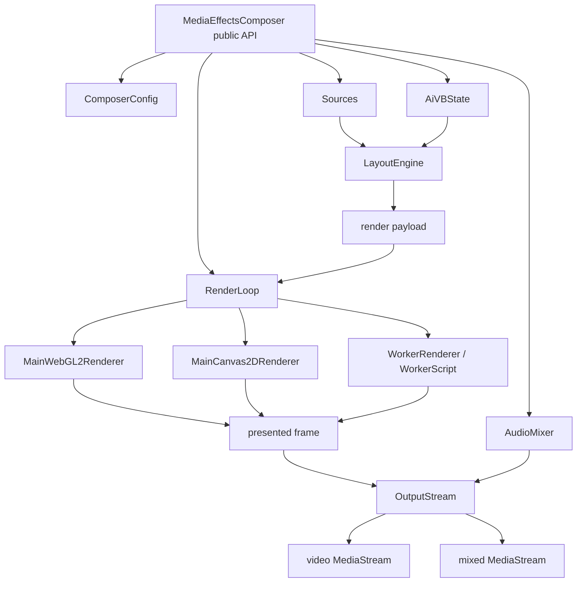
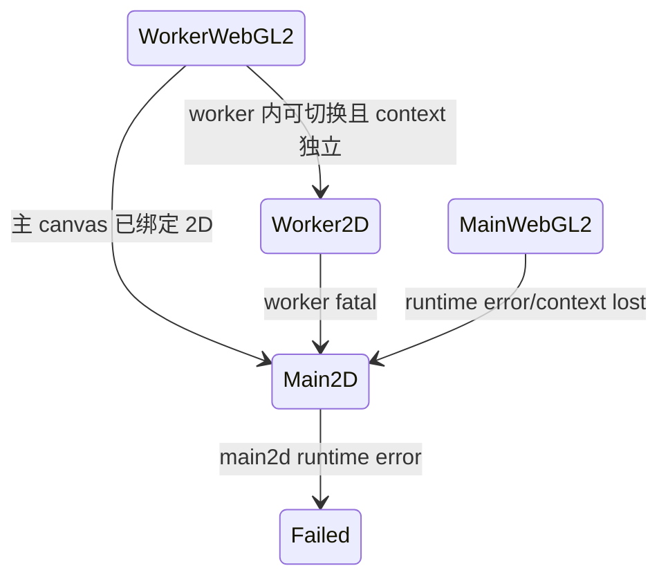
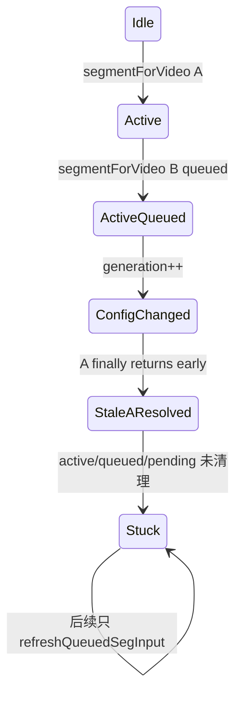

# MediaEffectsComposer 深度代码审查

> 返回：[审查总览](./README.md)
> 源码目录：[`lib/MediaEffectsComposer/`](../../../lib/MediaEffectsComposer/)
> RTCSession 集成：[`MediaPipeline.applyMediaEffectsComposerOnSdkGumStream()`](../../../lib/RTCSession/MediaPipeline.js#L881)
> 相关测试：`test/test-media-effects-composer-*.js`、`test/test-aivb.js`、`test/test-rtcsession-media-effects-*.js`
> 修复状态：本文问题已处理；本分册保留修复前证据与调用链，实施结果和最新测试见[总览第 4、8 节](./README.md#4-修复实施结果)。

## 1. 结论摘要

MediaEffectsComposer 的模块职责划分基本清楚：顶层 Composer 负责编排，Sources 管输入，LayoutEngine 生成 draw payload，RenderLoop 选择/驱动 renderer，OutputStream 导出视频轨，AudioMixer 生成音频轨，AiVBState 管分割状态，Watermark 管绘制资源。

隐藏问题集中在以下边界：

1. **输出对象身份**：video 与 mixed 使用同一个 `MediaStream`容器。
2. **帧资源所有权**：Worker 返回的 ImageBitmap 在 Insertable 成功/早退路径没有统一关闭。
3. **运行期降级**：初始化 fallback 较完整，但 writer、requestFrame、MainWebGL2 和 Worker2D 在运行期失败后不能稳定恢复。
4. **异步代数**：AiVB generation 能丢弃旧结果，却同时跳过旧任务的状态清理。
5. **长期资源**：背景图、segmenter、纹理、Watermark、AudioNode 和 DOM 元素的错误路径不完全闭合。

## 2. 模块与数据流



## 3. 高风险问题

<a id="mec-001"></a>
### MEC-001：video 和 mixed 复用同一 MediaStream

| 字段 | 内容 |
|---|---|
| 严重级别/可信度 | P1 / 确认 |
| 影响范围 | `getVideoStream()`、`getMixedStream()`、`getOutput({type})`及已经持有输出流的消费者 |
| 证据 | [`_getVideoOutputSync()`](../../../lib/MediaEffectsComposer/MediaEffectsComposer.js#L1145)、[`_getMixedOutput()`](../../../lib/MediaEffectsComposer/MediaEffectsComposer.js#L1178)、[`setMixedStream()`](../../../lib/MediaEffectsComposer/OutputStream.js#L763) |

**结论与调用链**

```text
getOutput("mixed")
→ _getMixedOutput()
→ mixedVideoStream = _getVideoOutputSync()
→ OutputStream.setMixedStream(mixedVideoStream)
→ AudioMixer.getStableAudioStream()
→ addAudioTracks(mixedVideoStream, audioStream)
→ 同一个对象也仍是 OutputStream._videoStream
```

**触发/表现/状态**：只要 mixed 首次补入音轨，之前返回的 video 输出对象也会出现音轨；任一消费者对这个流 add/removeTrack 会影响另一个输出。轨对象可共享，但流容器不应共享。

**测试缺口**：音频测试在创建 mixed 前检查 video tracks，没有在 mixed 创建后重新断言 video 的 `getAudioTracks().length===0`，也没有断言对象身份不同。

**最小修复伪代码**

```js
const videoStream = output.getVideoStream();
const mixedStream = new MediaStream(videoStream.getVideoTracks());
output.setMixedStream(mixedStream);
output.addAudioTracks(mixedStream, audioStream);
return mixedStream;
```

不要 clone video track；建立独立容器即可，保持 sender 使用同一轨道和渲染时序。

**回归/审查清单**

- [ ] video 与 mixed `!==`，但 video track identity 相同。
- [ ] mixed 后获取 video 仍无音轨。
- [ ] mixed 后续注入音轨只改变 mixed 容器。
- [ ] stop 对共享轨只停止一次，不因容器增多误停原始轨。

<a id="mec-002"></a>
### MEC-002：Insertable 路径的 ImageSource 所有权不完整

| 字段 | 内容 |
|---|---|
| 严重级别/可信度 | P1 / 确认 |
| 影响范围 | WorkerRenderer + Insertable Streams，尤其持续通话 |
| 证据 | [`WorkerRenderer._handleWorkerMessage()`](../../../lib/MediaEffectsComposer/Renderers/WorkerRenderer.js#L196)、[`onFramePresented()`](../../../lib/MediaEffectsComposer/OutputStream.js#L556)、[`_createVideoFrame()`](../../../lib/MediaEffectsComposer/OutputStream.js#L675) |

**调用链与所有权断点**

```text
Worker postMessage({bitmap})
→ WorkerRenderer draw bitmap to output canvas
→ onFramePresented({frameSource:bitmap, frameSourceConsumed:true})
├─ insertable 未激活/writer 不存在/track ended → 直接 return，bitmap 未 close
└─ new VideoFrame(bitmap)
   → writer.write(frame)
   → VideoFrame.close()
   → bitmap 未 close
```

`_closeFrameSource()`只用于替换 pending frame 和 teardown；它没有覆盖早退与成功写入。`new VideoFrame(bitmap)`不会移交 bitmap 的释放责任。

**测试缺口**：Mock 没有对每帧 ImageBitmap 记录 close 次数，且没有组合“配置 insertable=true、初始化回退 captureStream、Worker 仍返回 direct frameSource”的场景。

**最小修复伪代码**

```js
onFramePresented(ctx) {
  if (!canWriteInsertable()) {
    this._closeFrameSource(ctx.frameSource);
    return;
  }
  // writer 完成后，无论成功失败都关闭 frame 与被接管 source。
}
```

**回归/审查清单**

- [ ] 每个 Worker bitmap 恰好 close 一次。
- [ ] early return、pending replacement、write success、write failure、stop 均覆盖。
- [ ] Canvas source 不被误调用 close。

<a id="mec-003"></a>
### MEC-003：Insertable 连续失败后只有停写，没有切换输出轨

| 字段 | 内容 |
|---|---|
| 严重级别/可信度 | P1 / 确认 |
| 证据 | [`_handleInsertableError()`](../../../lib/MediaEffectsComposer/OutputStream.js#L719)、[`hasLiveVideoStream()`](../../../lib/MediaEffectsComposer/OutputStream.js#L198) |

**调用链**

```text
writer.write() reject × maxWriteFails
→ _handleInsertableError()
→ _insertableActive=false
→ generator track 未 stop/replace
→ 已返回 MediaStream 仍持有 generator track
→ hasLiveVideoStream() 看到 readyState=live
→ 后续不再写帧，画面永久冻结
```

**最小修复**：在阈值达到时创建 captureStream 路径，并把现有输出容器中的旧 generator track 替换为新 capture track；若调用方依赖旧 track identity，则必须通过明确事件要求 RTCSession `replaceTrack()`。仅切布尔值不构成 fallback。

```js
const oldTrack = this._generatorTrack;
const fallback = this._createCaptureStreamVideo();
replaceTrackInOwnedStreams(oldTrack, fallback.getVideoTracks()[0]);
this._teardownInsertableState(true);
```

**测试/审查**

- [ ] 第 N 次失败后输出帧继续递增。
- [ ] generator 结束，capture track 被放入 video/mixed 容器。
- [ ] issue 中 `fallbackApplied`与真实结果一致。

<a id="mec-004"></a>
### MEC-004：captureStream(0) 的自动降级不会自动出帧

| 字段 | 内容 |
|---|---|
| 严重级别/可信度 | P1 / 确认 |
| 证据 | [`_createPrefCaptureStream()`](../../../lib/MediaEffectsComposer/OutputStream.js#L294)、[`_requestCaptureFrame()`](../../../lib/MediaEffectsComposer/OutputStream.js#L412) |

```text
canvas.captureStream(0)
→ _manualFrameControl=true
→ track.requestFrame() throw
→ catch: _manualFrameControl=false
→ 原 stream 仍是 0 fps
→ 不会自动捕获
```

**建议**：初始化时先确认 track 具有可调用的 requestFrame；运行时 requestFrame 失败则重新建立 `canvas.captureStream(config.fps)`，替换模块拥有的输出轨。不能只改变状态标签。

**测试/审查**

- [ ] `requestFrame`同步 throw 后实际 capture fps 非 0。
- [ ] mixed/video 都持有新轨，旧轨被停止。
- [ ] sink video 与 capturedStreams 列表不残留旧流。

<a id="mec-005"></a>
### MEC-005：Renderer 降级状态机与 Canvas context 约束冲突

| 字段 | 内容 |
|---|---|
| 严重级别/可信度 | P1 / 高 |
| 证据 | [`WorkerRenderer._handleWorkerMessage()`](../../../lib/MediaEffectsComposer/Renderers/WorkerRenderer.js#L196)、[`fallbackRenderer()`](../../../lib/MediaEffectsComposer/RenderLoop.js#L485)、[`_tryFallbackToMainWebGL2()`](../../../lib/MediaEffectsComposer/RenderLoop.js#L622)、[`_handleRenderError()`](../../../lib/MediaEffectsComposer/RenderLoop.js#L816) |

**问题 A：context 模式锁定**

WorkerRenderer ready 后在主输出 canvas 上获取 2D context 绘制 Worker bitmap。此后尝试在同一 canvas 上创建 MainWebGL2Renderer，真实浏览器通常无法从 2D 切换到 WebGL2。

**问题 B：MainWebGL2 运行期错误无法继续降级**

`_handleRenderError()`调用 `fallbackRenderer()`，但后者拒绝非 Worker renderer；MainWebGL2 context lost/shader/texture 异常后不会进入 MainCanvas2D。

**问题 C：先销毁后验证**

fallback 在新 renderer 初始化前销毁当前 renderer；新建失败时字段可能仍指向已销毁实例。

**建议状态机**



新 renderer 必须在候选 canvas/context 上初始化成功后再提交；必要时创建新的内部 canvas，并保持 OutputStream/preview 引用同步。

**测试/审查**

- [ ] Mock 强制同一 canvas 只能取得一种 context。
- [ ] MainWebGL2 连续 render error 后进入 Main2D。
- [ ] fallback candidate 初始化失败时旧 renderer 或明确 fail-safe 仍可用。

<a id="mec-006"></a>
### MEC-006：Worker 2D 成功状态会被再次识别为失败

| 字段 | 内容 |
|---|---|
| 严重级别/可信度 | P1 / 确认 |
| 证据 | [`_tryFallbackToWorker2D()`](../../../lib/MediaEffectsComposer/RenderLoop.js#L678)、[`_handleRendererInfo()`](../../../lib/MediaEffectsComposer/RenderLoop.js#L759) |

Worker2D fallback info 同时包含 `isWorker=true`、`isFallback=true`和非空 `reason`；健康检查把这组字段当作 worker 仍失败的信号，连续帧后再次降级。

**建议**：健康状态只根据明确的 fatal/error count/actualMode=`worker-failed`判定；`isFallback`和 reason 是历史信息，不是实时故障信号。

```js
const unhealthy = info.actualMode === 'worker-failed' || info.fatal === true;
```

**测试/审查**：Worker2D fallback 连续渲染 10 帧后仍保持 Worker2D，error count 为 0，不重复上报 fallback。

<a id="aivb-001"></a>
### AIVB-001：Worker AiVB 对 source mirror 执行两次

| 字段 | 内容 |
|---|---|
| 严重级别/可信度 | P1 / 确认 |
| 证据 | [`getRenderableSurface()`](../../../lib/MediaEffectsComposer/Renderers/WorkerScript.js#L728)、[`renderWebGL2()`](../../../lib/MediaEffectsComposer/Renderers/WorkerScript.js#L966)、[`renderCanvas2D()`](../../../lib/MediaEffectsComposer/Renderers/WorkerScript.js#L1048) |

前景和 blur 背景合成时已按 `item.mirrorX`绘制，最终 renderer 又使用 `item.mirrorX !== outputMirrorX`。source mirror 因应用两次而抵消。MainWebGL2 通过 composed surface 语义避免重复，Worker 没有对应标记。

**建议伪代码**

```js
const result = await getRenderableSurface(item);
const surfaceAlreadyMirrored = result.composed === true;
const finalMirror = (surfaceAlreadyMirrored ? false : item.mirrorX) !== outputMirrorX;
```

**测试/审查**：对三个 renderer 跑 sourceMirror×outputMirror×AiVB on/off 的 8 组合像素方向矩阵，水印镜像单独验证。

<a id="aivb-002"></a>
### AIVB-002：generation 变化会跳过 Promise 状态清理

| 字段 | 内容 |
|---|---|
| 严重级别/可信度 | P1 / 确认 |
| 证据 | [`setSourceConfig()`](../../../lib/MediaEffectsComposer/AiVirtualBackground/AiVBState.js#L347)、[`_scheduleSegmentation()`](../../../lib/MediaEffectsComposer/AiVirtualBackground/AiVBState.js#L1021)、[`_bindSegmentationPromise()`](../../../lib/MediaEffectsComposer/AiVirtualBackground/AiVBState.js#L1124) |

**状态链**



`.then/.catch`可以丢弃旧结果，但 `.finally`不能仅因 generation 不同就跳过 Promise 身份清理。否则 active、queued、segFrameMap、frame/canvas 引用会永久残留。

**最小修复伪代码**

```js
promise.finally(() => {
  // 始终按 identity 释放这个 promise 拥有的 frame/map/slot。
  cleanupPromiseOwnedState(state, promise);
  // 只有 generation 相同才提升 queued 或提交新调度状态。
  if (!state.disposed && state.generation === generation) promoteQueue(state);
});
```

**测试/审查**

- [ ] active-only 和 active+queued 两种情况下修改 blur/image/color 配置。
- [ ] 旧 result 不覆盖新 mask，但旧 frame/map 必须释放。
- [ ] 新 generation 能继续发起 segmentation。

<a id="aivb-003"></a>
### AIVB-003：背景图加载失败后按渲染帧重复请求

| 字段 | 内容 |
|---|---|
| 严重级别/可信度 | P1 / 确认 |
| 证据 | [`AiVBState._ensureBackgroundImage()`](../../../lib/MediaEffectsComposer/AiVirtualBackground/AiVBState.js#L849)、[`WorkerScript.ensureBackgroundImage()`](../../../lib/MediaEffectsComposer/Renderers/WorkerScript.js#L523) |

主线程的失败保护比较 `bgImagePendingUrl===config.imageUrl`，但 `onerror`把 pending URL 清为 null；下一帧再次加载。Worker catch 后同样清 Promise，下一帧重新 fetch。

**建议**

```js
state.bgImageFailedUrl = imageUrl;
state.bgImageRetryAt = Infinity; // 配置不变时不自动重试
// 或有限指数退避：1s/5s/30s，最多 N 次。
```

URL 变化时清失败记录；显式 retry API 可选，不应按帧重试。

**测试/审查**：模拟 100 个 render frame，同一失败 URL 只发起一次请求/有限次数退避；URL 更新后能重新加载。

## 4. 中风险问题

<a id="mec-007"></a>
### MEC-007：AudioMixer 首次初始化参数存在竞争

| 字段 | 内容 |
|---|---|
| 严重级别/可信度 | P2 / 确认 |
| 证据 | [`_ensureAudioSystem()`](../../../lib/MediaEffectsComposer/AudioMixer.js#L566)、[`getAudioStream()`](../../../lib/MediaEffectsComposer/AudioMixer.js#L129) |

`_audioReadyPr`全局共享，但是否创建默认 destination 取决于第一个调用的 `defaultDestination`。isolated/slot bus 先初始化时，紧随其后的默认 mixed 请求可复用一个没有创建 `_audioDestination`的 Promise，最后读取 null.stream。

- **触发**：首次并发调用 slot/isolated 音频与 mixed/default 音频。
- **表现**：TypeError 或无默认音轨。
- **状态**：Context 已存在，但默认 destination 缺失。
- **测试缺口**：测试调用顺序固定，没有同 tick 并发。
- **最小修复**：初始化 Promise 只负责 Context；每个请求完成后独立执行幂等 `_ensureDefaultDestination()`/`_ensureBusDestination()`。
- **伪代码**：`await _ensureAudioContext(); if (request.default) _ensureDefaultDestination();`
- **回归**：`Promise.all([slotRequest, defaultRequest])`两种顺序。
- **审查**：[ ] 不改变已有 shared/isolated 语义；[ ] destination 健康检查可重建 ended track。

<a id="mec-008"></a>
### MEC-008：AudioMixer 连接失败不回滚部分节点

| 字段 | 内容 |
|---|---|
| 严重级别/可信度 | P2 / 高 |
| 证据 | [`_connectSource()`](../../../lib/MediaEffectsComposer/AudioMixer.js#L1512)、[`_destroySourceNode()`](../../../lib/MediaEffectsComposer/AudioMixer.js#L434) |

- **链路**：createMediaStreamSource→create gain→connect/register/listener→后续 connect throw→catch/失败返回。
- **表现**：部分 gain/source/listener 留在 source record 中，重复刷新再创建一组。
- **测试缺口**：AudioNode.connect mock 不会在中间步骤抛错。
- **最小修复**：在局部变量中创建连接，全部成功后提交到 source/bus；catch 中反向 disconnect 并解绑。
- **伪代码**：`const owned=[]; try { build; commit; } catch(e) { owned.reverse().forEach(dispose); throw e; }`
- **回归/审查**：[ ] 每个 connect 步骤故障注入；[ ] connected/listener/gain 计数回到调用前。

<a id="mec-009"></a>
### MEC-009：stop 不是异常安全的完整释放

| 字段 | 内容 |
|---|---|
| 严重级别/可信度 | P2 / 确认 |
| 证据 | [`MediaEffectsComposer.stop()`](../../../lib/MediaEffectsComposer/MediaEffectsComposer.js#L1215)、[`Sources.remove()`](../../../lib/MediaEffectsComposer/Sources.js#L148) |

- **链路**：stop→RenderLoop.stop/clearSources/AudioMixer.stop/AiVB clear/renderer destroy/OutputStream.stop；任一 pause、remove、disconnect、close 或 destroy throw 会跳过后续步骤。
- **表现**：timer/Worker/track/AudioContext/DOM sink 残留。
- **测试缺口**：所有清理 mock 均成功。
- **最小修复**：每个子系统独立 safe cleanup，最后清顶层引用；stop 幂等。
- **伪代码**：`for (const cleanup of cleanups) try { await cleanup(); } catch(e) { record(e); }`
- **回归/审查**：[ ] 每一步单独抛错仍执行后续；[ ] 不停止业务拥有的原始轨。

<a id="mec-010"></a>
### MEC-010：getSources 返回嵌套配置内部引用

| 字段 | 内容 |
|---|---|
| 严重级别/可信度 | P2 / 确认 |
| 证据 | [`Sources.getSnapshot()`](../../../lib/MediaEffectsComposer/Sources.js#L203)、[`MediaEffectsComposer.getSources()`](../../../lib/MediaEffectsComposer/MediaEffectsComposer.js#L1521) |

- **链路**：getSources→getSnapshot→`aiBackground: source.aiBackground`。
- **表现**：调用方直接改 mode/blur/assets，绕过 normalize、generation、runtime reset 和 issue。
- **最小修复**：使用 AiVBState 的 snapshot clone 或专用递归 clone，禁止返回 DOM/MediaStream 内部对象以外的可变配置引用。
- **测试/审查**：[ ] 修改返回对象不改变第二次 getSources；[ ] MediaStream identity 按公开契约保留或明确省略。

<a id="mec-011"></a>
### MEC-011：达到最大源数量后无法替换已有 slot

| 字段 | 内容 |
|---|---|
| 严重级别/可信度 | P2 / 确认 |
| 证据 | [`MediaEffectsComposer.addSource()`](../../../lib/MediaEffectsComposer/MediaEffectsComposer.js#L1256)、[`Sources.add()`](../../../lib/MediaEffectsComposer/Sources.js#L55) |

- **链路**：顶层先用当前 count 计算 available 并截断输入，之后 `Sources.add()`才有机会判断同 slot 替换。
- **表现**：已有 9 路时不能换掉其中一路；批量输入中的 replacement 也可能被截掉。
- **最小修复**：先将输入分类为 replacement/new；replacement 不占新增容量，新增再按剩余数限制。
- **测试/审查**：[ ] 9 路同 slot 替换成功；[ ] 9 路新 slot 仍拒绝；[ ] 批量 replacement+new 顺序确定。

<a id="mec-012"></a>
### MEC-012：slot 缺少最大边界

| 字段 | 内容 |
|---|---|
| 严重级别/可信度 | P2 / 确认 |
| 证据 | [`ComposerConfig.normalizeSlot()`](../../../lib/MediaEffectsComposer/ComposerConfig.js#L128)、[`LayoutEngine._calcLayout()`](../../../lib/MediaEffectsComposer/LayoutEngine.js#L203) |

- **触发**：传入极大有限 slot。
- **表现**：maxSlot 参与网格维度，正常画面被缩至接近零；可能增加无意义计算。
- **兼容约束**：现有负 slot clamp 到 0 的历史行为应保留。
- **最小修复**：新增 slot 必须落在 `0..MAX_SOURCES-1`；超界返回 false 并 issue，不静默映射。
- **测试/审查**：[ ] slot 8 可用，9/极大值拒绝；[ ] 负值兼容行为不变。

<a id="mec-013"></a>
### MEC-013：Watermark 加载和尺寸缺少资源边界

| 字段 | 内容 |
|---|---|
| 严重级别/可信度 | P2 / 高 |
| 证据 | [`_prepareImageWatermark()`](../../../lib/MediaEffectsComposer/Watermark.js#L254)、[`_loadImage()`](../../../lib/MediaEffectsComposer/Watermark.js#L325)、[`_createTextSurface()`](../../../lib/MediaEffectsComposer/Watermark.js#L345) |

- **链路**：setWatermarks→normalize→prepare→load Image；无 timeout/cancel 时 Promise 可永久 pending。
- **表现**：配置更新不返回；超大图片/文字/font 可创建极大 surface；非字符串 image 对象未完全验证 drawable。
- **最小修复**：加载 timeout + generation/cancel；限制 decoded dimension、文字长度、font size 和 surface pixels；绘制失败降级跳过单个水印。
- **回归/审查**：[ ] hung image timeout；[ ] 更新配置取消旧请求；[ ] 超限只拒绝水印不停止视频。

<a id="mec-014"></a>
### MEC-014：Worker 历史资源缓存只在整体销毁时释放

| 字段 | 内容 |
|---|---|
| 严重级别/可信度 | P2 / 确认 |
| 证据 | [`ensureSegmenterRuntime()`](../../../lib/MediaEffectsComposer/Renderers/WorkerScript.js#L309)、[`ensureBackgroundImage()`](../../../lib/MediaEffectsComposer/Renderers/WorkerScript.js#L523)、[`closeBackgroundBitmaps()`](../../../lib/MediaEffectsComposer/Renderers/WorkerScript.js#L1191) |

- **资源**：历史背景 bitmap、按 config key 的 segmenter、watermark texture、拒绝后的 module Promise。
- **表现**：长会话反复换背景/模型/配置时内存和 GPU 资源增长；失败 module Promise 永久阻止重试。
- **测试缺口**：测试结束即 destroy Worker，没有长时间配置 churn。
- **最小修复**：source/config 引用计数 + LRU/最大数量；配置移除时释放不再使用的 bitmap/segmenter/texture；rejected Promise 从 cache 删除。
- **审查**：[ ] 被当前帧引用的资源不提前关闭；[ ] destroy 仍能兜底释放所有剩余缓存。

<a id="aivb-004"></a>
### AIVB-004：布尔值 true 实际不会启用默认效果

| 字段 | 内容 |
|---|---|
| 严重级别/可信度 | P2 / 确认 |
| 证据 | [`normalizeConfig()`](../../../lib/MediaEffectsComposer/AiVirtualBackground/AiVBState.js#L139)、[`setAiBackground()`](../../../lib/MediaEffectsComposer/MediaEffectsComposer.js#L1533) |

- **链路**：input=true→options={}→resolveMode 未找到 mode→`none`→isEffectEnabled=false→remove state。
- **契约**：公开 JSDoc 描述 `true=启用默认效果`。
- **建议**：明确 `true`映射为现有默认 blur 配置；`false/null`禁用。
- **测试/审查**：[ ] true 后 `getAiBackground()`返回 enabled blur；[ ] 默认参数不增加新的远程资源依赖之外行为。

<a id="aivb-005"></a>
### AIVB-005：顶层 blurRadius 绕过后处理钳位

| 字段 | 内容 |
|---|---|
| 严重级别/可信度 | P2 / 确认 |
| 证据 | [`normalizeConfig()`](../../../lib/MediaEffectsComposer/AiVirtualBackground/AiVBState.js#L139)、[`MainCanvas2DRenderer._drawAiVirtualBackgroundItem()`](../../../lib/MediaEffectsComposer/Renderers/MainCanvas2DRenderer.js#L193) |

- **链路**：postProcessing blur 被 clamp，但返回 config 顶层 blurRadius 使用原始 value；renderer 读取顶层字段。
- **表现**：极大 canvas blur 带来明显主线程/GPU 开销。
- **最小修复**：顶层字段从规范化后的 `postProcessing.blurRadius`派生，保留单一事实来源。
- **测试/审查**：[ ] -1/1e9/NaN 均得到安全范围；[ ] 三种 renderer 使用相同值。

<a id="aivb-006"></a>
### AIVB-006：无效 mode 在不同 renderer 中行为不同

| 字段 | 内容 |
|---|---|
| 严重级别/可信度 | P2 / 确认 |
| 证据 | [`resolveMode()`](../../../lib/MediaEffectsComposer/AiVirtualBackground/AiVBState.js#L81)、[`MainWebGL2Renderer._composeAiVirtualBackgroundSurface()`](../../../lib/MediaEffectsComposer/Renderers/MainWebGL2Renderer.js#L468)、[`WorkerScript.getRenderableSurface()`](../../../lib/MediaEffectsComposer/Renderers/WorkerScript.js#L728) |

- **表现**：WebGL2 可能返回原始 surface，Canvas/Worker 可能绘制透明背景上的人物抠像。
- **最小修复**：normalize 阶段只允许 none/blur/image/color；未知值禁用或抛清晰参数错误，不能留给 renderer 自行解释。
- **回归/审查**：[ ] 所有 renderer 对同配置输出一致；[ ] 参数失败不破坏通话原始画面。

<a id="aivb-007"></a>
### AIVB-007：MediaPipe 旧回调和销毁路径释放不完整

| 字段 | 内容 |
|---|---|
| 严重级别/可信度 | P2 / 高 |
| 证据 | [`runSegmentation()`](../../../lib/MediaEffectsComposer/AiVirtualBackground/MediaPipeSegmenterRuntime.js#L337)、[`closeSegmentationResult()`](../../../lib/MediaEffectsComposer/AiVirtualBackground/MediaPipeSegmenterRuntime.js#L617)、[`destroy()`](../../../lib/MediaEffectsComposer/AiVirtualBackground/MediaPipeSegmenterRuntime.js#L633) |

- **旧回调**：destroy/generation 后 callback 直接 return 时，result/mask 可能未走统一 close。
- **等待**：没有 callback timeout，某次 MediaPipe 不回调会永久占用 pending/queue。
- **销毁**：`segmenter.close()`异常可能中止剩余字段清理。
- **分配**：每结果复制 mask 创建 canvas，持续多路分割产生 GC 压力。
- **最小修复**：callback 首行以 finally 保证关闭原 result；单次 timeout 释放 pending 并允许后续帧；destroy 独立 safe cleanup；复用尺寸相同 mask surface。
- **回归/审查**：[ ] destroy 后迟到 result 被 close；[ ] callback timeout 后下一帧可恢复。

<a id="aivb-008"></a>
### AIVB-008：AssetLoader 存在全局模块串扰和失败重试污染

| 字段 | 内容 |
|---|---|
| 严重级别/可信度 | P2 / 确认 |
| 证据 | [`AiVBAssetLoader.ensureTasksLoaded()`](../../../lib/MediaEffectsComposer/AiVirtualBackground/AiVBAssetLoader.js#L77)、[`loadTasksRuntime()`](../../../lib/MediaEffectsComposer/AiVirtualBackground/AiVBAssetLoader.js#L127) |

- **全局串扰**：`window.CRTCAiVBVisionTasks`不按 moduleUrl/version 区分，后配置复用先加载版本。
- **失败污染**：失败/超时 script 留在 DOM；error attr 和旧 Promise 影响后续重试。
- **CSP**：内联 module import 在严格 CSP 无 nonce 时可能被拒绝。
- **字符串边界**：URL 插入 selector/import 源码时需要可靠转义。
- **最小修复**：Map<normalizedModuleUrl, Promise/runtime>；失败删除 Map 与自建 script；支持外部 script URL 或调用方提供 nonce/module loader。
- **回归/审查**：[ ] 两个 moduleUrl 不串；[ ] 首次失败后可成功重试；[ ] CSP 失败明确 issue 并回退原视频。

<a id="type-001"></a>
### TYPE-001：AiVB 公开类型与运行时不一致

| 字段 | 内容 |
|---|---|
| 严重级别/可信度 | P2 / 确认 |
| 证据 | [`MediaEffectsComposerInstance`](../../../lib/RTCSession.d.ts#L260)、[`setAiBackground()`](../../../lib/MediaEffectsComposer/MediaEffectsComposer.js#L1533) |

运行时 target 可通过 `_resolveFxSource()`接受 MediaStream/内部可解析目标，并返回配置快照；`.d.ts`只声明 `number|string`且 setter/clear 返回 `void`。TypeScript 调用方无法表达真实用法，也会忽略实际返回值。

- **最小修复**：按公开运行时支持范围扩 target union；setter/clear 返回与运行时一致的 snapshot/null。
- **测试/审查**：[ ] 类型测试编译 MediaStream target；[ ] 不为内部 source object 暴露公开类型。

<a id="type-002"></a>
### TYPE-002：getState 和 capability 字段语义偏差

| 字段 | 内容 |
|---|---|
| 严重级别/可信度 | P2 / 确认 |
| 证据 | [`MediaEffectsComposerState`](../../../lib/RTCSession.d.ts#L166)、[`getState()`](../../../lib/MediaEffectsComposer/MediaEffectsComposer.js#L1460)、[`getCapabilities()`](../../../lib/MediaEffectsComposer/MediaEffectsComposer.js#L1732) |

运行时 state 含 `issues`，类型没有；`features.aiBackground`实际读取“当前有 source 启用效果”，不是浏览器能力。

- **最小修复**：类型加入只读 issue 数组；capability 拆为 `supported/configured/enabled`中的明确字段，旧字段保留并注明 deprecated，避免直接改变历史语义。
- **回归/审查**：[ ] capability 在未配置效果时仍能表达环境是否支持；[ ] 旧消费者字段不突然改变含义。

## 5. 方法覆盖矩阵说明

以下矩阵按文件覆盖所有 class method、模块函数、内部 Worker function 和兼容别名。为控制宽度，列含义合并如下：

- **调用链**：直接调用方 → 当前方法 → 主要下游。
- **状态/资源/异常**：写入字段、资源所有权、异步点和错误传播。
- **关联/覆盖**：对应问题编号以及现有测试是否覆盖异常分支。

## 6. MediaEffectsComposer.js 方法矩阵

| 方法 | 可见性 | 调用链 | 状态/资源/异常 | 关联/覆盖 |
|---|---|---|---|---|
| [`cloneIssue()`](../../../lib/MediaEffectsComposer/MediaEffectsComposer.js#L20) | 文件私有 | issue getter/state→clone | JSON clone 公开 issue | 间接覆盖 |
| [`normalizeOutputRequest()`](../../../lib/MediaEffectsComposer/MediaEffectsComposer.js#L32) | 文件私有 | get/release output→标准 request | 字符串/对象→type/slots/isolated | 已覆盖 |
| [`resolveAudioRequest()`](../../../lib/MediaEffectsComposer/MediaEffectsComposer.js#L53) | 文件私有 | getOutput audio→AudioMixer 参数 | 补默认 slots/context | 已覆盖 |
| [`constructor(videos,options)`](../../../lib/MediaEffectsComposer/MediaEffectsComposer.js#L118) | 公 | 用户/MediaPipeline→Config→构造全部子模块→addSource | 创建 canvas、Sources、AiVB、Watermark、Output、Loop、Audio；绑定回调 | 多问题入口；已覆盖正常 |
| [`_forceFirstSlotFrameRate()`](../../../lib/MediaEffectsComposer/MediaEffectsComposer.js#L371) | 私 | constructor/兼容 UA→首源 track constraints | 可能 applyConstraints；失败只日志 | 浏览器专项部分覆盖 |
| [`_normalizeSourceOptions()`](../../../lib/MediaEffectsComposer/MediaEffectsComposer.js#L435) | 私 | addSource→ComposerConfig | slot/gain/mirror/AiVB | MEC-012；已覆盖 |
| [`_normalizeInitialSourceOptionsList()`](../../../lib/MediaEffectsComposer/MediaEffectsComposer.js#L455) | 私 | constructor | options.sources 与初始源逐项对齐 | 无资源 | 已覆盖 |
| [`_recordIssue()`](../../../lib/MediaEffectsComposer/MediaEffectsComposer.js#L499) | 私 | 子模块 onIssue | normalize→50 条 FIFO→外部 onIssue | 回调有保护 | 已覆盖 |
| [`getIssues()`](../../../lib/MediaEffectsComposer/MediaEffectsComposer.js#L521) | 公 | 用户/getState | clone issue 列表 | 返回快照 | TYPE-002；已覆盖 |
| [`_resolveMirrorX()`](../../../lib/MediaEffectsComposer/MediaEffectsComposer.js#L538) | 私 | LayoutEngine callback | slot override→source/default mirror | 无资源 | AIVB-001；已覆盖矩阵部分 |
| [`_isOutputMirrorEnabled()`](../../../lib/MediaEffectsComposer/MediaEffectsComposer.js#L562) | 私 | Layout/renderer callback | 读 config.outputMirrorX | 无资源 | 已覆盖 |
| [`_isMirrorEnabled()`](../../../lib/MediaEffectsComposer/MediaEffectsComposer.js#L573) | 私 | render policy | 聚合 source/output mirror | 无资源 | 已覆盖 |
| [`_hasSourceAiVirtualBackgroundEnabled()`](../../../lib/MediaEffectsComposer/MediaEffectsComposer.js#L594) | 私 | render policy/capability | 遍历 Sources→AiVB enabled | capability 混入当前状态 | TYPE-002；部分 |
| [`_preloadSourceAiVBRenderAssets()`](../../../lib/MediaEffectsComposer/MediaEffectsComposer.js#L603) | 私 | set/add config | 每源 AiVB preload | 异步资源由 AiVBState 管 | AIVB-002/003；部分 |
| [`_refreshFxRenderPolicy()`](../../../lib/MediaEffectsComposer/MediaEffectsComposer.js#L623) | 私 | 配置/源变化 | 根据 mirror/AiVB 更新 renderer policy | 可触发重绘 | 已覆盖 |
| [`_prepareCanvas()`](../../../lib/MediaEffectsComposer/MediaEffectsComposer.js#L639) | 私 | constructor/set config | 设置 canvas width/height/style/background | canvas context 后续模式锁定 | MEC-005；已覆盖 mock |
| [`_resizeRenderer()`](../../../lib/MediaEffectsComposer/MediaEffectsComposer.js#L669) | 私 | canvas/config 调整 | RenderLoop.resizeRenderer | renderer 异常向上传播 | MEC-005；部分 |
| [`_fallbackRendererToMain2D()`](../../../lib/MediaEffectsComposer/MediaEffectsComposer.js#L690) | 私 | renderer callback/compat | 转调 RenderLoop fallback | 同一 canvas context 风险 | MEC-005；部分 |
| [`_fallbackRendererToMainThread()`](../../../lib/MediaEffectsComposer/MediaEffectsComposer.js#L705) | 私 | renderer callback | 转调 RenderLoop | 先销毁后验证风险 | MEC-005；部分 |
| [`_fallbackRendererToWorker2D()`](../../../lib/MediaEffectsComposer/MediaEffectsComposer.js#L719) | 私 | renderer callback | 转调 RenderLoop | fallback info 健康误判 | MEC-006；部分 |
| [`_assertNotDestroyed()`](../../../lib/MediaEffectsComposer/MediaEffectsComposer.js#L735) | 私 | 大部分公开更新/获取 | stopped 时 throw | 保持 stop 后不可复用 | 已覆盖 |
| [`_removeSource()`](../../../lib/MediaEffectsComposer/MediaEffectsComposer.js#L755) | 私 | Sources 回调/内部移除 | 断音频、AiVB、renderer source、video | 清理异常可中断 | MEC-009；部分 |
| [`_findSource()`](../../../lib/MediaEffectsComposer/MediaEffectsComposer.js#L778) | 私 | source API | Sources.find | MediaStream/id/video/slot 解析 | TYPE-001；已覆盖 |
| [`_createRenderPayload()`](../../../lib/MediaEffectsComposer/MediaEffectsComposer.js#L799) | 私 | RenderLoop | LayoutEngine payload→Watermark items | 每帧同步，AiVB state 读取 | AIVB-001；已覆盖 |
| [`_createWatermarkItems()`](../../../lib/MediaEffectsComposer/MediaEffectsComposer.js#L810) | 私 | render payload | Watermark.createRenderItems | 单水印绘制异常可能进入 frame error | MEC-013；部分 |
| [`_drawVideosToCanvas()`](../../../lib/MediaEffectsComposer/MediaEffectsComposer.js#L828) | 私 | video output/兼容路径 | RenderLoop.renderFrame | 同步 render error 由 Loop 处理 | MEC-005；已覆盖 |
| [`_mediaStreamToVideoElement()`](../../../lib/MediaEffectsComposer/MediaEffectsComposer.js#L849) | 私 | Sources create callback | 创建/配置 owned video sink | play Promise 异常降级 | MEC-009；已覆盖普通 |
| [`_createSinkVideoElement()`](../../../lib/MediaEffectsComposer/MediaEffectsComposer.js#L878) | 私 | capture stream 保活 | 创建隐藏 video，srcObject/play | DOM/播放资源 | MEC-004/009；部分 |
| [`_disposeSinkVideoElement()`](../../../lib/MediaEffectsComposer/MediaEffectsComposer.js#L890) | 私 | OutputStream teardown | pause/srcObject/remove | DOM 方法可抛 | MEC-009；未故障注入 |
| [`_scheduleAudioRefresh()`](../../../lib/MediaEffectsComposer/MediaEffectsComposer.js#L909) | 私 | source/config 变化 | AudioMixer.scheduleRefresh | timer/microtask 由 mixer 管 | MEC-007/008；已覆盖 |
| [`_syncExternalSourceAudio()`](../../../lib/MediaEffectsComposer/MediaEffectsComposer.js#L918) | 私 | RenderLoop 每帧 | AudioMixer.syncSourceAudio | 检测 HTMLMediaElement 换源 | MEC-008；部分 |
| [`_disconnectAudio()`](../../../lib/MediaEffectsComposer/MediaEffectsComposer.js#L932) | 私 | source remove | AudioMixer.disconnectSource | 节点释放 | MEC-008/009；部分 |
| [`_ensureMixedAudio()`](../../../lib/MediaEffectsComposer/MediaEffectsComposer.js#L948) | 私 | audio refresh | OutputStream.ensureMixedAudio | 向 mixed 容器注入音轨 | MEC-001；已覆盖部分 |
| [`_addAudioTracksToStream()`](../../../lib/MediaEffectsComposer/MediaEffectsComposer.js#L960) | 私 | mixed output | OutputStream.addAudioTracks | addTrack 改变目标容器 | MEC-001；部分 |
| [`_removeSourcesInternal()`](../../../lib/MediaEffectsComposer/MediaEffectsComposer.js#L976) | 私 | remove/clear | find/遍历→Sources.remove→render/audio refresh | 循环中异常会中断剩余源 | MEC-009；部分 |
| [`_getSourceMirrorLegacySnapshot()`](../../../lib/MediaEffectsComposer/MediaEffectsComposer.js#L1013) | 私 | getSourceMirror | 生成全局/slot 兼容结构 | 返回新对象 | 已覆盖 |
| [`_collectRenderInfo()`](../../../lib/MediaEffectsComposer/MediaEffectsComposer.js#L1058) | 私 | state/capability/getRenderInfo | RenderLoop + OutputStream route | logger 序列化 | 已覆盖 |
| [`_collectAudioInfo()`](../../../lib/MediaEffectsComposer/MediaEffectsComposer.js#L1101) | 私 | state/capability/getAudioInfo | AudioMixer.getInfo | 返回快照 | MEC-007/008；已覆盖 |
| [`_getConfigStateSnapshot()`](../../../lib/MediaEffectsComposer/MediaEffectsComposer.js#L1116) | 私 | state/setters | config/mirror/watermarks 快照 | 嵌套 clone 依赖子模块 | TYPE-002；已覆盖 |
| [`_getVideoOutputSync()`](../../../lib/MediaEffectsComposer/MediaEffectsComposer.js#L1145) | 私 | getOutput/video/mixed | OutputStream.getVideoStream→首次强制绘制 | 返回缓存容器 | MEC-001～004；部分 |
| [`_getMixedOutput()`](../../../lib/MediaEffectsComposer/MediaEffectsComposer.js#L1178) | 私/异步 | getOutput/getMixedStream | video→setMixedStream→AudioMixer→addTrack | 复用 video 容器 | MEC-001/007；部分 |
| [`_normalizeOutputRequest()`](../../../lib/MediaEffectsComposer/MediaEffectsComposer.js#L1196) | 私 | get/release output | 调文件 helper | 无资源 | 已覆盖 |
| [`stop()`](../../../lib/MediaEffectsComposer/MediaEffectsComposer.js#L1215) | 公 | 用户/RTCSession | 停 loop→清 sources/audio/AiVB/renderer/output | 顺序释放，非逐项异常安全 | MEC-009；部分 |
| [`addSource()`](../../../lib/MediaEffectsComposer/MediaEffectsComposer.js#L1256) | 公 | constructor/append/用户 | normalize/capacity→Sources.add→AiVB/audio/render | 先容量后 replacement | MEC-011/012；已覆盖普通 |
| [`removeSource()`](../../../lib/MediaEffectsComposer/MediaEffectsComposer.js#L1327) | 公 | 用户/remove alias | `_removeSourcesInternal(target)` | 返回 boolean | MEC-009；已覆盖 |
| [`clearSources()`](../../../lib/MediaEffectsComposer/MediaEffectsComposer.js#L1339) | 公 | 用户/clear alias/stop | `_removeSourcesInternal(undefined)` | 多资源释放 | MEC-009；已覆盖普通 |
| [`setConfig()`](../../../lib/MediaEffectsComposer/MediaEffectsComposer.js#L1365) | 公/异步 | 用户/兼容 setter/RTCSession update | normalize patch→mirror/watermark/AiVB→render | 水印 Promise 可挂起 | MEC-013/AIVB-002；部分 |
| [`getState()`](../../../lib/MediaEffectsComposer/MediaEffectsComposer.js#L1460) | 公 | 用户/RTCSession | sources/config/render/audio/issues | Sources AiVB 引用不安全 | MEC-010/TYPE-002；已覆盖结构 |
| [`getOutput()`](../../../lib/MediaEffectsComposer/MediaEffectsComposer.js#L1473) | 公/异步 | 用户/RTCSession | type 分派 video/mixed/audio | mixed/audio 异步 | MEC-001/007；已覆盖普通 |
| [`releaseOutput()`](../../../lib/MediaEffectsComposer/MediaEffectsComposer.js#L1499) | 公 | 用户 | AudioMixer.release submix；video/mixed 通常不释放 | 资源归属按 type | 已覆盖 |
| [`getSources()`](../../../lib/MediaEffectsComposer/MediaEffectsComposer.js#L1521) | 公 | 用户 | Sources.getSnapshot | 嵌套 AiVB 内部引用 | MEC-010；未变异测试 |
| [`setAiBackground()`](../../../lib/MediaEffectsComposer/MediaEffectsComposer.js#L1533) | 公 | 用户/RTCSession | resolve source→AiVBState.set→policy/render | 返回 snapshot 与 d.ts 不同 | AIVB-002/004/TYPE-001；部分 |
| [`getAiBackground()`](../../../lib/MediaEffectsComposer/MediaEffectsComposer.js#L1552) | 公 | 用户 | resolve→AiVBState.get snapshot | 无资源 | TYPE-001；已覆盖 |
| [`clearAiBackground()`](../../../lib/MediaEffectsComposer/MediaEffectsComposer.js#L1566) | 公 | 用户 | resolve→AiVB clear→policy/render | runtime 异步 destroy fire-and-forget | AIVB-002/TYPE-001；部分 |
| [`setMirror()`](../../../lib/MediaEffectsComposer/MediaEffectsComposer.js#L1581) | 公/异步 | 用户 | setConfig({mirror}) | 强制重绘 | 已覆盖 |
| [`getMirror()`](../../../lib/MediaEffectsComposer/MediaEffectsComposer.js#L1588) | 公 | 用户 | 读 output mirror | 无资源 | 已覆盖 |
| [`setWatermarkMirror()`](../../../lib/MediaEffectsComposer/MediaEffectsComposer.js#L1600) | 公/异步 | 用户 | setConfig | 改水印最终镜像 | 已覆盖 |
| [`getWatermarkMirror()`](../../../lib/MediaEffectsComposer/MediaEffectsComposer.js#L1607) | 公 | 用户 | 读 config | 无资源 | 已覆盖 |
| [`setSourceMirror()`](../../../lib/MediaEffectsComposer/MediaEffectsComposer.js#L1625) | 公/异步 | 用户 | 全局/slot patch→setConfig | 更新 override | AIVB-001；已覆盖主线程 |
| [`getSourceMirror()`](../../../lib/MediaEffectsComposer/MediaEffectsComposer.js#L1641) | 公 | 用户 | legacy snapshot | 返回新对象 | 已覆盖 |
| [`clearSourceMirror()`](../../../lib/MediaEffectsComposer/MediaEffectsComposer.js#L1658) | 公/异步 | 用户 | 清单 slot/全部 override→setConfig | 重绘 | 已覆盖 |
| [`_resolveFxSource()`](../../../lib/MediaEffectsComposer/MediaEffectsComposer.js#L1682) | 私 | AiVB source API | slot/stream/id/video→source | 接受范围大于 d.ts | TYPE-001；已覆盖部分 |
| [`getRenderInfo()`](../../../lib/MediaEffectsComposer/MediaEffectsComposer.js#L1705) | 公 | 用户 | `_collectRenderInfo()` | 诊断快照 | MEC-005/006；已覆盖 |
| [`getAudioInfo()`](../../../lib/MediaEffectsComposer/MediaEffectsComposer.js#L1717) | 公 | 用户 | `_collectAudioInfo()` | 诊断快照 | MEC-007/008；已覆盖 |
| [`getCapabilities()`](../../../lib/MediaEffectsComposer/MediaEffectsComposer.js#L1732) | 公 | 用户 | limits/features/render/audio/issues | feature 混合能力和启用状态 | TYPE-002；部分 |
| [`setWatermarks()`](../../../lib/MediaEffectsComposer/MediaEffectsComposer.js#L1758) | 公/异步 | 用户 | setConfig→Watermark.set | 资源加载可 pending | MEC-013；已覆盖普通 |
| [`clearWatermarks()`](../../../lib/MediaEffectsComposer/MediaEffectsComposer.js#L1769) | 公/异步 | 用户 | setConfig clear/filter | 移除 surface 引用 | MEC-013/014；已覆盖 |
| [`getWatermarks()`](../../../lib/MediaEffectsComposer/MediaEffectsComposer.js#L1784) | 公 | 用户 | Watermark.getWatermarks | 返回配置快照 | 已覆盖 |
| [`getMixedStream()`](../../../lib/MediaEffectsComposer/MediaEffectsComposer.js#L1800) | 兼容公/异步 | 用户 | getOutput mixed | video/mixed identity 问题 | MEC-001；已覆盖部分 |
| [`getVideoStream()`](../../../lib/MediaEffectsComposer/MediaEffectsComposer.js#L1813) | 兼容公/同步 | 用户 | `_getVideoOutputSync()` | 必须保持同步历史行为 | MEC-001～004；已覆盖 |
| [`getAudioStream()`](../../../lib/MediaEffectsComposer/MediaEffectsComposer.js#L1827) | 兼容公/异步 | 用户 | getOutput audio | shared/isolated request | MEC-007；已覆盖 |
| [`getSubmixStream()`](../../../lib/MediaEffectsComposer/MediaEffectsComposer.js#L1844) | 兼容公/异步 | 用户 | AudioMixer isolated | 独立 Context 生命周期 | MEC-007/009；已覆盖 |
| [`releaseSubmixStream()`](../../../lib/MediaEffectsComposer/MediaEffectsComposer.js#L1860) | 兼容公 | 用户 | releaseOutput audio | stop owned destination | 已覆盖 |
| [`get _sources`](../../../lib/MediaEffectsComposer/MediaEffectsComposer.js#L1871) | internal getter | 旧测试/兼容 | 暴露 Sources array | 可变内部引用，仅 internal | 测试依赖 |
| [`get _renderer`](../../../lib/MediaEffectsComposer/MediaEffectsComposer.js#L1877) | internal getter | 旧测试/兼容 | RenderLoop.renderer | 内部对象 | 测试依赖 |
| [`get _isStopDrawingFrames`](../../../lib/MediaEffectsComposer/MediaEffectsComposer.js#L1882) | internal getter | 旧兼容 | RenderLoop.isStopped | 无资源 | 测试依赖 |
| [`get _audioSources`](../../../lib/MediaEffectsComposer/MediaEffectsComposer.js#L1888) | internal getter | 旧兼容 | AudioMixer.audioSources | 可变内部 Map/数组 | 测试依赖 |
| [`get _audioDestination`](../../../lib/MediaEffectsComposer/MediaEffectsComposer.js#L1893) | internal getter | 旧兼容 | AudioMixer.audioDestination | WebAudio resource | 测试依赖 |
| [`get _audioContext`](../../../lib/MediaEffectsComposer/MediaEffectsComposer.js#L1898) | internal getter | 旧兼容 | AudioMixer.audioContext | WebAudio resource | 测试依赖 |
| [`get _capturedStreams`](../../../lib/MediaEffectsComposer/MediaEffectsComposer.js#L1904) | internal getter | 旧兼容 | OutputStream.capturedStreams | 可变内部数组 | 测试依赖 |
| [`get _videoStream`](../../../lib/MediaEffectsComposer/MediaEffectsComposer.js#L1909) | internal getter | 旧兼容 | OutputStream.videoStream | 输出容器 | MEC-001；测试依赖 |
| [`appendStream()`](../../../lib/MediaEffectsComposer/MediaEffectsComposer.js#L1914) | 兼容公 | 用户 | addSource | 行为完全转发 | MEC-011/012；已覆盖 |
| [`removeStream()`](../../../lib/MediaEffectsComposer/MediaEffectsComposer.js#L1919) | 兼容公 | 用户 | removeSource | 行为完全转发 | 已覆盖 |
| [`clearStreams()`](../../../lib/MediaEffectsComposer/MediaEffectsComposer.js#L1924) | 兼容公 | 用户 | clearSources | 行为完全转发 | 已覆盖 |

## 7. ComposerConfig / Sources / LayoutEngine / Watermark 方法矩阵

### 7.1 ComposerConfig

| 方法 | 调用链 | 状态/异常 | 关联/覆盖 |
|---|---|---|---|
| [`create()`](../../../lib/MediaEffectsComposer/ComposerConfig.js#L47) | Composer constructor→各 normalize | 返回完整配置，无副作用 | 已覆盖 |
| [`normalizeRenderMode()`](../../../lib/MediaEffectsComposer/ComposerConfig.js#L91) | create/set policy | 非法模式 fallback | 已覆盖 |
| [`normalizePositiveInteger()`](../../../lib/MediaEffectsComposer/ComposerConfig.js#L110) | create | width/height/fps/queue 正整数 | 尺寸无上限，P3；已覆盖 |
| [`normalizeSlot()`](../../../lib/MediaEffectsComposer/ComposerConfig.js#L128) | source normalize | finite→floor→负值 clamp 0→+index | MEC-012；已覆盖普通 |
| [`normalizeGain()`](../../../lib/MediaEffectsComposer/ComposerConfig.js#L151) | source/audio config | 非负，可大于 1 | 已覆盖 |
| [`normalizeMirrorX()`](../../../lib/MediaEffectsComposer/ComposerConfig.js#L174) | mirror config | 严格 boolean/fallback | 已覆盖 |
| [`getMaxSources()`](../../../lib/MediaEffectsComposer/ComposerConfig.js#L189) | Composer/capability | 返回 9 | MEC-011/012；已覆盖 |
| [`normalizeSourceOptions()`](../../../lib/MediaEffectsComposer/ComposerConfig.js#L209) | Composer.add | 数字/对象→slot/gain/mirror/AiVB | 未校验 slot max | MEC-012；已覆盖 |

### 7.2 Sources

| 方法 | 调用链 | 状态/资源/异常 | 关联/覆盖 |
|---|---|---|---|
| [`constructor()`](../../../lib/MediaEffectsComposer/Sources.js#L20) | Composer constructor | 保存 videos/sources/回调 | 无资源创建 | 已覆盖 |
| [`add()`](../../../lib/MediaEffectsComposer/Sources.js#L55) | Composer.add→`_createSource`→同 slot remove→push/sort/sync | 负责 owned video/source record | MEC-011；已覆盖 |
| [`clear()`](../../../lib/MediaEffectsComposer/Sources.js#L93) | Composer clear/stop | remove×N | 任一 remove throw 可中断 | MEC-009；部分 |
| [`find()`](../../../lib/MediaEffectsComposer/Sources.js#L112) | Composer source API | 匹配对象/id/stream/video/slot | 无资源 | 已覆盖 |
| [`remove()`](../../../lib/MediaEffectsComposer/Sources.js#L148) | clear/Composer | before callback→删数组→pause/srcObject/remove→after callback | DOM 异常未逐项保护 | MEC-009；部分 |
| [`getSnapshot()`](../../../lib/MediaEffectsComposer/Sources.js#L203) | getState/getSources | 映射 source 公开字段 | AiVB 嵌套引用未 clone | MEC-010；部分 |
| [`getStream()`](../../../lib/MediaEffectsComposer/Sources.js#L231) | Audio/Layout | source.stream 或 video.srcObject | 返回原始对象 | 已覆盖 |
| [`hasLiveAudio()`](../../../lib/MediaEffectsComposer/Sources.js#L249) | AudioMixer/Composer | some hasLiveAudioTrack | track 状态读取 | 已覆盖 |
| [`hasLiveAudioTrack()`](../../../lib/MediaEffectsComposer/Sources.js#L261) | audio policy | audio tracks some readyState live | ended 输入不参与 | 已覆盖 |
| [`hasVideoTrack()`](../../../lib/MediaEffectsComposer/Sources.js#L279) | Layout/render policy | 检查 stream video tracks | 不代表 video element ready | 已覆盖 |
| [`isRenderable()`](../../../lib/MediaEffectsComposer/Sources.js#L298) | Layout | video ready/track live/placeholder | 无资源 | 已覆盖 |
| [`_isMediaStreamLike()`](../../../lib/MediaEffectsComposer/Sources.js#L317) | `_createSource` | duck type MediaStream | 可能接受非标准对象 | 已覆盖 |
| [`_createSource()`](../../../lib/MediaEffectsComposer/Sources.js#L335) | add | stream/video normalize→必要时创建 owned video→source record | 创建 DOM sink；失败清理不事务化 | MEC-009；部分 |
| [`_createSourceId()`](../../../lib/MediaEffectsComposer/Sources.js#L403) | createSource | stream.id/video.id/自增 fallback | 稳定性依赖输入 id | 已覆盖 |
| [`_getNextSlot()`](../../../lib/MediaEffectsComposer/Sources.js#L423) | createSource | 找最小空 slot | max 由顶层容量控制 | MEC-011/012；已覆盖 |
| [`_syncVideos()`](../../../lib/MediaEffectsComposer/Sources.js#L448) | add/remove | sources→videos 数组 | 暴露兼容数组同步 | 已覆盖 |

### 7.3 LayoutEngine

| 方法 | 调用链 | 状态/资源/异常 | 关联/覆盖 |
|---|---|---|---|
| [`constructor()`](../../../lib/MediaEffectsComposer/LayoutEngine.js#L21) | Composer | 保存 callbacks/config/cache | placeholder cache | 已覆盖 |
| [`createRenderPayload()`](../../../lib/MediaEffectsComposer/LayoutEngine.js#L58) | Composer每帧 | `_calcLayout`→每源 draw/mirror/AiVB/placeholder | 创建 renderer payload | AIVB-001/006；已覆盖 |
| [`_resolveMirror()`](../../../lib/MediaEffectsComposer/LayoutEngine.js#L165) | payload | callback/source/slot mirror | 无资源 | AIVB-001；已覆盖主线程 |
| [`clearAudioCache()`](../../../lib/MediaEffectsComposer/LayoutEngine.js#L175) | source/config/stop | 清 Map | canvas 交 GC | MEC-009；已覆盖 |
| [`_getSourceStreamId()`](../../../lib/MediaEffectsComposer/LayoutEngine.js#L186) | payload | 读取 stream id | 无资源 | 已覆盖 |
| [`_calcLayout()`](../../../lib/MediaEffectsComposer/LayoutEngine.js#L203) | payload | maxSlot→rows/columns/cells | 极大 slot 退化 | MEC-012；未边界覆盖 |
| [`_calcDrawRect()`](../../../lib/MediaEffectsComposer/LayoutEngine.js#L290) | payload | video dimensions→contain rect | 未 ready 返回 null | 已覆盖 |
| [`_scaleVideo()`](../../../lib/MediaEffectsComposer/LayoutEngine.js#L317) | calcDrawRect | 等比缩放 | 非正尺寸返回 null | 已覆盖 |
| [`_createPlaceholderCanvas()`](../../../lib/MediaEffectsComposer/LayoutEngine.js#L364) | audio-only source | 按 slot/尺寸缓存 canvas | 大尺寸受 config 影响 | 已覆盖 |
| [`_drawMicrophone()`](../../../lib/MediaEffectsComposer/LayoutEngine.js#L422) | placeholder | Canvas2D 路径图标 | context 异常向上传播 | 间接覆盖 |

### 7.4 Watermark

| 方法 | 调用链 | 状态/资源/异常 | 关联/覆盖 |
|---|---|---|---|---|
| [`constructor()`](../../../lib/MediaEffectsComposer/Watermark.js#L23) | Composer | 保存 logger/onIssue/list | 无资源 | 已覆盖 |
| [`_reportIssue()`](../../../lib/MediaEffectsComposer/Watermark.js#L52) | load/prepare/render | onIssue 有 try/catch | 无历史 | 已覆盖 |
| [`setWatermarks()`](../../../lib/MediaEffectsComposer/Watermark.js#L65) | Composer.set | normalize list→Promise.all prepare→替换 list | 单资源 pending 阻塞整体 | MEC-013；部分 |
| [`clearWatermarks()`](../../../lib/MediaEffectsComposer/Watermark.js#L87) | Composer | filter 删除/全清 | surface 交 GC；Worker 纹理由 renderer 清理不一致 | MEC-014；已覆盖 |
| [`getWatermarks()`](../../../lib/MediaEffectsComposer/Watermark.js#L109) | state/API | 输出配置/status snapshot | 不返回 image/surface | 已覆盖 |
| [`createRenderItems()`](../../../lib/MediaEffectsComposer/Watermark.js#L140) | 每帧 payload | 匹配 source/output→draw item | 未 ready 跳过 | 已覆盖 |
| [`_normalizeWatermarkList()`](../../../lib/MediaEffectsComposer/Watermark.js#L184) | set | 单个/数组/null 标准化 | 无资源 | 已覆盖 |
| [`_normalizeWatermark()`](../../../lib/MediaEffectsComposer/Watermark.js#L199) | set | type/target/position/opacity/size | 尺寸上限不足 | MEC-013；部分 |
| [`_prepareWatermark()`](../../../lib/MediaEffectsComposer/Watermark.js#L235) | set | image/text 分派 | Promise | MEC-013；部分 |
| [`_prepareImageWatermark()`](../../../lib/MediaEffectsComposer/Watermark.js#L254) | prepare | URL→load；对象直接 ready | drawable 验证不足 | MEC-013；部分 |
| [`_loadImage()`](../../../lib/MediaEffectsComposer/Watermark.js#L325) | prepare image | new Image/onload/onerror/src | 无 timeout/cancel | MEC-013；未覆盖 hung |
| [`_createTextSurface()`](../../../lib/MediaEffectsComposer/Watermark.js#L345) | prepare text | measure→canvas→draw rounded bg/text | 文字/font/surface pixels 无上限 | MEC-013；已覆盖普通 |
| [`_createDrawItem()`](../../../lib/MediaEffectsComposer/Watermark.js#L398) | createRenderItems | resolve size/rect→frame/surface item | drawable 在 renderer 使用 | MEC-013；已覆盖 |
| [`_resolveSize()`](../../../lib/MediaEffectsComposer/Watermark.js#L428) | draw item | 配置/原图比例→width/height | 极端值可放大 | MEC-013；边界不足 |
| [`_resolveDrawRect()`](../../../lib/MediaEffectsComposer/Watermark.js#L453) | draw item | preset/point/margin→坐标 | 不裁剪异常大 rect | MEC-013；已覆盖 |
| [`_matchesSource()`](../../../lib/MediaEffectsComposer/Watermark.js#L510) | render items | slot/sourceId/streamId 匹配 | 无资源 | 已覆盖 |
| [`_matchesFilter()`](../../../lib/MediaEffectsComposer/Watermark.js#L535) | clear | target/id/source filter | 无资源 | 已覆盖 |
| [`normalizePositiveInteger()`](../../../lib/MediaEffectsComposer/Watermark.js#L566) | normalize | >0 floor/fallback | 无最大值 | MEC-013；间接 |
| [`normalizeNonNegativeInteger()`](../../../lib/MediaEffectsComposer/Watermark.js#L578) | normalize | >=0 floor/fallback | 无最大值 | MEC-013；间接 |
| [`normalizeOpacity()`](../../../lib/MediaEffectsComposer/Watermark.js#L590) | normalize | clamp 0～1 | 已覆盖 |
| [`normalizeSlot()`](../../../lib/MediaEffectsComposer/Watermark.js#L602) | normalize/filter | 非负 floor/null | 未与 max source 对齐 | MEC-012；间接 |
| [`normalizePosition()`](../../../lib/MediaEffectsComposer/Watermark.js#L614) | normalize | preset 或 x/y clone | 无资源 | 已覆盖 |
| [`clonePosition()`](../../../lib/MediaEffectsComposer/Watermark.js#L635) | getter/normalize | 复制 point | 无资源 | 已覆盖 |
| [`fillRoundedRect()`](../../../lib/MediaEffectsComposer/Watermark.js#L645) | text surface | Canvas path/fill | context 异常向上传播 | 间接覆盖 |

## 8. AudioMixer.js 方法矩阵

主链路：

```text
getAudioStream(request)
→ _normalizeAudioRequest()
→ _ensureAudioSystem()
→ default bus / slots bus / isolated submix
→ _refreshBusAudio() 或 _refreshIsolatedSubmixConnections()
→ _connectSource()
→ MediaStreamDestination.stream
```

| 方法 | 调用链 | 状态/资源/异常 | 关联/覆盖 |
|---|---|---|---|
| [`constructor()`](../../../lib/MediaEffectsComposer/AudioMixer.js#L24) | Composer constructor | 初始化 Context/destination/bus/submix/source/listener 状态和回调 | 已覆盖 |
| [`_reportIssue()`](../../../lib/MediaEffectsComposer/AudioMixer.js#L116) | 所有音频异常路径 | normalize→onIssue，回调有保护 | 已覆盖 |
| [`getAudioStream()`](../../../lib/MediaEffectsComposer/AudioMixer.js#L129) | Composer getOutput/getAudioStream | normalize→isolated 或 ensure shared→refresh→stream | 首次默认 destination 竞争 | MEC-007；部分 |
| [`getSubmixStream()`](../../../lib/MediaEffectsComposer/AudioMixer.js#L187) | Composer兼容 API | 强制 isolated→`_createSubmixAudio` | 创建独立 Context/destination | MEC-007/009；已覆盖 |
| [`getStableAudioStream()`](../../../lib/MediaEffectsComposer/AudioMixer.js#L211) | Composer mixed output | default destination 请求，尽量复用稳定 track | destination ended 后健康恢复有限 | MEC-007；已覆盖普通 |
| [`releaseSubmixStream()`](../../../lib/MediaEffectsComposer/AudioMixer.js#L230) | Composer release | normalize key→shared bus/isolated submix disconnect | stop owned tracks/close Context | MEC-009；已覆盖 |
| [`scheduleRefresh()`](../../../lib/MediaEffectsComposer/AudioMixer.js#L281) | Composer源变化/track listener | 合并刷新请求→timer/microtask | 重复调用去重 | 已覆盖 |
| [`_runScheduledRefresh()`](../../../lib/MediaEffectsComposer/AudioMixer.js#L308) | refresh callback | 清 scheduled→`_refreshRequestedState`→回调 | 异常报告后不中断主渲染 | 部分 |
| [`syncSourceAudio()`](../../../lib/MediaEffectsComposer/AudioMixer.js#L370) | RenderLoop每帧 | 对比 track signature→断旧/刷新 | HTMLMediaElement srcObject 换轨检测 | MEC-008；已覆盖 |
| [`disconnectSource()`](../../../lib/MediaEffectsComposer/AudioMixer.js#L424) | Composer remove | `_destroySourceNode`并从所有 bus/submix 断开 | 多节点释放 | MEC-008/009；部分 |
| [`_destroySourceNode()`](../../../lib/MediaEffectsComposer/AudioMixer.js#L434) | disconnect/stop/reconnect | unbind→disconnect source/gains→清字段 | 对部分提交节点的覆盖不完整 | MEC-008；部分 |
| [`getInfo()`](../../../lib/MediaEffectsComposer/AudioMixer.js#L479) | Composer state/capability | clone `_audioInfo`并补计数 | 无资源 | 已覆盖 |
| [`stop()`](../../../lib/MediaEffectsComposer/AudioMixer.js#L495) | Composer.stop | 取消 refresh→断 source/bus/submix→stop destination→close Context | close Promise 不由 Composer await；异常隔离不足 | MEC-009；部分 |
| [`_ensureAudioSystem()`](../../../lib/MediaEffectsComposer/AudioMixer.js#L566) | get stream/refresh | 建 Context/resume/compressor/default destination，缓存 `_audioReadyPr` | 第一个 request 决定 default destination | MEC-007；部分 |
| [`_normalizeAudioRequest()`](../../../lib/MediaEffectsComposer/AudioMixer.js#L675) | get/release | slots 去重排序、isolated/recreate/default flags、key | 无资源 | 已覆盖 |
| [`_queueAudioRefresh()`](../../../lib/MediaEffectsComposer/AudioMixer.js#L727) | get/init/track change | 串行 Promise callback | callback rejection 进入队列 catch | 部分 |
| [`_refreshRequestedState()`](../../../lib/MediaEffectsComposer/AudioMixer.js#L739) | scheduled refresh | shared buses + isolated submixes 刷新 | 依赖各子刷新异常处理 | MEC-008；部分 |
| [`_createAudioContext()`](../../../lib/MediaEffectsComposer/AudioMixer.js#L751) | ensure shared/isolated | `new AudioContext()` | 构造同步 throw | MEC-007/009；未故障注入 |
| [`_createAudioDestination()`](../../../lib/MediaEffectsComposer/AudioMixer.js#L766) | ensure default | context.createMediaStreamDestination→保存 | owned output track | MEC-007；已覆盖 |
| [`_createCompressor()`](../../../lib/MediaEffectsComposer/AudioMixer.js#L785) | ensure shared | createDynamicsCompressor→configure | owned AudioNode | MEC-008；已覆盖 |
| [`_configureCompressor()`](../../../lib/MediaEffectsComposer/AudioMixer.js#L794) | create compressor | 设置 threshold/knee/ratio/attack/release | AudioParam 写异常向上传播 | 部分 |
| [`_isDestinationTrackHealthy()`](../../../lib/MediaEffectsComposer/AudioMixer.js#L811) | ensure bus/default | 检查 destination audio track live | default 路径重建语义需统一 | MEC-007；部分 |
| [`_ensureBusDestination()`](../../../lib/MediaEffectsComposer/AudioMixer.js#L823) | get/refresh bus | ended/missing 时创建 destination并接 compressor | stop 旧 destination | MEC-007；已覆盖 bus |
| [`_getOrCreateAudioBus()`](../../../lib/MediaEffectsComposer/AudioMixer.js#L866) | get shared submix | Map key→bus record→ensure destination | 长期缓存直到 release/stop | 已覆盖 |
| [`_refreshRequestedAudioConnections()`](../../../lib/MediaEffectsComposer/AudioMixer.js#L900) | refresh state | default + 所有 shared bus 调 `_refreshBusAudio` | Promise 聚合 | MEC-007/008；部分 |
| [`_getLiveAudioSources()`](../../../lib/MediaEffectsComposer/AudioMixer.js#L934) | refresh bus/submix | Sources 过滤 live audio/slot | track状态快照 | 已覆盖 |
| [`_getTargetConnectionCount()`](../../../lib/MediaEffectsComposer/AudioMixer.js#L953) | audio info | 统计 bus.connections | 无资源 | 已覆盖间接 |
| [`_updateTargetAudioInfo()`](../../../lib/MediaEffectsComposer/AudioMixer.js#L964) | refresh | 更新 request/connected/output/reason/error | 诊断状态 | 已覆盖 |
| [`_disconnectBusSource()`](../../../lib/MediaEffectsComposer/AudioMixer.js#L986) | refresh/remove | 找 connection→`_disconnectBusConnection` | 释放 bus gain/source edge | MEC-008；部分 |
| [`_disconnectBusConnection()`](../../../lib/MediaEffectsComposer/AudioMixer.js#L1006) | disconnect bus/source | disconnect source/gain→dispose output gain→Map delete | 单步异常需 safe | MEC-008/009；部分 |
| [`_disconnectAudioBus()`](../../../lib/MediaEffectsComposer/AudioMixer.js#L1034) | release/stop | 全 connections→stop destination→clear bus | owned track | MEC-009；已覆盖正常 |
| [`_useIsolatedAudioCtx()`](../../../lib/MediaEffectsComposer/AudioMixer.js#L1075) | normalize/get | 判断 isolated/audioContext | 无资源 | 已覆盖 |
| [`_createSubmixAudio()`](../../../lib/MediaEffectsComposer/AudioMixer.js#L1080) | get isolated | get/create→ensure system→refresh→return stream | 独立 Context Promise | MEC-007；已覆盖 |
| [`_getOrCreateIsolatedSubmix()`](../../../lib/MediaEffectsComposer/AudioMixer.js#L1098) | create submix | key→record Map | 长期资源直到 release | 已覆盖 |
| [`_ensureIsolatedSubmixSystem()`](../../../lib/MediaEffectsComposer/AudioMixer.js#L1125) | create/refresh isolated | new Context→resume→destination/compressor→ready Promise | 与 shared 类似同步/异步失败 | MEC-007/009；部分 |
| [`_disconnectSubmixSrc()`](../../../lib/MediaEffectsComposer/AudioMixer.js#L1192) | isolated refresh/remove | disconnect source/gain/listener→Map delete | 独立节点 | MEC-008；部分 |
| [`_disconnectIsolatedSubmix()`](../../../lib/MediaEffectsComposer/AudioMixer.js#L1229) | release/stop | 断所有源→stop destination→close context→clear | close 异常/Promise | MEC-009；部分 |
| [`_refreshIsolatedSubmixConnections()`](../../../lib/MediaEffectsComposer/AudioMixer.js#L1268) | get/refresh | live sources diff→create/disconnect nodes→info | 中间失败需要回滚 | MEC-008；部分 |
| [`_refreshBusAudio()`](../../../lib/MediaEffectsComposer/AudioMixer.js#L1357) | default/shared get/refresh | ensure system/destination→source diff→`_connectSource`→stream | createWhenSilent 可触发 null destination | MEC-007/008；部分 |
| [`_connectSource()`](../../../lib/MediaEffectsComposer/AudioMixer.js#L1512) | refresh bus | get stream→create source/gain→connect→register/listeners→info | 非事务式；部分节点泄漏 | MEC-008；部分 |
| [`_updateAudioInfo()`](../../../lib/MediaEffectsComposer/AudioMixer.js#L1639) | shared default refresh/errors | 合并顶层 audio info | 诊断状态 | 已覆盖 |
| [`_countConnectedSources()`](../../../lib/MediaEffectsComposer/AudioMixer.js#L1666) | getInfo | 统计 sourceNode/bus/submix connections | 无资源 | 已覆盖间接 |
| [`_countBoundTrackListeners()`](../../../lib/MediaEffectsComposer/AudioMixer.js#L1683) | getInfo/tests | 统计已绑定源 | 诊断泄漏 | MEC-008；已覆盖间接 |
| [`_registerOutputGain()`](../../../lib/MediaEffectsComposer/AudioMixer.js#L1690) | connect shared/isolated | 将 gain 记入 source.outputGains | 资源所有权登记 | MEC-008；部分 |
| [`_disposeOutputGain()`](../../../lib/MediaEffectsComposer/AudioMixer.js#L1705) | disconnect/rollback | 可 disconnect→从 Set 删除 | disconnect 需 safe | MEC-008；部分 |
| [`_syncSourceOutputGains()`](../../../lib/MediaEffectsComposer/AudioMixer.js#L1730) | gain/source update | 遍历 outputGains→set value | 已销毁 node 可能抛 | MEC-008；部分 |
| [`_setGainValue()`](../../../lib/MediaEffectsComposer/AudioMixer.js#L1746) | connect/update | 选择所属 Context→`_setGainValueForContext` | 无平滑 ramp | P3；已覆盖 |
| [`_setGainValueForContext()`](../../../lib/MediaEffectsComposer/AudioMixer.js#L1756) | gain helper | cancel/set AudioParam 或 value | 参数 API 差异有 fallback | 已覆盖 mock |
| [`_safeDisconnect()`](../../../lib/MediaEffectsComposer/AudioMixer.js#L1778) | 大部分 cleanup | disconnect(target/all) try/catch | 防止单节点阻断 | MEC-009；已覆盖间接 |
| [`_stopDestinationTracks()`](../../../lib/MediaEffectsComposer/AudioMixer.js#L1800) | bus/submix/stop | destination.stream tracks stop | owned track释放 | MEC-009；已覆盖 |
| [`_bindAudioTrackListeners()`](../../../lib/MediaEffectsComposer/AudioMixer.js#L1821) | connect/sync | 对 track ended/mute/unmute 绑定 scheduleRefresh | listener owner 记录在 source | MEC-008；已覆盖部分 |
| [`_unbindAudioTrackListeners()`](../../../lib/MediaEffectsComposer/AudioMixer.js#L1874) | destroy/rebind | removeEventListener/清记录 | 异常需 safe | MEC-008/009；部分 |
| [`_getAudioTrackId()`](../../../lib/MediaEffectsComposer/AudioMixer.js#L1899) | signature/info | 首音轨 id | 无轨返回空 | 已覆盖 |
| [`_getTrackSig()`](../../../lib/MediaEffectsComposer/AudioMixer.js#L1906) | sync external | 音轨 id/ready/mute 列表签名 | 多轨顺序影响 | 已覆盖 |
| [`_sameTrackSig()`](../../../lib/MediaEffectsComposer/AudioMixer.js#L1926) | sync external | 比较前后 signature | 无资源 | 已覆盖 |
| [`get requested`](../../../lib/MediaEffectsComposer/AudioMixer.js#L1937) | Composer internal | 读 `_audioRequested` | 无资源 | 测试依赖 |
| [`get hasAudioContext`](../../../lib/MediaEffectsComposer/AudioMixer.js#L1942) | Composer internal | Boolean context | Context 可能 closed 仍 truthy | P3；测试依赖 |
| [`get audioSources`](../../../lib/MediaEffectsComposer/AudioMixer.js#L1947) | Composer internal | 返回 source nodes集合 | 可变内部对象 | 测试依赖 |
| [`get audioDestination`](../../../lib/MediaEffectsComposer/AudioMixer.js#L1952) | Composer internal | 返回默认 destination | WebAudio 资源 | MEC-007；测试依赖 |
| [`get audioContext`](../../../lib/MediaEffectsComposer/AudioMixer.js#L1957) | Composer internal | 返回 shared Context | WebAudio 资源 | 测试依赖 |
| [`get audioInfo`](../../../lib/MediaEffectsComposer/AudioMixer.js#L1962) | Composer internal | 返回内部 info | 可变内部对象 | 测试依赖 |

## 9. OutputStream.js 方法矩阵

| 方法 | 调用链 | 状态/资源/异常 | 关联/覆盖 |
|---|---|---|---|
| [`constructor()`](../../../lib/MediaEffectsComposer/OutputStream.js#L24) | Composer | 保存 canvas/config/callback；初始化 capture/insertable/mixed 状态 | 已覆盖 |
| [`_reportIssue()`](../../../lib/MediaEffectsComposer/OutputStream.js#L113) | 输出错误路径 | onIssue 保护 | 已覆盖 |
| [`static _getGlobalObject()`](../../../lib/MediaEffectsComposer/OutputStream.js#L120) | capability/frame | globalThis/window/self fallback | 无资源 | 已覆盖 mock |
| [`static detectInsertableStreams()`](../../../lib/MediaEffectsComposer/OutputStream.js#L143) | constructor/capability | 检查 VideoFrame、Generator、Writable | 静态能力不证明 writer 可持续工作 | MEC-003；已覆盖基础 |
| [`hasLiveVideoStream()`](../../../lib/MediaEffectsComposer/OutputStream.js#L198) | getVideoStream | 检查缓存流首视频轨 readyState | live 不代表仍有帧 | MEC-003；部分 |
| [`getVideoStream()`](../../../lib/MediaEffectsComposer/OutputStream.js#L215) | Composer video/mixed | 复用 live→优先 insertable→capture→首次 draw | 创建/缓存输出容器 | MEC-001～004；部分 |
| [`_createCaptureStreamVideo()`](../../../lib/MediaEffectsComposer/OutputStream.js#L255) | get/fallback | `_createPrefCaptureStream`→记录 track/stream→sink | 创建 owned capture track | MEC-004；部分 |
| [`_createPrefCaptureStream()`](../../../lib/MediaEffectsComposer/OutputStream.js#L294) | create capture | 优先 captureStream(0)，失败用 fps | 零 fps 与 requestFrame 强绑定 | MEC-004；部分 |
| [`_hasRequestFrame()`](../../../lib/MediaEffectsComposer/OutputStream.js#L346) | capture config | 检查 video track.requestFrame | 方法存在不代表调用成功 | MEC-004；已覆盖静态 |
| [`_configCaptureFrameCtrl()`](../../../lib/MediaEffectsComposer/OutputStream.js#L358) | create capture | 设置 manual flag/track | 仅配置状态 | MEC-004；部分 |
| [`_ensureActiveCaptureSink()`](../../../lib/MediaEffectsComposer/OutputStream.js#L378) | create capture | 调 Composer callback 创建隐藏 sink | DOM/play 资源 | MEC-004/009；部分 |
| [`_teardownCaptureSink()`](../../../lib/MediaEffectsComposer/OutputStream.js#L397) | stop/recreate | dispose callback→清字段 | DOM 清理异常依赖 callback | MEC-009；部分 |
| [`_requestCaptureFrame()`](../../../lib/MediaEffectsComposer/OutputStream.js#L412) | presented frame | track.requestFrame | throw 后只关 manual flag | MEC-004；未真实 fallback |
| [`_createInsertableStream()`](../../../lib/MediaEffectsComposer/OutputStream.js#L446) | getVideoStream | generator→writer→MediaStream(track)→状态提交 | 任一步失败 teardown 并 fallback capture | MEC-002/003；已覆盖初始化 |
| [`_createTrackGenerator()`](../../../lib/MediaEffectsComposer/OutputStream.js#L513) | create insertable | VideoTrackGenerator/MediaStreamTrackGenerator 构造 | 构造异常向上 | 已覆盖 mock |
| [`_resolveGeneratorTrack()`](../../../lib/MediaEffectsComposer/OutputStream.js#L531) | create insertable | generator.track 或 generator 本身 | 无轨返回 null | 已覆盖 |
| [`onFramePresented()`](../../../lib/MediaEffectsComposer/OutputStream.js#L556) | renderer frame callback | requestFrame；insertable early return/pending/latest/write | early return 不关 direct frameSource | MEC-002/003/004；部分 |
| [`_flushLatestPendingFrame()`](../../../lib/MediaEffectsComposer/OutputStream.js#L602) | write finally | latest→onFramePresented | insertable inactive时 latest 可能留到 stop | MEC-002/003；部分 |
| [`_normalizeTimestampUs()`](../../../lib/MediaEffectsComposer/OutputStream.js#L615) | create VideoFrame | ms→us 严格单调 | 写 `_lastTimestampUs` | 已覆盖 |
| [`_writePresentedFrame()`](../../../lib/MediaEffectsComposer/OutputStream.js#L634) | onFramePresented | create frame→writer.write→close VideoFrame | direct frameSource 未 close | MEC-002/003；部分 |
| [`_createVideoFrameForFrame()`](../../../lib/MediaEffectsComposer/OutputStream.js#L662) | write | frameSource 优先，否则 canvas | 传 sourceConsumed | MEC-002；部分 |
| [`_createVideoFrame()`](../../../lib/MediaEffectsComposer/OutputStream.js#L675) | create frame | direct source→VideoFrame；canvas→createImageBitmap→VideoFrame | 自建 bitmap 会 close，direct 不 close | MEC-002；部分 |
| [`_handleInsertableError()`](../../../lib/MediaEffectsComposer/OutputStream.js#L719) | write catch | fail count/issue；阈值关 active | 无真实轨 fallback | MEC-003；部分 |
| [`setMixedStream()`](../../../lib/MediaEffectsComposer/OutputStream.js#L763) | Composer mixed | 保存 mixed 容器引用 | 当前传入 video 容器 | MEC-001；已覆盖部分 |
| [`addAudioTracks()`](../../../lib/MediaEffectsComposer/OutputStream.js#L781) | Composer mixed | 按 id 去重 addTrack | 修改目标容器 | MEC-001；已覆盖 |
| [`ensureMixedAudio()`](../../../lib/MediaEffectsComposer/OutputStream.js#L811) | 后续 audio refresh | mixed 无音轨时注入 | 修改已返回流 | MEC-001；已覆盖 |
| [`stop()`](../../../lib/MediaEffectsComposer/OutputStream.js#L839) | Composer.stop | 清引用/sink→stop capture tracks→teardown insertable | capture track.stop 未逐项保护 | MEC-009；部分 |
| [`_teardownInsertableState()`](../../../lib/MediaEffectsComposer/OutputStream.js#L877) | stop/init failure | close pending source/writer/lock/track→清字段 | writer close fire-and-forget | MEC-002/003；部分 |
| [`_closeFrameSource()`](../../../lib/MediaEffectsComposer/OutputStream.js#L928) | pending replace/teardown | 调 frameSource.close | 缺早退/成功路径调用 | MEC-002；部分 |
| [`getOutputRouteInfo()`](../../../lib/MediaEffectsComposer/OutputStream.js#L946) | Composer render state | 汇总 active/support/failure/capture sink | inactive 被显示成 capture，但可能未真正创建 capture | MEC-003；部分 |
| [`get mixedStream`](../../../lib/MediaEffectsComposer/OutputStream.js#L963) | internal | 返回混合容器 | 可变 MediaStream | MEC-001；测试依赖 |
| [`get capturedStreams`](../../../lib/MediaEffectsComposer/OutputStream.js#L968) | internal | 返回数组 | 可变内部数组 | 测试依赖 |
| [`get capturedStream`](../../../lib/MediaEffectsComposer/OutputStream.js#L973) | internal | 返回当前 capture stream | 可能 stale | MEC-004；测试依赖 |
| [`get videoStream`](../../../lib/MediaEffectsComposer/OutputStream.js#L978) | internal | 返回 video 容器 | 与 mixed alias | MEC-001；测试依赖 |

## 10. RenderLoop.js 方法矩阵

| 方法 | 调用链 | 状态/资源/异常 | 关联/覆盖 |
|---|---|---|---|
| [`createRenderer()`](../../../lib/MediaEffectsComposer/RenderLoop.js#L25) | ensureRenderer | 按 renderMode 尝试 Worker/Main WebGL/Main2D | 初始化 fallback 在同 canvas context 上 | MEC-005；部分 |
| [`createMainFallback()`](../../../lib/MediaEffectsComposer/RenderLoop.js#L107) | createRenderer | MainWebGL2 try→Main2D | WebGL context 已取得但 init 后续失败时 2D 可能不可用 | MEC-005；mock 隐藏 |
| [`createMain2D()`](../../../lib/MediaEffectsComposer/RenderLoop.js#L134) | factory/fallback | new MainCanvas2D→init | 绑定 2D context | MEC-005；已覆盖 |
| [`canUseWorkerRenderer()`](../../../lib/MediaEffectsComposer/RenderLoop.js#L147) | factory | 检查 Worker/Offscreen/transfer | 静态能力 | 已覆盖 |
| [`constructor()`](../../../lib/MediaEffectsComposer/RenderLoop.js#L169) | Composer | 保存 canvas/config/callbacks/timing/error/renderer | 不立即创建 renderer | 已覆盖 |
| [`_reportIssue()`](../../../lib/MediaEffectsComposer/RenderLoop.js#L234) | fallback/render error | onIssue 保护 | 已覆盖 |
| [`resume()`](../../../lib/MediaEffectsComposer/RenderLoop.js#L244) | start | `_stopped=false` | 无 timer | 已覆盖 |
| [`start()`](../../../lib/MediaEffectsComposer/RenderLoop.js#L258) | Composer源变化 | resume→schedule | 建 rAF | 已覆盖 |
| [`stop()`](../../../lib/MediaEffectsComposer/RenderLoop.js#L273) | Composer.stop/destroy | stopped=true→cancel rAF | window API 异常未保护 | MEC-009；已覆盖正常 |
| [`resetFrameTiming()`](../../../lib/MediaEffectsComposer/RenderLoop.js#L294) | add/config | lastRenderTime=0 | 下帧绕过 fps throttle | 已覆盖 |
| [`ensureRenderer()`](../../../lib/MediaEffectsComposer/RenderLoop.js#L310) | renderFrame | createRenderer→bind callback→log | Worker fatal callback进入 fallback | MEC-005/006；部分 |
| [`resizeRenderer()`](../../../lib/MediaEffectsComposer/RenderLoop.js#L338) | Composer resize | renderer.resize | context/resource resize | MEC-005；已覆盖 |
| [`removeSource()`](../../../lib/MediaEffectsComposer/RenderLoop.js#L351) | Composer remove | renderer.removeSource | 清纹理/worker state | MEC-014；部分 |
| [`getRenderInfo()`](../../../lib/MediaEffectsComposer/RenderLoop.js#L364) | state/capability | 未开始默认结构或 renderer info | 历史 fallback reason 保留 | MEC-006；已覆盖 |
| [`renderFrame()`](../../../lib/MediaEffectsComposer/RenderLoop.js#L400) | rAF/强制首帧 | throttle→sync audio→payload→ensure renderer→render→health→schedule | 同步错误 `_handleRenderError` | MEC-005/006；已覆盖普通 |
| [`destroy()`](../../../lib/MediaEffectsComposer/RenderLoop.js#L457) | Composer.stop | stop→renderer.destroy→null | renderer destroy throw 可阻断置 null | MEC-009；部分 |
| [`fallbackRenderer()`](../../../lib/MediaEffectsComposer/RenderLoop.js#L485) | Worker fatal/render error | 检 info→destroy current→MainWebGL/Worker2D/Main2D | 拒绝 MainWebGL2 runtime fallback；先销毁 | MEC-005；部分 |
| [`fallbackMain2D()`](../../../lib/MediaEffectsComposer/RenderLoop.js#L536) | fallback/Composer | 可销毁 current→new/init→commit | init 无完整 rollback | MEC-005；部分 |
| [`fallbackMain()`](../../../lib/MediaEffectsComposer/RenderLoop.js#L575) | Composer/Worker fatal | destroy→try MainWebGL→Main2D | context 模式冲突 | MEC-005；部分 |
| [`fallbackWorker2D()`](../../../lib/MediaEffectsComposer/RenderLoop.js#L605) | Composer | destroy→`_tryFallbackToWorker2D` | candidate 失败后旧 renderer 已销毁 | MEC-005/006；部分 |
| [`_tryFallbackToMainWebGL2()`](../../../lib/MediaEffectsComposer/RenderLoop.js#L622) | fallback | new MainWebGL2→init→commit；catch issue | 同 canvas 已绑定 2D | MEC-005；mock 隐藏 |
| [`_tryFallbackToWorker2D()`](../../../lib/MediaEffectsComposer/RenderLoop.js#L678) | fallback | new WorkerRenderer(force2d)→init→commit | info 带 fallback reason 被误判 | MEC-006；部分 |
| [`_scheduleNextFrame()`](../../../lib/MediaEffectsComposer/RenderLoop.js#L743) | start/render finally | 条件→requestAnimationFrame | rAF id 所有权 | MEC-009；已覆盖 |
| [`_handleRendererInfo()`](../../../lib/MediaEffectsComposer/RenderLoop.js#L759) | 每帧 render 后 | 按 info 累计 rendererErrorCount→fallback | 把 fallback history 当 health | MEC-006；部分 |
| [`_shouldRenderPayload()`](../../../lib/MediaEffectsComposer/RenderLoop.js#L793) | renderFrame | 空 payload 且 renderer 未建时跳过 | 已建 renderer 时允许清画布 | 已覆盖 |
| [`_handleRenderError()`](../../../lib/MediaEffectsComposer/RenderLoop.js#L816) | render catch | report/count；阈值 fallbackRenderer | MainWebGL2 被 fallback guard 拒绝 | MEC-005；部分 |
| [`_bindFrameCb()`](../../../lib/MediaEffectsComposer/RenderLoop.js#L845) | renderer create/fallback | renderer.onFramePresented→OutputStream | frameSource 所有权跨模块 | MEC-002；部分 |
| [`_logRenderPath()`](../../../lib/MediaEffectsComposer/RenderLoop.js#L861) | create/fallback | logger + 去重 path key | 无资源 | 已覆盖间接 |
| [`get renderer`](../../../lib/MediaEffectsComposer/RenderLoop.js#L899) | Composer internal | 返回 renderer | 可变资源 | 测试依赖 |
| [`get animationId`](../../../lib/MediaEffectsComposer/RenderLoop.js#L904) | internal/tests | 返回 rAF id | timer 句柄 | 测试依赖 |
| [`get lastRenderTime`](../../../lib/MediaEffectsComposer/RenderLoop.js#L909) | internal/tests | 返回 timestamp | 无资源 | 测试依赖 |
| [`get renderFrameInterval`](../../../lib/MediaEffectsComposer/RenderLoop.js#L914) | internal/tests | 返回 fps interval | 无资源 | 测试依赖 |
| [`get renderErrorCount`](../../../lib/MediaEffectsComposer/RenderLoop.js#L919) | state/tests | 返回 frame error count | 无资源 | MEC-005；测试依赖 |
| [`get rendererErrorCount`](../../../lib/MediaEffectsComposer/RenderLoop.js#L924) | state/tests | 返回 health error count | 无资源 | MEC-006；测试依赖 |
| [`get isStopped`](../../../lib/MediaEffectsComposer/RenderLoop.js#L929) | Composer internal | 返回 stopped | 无资源 | 已覆盖 |

## 11. 主线程 Renderer 方法矩阵

### 11.1 RendererBase

| 方法 | 调用链 | 状态/资源/异常 | 关联/覆盖 |
|---|---|---|---|
| [`createRendererBase()`](../../../lib/MediaEffectsComposer/Renderers/RendererBase.js#L9) | 三个 renderer constructor | 创建 info/config/callback mixin | 返回可变基础对象 | 已覆盖间接 |
| [`getInfo()`](../../../lib/MediaEffectsComposer/Renderers/RendererBase.js#L29) | RenderLoop/state | 浅复制 `_info` | 嵌套字段当前均标量 | 已覆盖 |
| [`_updateInfo()`](../../../lib/MediaEffectsComposer/Renderers/RendererBase.js#L31) | WorkerRenderer 消息 | Object.assign info | 历史 reason/fallback 状态 | MEC-006；已覆盖 |
| [`setFrameCallback()`](../../../lib/MediaEffectsComposer/Renderers/RendererBase.js#L33) | RenderLoop bind | 保存 callback/null | 跨到 OutputStream 的资源所有权 | MEC-002；部分 |
| [`_emitFramePresented()`](../../../lib/MediaEffectsComposer/Renderers/RendererBase.js#L38) | renderer.render/worker message | 同步调用 callback | callback 异常可反向进入 render error | MEC-002/005；部分 |

### 11.2 MainCanvas2DRenderer

| 方法 | 调用链 | 状态/资源/异常 | 关联/覆盖 |
|---|---|---|---|
| [`buildForegroundEnhancementFilter()`](../../../lib/MediaEffectsComposer/Renderers/MainCanvas2DRenderer.js#L16) | AiVB draw | brightness/contrast/saturate→CSS filter | 非有限值 fallback 1 | 已覆盖间接 |
| [`constructor()`](../../../lib/MediaEffectsComposer/Renderers/MainCanvas2DRenderer.js#L32) | factory/fallback | mixin base；保存 canvas/context/AiVB manager | 无 context 创建 | 已覆盖 |
| [`init()`](../../../lib/MediaEffectsComposer/Renderers/MainCanvas2DRenderer.js#L55) | factory/fallback | canvas.getContext('2d')→resize | context 模式锁定；失败 throw | MEC-005；已覆盖 mock |
| [`resize()`](../../../lib/MediaEffectsComposer/Renderers/MainCanvas2DRenderer.js#L77) | init/render/Composer | 更新 info/canvas dimensions | 改尺寸会重置 context 状态 | 已覆盖 |
| [`render()`](../../../lib/MediaEffectsComposer/Renderers/MainCanvas2DRenderer.js#L108) | RenderLoop | clear→items/AiVB→watermarks→emit frame | 任一 draw throw 进入 RenderLoop error | MEC-005/AIVB-006；已覆盖普通 |
| [`_drawWatermarks()`](../../../lib/MediaEffectsComposer/Renderers/MainCanvas2DRenderer.js#L157) | render | resolve rect→alpha→draw surface | drawable/alpha 异常影响整帧 | MEC-013；部分 |
| [`_drawItem()`](../../../lib/MediaEffectsComposer/Renderers/MainCanvas2DRenderer.js#L180) | render/AiVB fallback | output mirror rect→source xor output mirror→draw | 镜像基准 | AIVB-001；已覆盖 |
| [`_drawAiVirtualBackgroundItem()`](../../../lib/MediaEffectsComposer/Renderers/MainCanvas2DRenderer.js#L193) | render | AiVB state/mask→work surface→foreground/background→note rendered | 顶层 blurRadius；无效 mode 只叠前景 | AIVB-005/006；部分 |
| [`_ensureWorkSurface()`](../../../lib/MediaEffectsComposer/Renderers/MainCanvas2DRenderer.js#L276) | AiVB draw | 在 AiVB state 创建/resize canvas/context | state clear 时交 GC | AIVB-002/007；已覆盖 |
| [`_drawSurface()`](../../../lib/MediaEffectsComposer/Renderers/MainCanvas2DRenderer.js#L310) | item/watermark/AiVB bg | drawImage 或 save/translate/scale | context 异常向上 | 已覆盖 |
| [`_drawSurfaceToContext()`](../../../lib/MediaEffectsComposer/Renderers/MainCanvas2DRenderer.js#L337) | AiVB foreground/mask | 任意 context 镜像绘制 | mask 和 frame 同时镜像 | AIVB-001；已覆盖部分 |
| [`_drawCoverSurface()`](../../../lib/MediaEffectsComposer/Renderers/MainCanvas2DRenderer.js#L358) | image background | natural/video/width→cover crop→draw | 无尺寸返回 false | AIVB-003；已覆盖 |
| [`_resolveDrawRect()`](../../../lib/MediaEffectsComposer/Renderers/MainCanvas2DRenderer.js#L401) | item/watermark | output mirror 翻 x | 返回原 draw 引用或新对象 | 已覆盖 |
| [`destroy()`](../../../lib/MediaEffectsComposer/Renderers/MainCanvas2DRenderer.js#L424) | RenderLoop destroy/fallback | clearRect→清 context/canvas | clearRect throw 可阻断清字段 | MEC-009；部分 |

### 11.3 MainWebGL2Renderer 文件函数

| 函数 | 调用链 | 状态/资源/异常 | 关联/覆盖 |
|---|---|---|---|
| [`compileShader()`](../../../lib/MediaEffectsComposer/Renderers/MainWebGL2Renderer.js#L38) | `_setupProgram` | create/compile/check→shader | compile 失败删除/throw | MEC-005；已覆盖 mock |
| [`createProgram()`](../../../lib/MediaEffectsComposer/Renderers/MainWebGL2Renderer.js#L55) | `_setupProgram` | attach/link/check→program | link 失败删除/throw | MEC-005；已覆盖 mock |
| [`createVideoTexture()`](../../../lib/MediaEffectsComposer/Renderers/MainWebGL2Renderer.js#L73) | source/watermark texture getter | create texture + filter/wrap params | GPU 资源 | MEC-014；已覆盖 mock |
| [`parseColor()`](../../../lib/MediaEffectsComposer/Renderers/MainWebGL2Renderer.js#L88) | render clear | hex/rgb 分派→RGBA | 非法 fallback 黑 | 已覆盖 |
| [`parseHexColor()`](../../../lib/MediaEffectsComposer/Renderers/MainWebGL2Renderer.js#L99) | parseColor | 3/6 位 hex→RGBA | 无资源 | 已覆盖 |
| [`parseRgbColor()`](../../../lib/MediaEffectsComposer/Renderers/MainWebGL2Renderer.js#L113) | parseColor | rgb/rgba string→clamp | 无资源 | 已覆盖 |
| [`clamp()`](../../../lib/MediaEffectsComposer/Renderers/MainWebGL2Renderer.js#L128) | color parser | min/max | 无资源 | 间接 |
| [`buildForegroundEnhancementFilter()`](../../../lib/MediaEffectsComposer/Renderers/MainWebGL2Renderer.js#L130) | AiVB compose 2D surface | 配置→CSS filter | 无资源 | 已覆盖间接 |

### 11.4 MainWebGL2Renderer 类

| 方法 | 调用链 | 状态/资源/异常 | 关联/覆盖 |
|---|---|---|---|
| [`constructor()`](../../../lib/MediaEffectsComposer/Renderers/MainWebGL2Renderer.js#L146) | factory/fallback | base→初始化 GL/program/buffer/texture字段 | 无 GL 创建 | 已覆盖 |
| [`init()`](../../../lib/MediaEffectsComposer/Renderers/MainWebGL2Renderer.js#L193) | factory/fallback | getContext(webgl2)→setup→resize | context 取得后 setup 失败仍锁 canvas | MEC-005；mock 隐藏 |
| [`_setupProgram()`](../../../lib/MediaEffectsComposer/Renderers/MainWebGL2Renderer.js#L218) | init | shader/program/buffers/attributes/uniform | 中途失败的已建资源回滚不完整 | MEC-005；部分 |
| [`_enableAttribute()`](../../../lib/MediaEffectsComposer/Renderers/MainWebGL2Renderer.js#L270) | setup/mirror | get location→bind/pointer | location=-1 时 GL error 风险 | 部分 |
| [`resize()`](../../../lib/MediaEffectsComposer/Renderers/MainWebGL2Renderer.js#L286) | init/render | info/canvas dimensions | resize 可隐式清 GL buffer | 已覆盖 |
| [`render()`](../../../lib/MediaEffectsComposer/Renderers/MainWebGL2Renderer.js#L320) | RenderLoop | clear→items surface/texture/draw→watermarks→flush→emit | texImage/context lost 异常无法 Main2D fallback | MEC-005；部分 |
| [`_getTexture()`](../../../lib/MediaEffectsComposer/Renderers/MainWebGL2Renderer.js#L380) | render item | source id→texture cache | remove/destroy 释放 | MEC-014；已覆盖 |
| [`_drawItem()`](../../../lib/MediaEffectsComposer/Renderers/MainWebGL2Renderer.js#L403) | item/watermark | viewport/opacity/mirror texcoord→drawArrays | 非正 viewport 跳过 | AIVB-001；已覆盖 |
| [`_resolveItemSurface()`](../../../lib/MediaEffectsComposer/Renderers/MainWebGL2Renderer.js#L426) | render | AiVB state→compose；返回 composed flag/镜像归零 | 主线程正确避免二次镜像 | AIVB-001/006；已覆盖部分 |
| [`_composeAiVirtualBackgroundSurface()`](../../../lib/MediaEffectsComposer/Renderers/MainWebGL2Renderer.js#L468) | resolve surface | mask/foreground→2D work canvases→背景→合成 | blur 上限/mode 语义 | AIVB-005/006；部分 |
| [`_ensureWorkSurface()`](../../../lib/MediaEffectsComposer/Renderers/MainWebGL2Renderer.js#L559) | AiVB compose | state key→canvas/context→resize | 2D surface 交 AiVB state 生命周期 | AIVB-002/007；已覆盖 |
| [`_drawSurfaceToContext()`](../../../lib/MediaEffectsComposer/Renderers/MainWebGL2Renderer.js#L599) | AiVB compose | 2D draw/mirror | context 异常向上传播到 GL render | AIVB-001；已覆盖 |
| [`_drawCoverSurfaceToContext()`](../../../lib/MediaEffectsComposer/Renderers/MainWebGL2Renderer.js#L620) | image background | cover crop→draw | 无尺寸 false | AIVB-003；已覆盖 |
| [`_resolveDrawRect()`](../../../lib/MediaEffectsComposer/Renderers/MainWebGL2Renderer.js#L668) | item/AiVB | output mirror x | 无 draw null guard | 已覆盖 |
| [`_setMirrorTexCoord()`](../../../lib/MediaEffectsComposer/Renderers/MainWebGL2Renderer.js#L683) | draw item | 缓存 active mirror→切 attribute buffer | GL 状态 | AIVB-001；已覆盖 |
| [`_drawWatermarks()`](../../../lib/MediaEffectsComposer/Renderers/MainWebGL2Renderer.js#L702) | render | blend→纹理 upload/draw→cleanup unused | 每帧 active key 清理完善 | MEC-013/014；已覆盖 |
| [`_getWatermarkTexture()`](../../../lib/MediaEffectsComposer/Renderers/MainWebGL2Renderer.js#L742) | draw watermarks | key→texture cache | GPU 资源 | MEC-014；已覆盖 |
| [`_cleanupUnusedWatermarkTextures()`](../../../lib/MediaEffectsComposer/Renderers/MainWebGL2Renderer.js#L757) | draw watermarks | delete 不活跃纹理 | 主线程有淘汰，Worker 不一致 | MEC-014；已覆盖 |
| [`removeSource()`](../../../lib/MediaEffectsComposer/Renderers/MainWebGL2Renderer.js#L776) | RenderLoop | delete source texture | GPU 释放 | MEC-014；已覆盖 |
| [`destroy()`](../../../lib/MediaEffectsComposer/Renderers/MainWebGL2Renderer.js#L797) | fallback/stop | delete textures/buffers/program→lose context→清字段 | 某个 GL delete throw 可阻断后续 | MEC-009；部分 |

## 12. WorkerRenderer / WorkerScript 方法矩阵

### 12.1 WorkerRenderer

| 方法 | 调用链 | 状态/资源/异常 | 关联/覆盖 |
|---|---|---|---|
| [`constructor()`](../../../lib/MediaEffectsComposer/Renderers/WorkerRenderer.js#L31) | RenderLoop factory | base→保存 Worker/canvas/context/pending/busy/frame source policy | 无 Worker 创建 | 已覆盖 |
| [`init()`](../../../lib/MediaEffectsComposer/Renderers/WorkerRenderer.js#L100) | factory/fallback | capability→create worker→transfer offscreen→post init→等待 ready | ready 后主 canvas 绑定 2D | MEC-005；部分 |
| [`_canUseWorker()`](../../../lib/MediaEffectsComposer/Renderers/WorkerRenderer.js#L155) | init | Worker/transferControlToOffscreen 检查 | 静态能力 | 已覆盖 |
| [`_createWorker()`](../../../lib/MediaEffectsComposer/Renderers/WorkerRenderer.js#L171) | init | workerUrl 或 Blob(workerScript)→new Worker | Blob URL/Worker 生命周期 | MEC-009；已覆盖 mock |
| [`_handleWorkerMessage()`](../../../lib/MediaEffectsComposer/Renderers/WorkerRenderer.js#L196) | worker.onmessage | ready/failed/rendered/renderError 分派→draw bitmap→emit | bitmap direct ownership；2D context 锁定 | MEC-002/005；部分 |
| [`_drawWorkerBitmapToOutput()`](../../../lib/MediaEffectsComposer/Renderers/WorkerRenderer.js#L362) | rendered message | output 2D drawImage(bitmap) | draw 后 bitmap 可能继续移交 OutputStream | MEC-002；部分 |
| [`_notifyFatalError()`](../../../lib/MediaEffectsComposer/Renderers/WorkerRenderer.js#L383) | init/runtime failure | info→onWorkerFatalError | 回调进入 RenderLoop fallback | MEC-005/006；已覆盖部分 |
| [`resize()`](../../../lib/MediaEffectsComposer/Renderers/WorkerRenderer.js#L400) | RenderLoop/Composer | 更新 info/canvas→post resize | Worker destroyed/postMessage throw | MEC-005；部分 |
| [`render()`](../../../lib/MediaEffectsComposer/Renderers/WorkerRenderer.js#L417) | RenderLoop | busy 时 drop；否则 `_renderInWorker` | Promise catch→fatal/error计数 | MEC-002/005；已覆盖 |
| [`_renderInWorker()`](../../../lib/MediaEffectsComposer/Renderers/WorkerRenderer.js#L500) | render | create payload/transfers→postMessage→pending resolve | post 失败需关闭 items+watermarks；历史分支不完整 | MEC-002/014；部分 |
| [`_createWorkerPayload()`](../../../lib/MediaEffectsComposer/Renderers/WorkerRenderer.js#L559) | render worker | item video→frame，AiVB config absolute URL，watermarks→transfer | 创建 VideoFrame/ImageBitmap ownership 转 Worker | MEC-002/AIVB-008；部分 |
| [`_appendWorkerWatermarks()`](../../../lib/MediaEffectsComposer/Renderers/WorkerRenderer.js#L610) | create payload | watermark image→frame→target/transfers | 失败时已建 watermark frame 需 close | MEC-002/013；部分 |
| [`_createFrame()`](../../../lib/MediaEffectsComposer/Renderers/WorkerRenderer.js#L643) | create payload | video→VideoFrame 或 createImageBitmap | 创建 transferable frame | MEC-002；已覆盖 mock |
| [`_createWatermarkFrame()`](../../../lib/MediaEffectsComposer/Renderers/WorkerRenderer.js#L694) | append watermarks | image→ImageBitmap | drawable/跨域异常 | MEC-013；部分 |
| [`_normalizeWorkerAiVirtualBackgroundConfig()`](../../../lib/MediaEffectsComposer/Renderers/WorkerRenderer.js#L711) | create payload | clone mode/video/seg/post/assets→absolute URL | mode/blur 依赖上游校验 | AIVB-005/006/008；已覆盖部分 |
| [`_toAbsoluteUrl()`](../../../lib/MediaEffectsComposer/Renderers/WorkerRenderer.js#L751) | normalize worker config | URL(value, document.baseURI) fallback raw | 非标准/危险 scheme 未明确限制 | AIVB-008；部分 |
| [`_closeTransferFrames()`](../../../lib/MediaEffectsComposer/Renderers/WorkerRenderer.js#L781) | post failure/destroy | items[].frame.close | 仅传入数组；调用方必须覆盖所有数组 | MEC-002；部分 |
| [`removeSource()`](../../../lib/MediaEffectsComposer/Renderers/WorkerRenderer.js#L797) | RenderLoop | post removeSource(id) | Worker state/texture/background释放 | MEC-014；部分 |
| [`destroy()`](../../../lib/MediaEffectsComposer/Renderers/WorkerRenderer.js#L814) | fallback/stop | reject pending→destroy worker→清 canvas/context | pending transfer/frame ownership | MEC-002/009；部分 |
| [`_destroyWorker()`](../../../lib/MediaEffectsComposer/Renderers/WorkerRenderer.js#L830) | destroy/init failure | post destroy→terminate→revoke URL→clear handler | destroy message异步未等待即 terminate | MEC-014；部分 |

### 12.2 WorkerScript

WorkerScript 中的函数在 `workerMain()`闭包内运行；所有 Map/cache/GL/Canvas 状态都属于 Worker 实例。

| 函数 | 调用链 | 状态/资源/异常 | 关联/覆盖 |
|---|---|---|---|
| [`workerMain()`](../../../lib/MediaEffectsComposer/Renderers/WorkerScript.js#L10) | WorkerRenderer Blob/source | 定义全部 Worker 状态、函数和 onmessage | Worker 全局生命周期 | 全局 |
| [`now()`](../../../lib/MediaEffectsComposer/Renderers/WorkerScript.js#L99) | segmentation/render | performance.now→Date.now | 无资源 | 间接 |
| [`clamp()`](../../../lib/MediaEffectsComposer/Renderers/WorkerScript.js#L107) | color/config helper | min/max | 无资源 | 间接 |
| [`buildForegroundEnhancementFilter()`](../../../lib/MediaEffectsComposer/Renderers/WorkerScript.js#L112) | AiVB compose | postProcessing→CSS filter | 无资源 | AIVB-005；间接 |
| [`hasAiVirtualBackground()`](../../../lib/MediaEffectsComposer/Renderers/WorkerScript.js#L123) | render surface | 检 config/mode/enabled | 无效 mode 仍可能为 true | AIVB-006；部分 |
| [`getFrameWidth()`](../../../lib/MediaEffectsComposer/Renderers/WorkerScript.js#L134) | surface/input | displayWidth/codedWidth/width | 无资源 | 间接 |
| [`getFrameHeight()`](../../../lib/MediaEffectsComposer/Renderers/WorkerScript.js#L139) | surface/input | displayHeight/codedHeight/height | 无资源 | 间接 |
| [`ensureCanvasSize()`](../../../lib/MediaEffectsComposer/Renderers/WorkerScript.js#L146) | masks/background/foreground | 创建 OffscreenCanvas+2D context或resize | 每 source 多 surface；大尺寸资源 | MEC-014；部分 |
| [`getSourceState()`](../../../lib/MediaEffectsComposer/Renderers/WorkerScript.js#L187) | AiVB render | id→sourceStates record | 历史 source 由 remove/destroy 清 | MEC-014；已覆盖部分 |
| [`createRuntimeConfigKey()`](../../../lib/MediaEffectsComposer/Renderers/WorkerScript.js#L214) | resolve AiVB state | assets/model/delegate→key | key 决定重置 | AIVB-002/008；间接 |
| [`resetSourceState()`](../../../lib/MediaEffectsComposer/Renderers/WorkerScript.js#L226) | config change/remove | 清 mask/frame/counters/surfaces部分状态 | close owned bitmap/frame 需完整 | AIVB-002/MEC-014；部分 |
| [`resolveAiVBState()`](../../../lib/MediaEffectsComposer/Renderers/WorkerScript.js#L235) | render item | get source state→config key变化 reset | generation语义由 Worker 自管 | AIVB-002；部分 |
| [`loadVisionTasksModule()`](../../../lib/MediaEffectsComposer/Renderers/WorkerScript.js#L271) | ensure runtime | dynamic import moduleUrl→module promise cache | rejected Promise 永久缓存 | AIVB-008/MEC-014；未重试覆盖 |
| [`getRuntimeKey()`](../../../lib/MediaEffectsComposer/Renderers/WorkerScript.js#L297) | ensure runtime | asset/model/delegate→runtime key | 无资源 | 间接 |
| [`ensureSegmenterRuntime()`](../../../lib/MediaEffectsComposer/Renderers/WorkerScript.js#L309) | ensure latest mask | module→FilesetResolver→ImageSegmenter→runtime cache | 无引用计数/淘汰 | MEC-014/AIVB-008；部分 |
| [`createMaskCanvas()`](../../../lib/MediaEffectsComposer/Renderers/WorkerScript.js#L367) | segmentation result | result mask values→ImageData→canvas | mask surface/typed array | AIVB-007；已覆盖 fake |
| [`drawSurface()`](../../../lib/MediaEffectsComposer/Renderers/WorkerScript.js#L437) | 所有 Canvas2D绘制 | optional mirror/flip→drawImage | context异常使 renderError | AIVB-001；已覆盖 |
| [`drawCoverSurface()`](../../../lib/MediaEffectsComposer/Renderers/WorkerScript.js#L460) | image background | cover crop→draw | bitmap尺寸 | AIVB-003；已覆盖 |
| [`resolveDrawRect()`](../../../lib/MediaEffectsComposer/Renderers/WorkerScript.js#L503) | WebGL/2D draw | output mirror x | 无资源 | AIVB-001；已覆盖 |
| [`ensureBackgroundImage()`](../../../lib/MediaEffectsComposer/Renderers/WorkerScript.js#L523) | getRenderableSurface | URL→fetch→blob→createImageBitmap→cache | 失败每帧重试；成功历史 bitmap不淘汰 | AIVB-003/MEC-014；部分 |
| [`canRunSegmentation()`](../../../lib/MediaEffectsComposer/Renderers/WorkerScript.js#L583) | ensure mask | runtime/config/frame ready检查 | 无资源 | 已覆盖 |
| [`shouldUpdateMask()`](../../../lib/MediaEffectsComposer/Renderers/WorkerScript.js#L596) | ensure mask | latest/frameSkip/fps | 时间状态 | 已覆盖 |
| [`copyFrameToSurface()`](../../../lib/MediaEffectsComposer/Renderers/WorkerScript.js#L613) | segmentation input | frame→source surface | 2D copy | AIVB-007；已覆盖 |
| [`buildSegmentationInput()`](../../../lib/MediaEffectsComposer/Renderers/WorkerScript.js#L630) | run segmentation | processingScale→surface | resize/copy每次开销 | AIVB-007；部分 |
| [`runSegmentation()`](../../../lib/MediaEffectsComposer/Renderers/WorkerScript.js#L651) | ensure latest mask | runtime.segmentForVideo→mask canvas→state | pending Promise/输入资源 | AIVB-002/007；部分 |
| [`ensureLatestMask()`](../../../lib/MediaEffectsComposer/Renderers/WorkerScript.js#L686) | getRenderableSurface | resolve state/runtime→schedule/await mask | 背景/分割 await 可让 worker busy | AIVB-002/003；部分 |
| [`getRenderableSurface()`](../../../lib/MediaEffectsComposer/Renderers/WorkerScript.js#L728) | WebGL/2D render item | mask→前景/背景合成→canvas | source mirror 在此已应用 | AIVB-001/005/006；部分 |
| [`init()`](../../../lib/MediaEffectsComposer/Renderers/WorkerScript.js#L804) | onmessage init | 保存 offscreen/config→WebGL2或2D→post ready/failed | Worker内部 context模式选择 | MEC-005；已覆盖 mock |
| [`initWebGL2()`](../../../lib/MediaEffectsComposer/Renderers/WorkerScript.js#L851) | init | getContext→shader/program/buffer/texture coords | 中途失败回滚由 destroyWebGL2 | MEC-005；已覆盖部分 |
| [`initCanvas2D()`](../../../lib/MediaEffectsComposer/Renderers/WorkerScript.js#L892) | init fallback | getContext('2d') | 同 offscreen WebGL失败后能否2D依浏览器 | MEC-005；mock可能隐藏 |
| [`render()`](../../../lib/MediaEffectsComposer/Renderers/WorkerScript.js#L908) | onmessage render | resize→mode render→transferToImageBitmap→post→close inputs | `finally`关闭 items/watermarks | MEC-002；已覆盖 |
| [`renderWebGL2()`](../../../lib/MediaEffectsComposer/Renderers/WorkerScript.js#L966) | render | items→getRenderableSurface→texture/draw→watermarks | composed surface又应用 mirror xor | AIVB-001；部分 |
| [`drawWatermarksWebGL2()`](../../../lib/MediaEffectsComposer/Renderers/WorkerScript.js#L1002) | renderWebGL2 | watermark frame→texture→draw | texture cache不淘汰 | MEC-014；部分 |
| [`drawRect()`](../../../lib/MediaEffectsComposer/Renderers/WorkerScript.js#L1031) | WebGL item/watermark | viewport/mirror texcoord→drawArrays | 依赖全局 active texture | AIVB-001；已覆盖 |
| [`renderCanvas2D()`](../../../lib/MediaEffectsComposer/Renderers/WorkerScript.js#L1048) | render | clear→surface/draw→watermarks | composed surface二次镜像 | AIVB-001/006；部分 |
| [`drawWatermarksCanvas2D()`](../../../lib/MediaEffectsComposer/Renderers/WorkerScript.js#L1074) | renderCanvas2D | alpha/mirror→drawSurface | watermark frame输入在render finally关闭 | 已覆盖 |
| [`compileShader()`](../../../lib/MediaEffectsComposer/Renderers/WorkerScript.js#L1093) | initWebGL2 | compile/check | 失败删除/throw | MEC-005；已覆盖 mock |
| [`createProgram()`](../../../lib/MediaEffectsComposer/Renderers/WorkerScript.js#L1111) | initWebGL2 | link/check | 失败删除/throw | MEC-005；已覆盖 mock |
| [`enableAttribute()`](../../../lib/MediaEffectsComposer/Renderers/WorkerScript.js#L1130) | init/draw mirror | location→bind/pointer | GL状态 | 已覆盖 |
| [`getTexture()`](../../../lib/MediaEffectsComposer/Renderers/WorkerScript.js#L1139) | render item | id→source texture | removeSource/destroy释放 | MEC-014；部分 |
| [`getWatermarkTexture()`](../../../lib/MediaEffectsComposer/Renderers/WorkerScript.js#L1154) | watermark WebGL | id→watermark texture | 无逐帧/配置淘汰 | MEC-014；未长测 |
| [`removeSource()`](../../../lib/MediaEffectsComposer/Renderers/WorkerScript.js#L1169) | onmessage remove | delete texture→reset/delete source state | 不清该 source 专属背景全局 cache | MEC-014；部分 |
| [`closeFrames()`](../../../lib/MediaEffectsComposer/Renderers/WorkerScript.js#L1180) | render finally/destroy | items[].frame.close | 输入 ownership闭合 | MEC-002；已覆盖部分 |
| [`closeBackgroundBitmaps()`](../../../lib/MediaEffectsComposer/Renderers/WorkerScript.js#L1191) | destroy | 遍历 cache close→clear | 只在整体 destroy | MEC-014；已覆盖 destroy |
| [`destroy()`](../../../lib/MediaEffectsComposer/Renderers/WorkerScript.js#L1206) | onmessage destroy | close backgrounds/segmenters/source states/GL→post destroyed | segmenter.close异常需逐项保护 | MEC-009/014/AIVB-007；部分 |
| [`destroyWebGL2()`](../../../lib/MediaEffectsComposer/Renderers/WorkerScript.js#L1234) | init failure/destroy | delete textures/buffers/program→lose context→清字段 | GL异常可阻断 | MEC-009；部分 |
| [`parseColor()`](../../../lib/MediaEffectsComposer/Renderers/WorkerScript.js#L1288) | render clear | hex/rgb分派 | 非法黑色 | 已覆盖 |
| [`parseHexColor()`](../../../lib/MediaEffectsComposer/Renderers/WorkerScript.js#L1310) | parseColor | hex→RGBA | 无资源 | 已覆盖 |
| [`parseRgbColor()`](../../../lib/MediaEffectsComposer/Renderers/WorkerScript.js#L1342) | parseColor | rgb/rgba→clamp | 无资源 | 已覆盖 |
| [`onmessage handler`](../../../lib/MediaEffectsComposer/Renderers/WorkerScript.js#L1380) | Worker系统 | init/render/resize/remove/destroy分派 | async handler迟到消息与destroy竞争 | MEC-009/014；部分 |

## 13. AiVirtualBackground 方法矩阵

### 13.1 AiVBConfig

| 方法 | 调用链 | 状态/异常 | 关联/覆盖 |
|---|---|---|---|
| [`create()`](../../../lib/MediaEffectsComposer/AiVirtualBackground/AiVBConfig.js#L83) | AiVBState/AssetLoader | normalize video/seg/post/assets→完整配置 | 无副作用 | 已覆盖 |
| [`normalizeVideo()`](../../../lib/MediaEffectsComposer/AiVirtualBackground/AiVBConfig.js#L112) | create | width/height正数，fps/scale clamp，mirror严格 boolean | width/height无最大值 | MEC-013同类/P3；已覆盖 |
| [`normalizeSegmentation()`](../../../lib/MediaEffectsComposer/AiVirtualBackground/AiVBConfig.js#L154) | create | delegate强制GPU；frameSkip clamp 0～120 | CPU声明与运行时强制GPU语义需文档一致 | 已覆盖 |
| [`normalizePostProcessing()`](../../../lib/MediaEffectsComposer/AiVirtualBackground/AiVBConfig.js#L184) | create | blur/max/brightness/contrast/saturate clamp | AiVBState顶层 blur 未复用此值 | AIVB-005；已覆盖 config |
| [`normalizeAssetConfig()`](../../../lib/MediaEffectsComposer/AiVirtualBackground/AiVBConfig.js#L238) | create/AssetLoader | cdnUrl推导或显式 URL覆盖 | 远程 URL/版本由业务控制 | AIVB-008；已覆盖 |
| [`clampNumber()`](../../../lib/MediaEffectsComposer/AiVirtualBackground/AiVBConfig.js#L297) | normalize sections | finite→min/max；否则 fallback | 无资源 | 已覆盖间接 |
| [`assertKnownKeys()`](../../../lib/MediaEffectsComposer/AiVirtualBackground/AiVBConfig.js#L319) | normalize sections | 未知 key throw | 参数错误会由上层决定回退 | AIVB-006；已覆盖 |

### 13.2 AiVBAssetLoader

| 方法 | 调用链 | 状态/资源/异常 | 关联/覆盖 |
|---|---|---|---|
| [`constructor()`](../../../lib/MediaEffectsComposer/AiVirtualBackground/AiVBAssetLoader.js#L51) | MediaPipe runtime | AiVBConfig.create→保存 asset config | 无加载 | 已覆盖 |
| [`getRuntimeOptions()`](../../../lib/MediaEffectsComposer/AiVirtualBackground/AiVBAssetLoader.js#L63) | MediaPipe initialize | SegmentationCommon.resolveRuntimeOptions | 生成 module/wasm/model/delegate参数 | 已覆盖 |
| [`ensureTasksLoaded()`](../../../lib/MediaEffectsComposer/AiVirtualBackground/AiVBAssetLoader.js#L77) | runtime initialize | 查全局→查 moduleUrl promise→load | 全局 runtime 不按 URL区分 | AIVB-008；部分 |
| [`loadTasksRuntime()`](../../../lib/MediaEffectsComposer/AiVirtualBackground/AiVBAssetLoader.js#L127) | ensure loaded | 查/建 module script→inline import→等待 global | script/timeout/CSP/URL转义资源 | AIVB-008；部分 |
| [`waitForExistingScript()`](../../../lib/MediaEffectsComposer/AiVirtualBackground/AiVBAssetLoader.js#L208) | load | 轮询 ready/error/global，15s timeout | 失败节点留存，重试复用坏节点 | AIVB-008；未重试覆盖 |

### 13.3 AiVBSegmentationCommon

| 方法 | 调用链 | 状态/资源/异常 | 关联/覆盖 |
|---|---|---|---|
| [`createSegmentationHelpers()`](../../../lib/MediaEffectsComposer/AiVirtualBackground/AiVBSegmentationCommon.js#L19) | AssetLoader/MediaPipe/WorkerScript | 返回共享 helper 集合 | 无状态 | 已覆盖间接 |
| [`createSegmenterOptions()`](../../../lib/MediaEffectsComposer/AiVirtualBackground/AiVBSegmentationCommon.js#L21) | runtime create | model/delegate→ImageSegmenter options | 输出 category/confidence masks 配置 | 已覆盖 |
| [`resolveRuntimeOptions()`](../../../lib/MediaEffectsComposer/AiVirtualBackground/AiVBSegmentationCommon.js#L34) | AssetLoader | asset config/model path→runtime URLs | URL优先级 | AIVB-008；已覆盖 |
| [`resolvePersonMaskIndex()`](../../../lib/MediaEffectsComposer/AiVirtualBackground/AiVBSegmentationCommon.js#L47) | runtime/Worker mask | labels/mask count→person index | fallback index语义 | 已覆盖 |
| [`resolveOutputMask()`](../../../lib/MediaEffectsComposer/AiVirtualBackground/AiVBSegmentationCommon.js#L67) | runtime result | category/confidence mask选择 | 返回外部 mask资源 | AIVB-007；已覆盖 fake |
| [`readMaskValues()`](../../../lib/MediaEffectsComposer/AiVirtualBackground/AiVBSegmentationCommon.js#L90) | create mask | getAsFloat32Array/getAsUint8Array等 | TypedArray/copy异常 | AIVB-007；已覆盖 fake |
| [`closeSegmentationResult()`](../../../lib/MediaEffectsComposer/AiVirtualBackground/AiVBSegmentationCommon.js#L118) | runtime/Worker finally | 关闭 masks/result，去重资源 | 必须覆盖迟到回调 | AIVB-007；部分 |
| [`fillAlphaMaskImageData()`](../../../lib/MediaEffectsComposer/AiVirtualBackground/AiVBSegmentationCommon.js#L144) | mask canvas | confidence→alpha bias→RGBA | 大数组CPU循环 | AIVB-007；已覆盖 |

### 13.4 AiVBState 文件函数

| 函数 | 调用链 | 状态/异常 | 关联/覆盖 |
|---|---|---|---|
| [`cloneObject()`](../../../lib/MediaEffectsComposer/AiVirtualBackground/AiVBState.js#L42) | config snapshot | 递归 clone plain array/object | 非 plain资源不应进入配置 | MEC-010；间接 |
| [`clampNumber()`](../../../lib/MediaEffectsComposer/AiVirtualBackground/AiVBState.js#L56) | normalizeConfig | finite clamp/fallback | 无资源 | AIVB-005；已覆盖 |
| [`resolveMode()`](../../../lib/MediaEffectsComposer/AiVirtualBackground/AiVBState.js#L81) | normalizeConfig | mode/string/legacy字段推断 | 任意字符串可通过 | AIVB-004/006；部分 |
| [`normalizeModeValue()`](../../../lib/MediaEffectsComposer/AiVirtualBackground/AiVBState.js#L115) | normalizeConfig | 把 mode关联 image/color/blur字段 | 未完整枚举拒绝 | AIVB-006；部分 |
| [`normalizeConfig()`](../../../lib/MediaEffectsComposer/AiVirtualBackground/AiVBState.js#L139) | AiVBState public | boolean/object/null→完整 source effect config | true→none；顶层 blur原值 | AIVB-004/005/006；部分 |
| [`cloneConfigSnapshot()`](../../../lib/MediaEffectsComposer/AiVirtualBackground/AiVBState.js#L204) | get/set config | clone公开 config | 安全快照 | MEC-010；已覆盖 |
| [`isEffectEnabled()`](../../../lib/MediaEffectsComposer/AiVirtualBackground/AiVBState.js#L235) | set/policy | enabled且mode!=none | 无资源 | AIVB-004/006；已覆盖 |
| [`isRuntimeEnabled()`](../../../lib/MediaEffectsComposer/AiVirtualBackground/AiVBState.js#L246) | set/runtime | effect enabled且需要mask/runtime | 无资源 | 已覆盖 |
| [`createRuntimeConfigKey()`](../../../lib/MediaEffectsComposer/AiVirtualBackground/AiVBState.js#L258) | set/runtime | asset/model/delegate配置序列化 key | 决定 runtime重建 | AIVB-002/008；已覆盖 |

### 13.5 AiVBState 类

| 方法 | 调用链 | 状态/资源/异常 | 关联/覆盖 |
|---|---|---|---|
| [`constructor()`](../../../lib/MediaEffectsComposer/AiVirtualBackground/AiVBState.js#L283) | Composer | 保存 logger/onIssue/runtime/image/frame/time hooks→Map | 无 runtime创建 | 已覆盖 |
| [`_reportIssue()`](../../../lib/MediaEffectsComposer/AiVirtualBackground/AiVBState.js#L313) | 背景/runtime/seg错误 | onIssue 保护 | 已覆盖 |
| [`normalizeInput()`](../../../lib/MediaEffectsComposer/AiVirtualBackground/AiVBState.js#L331) | Composer/tests | `normalizeConfig` | 参数 throw/contract | AIVB-004～006；已覆盖部分 |
| [`setSourceConfig()`](../../../lib/MediaEffectsComposer/AiVirtualBackground/AiVBState.js#L347) | Composer add/set | 写 source config→ensure state→generation++→runtime/bg reset | render-only变化也增代但不清旧Promise | AIVB-002/003；部分 |
| [`getSourceConfig()`](../../../lib/MediaEffectsComposer/AiVirtualBackground/AiVBState.js#L415) | Composer API | clone source config | 无资源 | 已覆盖 |
| [`clearSourceConfig()`](../../../lib/MediaEffectsComposer/AiVirtualBackground/AiVBState.js#L425) | Composer | source config=null→removeSource | runtime destroy fire-and-forget | AIVB-002/007；已覆盖 |
| [`hasEnabledEffect()`](../../../lib/MediaEffectsComposer/AiVirtualBackground/AiVBState.js#L442) | Composer policy | isEffectEnabled(source config) | 无资源 | TYPE-002；已覆盖 |
| [`preloadRenderAssets()`](../../../lib/MediaEffectsComposer/AiVirtualBackground/AiVBState.js#L454) | Composer config/add | ensure state→background/runtime | 启动异步资源，不阻塞 render | AIVB-002/003；部分 |
| [`getRenderableState()`](../../../lib/MediaEffectsComposer/AiVirtualBackground/AiVBState.js#L485) | Main renderers每帧 | ensure state/bg/runtime/schedule seg→返回 mask/frame/config | 每帧状态机入口 | AIVB-002/003；部分 |
| [`noteFrameRendered()`](../../../lib/MediaEffectsComposer/AiVirtualBackground/AiVBState.js#L532) | renderers | usedMask时 renderedSinceSeg++ | frameSkip状态 | 已覆盖 |
| [`removeSource()`](../../../lib/MediaEffectsComposer/AiVirtualBackground/AiVBState.js#L556) | Composer/source clear | disposed/generation++→关闭frame/mask/canvas→reset runtime→Map delete | pending Promise迟到清理 | AIVB-002/007；部分 |
| [`clear()`](../../../lib/MediaEffectsComposer/AiVirtualBackground/AiVBState.js#L608) | Composer.stop | removeSource×N→clear Map | 任一异常应不阻断 | MEC-009/AIVB-007；部分 |
| [`_ensureState()`](../../../lib/MediaEffectsComposer/AiVirtualBackground/AiVBState.js#L657) | set/render | source id→创建完整 state record | 持有 runtime/bg/mask/frame/canvas/Promise | AIVB-002/003/007；已覆盖间接 |
| [`_ensureRuntime()`](../../../lib/MediaEffectsComposer/AiVirtualBackground/AiVBState.js#L721) | preload/render | startup delay→new runtime→initialize→generation检查→ready | init Promise/迟到runtime所有权 | AIVB-002/007/008；部分 |
| [`_resetRuntime()`](../../../lib/MediaEffectsComposer/AiVirtualBackground/AiVBState.js#L806) | config/remove | generation相关state清理→runtime.destroy fire-and-forget | destroy异常吞掉 | AIVB-002/007；部分 |
| [`_ensureBackgroundImage()`](../../../lib/MediaEffectsComposer/AiVirtualBackground/AiVBState.js#L849) | preload/render | image mode→load/reuse/error state | onerror清pending导致重试；无timeout | AIVB-003；部分 |
| [`_createImageElement()`](../../../lib/MediaEffectsComposer/AiVirtualBackground/AiVBState.js#L973) | background load | Image或document.createElement→crossOrigin | 环境不支持返回null | AIVB-003；已覆盖 |
| [`_scheduleSegmentation()`](../../../lib/MediaEffectsComposer/AiVirtualBackground/AiVBState.js#L1021) | renderable state | ready/skip/fps→active或queued Promise→bind | latest-frame-wins；状态可能卡死 | AIVB-002；部分 |
| [`_canScheduleSegmentation()`](../../../lib/MediaEffectsComposer/AiVirtualBackground/AiVBState.js#L1097) | schedule | lastSegAt/maxRuntimeFps→interval | 无资源 | 已覆盖 |
| [`_bindSegmentationPromise()`](../../../lib/MediaEffectsComposer/AiVirtualBackground/AiVBState.js#L1124) | schedule | then提交mask/catch issue/finally promote+cleanup | generation不匹配连cleanup也跳过 | AIVB-002；未竞态覆盖 |
| [`_refreshQueuedSegInput()`](../../../lib/MediaEffectsComposer/AiVirtualBackground/AiVBState.js#L1231) | schedule已有queue | 复制最新queued frame→Map→runtime.updateQueuedFrame | stuck状态只会不断刷新 | AIVB-002；部分 |
| [`_getSegmentationFrame()`](../../../lib/MediaEffectsComposer/AiVirtualBackground/AiVBState.js#L1261) | schedule/refresh | video→VideoFrame/createImageBitmap/fallback canvas | active/queued frame所有权 | AIVB-002/007；部分 |
| [`_copyLatestSegFrame()`](../../../lib/MediaEffectsComposer/AiVirtualBackground/AiVBState.js#L1307) | seg result then | 请求冻结帧→latest frame/canvas copy | 旧 latest frame需 close | AIVB-002/007；部分 |
| [`_getSegmentationInput()`](../../../lib/MediaEffectsComposer/AiVirtualBackground/AiVBState.js#L1360) | schedule | processingScale→active/queued canvas→draw frame | 大尺寸/Canvas资源 | AIVB-007；已覆盖 |
| [`_isVideoReadyForSeg()`](../../../lib/MediaEffectsComposer/AiVirtualBackground/AiVBState.js#L1420) | schedule | readyState/dimensions检查 | 无资源 | 已覆盖 |
| [`_now()`](../../../lib/MediaEffectsComposer/AiVirtualBackground/AiVBState.js#L1439) | delay/fps | 注入 now或performance/Date | 无资源 | 已覆盖 |

### 13.6 MediaPipeSegmenterRuntime

| 方法 | 调用链 | 状态/资源/异常 | 关联/覆盖 |
|---|---|---|---|
| [`normalizeDelegate()`](../../../lib/MediaEffectsComposer/AiVirtualBackground/MediaPipeSegmenterRuntime.js#L28) | constructor/init | 强制GPU | 配置CPU被忽略 | 已覆盖 |
| [`constructor()`](../../../lib/MediaEffectsComposer/AiVirtualBackground/MediaPipeSegmenterRuntime.js#L39) | AiVBState/Worker等 | 保存 config/loader/segmenter/queue/mask surfaces | 无加载 | 已覆盖 |
| [`_reportIssue()`](../../../lib/MediaEffectsComposer/AiVirtualBackground/MediaPipeSegmenterRuntime.js#L90) | init/seg错误 | onIssue保护 | 已覆盖 |
| [`initialize()`](../../../lib/MediaEffectsComposer/AiVirtualBackground/MediaPipeSegmenterRuntime.js#L115) | AiVBState ensure runtime | loader→tasks→vision→GPU segmenter→ready | 多阶段资源；失败close/issue | AIVB-007/008；部分 |
| [`createGpuSegmenter()`](../../../lib/MediaEffectsComposer/AiVirtualBackground/MediaPipeSegmenterRuntime.js#L240) | initialize | ImageSegmenter.createFromOptions | 强制GPU失败即整体失败 | 已覆盖失败部分 |
| [`segmentForVideo()`](../../../lib/MediaEffectsComposer/AiVirtualBackground/MediaPipeSegmenterRuntime.js#L275) | AiVBState/Worker | 未ready初始化→pending时queue latest→run | 一个active+一个queued | AIVB-002/007；部分 |
| [`updateQueuedFrame()`](../../../lib/MediaEffectsComposer/AiVirtualBackground/MediaPipeSegmenterRuntime.js#L316) | AiVBState refresh | 替换 queued input引用 | 旧 transferable/canvas所有权需明确 | AIVB-002/007；部分 |
| [`runSegmentation()`](../../../lib/MediaEffectsComposer/AiVirtualBackground/MediaPipeSegmenterRuntime.js#L337) | segmentForVideo/process queue | segmenter.segmentForVideo callback→mask→resolve→finally queue | callback无timeout；destroy后迟到result | AIVB-007；部分 |
| [`processQueuedRequest()`](../../../lib/MediaEffectsComposer/AiVirtualBackground/MediaPipeSegmenterRuntime.js#L408) | active finally | 取最新queued→run→resolve/reject桥接 | active状态清理关键 | AIVB-002/007；部分 |
| [`resolvePersonMaskIndex()`](../../../lib/MediaEffectsComposer/AiVirtualBackground/MediaPipeSegmenterRuntime.js#L438) | mask create | common helper + labels | 无资源 | 已覆盖 |
| [`createSegmentationMask()`](../../../lib/MediaEffectsComposer/AiVirtualBackground/MediaPipeSegmenterRuntime.js#L457) | callback | resolve mask→read values→ImageData→edge blur→copy result | Canvas/mask资源 | AIVB-007；已覆盖 fake |
| [`copyMaskForResult()`](../../../lib/MediaEffectsComposer/AiVirtualBackground/MediaPipeSegmenterRuntime.js#L497) | create mask | 新 canvas→draw mask | 每结果新分配，GC压力 | AIVB-007；未长期测 |
| [`applyMaskEdgeBlur()`](../../../lib/MediaEffectsComposer/AiVirtualBackground/MediaPipeSegmenterRuntime.js#L527) | create mask | 临时/输出 canvas filter+inset合成 | surface复用但尺寸变化重分配 | AIVB-007；已覆盖 |
| [`resolveOutputMask()`](../../../lib/MediaEffectsComposer/AiVirtualBackground/MediaPipeSegmenterRuntime.js#L583) | create mask | common helper | 返回外部mask | AIVB-007；已覆盖 |
| [`readMaskValues()`](../../../lib/MediaEffectsComposer/AiVirtualBackground/MediaPipeSegmenterRuntime.js#L603) | create mask | common helper | TypedArray | AIVB-007；已覆盖 |
| [`closeSegmentationResult()`](../../../lib/MediaEffectsComposer/AiVirtualBackground/MediaPipeSegmenterRuntime.js#L617) | callback finally/destroy | common close helper | 迟到callback early return需调用 | AIVB-007；部分 |
| [`destroy()`](../../../lib/MediaEffectsComposer/AiVirtualBackground/MediaPipeSegmenterRuntime.js#L633) | AiVBState/Worker | disposed→拒绝queue→segmenter.close→清surface/fields | close throw可能中断字段清理 | AIVB-007/MEC-009；部分 |

## 14. RTCSession 集成调用链

### 14.1 初次处理

```text
MediaPipeline.processSdkGumStream(rawStream)
→ applyAiNoiseSuppressionOnSdkGumStream(rawStream)
→ applyMediaEffectsComposerOnSdkGumStream(aiNSOrRawStream, options)
  ├─ 检查 MediaStream/视频轨/options
  ├─ stopSessionMediaEffectsComposer() 清旧实例
  ├─ new MediaEffectsComposer([stream], ctorOptions)
  ├─ await composer.getOutput({type:'mixed'})
  ├─ session._sessionMediaEffectsComposer = composer
  ├─ session._mediaEffectsComposerInputStream = stream
  └─ catch → composer.stop() → return input stream
```

Composer 失败时已有原流 fallback，但 MEC-003/MEC-004 的输出轨是“初始化成功、readyState live、运行期停止出帧”，不会抛回 MediaPipeline，因此现有 catch 无法恢复。

### 14.2 运行时更新

```text
RTCSession.updateMediaEffectsComposer(options)
→ MediaPipeline.resolveMediaEffectsComposerPatch()
├─ 可热更新字段
│  → composer.setConfig(patch)
│  → source 0 AiVB/mirror/watermark update
└─ 不可热更新/需要重建字段
   → 重新 apply composer
   → sender.replaceTrack(new output track)
   → stop old composer/input as appropriate
```

并发重建和 AiNS 一样需要 session generation。当前普通调用多由业务串行触发，但快速设备切换、配置更新和关闭会话仍可能反序完成。修复时应在 MediaPipeline 层保证最后一次请求获胜，旧 composer 只能释放自身，不能停止新实例。

### 14.3 输出进入 sender

```text
composer mixed stream
→ RTCSession 选择 audio/video tracks
→ addTrack 或 RTCRtpSender.replaceTrack
→ renegotiation/re-INVITE（仅需要时）
```

修复 MEC-001 时只拆分 `MediaStream`容器，不 clone MediaStreamTrack，可避免改变 replaceTrack、transceiver、SDP 和轨生命周期时序。修复运行期 fallback 若必须替换 track，则应复用 RTCSession 现有 replaceTrack/重协商控制路径，不能在 OutputStream 内静默创建新轨却不通知 sender。

## 15. 问题与测试缺口矩阵

| 问题 | 当前最接近测试 | 当前缺口 | 建议新增断言 |
|---|---|---|---|
| MEC-001 | Composer audio/mixed tests | mixed 后未重新检查 video；未比对象身份 | video/mixed 容器不同、轨 identity符合预期 |
| MEC-002 | Renderer/Insertable mocks | 没有 bitmap close 计数和早退组合 | 每帧 source/frame close 恰好一次 |
| MEC-003 | writer failure issue | 只检查 flag/issue，不检查后续帧 | 失败阈值后 capture track持续输出 |
| MEC-004 | manual capture tests | requestFrame存在且成功 | requestFrame throw 后真实 fps路径与轨替换 |
| MEC-005 | renderer fallback tests | mock允许同canvas多context；只测Worker失败 | context互斥、MainWebGL2 runtime错误、candidate init失败 |
| MEC-006 | Worker2D fallback | 没有多帧健康观察 | fallback后10帧不再次降级 |
| MEC-007 | Audio bus/isolated tests | 首次调用串行 | 两种首次请求 `Promise.all`反序 |
| MEC-008 | connect/disconnect正常路径 | AudioNode中间步骤不抛 | 每个创建/连接步骤故障注入后资源计数归零 |
| MEC-009 | stop正常路径 | DOM/Audio/GL cleanup不抛 | 每个cleanup单独抛错，后续仍执行 |
| MEC-010 | getState结构 | 不修改返回对象 | 外部变异不影响内部及generation |
| MEC-011 | max source拒绝 | 满载同slot替换未测 | 9路 replacement成功、新slot失败 |
| MEC-012 | 负slot/普通slot | 超大slot未测 | 8边界、9和极大值拒绝 |
| MEC-013 | watermark load success/error | hung请求和超限尺寸未测 | timeout/cancel/pixel budget/单水印失败降级 |
| MEC-014 | destroy释放 | 无长期配置churn | 背景/模型/水印切换后缓存有界且close计数平衡 |
| AIVB-001 | watermark/mirror组合 | Worker AiVB source mirror像素语义未测 | 三renderer 8组合像素方向一致 |
| AIVB-002 | active/queued普通完成 | generation在途变化未测 | active-only、active+queued配置变化后继续分割 |
| AIVB-003 | image load error | 多帧失败请求次数未测 | 100帧同URL请求有界，换URL可重试 |
| AIVB-004 | object config | boolean true契约未测 | true→默认blur；false/null→none |
| AIVB-005 | postProcessing clamp | 顶层blurRadius未对齐 | renderer消费值落在规范化范围 |
| AIVB-006 | 合法mode | 无效mode未测 | 所有renderer一致回退原视频/参数错误 |
| AIVB-007 | fake segmentation success/destroy | 迟到callback、timeout、close throw未测 | result close、队列恢复、逐项destroy |
| AIVB-008 | 单URL首次加载 | 多版本/失败重试/CSP未测 | URL隔离、失败cache删除、明确CSP降级 |
| TYPE-001/002 | runtime API tests | 无TypeScript编译测试/字段语义测试 | 类型签名与runtime返回、capability状态拆分 |

## 16. 最小修复批次建议

### 批次 A：输出正确性与帧资源

- MEC-001～MEC-004。
- 只修改 MediaStream 容器、frame source 关闭和输出 fallback，不改 renderer 绘制算法。
- 验证 video、mixed、屏幕共享、设备切换、挂断和重呼。

### 批次 B：Renderer 状态机

- MEC-005、MEC-006、AIVB-001。
- 显式定义 renderer health 和 fallback transition；候选成功后提交。
- 使用真实 Chrome/Edge canvas context 行为验证，而不只依赖 mock。

### 批次 C：AiVB 异步状态

- AIVB-002、AIVB-003、AIVB-007。
- Promise identity 负责无条件清自身资源；generation 只控制是否提交结果。
- 所有远程资源增加 timeout/失败记忆，效果失败回退原始视频。

### 批次 D：长期运行与公开契约

- MEC-007～MEC-014、AIVB-004～AIVB-008、TYPE-001/002。
- 每批保持小范围，类型更新与真实 API 同步，不借机重命名公开方法。

## 17. 修复验收标准

1. `video`输出永远不因 mixed/audio 请求而增加音轨。
2. 每个 Worker/Insertable 帧资源在所有路径恰好释放一次。
3. Insertable、requestFrame、Worker、WebGL2 运行期失败后，实际媒体仍持续出帧或明确回退原始视频。
4. 三种 renderer 对 source/output mirror、AiVB 和 watermark 的组合语义一致。
5. AiVB generation 更新后旧结果不提交，但旧任务拥有的 frame、Promise slot、Map 和 runtime 都被释放。
6. 同一失败背景资源不会按帧请求；历史缓存具有明确上限和淘汰。
7. stop 即使遇到局部清理异常，也释放其余 Worker、track、AudioContext、AudioNode、DOM 和 canvas 资源。
8. 类型声明、state 和 capability report 与当前公开运行时行为一致。
9. `npm run lint`、完整 `npm test`通过，并完成 Chrome/Edge 真实页面的长时间媒体验证。
