# RTCStatsMonitor / MediaEffectsComposer / AiNoiseSuppression 深度代码审查

> 审查日期：2026-07-20
> 审查基线：当前工作区实际源码，而不是仅按 Git HEAD 推断
> 审查性质：审查证据与修复实施记录；分册保留修复前证据，总览记录当前修复状态
> 读者：SDK 研发、WebRTC/媒体链路维护者、测试与版本负责人

## 1. 文档导航

- [RTCStatsMonitor 深度审查](./RTCStatsMonitor-review.md)
- [MediaEffectsComposer 深度审查](./MediaEffectsComposer-review.md)
- [AiNoiseSuppression 深度审查](./AiNoiseSuppression-review.md)

本文负责跨模块结论和修复顺序；三个分册负责逐方法调用链、逐问题证据、伪代码和回归测试。

## 2. 审查范围

### 2.1 直接源码

- [`lib/RTCStatsMonitor.js`](../../../lib/RTCStatsMonitor.js)
- [`lib/MediaEffectsComposer/`](../../../lib/MediaEffectsComposer/)
- [`lib/AiNoiseSuppression/`](../../../lib/AiNoiseSuppression/)

### 2.2 集成调用方

- [`lib/RTCSession.js`](../../../lib/RTCSession.js)
- [`lib/RTCSession/MediaPipeline.js`](../../../lib/RTCSession/MediaPipeline.js)
- [`lib/JsSIP.js`](../../../lib/JsSIP.js)
- `MetaHumanClient` 的 AiNS 调用路径
- 对应 `test/` 专项、集成和浏览器兼容测试

### 2.3 严重级别

| 级别 | 定义 | 本次判定标准 |
|---|---|---|
| P1 | 高风险 | 可能造成通话静音、视频冻结、持续 GPU/媒体资源泄漏，或直接破坏公开 API 契约 |
| P2 | 中风险 | 恢复能力不足、异步竞争、长期资源增长、兼容性或类型契约偏差 |
| P3 | 低风险 | 诊断准确性、可维护性、边界输入或长期运行健壮性问题 |

“可信度”表示静态证据的确定程度：`确认`表示调用链可以直接证明；`高`表示还依赖真实浏览器行为，但风险路径明确；`中`表示需要浏览器或故障注入进一步确认。

## 3. 跨模块主调用链

```mermaid
flowchart LR
    APP["业务调用 / RTCSession"] --> GUM["getUserMedia / 外部 MediaStream"]
    GUM --> PIPE["RTCSession.MediaPipeline"]
    PIPE --> AINS["AiNoiseSuppressionEngine"]
    AINS --> AOUT["处理后音频轨或原始音频回退"]
    AOUT --> MEC["MediaEffectsComposer"]
    MEC --> SRC["Sources + AiVBState"]
    SRC --> RENDER["LayoutEngine + RenderLoop + Renderer"]
    MEC --> MIX["AudioMixer"]
    RENDER --> VIDEO["OutputStream 视频轨"]
    MIX --> AUDIO["WebAudio destination 音频轨"]
    VIDEO --> OUT["mixed MediaStream"]
    AUDIO --> OUT
    OUT --> PC["RTCPeerConnection sender"]
    PC --> STATS["RTCStatsMonitor"]
    STATS --> EVENTS["RTCSession stats:* 事件"]
```

关键优先级关系：

1. AiNS 在 Composer 之前处理 SDK 采集流；AiNS 返回“live 但静音”的轨时，Composer 无法判断它是假成功。
2. Composer 是发送媒体进入 PeerConnection 前的最后一站；输出轨冻结会直接传递给 sender。
3. RTCStatsMonitor 只观察最终 PeerConnection；其事件异常不应反向破坏采样循环。
4. 所有效果失败都应遵循项目原则：优先保住原始音视频通话。

## 4. 修复实施结果

本轮已按稳定编号完成源码处理，`40/40` 个审查项均已落地；分册中的调用链、触发条件和源码证据作为“修复前审查快照”保留，不覆盖成事后描述。

| 问题组 | 状态 | 主要实施结果 |
|---|---|---|
| `MEC-001`～`MEC-006` | 已修复 | video/mixed 使用独立容器；闭合 `ImageBitmap`/`VideoFrame` 所有权；Insertable 与 `requestFrame()`运行期失败会创建新 capture track 并传播到 RTCSession sender；renderer 采用候选验证后切换，并可更换已污染 canvas；健康 Worker2D 不再被误判失败 |
| `MEC-007`～`MEC-014` | 已修复 | AudioContext 就绪与 destination 创建解耦；音频建图失败回滚；stop/remove 逐资源异常隔离；快照深拷贝；同槽替换先于容量判断；slot、watermark、surface 与缓存均设上限；纹理、背景和 runtime 增加淘汰/释放 |
| `AIVB-001`～`AIVB-008` | 已修复 | Worker 镜像只应用一次；generation 失效仍清 Promise 身份与队列；失败背景不逐帧重试；`true`映射默认 blur；blur 使用钳位值；mode 枚举化；分割 callback 加单调时间戳、超时及过期结果释放；runtime 按 URL 隔离并支持 CSP nonce |
| `AINS-001`～`AINS-009` | 已修复 | `resume()`失败回退原始输入；RTCSession 与 Engine 加最后请求获胜/串行锁；Worklet 处理异常同回调内直通，`processorerror`重连 raw audio；拆分节点释放；切换 bypass 清 ring buffer；能力检查、fetch 超时、输入 ended 和 issue 上限补齐 |
| `STAT-001`～`STAT-007` | 已修复 | 采样、日志和用户事件异常隔离；Promise 失败可回退两种 legacy callback 签名；重启清运行态；raw log 脱敏并支持 BigInt/循环引用；getter 返回深拷贝；详细质量结果用 `sampleReady`区分未知样本，同时保持 legacy 事件 payload 不变 |
| `TYPE-001`～`TYPE-002` | 已修复 | `.d.ts`补齐 AiVB target/boolean/返回值、`issues`、capability 的 supported/enabled 字段和 `scriptNonce` |

实现保持既有公开方法名、事件名、正常 Promise 时序和通话主流程；新增字段均为向后兼容扩展。运行期输出轨降级会更新已返回的流容器，并在 Composer 已接入 RTCSession 后调用 `RTCRtpSender.replaceTrack()`。

## 5. 发现索引（修复前证据）

### 4.1 P1 高风险

| ID | 模块 | 结论 | 可信度 | 主要影响 |
|---|---|---|---|---|
| [MEC-001](./MediaEffectsComposer-review.md#mec-001) | OutputStream/Composer | video 与 mixed 复用同一个 `MediaStream`，mixed 添加音频会污染 video 输出 | 确认 | 公开输出契约破坏、消费者相互影响 |
| [MEC-002](./MediaEffectsComposer-review.md#mec-002) | WorkerRenderer/OutputStream | 直接传递的 `ImageBitmap` 在成功和早退路径均可能未关闭 | 确认 | GPU/共享图像资源持续增长 |
| [MEC-003](./MediaEffectsComposer-review.md#mec-003) | OutputStream | writer 连续失败后只关闭写入标志，没有建立 captureStream 输出 | 确认 | generator track 保持 live 但画面冻结 |
| [MEC-004](./MediaEffectsComposer-review.md#mec-004) | OutputStream | `requestFrame()`失败后只改布尔值，已有 `captureStream(0)`不会自动采集 | 确认 | 视频冻结 |
| [MEC-005](./MediaEffectsComposer-review.md#mec-005) | RenderLoop/Renderer | Worker→MainWebGL2 使用已绑定 2D context 的同一 canvas；MainWebGL2 运行错误又不能降级 | 高 | 渲染失败或冻结 |
| [MEC-006](./MediaEffectsComposer-review.md#mec-006) | RenderLoop | 健康 Worker2D 的 fallback 信息满足故障判定条件 | 确认 | 无意义二次降级、性能下降 |
| [AIVB-001](./MediaEffectsComposer-review.md#aivb-001) | WorkerScript | AiVB 前景合成和最终绘制各应用一次 source mirror | 确认 | Worker 与主线程画面方向不一致 |
| [AIVB-002](./MediaEffectsComposer-review.md#aivb-002) | AiVBState | generation 不匹配时 `finally`也跳过，active/queued 状态可能永久残留 | 确认 | 某路虚拟背景停止更新 |
| [AIVB-003](./MediaEffectsComposer-review.md#aivb-003) | AiVBState/WorkerScript | 失败 URL 标记被清空，同一 URL 下一帧重新加载 | 确认 | 请求、日志、Worker 开销风暴 |
| [AINS-001](./AiNoiseSuppression-review.md#ains-001) | AiNSEngine | `resume()`失败只警告，仍返回 destination stream | 确认 | 呼叫成功但麦克风静音 |
| [AINS-002](./AiNoiseSuppression-review.md#ains-002) | AiNSEngine/MediaPipeline | 初始化、换轨和销毁没有 generation/互斥，异步完成顺序决定最终资源 | 高 | 错轨、泄漏、旧请求覆盖新请求 |
| [AINS-003](./AiNoiseSuppression-review.md#ains-003) | Worklet | WASM 处理无 try/catch，主线程未监听 `processorerror` | 确认 | 处理轨 live 但永久静音 |
| [STAT-001](./RTCStatsMonitor-review.md#stat-001) | RTCStatsMonitor | 用户 listener 异常污染采样错误计数，`stats-error`异常还可逃出定时任务 | 确认 | 误诊断、未处理 rejection、采样不稳定 |

### 4.2 P2/P3 风险与契约偏差

| ID | 级别 | 结论 |
|---|---|---|
| [MEC-007](./MediaEffectsComposer-review.md#mec-007) | P2 | `_audioReadyPr`共享，但默认 destination 是否创建由第一个调用参数决定 |
| [MEC-008](./MediaEffectsComposer-review.md#mec-008) | P2 | `_connectSource()`部分成功后的异常没有事务式回滚 |
| [MEC-009](./MediaEffectsComposer-review.md#mec-009) | P2 | 某个 DOM/Audio/Renderer 清理异常会跳过后续资源释放 |
| [MEC-010](./MediaEffectsComposer-review.md#mec-010) | P2 | AiVB 配置没有深拷贝，调用方可绕过规范化和 generation |
| [MEC-011](./MediaEffectsComposer-review.md#mec-011) | P2 | 顶层容量截断发生在同 slot 替换判定之前 |
| [MEC-012](./MediaEffectsComposer-review.md#mec-012) | P2 | 极大 slot 参与网格计算，画面可缩至不可见 |
| [MEC-013](./MediaEffectsComposer-review.md#mec-013) | P2 | 图片加载无超时/取消，文本和 surface 尺寸无上限 |
| [MEC-014](./MediaEffectsComposer-review.md#mec-014) | P2 | 背景 bitmap、segmenter、纹理和失败 Promise 缺少淘汰 |
| [AIVB-004](./MediaEffectsComposer-review.md#aivb-004) | P2 | 文档称 `true`启用默认效果，实际规范化为 `mode=none` |
| [AIVB-005](./MediaEffectsComposer-review.md#aivb-005) | P2 | Renderer 使用未钳位的顶层模糊半径 |
| [AIVB-006](./MediaEffectsComposer-review.md#aivb-006) | P2 | mode 未枚举校验，Canvas2D/WebGL2/Worker 退化语义不同 |
| [AIVB-007](./MediaEffectsComposer-review.md#aivb-007) | P2 | 过期 result、callback 超时和 `segmenter.close()`异常路径不完整 |
| [AIVB-008](./MediaEffectsComposer-review.md#aivb-008) | P2 | 全局 runtime 不按 URL 区分，失败 script 留存，严格 CSP 下不稳定 |
| [AINS-004](./AiNoiseSuppression-review.md#ains-004) | P2 | 第一个 disconnect 异常会跳过后续节点和 AudioContext 关闭 |
| [AINS-005](./AiNoiseSuppression-review.md#ains-005) | P2 | 重新启用时可能先输出 bypass 前的旧采样 |
| [AINS-006](./AiNoiseSuppression-review.md#ains-006) | P2 | 静态检查没有覆盖 `audioWorklet.addModule`、MediaStream、Blob、fetch 等 |
| [AINS-007](./AiNoiseSuppression-review.md#ains-007) | P2 | fetch headers 返回后取消 timer，`arrayBuffer()`可无限等待 |
| [AINS-008](./AiNoiseSuppression-review.md#ains-008) | P2 | 原始麦克风结束后 destination track 仍可保持 live/静音 |
| [AINS-009](./AiNoiseSuppression-review.md#ains-009) | P3 | 长会话重复 warning 会持续增长内存 |
| [STAT-002](./RTCStatsMonitor-review.md#stat-002) | P2 | 无参数调用返回 rejected Promise 时不会尝试 legacy callback |
| [STAT-003](./RTCStatsMonitor-review.md#stat-003) | P2 | 只有同步 throw 才切换 callback 参数顺序 |
| [STAT-004](./RTCStatsMonitor-review.md#stat-004) | P2 | 连续错误数和 raw log 时间等状态跨运行周期保留 |
| [STAT-005](./RTCStatsMonitor-review.md#stat-005) | P2 | candidate 地址可进入日志，BigInt/循环引用可让采样被误判失败 |
| [STAT-006](./RTCStatsMonitor-review.md#stat-006) | P3 | 外部可修改缓存诊断结果 |
| [STAT-007](./RTCStatsMonitor-review.md#stat-007) | P3 | 下游可能把未知 RTT/丢包误认为零 |
| [TYPE-001](./MediaEffectsComposer-review.md#type-001) | P2 | AiVB target 和 setter 返回值的 `.d.ts`声明落后于运行时 |
| [TYPE-002](./MediaEffectsComposer-review.md#type-002) | P2 | `issues`缺少类型，capability 字段实际表示当前启用状态 |

## 6. 跨模块资源所有权（审查时状态）

| 资源 | 创建者 | 正常移交/消费者 | 当前释放点 | 审查结论 |
|---|---|---|---|---|
| 原始 `MediaStreamTrack` | getUserMedia/业务方 | AiNS、Composer、RTCRtpSender | 通常由 RTCSession/业务关闭 | 特效模块不应误停业务拥有的原始轨 |
| AiNS destination track | `createMediaStreamDestination()` | Composer 或 RTCRtpSender | 依赖 AudioContext 关闭 | 应显式停止模块拥有的输出轨，并监听输入 ended |
| Video generator track | OutputStream | mixed/video 输出、RTCRtpSender | `_teardownInsertableState(true)` | 写入失败时未切换轨，形成 live-but-frozen |
| captureStream track | Canvas | OutputStream/RTCRtpSender | `OutputStream.stop()` | `captureStream(0)`失去 requestFrame 后无法自动恢复 |
| `ImageBitmap`/`VideoFrame` | WorkerRenderer/OutputStream | Insertable writer | 部分路径调用 `close()` | 直接 frameSource 成功和早退路径所有权不闭合 |
| AudioNode/AudioContext | AiNS、AudioMixer | WebAudio graph | stop/destroy/teardown | 多资源放在单个 try，异常时后续资源泄漏 |
| Worker | WorkerRenderer | RenderLoop | renderer destroy | 新 renderer 未验证前销毁旧 renderer，失败时状态不一致 |
| MediaPipe segmenter | AiVB runtime | AiVBState/Worker | runtime/worker destroy | 按配置缓存无淘汰，旧 callback 释放不完整 |
| timer/rAF/Promise | Stats、RenderLoop、AiVB | 各状态机 | stop/generation | generation 应丢弃结果，但不能跳过自身状态清理 |

## 7. 已执行的修复顺序

1. **输出可用性**：MEC-001～MEC-004、AINS-001、AINS-003。先消除冻结、静音和持续帧资源泄漏。
2. **渲染状态机**：MEC-005、MEC-006、AIVB-001。确保所有 renderer 使用一致语义且可真实降级。
3. **异步所有权**：AIVB-002、AIVB-003、AINS-002。使用 generation + Promise 身份清理，最后一次请求获胜。
4. **释放与长期运行**：MEC-008、MEC-009、MEC-013、MEC-014、AIVB-007、AINS-004、AINS-008。
5. **兼容和公开契约**：STAT-001～STAT-005、AIVB-004～AIVB-006、TYPE-001、TYPE-002。
6. **低风险健壮性**：STAT-006、STAT-007、AINS-009。

每组应独立提交和验证，避免把 WebRTC/媒体时序修复与无关重构混在一起。

## 8. 当前测试结论

当前 `npm test` 全部通过。按测试输出分组统计，全套为 270 项；与本次三个模块及 RTCSession 媒体集成直接相关的 161 项通过。

相对审查基线新增 10 项故障注入回归：RTCStatsMonitor 2 项、AiNS 2 项、AiVB 2 项、Composer Audio 1 项、Composer Renderer/OutputStream 3 项。

相关测试覆盖了：

- RTCStats 指标计算、callback 兼容、timeout、会话事件转发。
- AiNS 初始化、配置、处理流、部分 Worklet 消息和多声道 bypass。
- Composer 音频混流、AiVB、镜像、水印、renderer 选择与降级。
- RTCSession 媒体管线、设备切换、SDP 和运行时更新。

单元测试通过后仍需真实浏览器回归，原因主要是：

- Canvas mock 允许同一 canvas 同时取得 2D 和 WebGL2 context，真实浏览器通常不允许。
- 新增 mock 已跟踪关键 `ImageBitmap.close()`/`VideoFrame.close()`路径，但无法衡量真实 GPU 资源曲线。
- 新增 writer、`requestFrame()`、`AudioContext.resume()`、Worklet processor 和 listener 抛错故障注入，但 mock 不能完全复制浏览器线程与权限策略。
- MediaPipe、AudioWorklet、VideoFrame 与 Worker 大多是 fake runtime，不是浏览器原生对象。

## 9. 文档与实现校验记录

- 文档组共 4 个 Markdown、2307 行。
- 从当前源码提取 class method、模块函数、配置导出函数、Worker 闭包函数和 Worklet 内部方法后，逐名检查对应分册：没有缺失项。
- 全部本地 Markdown 链接的文件或目录目标存在。
- 40 个问题编号均具有显式稳定锚点，README 中的问题链接全部可解析。
- 代码与 Mermaid 围栏共 70 个起止标记，逐文件均为偶数并闭合。
- `npm run lint`于 2026-07-20 重新执行：通过。
- `npm test`于 2026-07-20 重新执行：270 passed、0 failed；其中本次相关分组 161 passed、0 failed。
- `git diff --check`对本轮源码、类型和测试文件执行：通过。
- 未修改 `dist/`、构建产物、CHANGELOG、Demo 或第三方资源；未 stage、commit 或 push。

## 10. 总体判断

三个模块的正常路径和模块边界整体清晰，配置、issue、状态查询与 RTCSession 集成也已有较完整基础。隐藏风险主要集中在四类：

1. **对象身份**：流容器、帧对象、节点和 runtime 的所有权没有在所有分支闭合。
2. **运行期降级**：初始化 fallback 有测试，但初始化成功后的故障恢复不足。
3. **异步代数**：generation 用于丢弃旧结果，却同时跳过旧任务必须完成的清理。
4. **Mock 与浏览器差异**：canvas context、AudioContext 状态、Worklet 错误和 GPU 资源生命周期未被真实模拟。

上述四类问题已按现有模块边界修复。剩余验证风险主要来自真实浏览器对象和线程模型，建议在 Chrome/Edge、Safari、Firefox、Android WebView 上执行长会话、设备切换、挂断重呼和强制故障回归。
