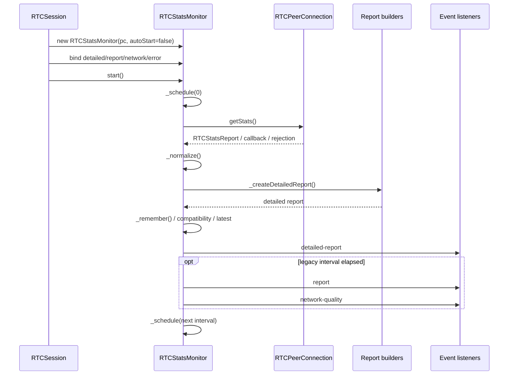

# RTCStatsMonitor 深度代码审查

> 返回：[审查总览](./README.md)
> 主源码：[`lib/RTCStatsMonitor.js`](../../../lib/RTCStatsMonitor.js)
> 主要调用方：[`RTCSession._startStatsMonitor()`](../../../lib/RTCSession.js#L4038)、[`RTCSession._stopStatsMonitor()`](../../../lib/RTCSession.js#L4088)
> 专项测试：[`test/test-rtc-stats-monitor.js`](../../../test/test-rtc-stats-monitor.js)
> 修复状态：本文问题已处理；本分册保留修复前证据与调用链，实施结果和最新测试见[总览第 4、8 节](./README.md#4-修复实施结果)。

## 1. 结论摘要

RTCStatsMonitor 的主计算链整体可靠：报告格式归一化、RTP counter delta、timestamp delta、counter 回退、topology 识别、transition grace 和 compatibility 累计均有明确边界。主要隐藏问题不是指标公式，而是：

1. 用户事件回调与采集逻辑处于同一个异常边界，listener 抛错会被误报成 `getStats`失败。
2. Promise/legacy callback fallback 只覆盖同步失败，没有覆盖 rejected Promise 和静默错误签名。
3. reset/stop 没有清理完整运行状态，错误计数和 raw log 状态会跨周期延续。
4. raw log 与 latest getter 在隐私、可变引用和序列化方面缺少防护。

## 2. 生命周期和采样时序



状态提交点需要特别区分：`_collect()`已经更新 baseline 和 compatibility；`_sample()`随后更新 `_sampleCount`和 latest，再向外 emit。当前外部 listener 异常会进入包住整条链的 catch，这是 [STAT-001](#stat-001-事件-listener-异常被当成-getstats-失败) 的根因。

## 3. 详细问题

<a id="stat-001"></a>
### STAT-001：事件 listener 异常被当成 getStats 失败

| 字段 | 内容 |
|---|---|
| 严重级别 | P1 |
| 可信度 | 确认 |
| 影响范围 | `detailed-report`、`report`、`network-quality`、`stats-error`事件及 RTCSession 转发监听器 |
| 主要证据 | [`_sample()`](../../../lib/RTCStatsMonitor.js#L271)、[`_emitStatsError()`](../../../lib/RTCStatsMonitor.js#L1308)、[`_schedule()`](../../../lib/RTCStatsMonitor.js#L252) |

**结论**

`_sample()`把采集、解析、状态提交、日志序列化和用户事件通知放在同一个 try/catch 中。任一 listener 抛出的异常都会进入 catch，被计为 `GET_STATS_FAILED`；如果 `stats-error` listener 再次抛错，异常会从 async `_sample()`逃出，而定时器没有接住返回 Promise。

**完整调用链**

```text
_schedule()
→ setTimeout(() => _sample())
→ _collect() 成功
→ _sampleCount++ / _consecutiveErrors=0 / latest=report
→ emit("detailed-report" | "report" | "network-quality")
→ 用户或 RTCSession 转发 listener 抛错
→ catch
→ _consecutiveErrors++
→ _emitStatsError("GET_STATS_FAILED")
→ emit("stats-error") 再抛错
→ _sample() rejected，timer 未 catch
```

**触发条件与外部表现**

- 接入方事件处理器中发生空指针、JSON 序列化或业务异常。
- 统计采集明明成功，却收到 `GET_STATS_FAILED`。
- baseline 已经推进，失败样本无法简单重算。
- 连续错误数失真；极端情况下出现未处理 Promise rejection。

**资源/状态变化**

- `_previous`已在 `_collect()`中更新。
- `_sampleCount`和 latest 已提交。
- `_consecutiveErrors`先归零又加一。
- `finally`通常仍会继续调度，但 `stats-error` listener 抛错时可能打破这个保证。

**现有测试为何遗漏**

现有测试验证事件转发与 payload，没有安装会抛异常的普通 listener 和 `stats-error` listener，也没有监听进程级 `unhandledRejection`。

**最小修复方向与伪代码**

```js
async _sample() {
  let report;
  try {
    report = await this._collect();
    this._commitSample(report);
  } catch (error) {
    this._recordCollectionFailure(error);
    return;
  }

  // 用户事件异常不能反向改变采集结果。
  this._safeEmit('detailed-report', payload);
  this._safeEmit('report', legacy);
}

_safeEmit(name, payload) {
  try { this.emit(name, payload); }
  catch (error) { logger.warn(`event listener failed: ${name}`, error); }
}
```

`stats-error`自身的 listener 异常只记录 logger，不能递归触发新的 stats-error。

**回归测试**

- `detailed-report` listener 抛错后，下一次采样仍进行且 `_consecutiveErrors`保持 0。
- `report`或 `network-quality` listener 抛错不产生 `GET_STATS_FAILED`。
- `stats-error` listener 抛错不产生 `unhandledRejection`。
- listener 抛错后 baseline delta 仍连续正确。

**人工审查清单**

- [ ] 采集失败和事件消费失败使用不同错误码/日志。
- [ ] 所有 emit 均不在采集主 try/catch 内。
- [ ] `stats-error`不会递归上报自身 listener 错误。
- [ ] 正常事件顺序和 payload 不变。

<a id="stat-002"></a>
### STAT-002：Promise getStats reject 后不尝试 callback

| 字段 | 内容 |
|---|---|
| 严重级别 | P2 |
| 可信度 | 确认 |
| 影响范围 | 旧 WebView、非标准 polyfill、过渡期浏览器实现 |
| 主要证据 | [`_requestStats()`](../../../lib/RTCStatsMonitor.js#L401) |

**结论与调用链**

```text
_requestStats()
→ pc.getStats() 返回 thenable
→ 标记 promiseGetStats=true
→ 直接 return result
→ Promise reject
→ withTimeout/_sample catch
→ 不调用 _requestStatsByCallback()
```

同步 throw 和空返回值能够 fallback，但异步 rejection 不能。某些 polyfill 的无参数 Promise 调用失败，而 callback 签名仍可用。

**最小修复伪代码**

```js
if (isThenable(result)) {
  try { return await result; }
  catch (promiseError) {
    return this._requestStatsByCallback(promiseError);
  }
}
```

需要避免重复调用会产生副作用的现代实现；仅在明确 rejected 时 fallback。

**测试与审查**

- [ ] 构造“Promise reject、callback success”的 PC mock。
- [ ] 两种 API 都失败时保留更有价值的最终异常和初始异常上下文。
- [ ] compatibility 同时记录 promise 尝试和 callback 成功。

<a id="stat-003"></a>
### STAT-003：callback 首个签名静默失败时不会尝试备选签名

| 字段 | 内容 |
|---|---|
| 严重级别 | P2 |
| 可信度 | 确认 |
| 影响范围 | `getStats.length`与真实签名不一致且错误调用不 throw 的实现 |
| 主要证据 | [`_requestStatsByCallback()`](../../../lib/RTCStatsMonitor.js#L439)、[`withTimeout()`](../../../lib/RTCStatsMonitor.js#L1931) |

第一签名只有同步 throw 时才切换。若错误参数顺序被静默忽略，外层直到总 timeout 才失败，正确的另一种签名从未尝试。

**建议状态机**

```text
签名 A
├─ 同步 throw → 立即尝试签名 B
├─ success/failure callback → 完成
└─ 短签名探测超时 → 尝试签名 B
   └─ 由总 getStats timeout 兜底
```

探测超时应明显短于 `timeoutMs`，且同一轮只允许一个结果提交。

**回归测试**

- [ ] A 静默、B 成功。
- [ ] A 延迟成功时不会与 B 重复完成。
- [ ] A/B 都静默时仍按总 timeout 结束。

<a id="stat-004"></a>
### STAT-004：reset/stop 没有清理完整运行期状态

| 字段 | 内容 |
|---|---|
| 严重级别 | P2 |
| 可信度 | 确认 |
| 主要证据 | [`_clearSamplingBaseline()`](../../../lib/RTCStatsMonitor.js#L213) |

当前只清理 `_previous`、sample count、legacy timestamp、topology 和 transition。以下状态保留：

- `_consecutiveErrors`：重启后会继承旧失败次数。
- `_lastRawLogTimestamp`：reset 后第一份 raw log 可能继续被限频。
- `_unsupportedReported`：PC 对象通常不变，保留尚可解释；若运行期 polyfill 恢复，则不会重新上报。
- observed types/features 和 stats format：作为同一 PC 的 capability 累计可以保留，但需要明确契约。

**最小修复方向**

把“counter baseline reset”和“run lifecycle reset”拆成两个方法：reset 只重建 counter；stop/start 新运行周期额外清理错误计数和 raw log timestamp。Compatibility 是否保留应保持当前同一 PC 累计语义。

**回归测试**

- [ ] 连续失败后 stop/start，第一次失败的 `consecutiveErrors`为 1。
- [ ] reset 后下一份报告重新 warming-up。
- [ ] stop 后 latest 报告仍可查询，符合现有注释。

<a id="stat-005"></a>
### STAT-005：raw stats 日志具有隐私与序列化风险

| 字段 | 内容 |
|---|---|
| 严重级别 | P2 |
| 可信度 | 确认 |
| 主要证据 | [`_logRawStats()`](../../../lib/RTCStatsMonitor.js#L1292) |

**风险一：隐私**

完整 candidate report 可能包含本地/公网 IP、端口、协议和网络类型。虽然功能默认关闭，但开启调试后日志可能被上传到客户日志系统。

**风险二：序列化反向破坏采样**

`JSON.stringify(reports)`位于 `_collect()`内部。BigInt、循环引用或浏览器扩展字段抛错时，baseline 和 compatibility 已经更新，最终却被记为 `GET_STATS_FAILED`。

**建议伪代码**

```js
const safeReports = reports.map(redactCandidateAddress);
try { logger.debug('raw stats', safeStringify(safeReports)); }
catch (error) { logger.warn('raw stats serialization failed', error); }
```

raw log 失败不应改变采样成功状态。若确需完整地址，应增加显式的高风险调试选项，而不是复用普通 raw log。

**回归测试**

- [ ] candidate address/port 默认脱敏。
- [ ] BigInt 和循环引用不触发 `GET_STATS_FAILED`。
- [ ] `rawLogIntervalMs`非法值被规范化。

<a id="stat-006"></a>
### STAT-006：latest getter 暴露可变内部对象

| 字段 | 内容 |
|---|---|
| 严重级别 | P3 |
| 可信度 | 确认 |
| 主要证据 | [`getReport()`](../../../lib/RTCStatsMonitor.js#L232) |

三个 getter 直接返回内部对象。接入方对嵌套字段的修改会污染之后的诊断读取。它不会改变 `_previous` counter baseline，因此风险低于状态快照泄漏，但与“报告快照”的直觉不一致。

建议在提交时冻结/克隆，或 getter 返回结构化浅深拷贝。回归测试应修改返回对象并验证第二次读取不变。

<a id="stat-007"></a>
### STAT-007：legacy 输出把未知质量值映射为 0

| 字段 | 内容 |
|---|---|
| 严重级别 | P3/契约歧义 |
| 可信度 | 确认 |
| 主要证据 | [`_createDetailedQuality()`](../../../lib/RTCStatsMonitor.js#L1084)、[`networkQuality()`](../../../lib/RTCStatsMonitor.js#L1990) |

详细报告尽量保留 `null=未知`，legacy/network quality 为兼容旧接口会把部分未知 RTT/丢包转换为 0。若下游没有同时检查 quality/status，可能把“尚无样本”理解成“零丢包、零延迟”。

不建议直接改变历史字段值。更安全的方案是在 legacy payload 增加兼容的 `sampleReady`/`hasMeasurement`提示，或在文档中要求先判断 quality/status。

## 4. Class 方法覆盖矩阵

说明：`公`为公开 API/属性，`私`为类内部方法。测试列中的“部分”表示正常路径有覆盖，但本文描述的异常分支没有覆盖。

| 方法 | 可见性 | 直接调用方 | 直接下游与读写状态 | 异步/资源/异常 | 关联问题 | 测试 |
|---|---|---|---|---|---|---|
| [`constructor(pc, options)`](../../../lib/RTCStatsMonitor.js#L75) | 公 | SDK 用户、RTCSession | 规范化 interval；初始化 baseline、compatibility、latest；可调用 `start()` | 可能立即建立 timer | STAT-004/005 | 已覆盖 |
| [`get supported`](../../../lib/RTCStatsMonitor.js#L130) | 公 | capability 查询 | 读取 compatibility level | 无资源 | - | 已覆盖 |
| [`get compatibility`](../../../lib/RTCStatsMonitor.js#L135) | 公 | capability 查询 | `_compatibilitySnapshot()` | 返回新快照 | - | 已覆盖 |
| [`start()`](../../../lib/RTCStatsMonitor.js#L146) | 公 | constructor、RTCSession、用户 | runId++；在途采样时设置 restartPending；否则 `_schedule(0)` | 建立 timer | STAT-004 | 已覆盖 |
| [`stop()`](../../../lib/RTCStatsMonitor.js#L174) | 公 | RTCSession、关闭 PC、用户 | runId++；clearTimeout；`_clearSamplingBaseline()` | 无法取消在途 getStats，以 runId 丢弃 | STAT-004 | 已覆盖 |
| [`reset()`](../../../lib/RTCStatsMonitor.js#L201) | 公 | 用户 | `_clearSamplingBaseline()`→`markChange('reset')` | 保持 timer 运行 | STAT-004 | 部分 |
| [`_clearSamplingBaseline()`](../../../lib/RTCStatsMonitor.js#L213) | 私 | stop/reset/失效采样 | 清 previous、sample count、topology、transition | 未清 errors/raw timestamp | STAT-004 | 部分 |
| [`markChange(reason)`](../../../lib/RTCStatsMonitor.js#L226) | 公 | RTCSession 媒体变化、reset、用户 | 写 transition reason/count | 后续质量诊断宽限 | - | 已覆盖 |
| [`getReport()`](../../../lib/RTCStatsMonitor.js#L232) | 公 | 用户/诊断 | 返回 `_latestDetailedReport` | 暴露内部引用 | STAT-006 | 未覆盖变异 |
| [`getLegacyReport()`](../../../lib/RTCStatsMonitor.js#L237) | 公 | 用户/诊断 | 返回 `_latestLegacyReport` | 暴露内部引用 | STAT-006 | 未覆盖变异 |
| [`getNetworkQuality()`](../../../lib/RTCStatsMonitor.js#L242) | 公 | 用户/诊断 | 返回 `_latestNetworkQuality` | 暴露内部引用 | STAT-006/007 | 未覆盖变异 |
| [`_canGetStats()`](../../../lib/RTCStatsMonitor.js#L247) | 私 | constructor、sample | 检查 `pc.getStats` | 无副作用 | - | 已覆盖 |
| [`_schedule(timeoutMs)`](../../../lib/RTCStatsMonitor.js#L252) | 私 | start、sample finally | `setTimeout(() => _sample())` | timer 回调不接 Promise rejection | STAT-001 | 部分 |
| [`_sample()`](../../../lib/RTCStatsMonitor.js#L271) | 私/异步 | timer、测试 | `_collect()`→提交状态→emit→重调度 | 单一 try/catch 包住用户事件 | STAT-001/004 | 部分 |
| [`_collect()`](../../../lib/RTCStatsMonitor.js#L370) | 私/异步 | `_sample()` | timeout→request→normalize→detail→compat→raw log | baseline/compat 在返回前已变更 | STAT-005 | 已覆盖正常 |
| [`_requestStats()`](../../../lib/RTCStatsMonitor.js#L401) | 私/异步 | `_collect()` | 优先无参 getStats；空值/同步异常走 callback | rejected Promise 不 fallback | STAT-002 | 部分 |
| [`_requestStatsByCallback(initialError)`](../../../lib/RTCStatsMonitor.js#L439) | 私 | `_requestStats()` | 依 function.length 选择签名；同步 throw 换签名 | 静默错误依赖总 timeout | STAT-003 | 部分 |
| [`_normalize(rawStats)`](../../../lib/RTCStatsMonitor.js#L509) | 私 | `_collect()` | standard/object/legacy→普通 report 数组 | 非法格式 throw TypeError | - | 已覆盖 |
| [`_createDetailedReport(...)`](../../../lib/RTCStatsMonitor.js#L545) | 私 | `_collect()` | 建 byId/byType；创建 RTP/connection/quality；`_remember()` | 同步 CPU；写 baseline | - | 已覆盖 |
| [`_createOutbound(...)`](../../../lib/RTCStatsMonitor.js#L639) | 私 | `_createDetailedReport()` | codec/source/remote-inbound/transceiver；计算发送 delta | 首样本字段为 null | - | 已覆盖 |
| [`_createRemoteInbound(...)`](../../../lib/RTCStatsMonitor.js#L706) | 私 | `_createDetailedReport()` | 远端接收侧 RTT/loss/jitter | 字段缺失保持 null | - | 已覆盖 |
| [`_createInbound(...)`](../../../lib/RTCStatsMonitor.js#L735) | 私 | `_createDetailedReport()` | codec/remote-outbound/transceiver；计算接收 delta | 首样本字段为 null | - | 已覆盖 |
| [`_createConnection(...)`](../../../lib/RTCStatsMonitor.js#L815) | 私 | `_createDetailedReport()` | candidate pair→transport/candidate/RTT/bitrate | candidate 地址进入内部 report | STAT-005 | 已覆盖 |
| [`_createLegacyReport(report)`](../../../lib/RTCStatsMonitor.js#L866) | 私 | `_sample()` | groupByType→legacy inbound/outbound | 丢失部分 null 语义 | STAT-007 | 已覆盖 |
| [`_createNetworkQuality(report)`](../../../lib/RTCStatsMonitor.js#L911) | 私 | `_sample()` | 当前 loss/RTT→networkQuality | 未知值兼容转换 | STAT-007 | 已覆盖 |
| [`_createDetailedLogReport(report)`](../../../lib/RTCStatsMonitor.js#L931) | 私 | `_sample()` | 缩减日志字段 | JSON stringify 仍可能受异常字段影响 | STAT-001/005 | 部分 |
| [`_createDetailedEventReport(report)`](../../../lib/RTCStatsMonitor.js#L1023) | 私 | `_sample()` | 生成公开事件 payload | 返回新结构 | - | 已覆盖 |
| [`_createDetailedQuality(report, context)`](../../../lib/RTCStatsMonitor.js#L1084) | 私 | `_createDetailedReport()` | network sample→issue collectors→media quality | transition 可抑制误报 | STAT-007 | 已覆盖 |
| [`_classify(report, context, transceiver)`](../../../lib/RTCStatsMonitor.js#L1127) | 私 | inbound/outbound builders | streamClassifier 或 mid/track/transceiver 推断 audio/video/shared | 用户 classifier 可抛错并终止采样 | STAT-001 | 部分 |
| [`_readContext()`](../../../lib/RTCStatsMonitor.js#L1156) | 私 | `_createDetailedReport()` | 调 contextProvider 并 `cleanContext()` | provider 抛错进入采集失败 | STAT-001 | 部分 |
| [`_readTransceivers()`](../../../lib/RTCStatsMonitor.js#L1175) | 私 | `_createDetailedReport()` | `pc.getTransceivers()` | 异常静默返回空数组 | - | 未覆盖异常诊断 |
| [`_readPhase(ready)`](../../../lib/RTCStatsMonitor.js#L1192) | 私 | `_createDetailedReport()` | 根据信令/连接/样本判断 phase | 无资源 | - | 已覆盖 |
| [`_remember(reports)`](../../../lib/RTCStatsMonitor.js#L1220) | 私 | `_createDetailedReport()` | 复制需做 delta 的报告到 `_previous` | baseline 状态提交 | STAT-001/005 | 已覆盖 |
| [`_updateCompatibility(reports, format)`](../../../lib/RTCStatsMonitor.js#L1255) | 私 | `_collect()` | 累计 observed types/features 和 level | 跨 reset/stop 保留 | STAT-004 | 已覆盖 |
| [`_compatibilitySnapshot()`](../../../lib/RTCStatsMonitor.js#L1281) | 私 | getter、detail report | 克隆 api、集合转数组/feature map | 无资源 | - | 已覆盖 |
| [`_logRawStats(timestamp, reports)`](../../../lib/RTCStatsMonitor.js#L1292) | 私 | `_collect()` | 限频并 `JSON.stringify`完整报告 | 日志可抛错；candidate 隐私 | STAT-005 | 未覆盖 |
| [`_emitStatsError(code, error, fatal)`](../../../lib/RTCStatsMonitor.js#L1308) | 私 | `_sample()` | logger.warn→emit stats-error | listener 异常可逃逸 | STAT-001 | 部分 |

## 5. 文件级辅助函数覆盖矩阵

这些函数均为模块内部函数，没有独立资源生命周期；“状态”列重点记录输入输出语义和可能的 null/异常传播。

| 函数 | 直接调用方 | 下游/状态语义 | 关联问题/测试 |
|---|---|---|---|
| [`monotonicNow()`](../../../lib/RTCStatsMonitor.js#L1323) | `_collect()` | performance.now→Date.now fallback | 已覆盖间接 |
| [`number(value)`](../../../lib/RTCStatsMonitor.js#L1333) | 几乎全部数值 helper | 有限 number/数字字符串→number，否则 null | 已覆盖间接 |
| [`rounded(value,digits)`](../../../lib/RTCStatsMonitor.js#L1350) | 报表 builder | null 保留，有限值定精度 | 已覆盖间接 |
| [`multiplied(value,multiplier)`](../../../lib/RTCStatsMonitor.js#L1362) | 时间/码率转换 | null 保留→rounded | 已覆盖间接 |
| [`valueOrNull(value)`](../../../lib/RTCStatsMonitor.js#L1367) | 报表 builder | 仅 undefined→null | 已覆盖间接 |
| [`copyReport(report)`](../../../lib/RTCStatsMonitor.js#L1372) | `_normalize()` | 浅复制可枚举字段并补 id/type/timestamp | STAT-005；部分 |
| [`normalizeLegacyReport(report)`](../../../lib/RTCStatsMonitor.js#L1397) | `_normalize()` | result/stat→标准 RTP/candidate 类型 | 已覆盖 |
| [`readKind(report)`](../../../lib/RTCStatsMonitor.js#L1466) | RTP builders | kind/mediaType/codec 推断 | 已覆盖间接 |
| [`delta(current,previous,key)`](../../../lib/RTCStatsMonitor.js#L1484) | bitrate/loss/frame builders | 缺基线或 counter 回退→null | 已覆盖 |
| [`durationSeconds(current,previous)`](../../../lib/RTCStatsMonitor.js#L1508) | bitrate | timestamp delta；非法/非正→null | 已覆盖 |
| [`bitrate(current,previous,key)`](../../../lib/RTCStatsMonitor.js#L1531) | RTP builders | byte delta×8/time | 已覆盖 |
| [`combinedBitrate(...)`](../../../lib/RTCStatsMonitor.js#L1539) | outbound | payload/header 合计 delta | 已覆盖间接 |
| [`average(...)`](../../../lib/RTCStatsMonitor.js#L1555) | RTP builders | total/count 区间增量平均 | 已覆盖间接 |
| [`cumulativeAverage(...)`](../../../lib/RTCStatsMonitor.js#L1563) | connection/RTP | 累计平均 | 已覆盖间接 |
| [`percent(part,total)`](../../../lib/RTCStatsMonitor.js#L1571) | loss/quality | total<=0→null | 已覆盖间接 |
| [`lossPercent(lost,received)`](../../../lib/RTCStatsMonitor.js#L1576) | RTP/quality | lost/(lost+received) | 已覆盖 |
| [`objectDelta(current,previous)`](../../../lib/RTCStatsMonitor.js#L1588) | quality limitation duration | 数值对象逐键 delta | 已覆盖间接 |
| [`numericObject(input)`](../../../lib/RTCStatsMonitor.js#L1612) | objectDelta/report | 只保留有限数值字段 | 已覆盖间接 |
| [`resolve(id,byId)`](../../../lib/RTCStatsMonitor.js#L1634) | codec/source/candidate 关联 | id→Map entry 或 null | 已覆盖间接 |
| [`createCodec(codec,report)`](../../../lib/RTCStatsMonitor.js#L1639) | inbound/outbound | codec/mime/payload/channels | 已覆盖间接 |
| [`createSource(report)`](../../../lib/RTCStatsMonitor.js#L1654) | outbound | media-source 元数据 | 已覆盖间接 |
| [`createSourceWithFallback(source,transceiver)`](../../../lib/RTCStatsMonitor.js#L1667) | outbound | stats source 缺失时读 sender track settings | 已覆盖间接 |
| [`createRemoteOutbound(report)`](../../../lib/RTCStatsMonitor.js#L1687) | inbound | remote timestamp/RTT 字段 | 已覆盖间接 |
| [`timeMs(secondsValue,legacyMsValue)`](../../../lib/RTCStatsMonitor.js#L1699) | RTT/jitter | 秒优先，legacy ms fallback | 已覆盖 |
| [`findTimestamp(reports)`](../../../lib/RTCStatsMonitor.js#L1706) | detail report | 选择最大有效 timestamp | 已覆盖间接 |
| [`findSelectedPair(byType,byId)`](../../../lib/RTCStatsMonitor.js#L1723) | detail report | transport.selectedCandidatePairId 或 nominated pair | 已覆盖 |
| [`indexByField(reports,field)`](../../../lib/RTCStatsMonitor.js#L1743) | remote RTP 关联 | 指定字段→Map | 已覆盖间接 |
| [`createCandidate(candidate)`](../../../lib/RTCStatsMonitor.js#L1758) | connection | candidate 公开结构，含 address/port | STAT-005；已覆盖 |
| [`age(current,event)`](../../../lib/RTCStatsMonitor.js#L1773) | freeze/quality | 时间差，非法→null | 已覆盖间接 |
| [`readConnectionState(pc)`](../../../lib/RTCStatsMonitor.js#L1781) | context/phase | connectionState→iceConnectionState fallback | 已覆盖间接 |
| [`readTrackSettings(track)`](../../../lib/RTCStatsMonitor.js#L1786) | source fallback | 安全读取 getSettings/getConstraints 基本字段 | 已覆盖间接 |
| [`readTrackId(transceiver,side)`](../../../lib/RTCStatsMonitor.js#L1809) | transceiver 匹配 | sender/receiver track.id | 已覆盖间接 |
| [`findTransceiver(...)`](../../../lib/RTCStatsMonitor.js#L1816) | RTP builders | mid 优先、track id fallback | 已覆盖间接 |
| [`createTopology(...)`](../../../lib/RTCStatsMonitor.js#L1829) | detail report | RTP/mid/pair 组合成拓扑签名 | 已覆盖 transition |
| [`findSampleDuration(outbound,inbound)`](../../../lib/RTCStatsMonitor.js#L1841) | detail performance | 查找首个有效 sampleDuration | 已覆盖间接 |
| [`groupByType(streams)`](../../../lib/RTCStatsMonitor.js#L1853) | legacy report | audio/video/shared 分组 | 已覆盖 |
| [`createLegacyOutbound(type,stream)`](../../../lib/RTCStatsMonitor.js#L1866) | legacy report | 详细 outbound→历史字段 | STAT-007；已覆盖 |
| [`createLegacyInbound(type,stream)`](../../../lib/RTCStatsMonitor.js#L1898) | legacy report | 详细 inbound→历史字段 | STAT-007；已覆盖 |
| [`withTimeout(promise,timeoutMs,message)`](../../../lib/RTCStatsMonitor.js#L1931) | `_collect()` | Promise.race 风格 timer；结束时清 timer | STAT-003；已覆盖 |
| [`currentNetworkSample(report)`](../../../lib/RTCStatsMonitor.js#L1965) | quality builders | 从 connection/remote RTP 选 RTT/loss | STAT-007；已覆盖 |
| [`networkQuality(loss,rtt,hasStream)`](../../../lib/RTCStatsMonitor.js#L1990) | network/detailed quality | 阈值判定 0～5/unknown | STAT-007；已覆盖 |
| [`collectOutboundIssues(stream,issues)`](../../../lib/RTCStatsMonitor.js#L2003) | detailed quality | 发送丢包、RTT、码率、帧率、卡顿问题 | 已覆盖部分阈值 |
| [`collectInboundIssues(stream,issues)`](../../../lib/RTCStatsMonitor.js#L2089) | detailed quality | 接收丢包、jitter、解码、冻结问题 | 已覆盖部分阈值 |
| [`collectConnectionIssues(report,issues,context)`](../../../lib/RTCStatsMonitor.js#L2163) | detailed quality | PC/ICE/DTLS/candidate/transition 问题 | 已覆盖部分阈值 |
| [`issue(code,severity,streamId,evidence)`](../../../lib/RTCStatsMonitor.js#L2205) | issue collectors | 统一 issue 结构 | 已覆盖间接 |
| [`mediaQuality(networkValue,issues,direction)`](../../../lib/RTCStatsMonitor.js#L2210) | detailed quality | 网络值结合媒体 issue 调低质量 | 已覆盖间接 |
| [`cleanContext(context)`](../../../lib/RTCStatsMonitor.js#L2225) | `_readContext()` | 只保留允许的会话上下文 | 已覆盖间接 |
| [`observeFeatures(report,features)`](../../../lib/RTCStatsMonitor.js#L2238) | compatibility | 按字段存在性累计 feature key | STAT-004；已覆盖 |
| [`featureSnapshot(features)`](../../../lib/RTCStatsMonitor.js#L2251) | compatibility snapshot | Set→排序后的布尔映射 | 已覆盖间接 |

## 6. RTCSession 集成链

```text
RTCSession 建立 PeerConnection
→ _startStatsMonitor(pc)
→ _stopStatsMonitor() 清旧实例
→ new RTCStatsMonitor(pc, { autoStart:false, contextProvider })
→ monitor.on("detailed-report", payload => session.emit("stats:detailed-report", payload))
→ monitor.on("report", payload => session.emit("stats:report", payload))
→ monitor.on("network-quality", payload => session.emit("stats:network-quality", payload))
→ monitor.on("stats-error", payload => session.emit("stats:error", payload))
→ monitor.start()
```

RTCSession 转发 listener 本身也属于 EventEmitter listener，所以业务注册在 RTCSession 上的事件处理器抛错，仍可能沿同步 emit 调用栈返回 RTCStatsMonitor。这进一步证明 STAT-001 需要在 Monitor 事件边界隔离，而不能只要求业务“不要抛错”。

## 7. 建议新增测试清单

- [ ] 普通事件 listener 抛错不改变采集成功状态。
- [ ] `stats-error` listener 抛错无未处理 rejection。
- [ ] Promise getStats reject 后 callback 成功。
- [ ] callback 首签名静默、备选签名成功。
- [ ] stop/start 重置 consecutive errors，保留 latest 报告。
- [ ] raw report 含 BigInt、循环引用时主采样仍成功。
- [ ] raw candidate 地址默认脱敏。
- [ ] latest getter 返回值被修改后内部快照不变。
- [ ] reset、transition、counter 回退和页面后台 interval 组合路径。

## 8. 修复验收标准

1. 任何用户事件 listener 异常都不能生成 `GET_STATS_FAILED`。
2. 任何采样失败或事件失败都不能使 `_sampling`永久为 true，也不能产生未处理 rejection。
3. 现代 Promise getStats 正常路径调用次数、报告结构和事件顺序保持不变。
4. Legacy fallback 扩展后仍由单一 settled gate 保证每轮只提交一次。
5. stop 后不再产生报告事件，restart 第一轮重新建立 counter baseline。
6. 默认日志不泄露 candidate address/port；日志序列化失败不影响报告。
