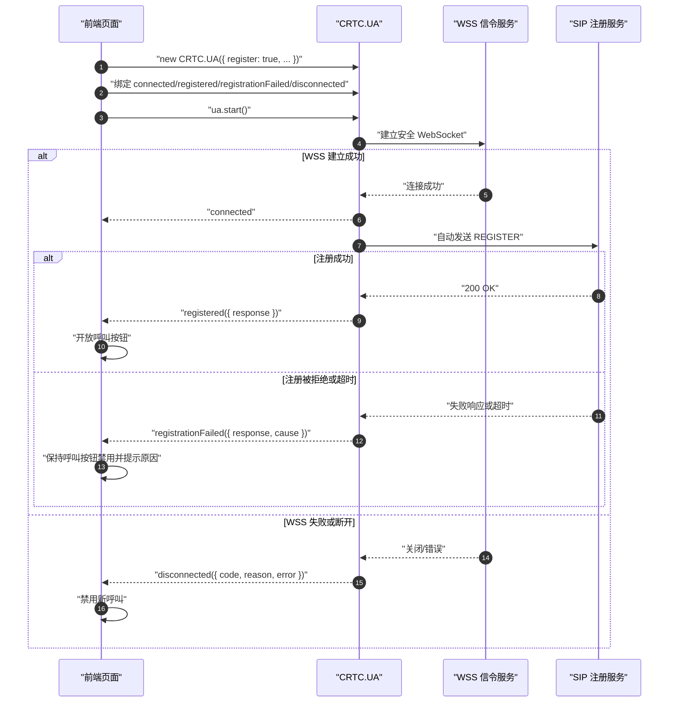
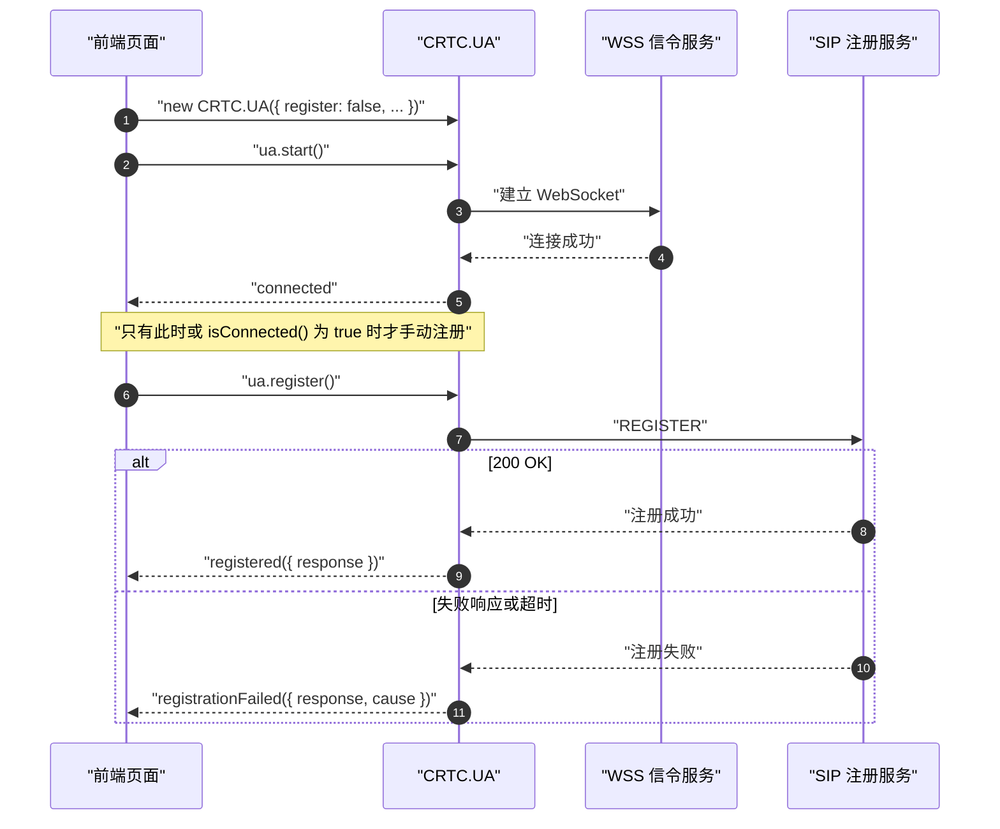
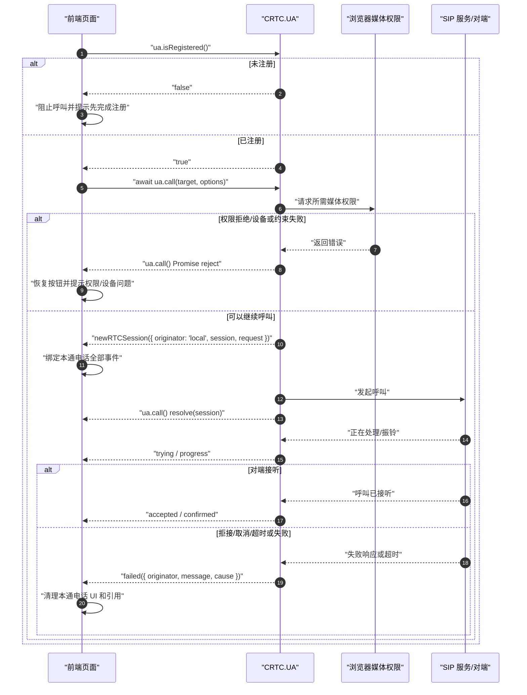
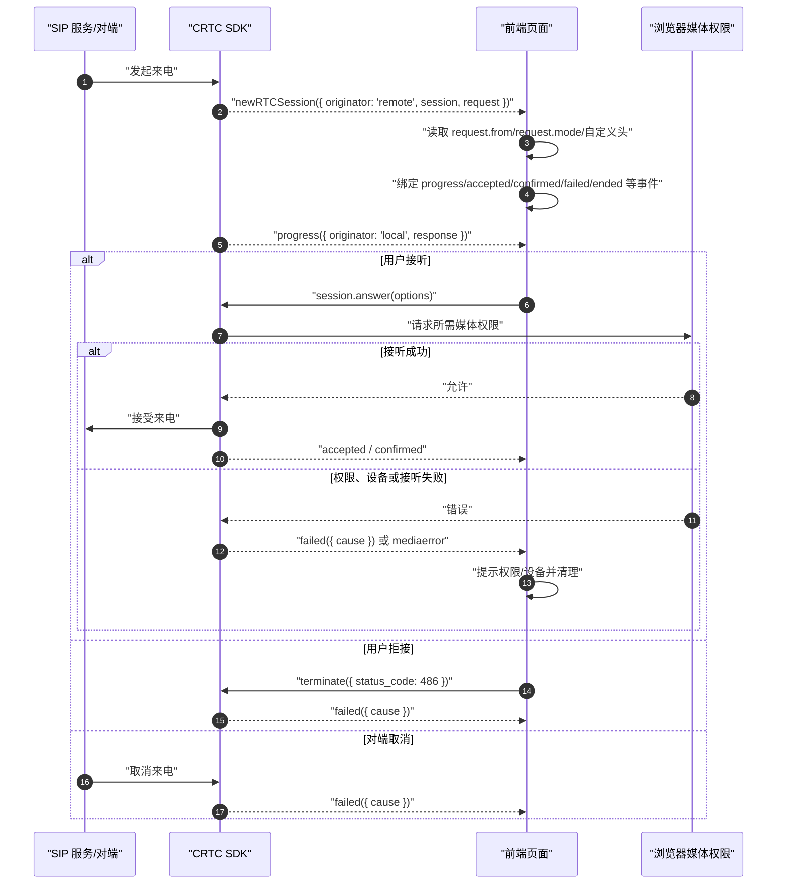

# 3. 注册、通话与事件时序

[← 上一章：快速完成第一通电话](./02-quick-start.md) · [学习目录](./README.md) · [下一章：媒体能力 →](./04-media-features.md)

本章回答四个接入中最容易混淆的问题：什么时候注册、什么时候得到 `RTCSession`、什么时候可以使用 `session.connection`、什么事件负责成功/失败后的页面状态。

## 3.1 总体状态关系

```text
UA 未启动
  └─ ua.start()
      └─ WSS 连接中
          ├─ connected
          │   └─ SIP 注册中
          │       ├─ registered → 允许呼叫
          │       └─ registrationFailed → 禁止呼叫
          └─ disconnected / failed

每一通电话
  └─ newRTCSession
      ├─ progress / trying
      ├─ accepted
      ├─ confirmed → 通话已建立
      ├─ failed → 未建立成功即结束
      └─ ended → 已建立后结束
```

`connected` 只表示 WSS 信令传输已连接，不能代替 `registered`。页面开放呼叫按钮前至少检查 `ua.isConnected()` 和 `ua.isRegistered()`。

## 3.2 自动注册时序

默认 `register: true`。调用 `ua.start()` 后，WSS 连接成功会自动发送 SIP REGISTER。



自动注册配置：

```js
const ua = new CRTC.UA({
  sockets          : socket,
  uri              : 'sip:alice@example.com',
  password         : 'alice-password',
  secret_key       : 'SDK 授权码',
  register         : true,
  register_expires : 600
});

ua.on('registered', function()
{
  callButton.disabled = false;
});

ua.start();
```

| 配置 | 默认值 | 作用 |
| --- | ---: | --- |
| `register` | `true` | WSS 连接成功后是否自动注册 |
| `register_expires` | `600` 秒 | REGISTER 过期时间；已注册后会按注册生命周期刷新 |
| `connection_recovery_min_interval` | `2` 秒 | 信令恢复重试的最小间隔 |
| `connection_recovery_max_interval` | `30` 秒 | 信令恢复重试的最大间隔 |

注册有效期和恢复间隔应按 SIP 服务要求配置，不要直接照搬测试环境的短周期参数。

## 3.3 手动注册时序

需要先建立 WSS、再由业务决定何时注册时，使用 `register: false`，并在 `connected` 之后调用 `ua.register()`。



```js
const ua = new CRTC.UA({
  sockets    : socket,
  uri        : 'sip:alice@example.com',
  password   : 'alice-password',
  secret_key : 'SDK 授权码',
  register   : false
});

ua.on('connected', function()
{
  ua.register();
});

ua.start();
```

自动注册与手动注册只改变 REGISTER 的触发方式，不改变 `registered`、`registrationFailed` 事件和后续呼叫 API。

## 3.4 UA 网络事件与页面状态

| 事件/方法 | 触发条件或返回值 | 页面处理 |
| --- | --- | --- |
| `browser:navigator:offline` | 浏览器 `navigator` 判断离线 | 显示设备网络已断开，不发起新呼叫 |
| `browser:navigator:online` | 浏览器判断恢复在线 | 显示正在恢复；不要直接当作已注册 |
| `connected` | WSS 已建立 | 自动注册时等待 `registered`；手动注册时调用 `register()` |
| `disconnected(data)` | WSS 主动或被动断开 | 禁止新呼叫；显示 `code/reason` |
| `failed(data)` | UA 发生无法完成当前操作的错误 | 记录 `originator/message/cause` |
| `isConnected()` | 当前 WSS 是否连接 | 用于按钮或超时检查 |
| `isRegistered()` | 当前 SIP 是否注册 | 呼叫前最终检查 |
| `stop()` | 主动停止 UA | 页面退出或明确注销整个 UA 时调用 |

`online` 只说明浏览器网络接口恢复，WSS 和 SIP 注册可能仍在恢复。页面应等到 `connected`、`registered` 后再恢复呼叫按钮。

Demo 将浏览器离线和 UA 信令断开分开记录。以下代码取自 [`app.js`](../../demo/base-js/js/app.js)：

```js
ua.on('browser:navigator:offline', function()
{
  setStatus('浏览器已离线');

  if (!disconnectedBy)
  {
    disconnectedBy = 'BROWSER';
    isShowUI = true;
  }
});

ua.on('disconnected', function(data)
{
  setStatus(`信令连接断开: ${data.code} ${data.reason}`);

  if (handleStop)
  {
    return;
  }

  if (!disconnectedBy)
  {
    isShowUI = true;
  }
  disconnectedBy = 'UA';
});
```

`handleStop` 用于区分页面主动停止与被动断线；否则退出页面时也会误显示“网络异常”。

## 3.5 呼出完整时序

呼出前必须满足：UA 已注册、没有违反业务的并发通话限制、被叫地址非空。本地媒体权限可能在 `ua.call()` 内请求，所以 `ua.call()` 返回 Promise。



呼出示例：

```js
async function call(target)
{
  if (!ua.isRegistered())
  {
    throw new Error('SIP 尚未注册');
  }

  try
  {
    const session = await ua.call(target, buildCallOptions());

    // 呼出 PC 已创建后可绑定远端轨道。
    bindPeerConnection(session.connection);
    return session;
  }
  catch (error)
  {
    console.error('呼叫初始化失败：', error);
    throw error;
  }
}
```

Base JS Demo 在 `await ua.call()` 成功后立即监听早期远端音频，避免将真实 183 提示音与本地回铃同时播放。以下节选自 [`app.js`](../../demo/base-js/js/app.js)：

```js
const session = await ua.call(`${number}@${sipDomain}`, options);

earlyMedia = false;

session.connection.ontrack = function(event)
{
  if (event.track.kind === 'audio')
  {
    earlyMedia = true;
    remoteAudio.srcObject = event.streams[0];
    remoteAudio.play()
      .catch(() => { });
  }
};
```

这段监听只处理外呼阶段的早期音频；通话建立后的完整本地/远端媒体仍由会话事件中的 `getStreams()` 更新。

## 3.6 呼入与接听完整时序

呼入时先收到 `newRTCSession`。此时可以读取主叫、呼叫模式和随路头，但不要假设本地媒体已经可用。用户点击接听后调用 `answer(options)`，随后再读取 `session.connection` 并绑定浏览器事件。



接听示例：

```js
function answerIncoming(session, video)
{
  session.answer({
    pcConfig,
    mediaConstraints : {
      audio : true,
      video : video ? videoConstraints : false
    }
  });

  if (session.connection)
  {
    bindPeerConnection(session.connection);
  }
}
```

Demo 的语音接听会把当前麦克风、PC 配置、composer 和 AiNS 一起传入。以下代码取自 [`app.js`](../../demo/base-js/js/app.js)：

```js
document.querySelector('#answer').onclick = function()
{
  e.session.answer({
    mediaConstraints : {
      audio : buildSelectedAudioConstraints(),
      video : false
    },
    pcConfig             : Object.assign(pcConfig, { 'rtcpMuxPolicy': 'negotiate' }),
    extraHeaders         : [ `X-Data: ${xdata}`, `X-UA: ${navigator.userAgent}` ],
    rtcOfferConstraints  : { offerToReceiveAudio: true },
    extraFeatures        : extraFeatures,
    mediaEffectsComposer : buildCallComposerOptions(),
    aiNoiseSuppression   : buildCallAiNsOptions()
  });

  setStatus('audio answer');
};
```

标准视频接听只把 `video: false` 换成 `video: buildSelectedVideoConstraints()`，并设置 `offerToReceiveVideo: true`。

## 3.7 `newRTCSession` 统一会话入口

```js
ua.on('newRTCSession', function(data)
{
  const session = data.session;

  console.log(data.originator === 'remote' ? '呼入' : '呼出');
  bindSessionEvents(session);
});
```

| 字段 | 类型/可选值 | 说明 |
| --- | --- | --- |
| `originator` | `local` / `remote` | `local` 为本端呼出，`remote` 为远端呼入 |
| `session` | `RTCSession` | 本通电话唯一的会话对象 |
| `request` | SIP 请求对象 | 可读取主叫、呼叫模式和自定义头 |

每一通电话都要重新绑定事件。不要把上一通的 composer、AiNS 控制器、统计实例或 `session.connection` 用到下一通。

Demo 还在这个统一入口读取呼入方向和主叫号码：

```js
if (e.originator === 'remote')
{
  remoteNo = e.request.from.uri.user;
  document.querySelector('#callee').value = remoteNo;

  setStatus(`收到${e.request.mode === 'video' ? '视频' : '音频'}呼叫`);
  showIncomingCallNotification(e.request.mode, remoteNo);
}
```

这段代码取自 [`app.js`](../../demo/base-js/js/app.js)。读取 `request` 只用于展示来电信息，真正接听仍要等用户点击后调用 `session.answer()`。

如果页面只允许一通电话，可在已有会话时拒绝新呼入：

```js
if (currentSession && currentSession !== data.session)
{
  data.session.terminate({ status_code: 486 });
  return;
}
```

`486` 表示忙。是否拒绝、排队或展示第二通来电由产品策略决定。

## 3.8 会话事件的触发条件和参数

| 事件 | 主要参数 | 触发条件 | 页面建议 |
| --- | --- | --- | --- |
| `trying` | 无 | 呼出进入 Trying 阶段 | 显示“正在呼叫” |
| `progress` | `{ originator, response }` | 收到或发出 1xx；`remote` 常用于呼出回铃，`local` 常用于呼入振铃 | 显示振铃/回铃；处理早期媒体 |
| `accepted` | `{ response }` | INVITE 已收到成功响应，但会话确认流程尚可能继续 | 显示“对方已接听，正在建立” |
| `confirmed` | 可忽略或读取来源 | ACK 完成，会话正式建立 | 切换为通话中 UI |
| `failed` | `{ originator, message, cause }` | 会话未建立即结束：拒接、取消、超时、媒体或信令失败 | 清理并展示失败原因 |
| `ended` | `{ originator, message, cause }` | 已建立会话被任一方挂断或终止 | 清理并恢复可呼叫状态 |
| `hold` / `unhold` | `{ originator: 'local' \| 'remote' }` | 本端或远端保持状态变化 | 更新保持按钮和提示 |
| `muted` / `unmuted` | `{ audio, video }` | 本端静音/恢复音频或视频 | 更新麦克风/摄像头按钮 |
| `mode` | `{ mode: 'audio' \| 'video' }` | 通话模式升级或降级完成 | 更新媒体模式 UI |
| `cameraChanged` | `{ videoStream }` | 摄像头切换完成 | 更新本地预览 |
| `peerconnection:iceConnectionState` | ICE 状态字符串 | ICE 状态改变 | 显示连接恢复/失败信息 |
| `remoteShared` | `{ sharedStream, mid?, track? }` | 远端开始 BFCP 或独立辅流共享 | 播放共享视频流 |
| `remoteUnShared` | 无 | 远端停止共享或共享轨结束 | 清空共享区域 |
| `mediaerror` | `{ type, mediastream }` | 轨道或流异常 | 提示设备/媒体问题 |
| `mediaEffectsIssue` | `{ module, message, ... }` | AiNS、虚拟背景或混流异常/降级 | 保持通话，提示效果不可用 |
| `stats:*` | 见第 5 章 | PC 建立后周期采样 | 更新质量面板 |

`failed` 和 `ended` 必须采用同样完整的清理流程，但含义不同：`failed` 表示电话没有成功进入稳定通话，`ended` 表示已经建立后结束。

## 3.9 远端轨道与媒体播放

Demo 直接使用 `session.connection`：

```js
function bindPeerConnection(pc)
{
  if (!pc)
  {
    return;
  }

  pc.ontrack = function(event)
  {
    const stream = event.streams && event.streams[0];

    if (stream)
    {
      remoteVideo.srcObject = stream;
      remoteVideo.play().catch(function()
      {
        showManualPlayButton();
      });
    }
  };
}
```

还可以在 `confirmed` 后通过 `CRTC.Utils.getStreams(session.connection, 'local'/'remote')` 获取已聚合的本地或远端流。`ontrack` 仍应保留，因为远端可能在早期媒体、重协商或共享时新增轨道。

Base JS Demo 把本地音频/视频和远端聚合流分开处理。以下是 [`app.sdk-helper.js`](../../demo/base-js/js/app.sdk-helper.js) 的核心节选：

```js
function getStreams(pc)
{
  const localStream = CRTC.Utils.getStreams(pc, 'local');
  const remoteStream = CRTC.Utils.getStreams(pc, 'remote');

  bindMediaStreamIfChanged(remoteAudio, remoteStream.audioStream);
  bindMediaStreamIfChanged(remoteVideo, remoteStream.mediaStream);

  Promise.all([ localVideo.play(), remoteAudio.play(), remoteVideo.play() ])
    .then(() => { })
    .catch(() => { });
}
```

实际 Demo 还会为本地预览克隆所需轨道，并在远端视频 track `ended` 时清空画面；业务页面可按自己的布局保留相同的生命周期处理。

## 3.10 挂断、拒接与取消

同一个 `terminate()` 可用于以下通话阶段：

| 当前阶段 | 调用 | 结果 |
| --- | --- | --- |
| 呼入振铃中 | `terminate({ status_code: 486 })` | 拒接来电 |
| 呼出尚未接通 | `terminate()` | 取消呼叫 |
| 已建立 | `terminate()` | 挂断通话 |

```js
function hangup()
{
  if (currentSession)
  {
    currentSession.terminate();
  }
}
```

不要在点击挂断后立即假设所有状态已完成；最终页面清理由对应会话的 `failed` 或 `ended` 处理，避免本端和远端事件顺序不同造成残留。

## 3.11 会话清理清单

```js
function clearSession(session)
{
  if (currentSession !== session)
  {
    return;
  }

  currentSession = null;
  remoteVideo.srcObject = null;
  sharedVideo.srcObject = null;
  callButton.disabled = !ua.isRegistered();
  answerButton.disabled = true;
  hangupButton.disabled = true;
}

session.on('failed', function() { clearSession(session); });
session.on('ended', function() { clearSession(session); });
```

至少清理：

- 当前 `RTCSession` 引用。
- 本地、远端和共享 `<video>/<audio>` 的 `srcObject`。
- 与本通电话关联的 composer、AiNS 和统计页面引用。
- 页面创建的屏幕共享流、自定义预览流和定时器。
- 通话按钮、接听按钮、保持/静音/共享状态。

会话内的统计实例和媒体效果控制器由会话释放；业务自行创建的 `MediaStream` 仍应停止其 tracks。

Demo 的 `failed` 和 `ended` 都会清理统计引用、定时器和页面自建媒体流。以下节选自 [`app.js`](../../demo/base-js/js/app.js)：

```js
if (statsSession === e.session)
{
  statsSession = null;
  resetSessionStatsPanel();
}

optionsTimer && clearInterval(optionsTimer);

cusMediaStream.getTracks().forEach((track) => track.stop());
cusMediaStream = new MediaStream();
```

把这组操作同时放进两种结束路径，可以避免取消呼叫、拒接和正常挂断留下不同的页面残留。

## 3.12 页面销毁和 UA 停止

```js
function disposeCallPage()
{
  if (currentSession)
  {
    currentSession.terminate();
    currentSession = null;
  }

  remoteVideo.srcObject = null;
  ua.stop();
}
```

如果 `UA` 是整个应用共享的单例，组件卸载时只清理组件拥有的会话和 DOM，不要停止其他页面仍在使用的 UA。只有退出账号、关闭通信模块或整个页面卸载时才调用 `ua.stop()`。

Base JS Demo 的页面卸载处理位于 [`app.ui-bindings.js`](../../demo/base-js/js/app.ui-bindings.js)：

```js
window.onbeforeunload = function()
{
  handleStop = true;
  ua.stop();
};
```

先设置 `handleStop` 是为了让 `disconnected` 回调知道这是主动停止，不展示被动断网提示。

[← 上一章：快速完成第一通电话](./02-quick-start.md) · [下一章：媒体能力 →](./04-media-features.md)
