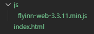

# 快速上手

### 注意：浏览器权限限制，仅支持https访问获取媒体设备

> FlyInn User Agent 代表与SIP帐户关联的SIP客户端。FlyInn User Agent 在 `FlyInn.UA` 中定义。

## 第一个例子

创建文件及目录，结构如下：



> *建议使用 adapterjs 以实现更好的浏览器兼容*
>
> *相关代码见 Demo 文件*

*开启debug模式查看控制台输出调试信息*

```
FlyInn.debug.enable('FlyInn:*')
```

*关闭调试*

```
FlyInn.debug.disable('FlyInn:*')
```

### 初始化

1. 引入sdk文件

```
<script src="./js/flyinn-web-3.3.11.min.js"></script>
```

2. UA 参数配置

```
var socket = new FlyInn.WebSocketInterface('你的 WSS 信令地址');
var configuration = {
  sockets    : socket,
  uri        : 'sip:account@domain',
  password   : 'password',
  secret_key : '授权码'
};
```

3. UA 实例化

```
var flyinnUA = new FlyInn.UA(configuration);
```

4. 启动 UA

```
flyinnUA.start();
```

### 被叫

```
flyinnUA.on('newRTCSession', function(e){
... 此处代码见 demo ...
});
```

### 发起呼叫

1. 呼叫参数

```
var options = {
  'eventHandlers'    : eventHandlers,
  'mediaConstraints' : { 'audio': true, 'video': true }
};
```

2. 发起呼叫

```
var session = flyinnUA.call('sip:bob@example.com', options);
```
