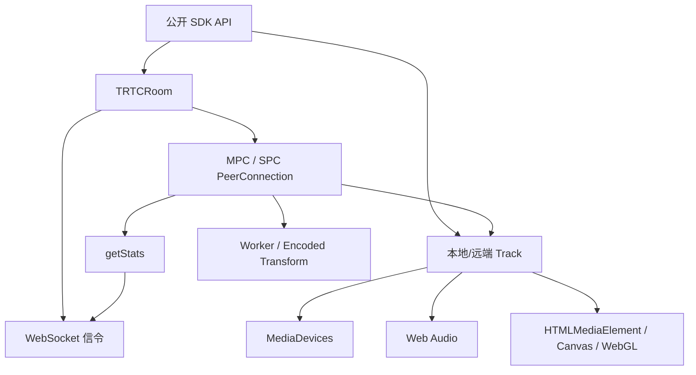

# 00 阅读说明与源码地图

> 本文解决三个问题：源码分成哪些层、文档中的缩写和术语是什么意思，以及后续文档应该按什么顺序阅读。

## 1. 先建立六层结构

| 层 | 大致范围 | 主要内容 | 阅读时最容易犯的错误 |
|---|---:|---|---|
| 运行时兼容 | L1—L6650 | core-js、基础 Polyfill | 把通用运行时代码当成 TRTC 业务 |
| WebRTC Adapter | L6651—L9450 | Chrome、Firefox、Safari Shim | 把原型包装调用计入正式协商次数 |
| 协议与公共工具 | L9450—L17420 | SDP、二进制、浏览器检测、重试、事件 | 只看函数名，不看实际调用方 |
| 媒体资源层 | L17420—L34090 | Track、Player、Audio、Canvas、WebGL、Worker | 混淆资源引用者与真正所有者 |
| SDK 门面层 | L34100—L36520 | 进退房、本地/远端音视频、屏幕共享 | 只看公开方法，不追到 Room/Track |
| 信令与 RTC 房间层 | L36520—L51908 | WebSocket、MPC/SPC、发布订阅、Stats、重连 | 把信令在线等同于媒体连通 |



## 2. 控制面与媒体面必须分开

TRTC 的浏览器侧链路至少包含四个完成阶段：

```text
HTTP 调度成功
  → WebSocket open
    → 应用层信令会话和 join 成功
      → RTCPeerConnection connected
        → 远端 track 到达并完成首帧播放
```

上游阶段成功不保证下游阶段已经完成。例如 `join()` 可以在 SPC 媒体 PC 尚未 connected 时 resolve；发布和订阅会在后续显式等待媒体连接。

## 3. 三种源码出现位置不能混为一谈

以 `RTCPeerConnection` 为例：

| 出现位置 | 实际含义 |
|---|---|
| Adapter 包装 `setRemoteDescription()` | 修改所有后续 PC 的浏览器兼容行为 |
| H.264 回环中的 `addIceCandidate()` | 两个临时本地 PC 验证真实编解码能力 |
| MPC/SPC 中 `setRemoteDescription()` | 正式通话的 SDP 应用 |

因此，文档先说明“这段代码属于哪一层”，再解释参数和调用链。

## 4. 关键对象与资源所有权

| 对象 | 主要责任 | 真正拥有的资源 | 典型释放动作 |
|---|---|---|---|
| SDK 门面实例 | 参数校验、公开事件、实例生命周期 | Room 和 Track 引用 | `exitRoom()`、`destroy()` |
| TRTCRoom | 房间、用户、发布订阅、网络质量 | SignalChannel、MPC/SPC、timer | leave、closeConnections、reset |
| SignalChannel | 信令连接、JSON RPC、恢复 | 主备 WebSocket、等待响应 listener、timer | 解绑、close、拒绝未完成请求 |
| 本地 Track | 采集、处理、播放和发布状态 | source/out MediaStreamTrack、Player、Audio/Video pipeline | stop track、断 AudioNode、停 Player |
| 远端 Track | 接收、播放和订阅状态 | receiver track、Player | unsubscribe、停 Player、解绑事件 |
| MPC Connection | 单方向或单用户媒体连接 | 独立 RTCPeerConnection | 解绑状态事件、`pc.close()` |
| SignalTransport | SPC 房间级媒体传输 | 共享 PC、Worker、encoded pipe | reset/rebuild 或最终 close |
| Player | DOM 或 Canvas 播放 | audio/video/canvas、帧回调 | pause、清 `srcObject`、移除元素 |

一个 `MediaStreamTrack` 可以同时被 Player、Sender 和 Track 包装引用，但通常只有创建它的 Track/Manager 有权决定何时 `stop()`。

## 5. 参数怎样从公开 API 流到浏览器

```text
用户调用参数
  → 参数校验与默认值
    → SDK 本地配置
      → Track / Room 内部配置
        → 浏览器兼容和失败降级
          → Web API 参数
            → settings / capabilities / stats 反向修正状态
```

例如本地视频的 `profile` 最终进入 `getUserMedia` 的 width、height、frameRate，也进入 sender 码率配置；`fillMode`、mirror 和 rotation 则进入 Player/Canvas，不属于采集约束。

参数追踪不能停在“源码调用了某 API”。每个重要字段都继续追四件事：

| 阶段 | 要回答的问题 | 屏幕共享示例 |
|---|---|---|
| 公开配置 | 用户传了什么，未传时谁补默认值 | `startScreenShare(options)` 中的 profile、系统音频和裁剪配置 |
| 首次浏览器调用 | 浏览器第一次实际收到什么对象 | `getDisplayMedia({video, audio, preferCurrentTab, systemAudio, selfBrowserSurface, surfaceSwitching})` |
| 运行时二次配置 | 创建后还改了什么 | `videoTrack.applyConstraints({frameRate, width, height})` |
| 结果与下游 | 什么才是最终生效值，随后交给谁 | `getSettings()`、`ended`，再进入 ScreenTrack、Player 和 Sender |

这四层不能合并成一张“参数表”。第一次调用描述选择器和初始采集意图；第二次调用约束已经选中的 Track；`getSettings()` 才反映浏览器最终采用的值。

## 6. 阅读每个专题时固定回答什么

第一层全景章节固定回答：API 是什么、在哪里、实际参数、使用场景、典型链路、深入阅读入口。

第二层关键 API 专题继续回答：

1. Adapter 是否改写它。
2. 是否存在临时能力检测。
3. 正式业务由谁拥有。
4. 怎样初始化以及初始化后处于什么状态。
5. 首次调用链和后续增量操作。
6. 状态怎样变化。
7. 异常怎样重试、重连或降级。
8. 谁负责关闭和释放。

其中每张“API 参数与本项目实参”卡片固定包含：API 签名、JS 源码片段、标准参数定义、本项目逐字段来源、默认/省略行为、调用阶段、返回值去向。机械搜索命中、全部行号和反向索引仍放在附录。

## 7. 核心术语速查

本文中的缩写分为两类：WebRTC/Web 平台的标准术语，以及当前 TRTC 源码自己的架构简称。标准术语可以追到规范；项目简称只能由当前源码命名和对象关系解释，不能假装成 Web 标准。

| 术语 | 英文全称 | 本文中的准确含义 | 来源 |
|---|---|---|---|
| TRTC | Tencent Real-Time Communication | 腾讯实时音视频 SDK；本文分析的是其浏览器端反混淆产物 | 当前项目上下文 |
| SDK | Software Development Kit | 提供给接入方调用的软件开发工具包 | 通用软件术语 |
| API | Application Programming Interface | 可被代码调用的接口；“Web API”特指浏览器提供的接口 | 通用软件术语 |
| RTC | Real-Time Communication | 实时通信；本文通常出现在 WebRTC、TRTC 或 RTC 房间等名称中 | 通用实时通信术语 |
| PC | Peer Connection | 文中的简称，通常指一个 `RTCPeerConnection` 实例，而不是个人电脑 | [W3C WebRTC](https://www.w3.org/TR/webrtc/#rtcpeerconnection-interface) |
| MPC | Multiple PeerConnections | **当前文档为便于阅读采用的项目术语**：上行和各远端用户分别使用独立 PC 的多连接模式 | [当前源码：MPC 连接与 `fallbackToMPC`](../trtc.deobfuscated.js#:~:text=fallbackToMPC) |
| SPC | Single PeerConnection | **当前源码使用的项目术语**：房间级 `SignalTransport` 共享一个 PC 的单连接模式；源码中的 `singlePC`、`enableSPC`、`initSinglePC()` 可直接证明这一含义 | [当前源码：`initSinglePC`](../trtc.deobfuscated.js#:~:text=initSinglePC) |
| SDP | Session Description Protocol | 描述媒体、编解码器、方向、地址和协商结果的会话文本 | [RFC 8866](https://www.rfc-editor.org/rfc/rfc8866) |
| ICE | Interactive Connectivity Establishment | 在主机、STUN 和 TURN 候选之间寻找可用网络路径的机制 | [RFC 8445](https://www.rfc-editor.org/rfc/rfc8445) |
| STUN | Session Traversal Utilities for NAT | 帮助端点发现公网映射地址；它不是媒体中继 | [RFC 8489](https://www.rfc-editor.org/rfc/rfc8489) |
| TURN | Traversal Using Relays around NAT | 直连失败时由中继服务器转发数据 | [RFC 8656](https://www.rfc-editor.org/rfc/rfc8656) |
| DTLS | Datagram Transport Layer Security | WebRTC 用于协商密钥和保护数据报传输的安全协议；媒体侧通常结合 SRTP | [RFC 9147](https://www.rfc-editor.org/rfc/rfc9147) |
| RTP | Real-time Transport Protocol | 承载实时音视频媒体包 | [RFC 3550](https://www.rfc-editor.org/rfc/rfc3550) |
| RTCP | RTP Control Protocol | 与 RTP 配套的质量、同步和参与者控制信息 | [RFC 3550](https://www.rfc-editor.org/rfc/rfc3550) |
| BUNDLE | Bundle Protocol | 让多个媒体描述复用同一组传输资源 | [RFC 9143](https://www.rfc-editor.org/rfc/rfc9143) |
| RTP/RTCP mux | RTP and RTCP Multiplexing | 让 RTP 和 RTCP 复用同一端口/传输 | [RFC 5761](https://www.rfc-editor.org/rfc/rfc5761) |
| Unified Plan | Unified Plan SDP semantics | 现代 WebRTC 的轨道/Transceiver 映射模型；一个 m-line 对应一个收发器 | [W3C `RTCRtpTransceiver`](https://www.w3.org/TR/webrtc/#rtcrtptransceiver-interface) |
| Plan B | Plan B SDP semantics | Chrome 早期的非标准多轨 SDP 模型；源码仅为旧环境保留兼容分支 | [Chromium Unified Plan 迁移说明](https://webrtc.org/getting-started/unified-plan-transition-guide) |
| m-line | media description line | SDP 中以 `m=` 开始的一段媒体描述 | [RFC 8866 §5.14](https://www.rfc-editor.org/rfc/rfc8866#section-5.14) |
| MID | Media Identification | 在 SDP/RTP 中标识媒体描述的 ID，用于把包和 m-line/Transceiver 对应起来 | [RFC 8843](https://www.rfc-editor.org/rfc/rfc8843) |
| SSRC | Synchronization Source | RTP 同步源标识，常用来区分发送源 | [RFC 3550 §6.4.1](https://www.rfc-editor.org/rfc/rfc3550#section-6.4.1) |
| MSID | MediaStream Identification | SDP 中把媒体轨道关联到 `MediaStream`/`MediaStreamTrack` 的标识 | [RFC 8830](https://www.rfc-editor.org/rfc/rfc8830) |
| RPC | Remote Procedure Call | 项目在 WebSocket 上封装的“发命令并等待对应响应”模式，不是 WebSocket 自带能力 | 当前源码 `sendWaitForResponse()` |
| VAD | Voice Activity Detection | 语音活动检测；用于判断声音中是否有语音活动 | [2018 WebRTC 候选推荐版中的历史定义](https://www.w3.org/TR/2018/CR-webrtc-20180927/#dom-rtcofferansweroptions-voiceactivitydetection) |
| AEC | Acoustic Echo Cancellation | 声学回声消除；本文也用来指音频处理图中的回声参考支路 | [W3C Media Capture `echoCancellation`](https://www.w3.org/TR/mediacapture-streams/#def-constraint-echoCancellation) |
| RTT | Round-Trip Time | 数据往返一次所需时间；Stats 中常用来描述网络时延 | [W3C WebRTC Stats](https://www.w3.org/TR/webrtc-stats/#dom-rtcremoteinboundrtpstreamstats-roundtriptime) |
| PCM | Pulse-Code Modulation | 未压缩的数字音频采样数据 | 通用音频术语 |
| SEI | Supplemental Enhancement Information | 视频码流中的补充增强信息；项目用于随视频发送附加数据 | [ITU-T H.264](https://www.itu.int/rec/T-REC-H.264) |
| WASM | WebAssembly | 浏览器可执行的低级二进制指令格式 | [WebAssembly Core Specification](https://webassembly.github.io/spec/core/) |
| SIMD | Single Instruction, Multiple Data | 一条指令并行处理多份数据；WASM 媒体算法常用来加速像素/音频计算 | [WebAssembly SIMD](https://webassembly.github.io/spec/core/bikeshed/#simd-instructions%E2%91%A0) |
| URL | Uniform Resource Locator | 网络资源地址 | [WHATWG URL Standard](https://url.spec.whatwg.org/) |
| HTTP | Hypertext Transfer Protocol | 调度、资源加载和上报使用的请求/响应协议 | [RFC 9110](https://www.rfc-editor.org/rfc/rfc9110) |
| JSON | JavaScript Object Notation | WebSocket 信封和 HTTP 数据常用的文本数据格式 | [RFC 8259](https://www.rfc-editor.org/rfc/rfc8259) |
| XHR | XMLHttpRequest | 浏览器的历史 HTTP 请求接口 | [WHATWG XMLHttpRequest](https://xhr.spec.whatwg.org/) |
| DOM | Document Object Model | 浏览器页面节点和事件对象模型 | [WHATWG DOM](https://dom.spec.whatwg.org/) |
| UA | User Agent | 执行页面的浏览器/客户端实现；UA string 指浏览器标识字符串 | [WHATWG HTML Navigator](https://html.spec.whatwg.org/multipage/system-state.html#the-navigator-object) |
| MIME / media type | Multipurpose Internet Mail Extensions media type | 描述资源格式的类型字符串，例如 `video/mp4`、`application/wasm` | [RFC 6838](https://www.rfc-editor.org/rfc/rfc6838) |
| CORS | Cross-Origin Resource Sharing | 浏览器决定跨源请求/资源是否可被页面读取的机制 | [WHATWG Fetch CORS protocol](https://fetch.spec.whatwg.org/#http-cors-protocol) |
| CSP | Content Security Policy | 限制页面可加载和执行哪些资源的安全策略 | [W3C CSP Level 3](https://www.w3.org/TR/CSP3/) |
| NAT | Network Address Translation | 在内网地址与外部地址之间转换；ICE/STUN/TURN 主要解决其带来的可达性问题 | [RFC 2663](https://www.rfc-editor.org/rfc/rfc2663) |
| SRTP | Secure Real-time Transport Protocol | 为 RTP/RTCP 提供机密性、认证和重放保护 | [RFC 3711](https://www.rfc-editor.org/rfc/rfc3711) |
| TCP | Transmission Control Protocol | 面向连接的可靠字节流协议；WebSocket 通常建立在 TCP/TLS 上 | [RFC 9293](https://www.rfc-editor.org/rfc/rfc9293) |
| TLS | Transport Layer Security | HTTPS/WSS 使用的传输层安全协议 | [RFC 8446](https://www.rfc-editor.org/rfc/rfc8446) |
| GPU | Graphics Processing Unit | 图形处理器；WebGL 渲染和硬件编解码可能使用 | 通用硬件术语 |
| CPU | Central Processing Unit | 中央处理器；Canvas 像素读取和软件编解码可能增加 CPU 负载 | 通用硬件术语 |
| rAF | `requestAnimationFrame` | 浏览器在下一次绘制前安排回调的页面动画 API | [HTML Standard](https://html.spec.whatwg.org/multipage/imagebitmap-and-animations.html#animation-frames) |
| FBO | Framebuffer Object | WebGL 的离屏/自定义帧缓冲对象 | [WebGL 2.0 Specification](https://registry.khronos.org/webgl/specs/latest/2.0/) |
| TLV | Type-Length-Value | 由类型、长度和值组成的二进制字段编码形式 | 通用协议编码术语 |
| Shim | Compatibility shim | 在原生 API 外包一层，补齐或改写旧浏览器行为 | 本文 Adapter 源码层 |

各专题仍应在术语**首次出现**时写出全称或中文解释；本表用于跨章节快速回查，而不是让正文只剩缩写。

## 8. 怎样判断“这个字段从哪里来”

文档中的“来源”必须区分下面四种证据，不能只放一个 MDN 链接就把项目私有字段也算成标准：

| 标记 | 能证明什么 | 不能证明什么 | 首选链接 |
|---|---|---|---|
| 当前标准 | 当前 Web IDL 中仍定义了该 API/字段 | 当前项目一定传了它 | [W3C WebRTC Recommendation](https://www.w3.org/TR/webrtc/)、对应 WHATWG/W3C 规范 |
| 开发者文档 | 语法、参数解释和浏览器兼容性 | 规范未定义的项目私有行为 | 对应 [MDN Web Docs](https://developer.mozilla.org/en-US/docs/Web/API) 页面 |
| 历史/实现扩展 | 旧规范或特定内核曾定义/实现 | 其他浏览器或当前版本仍支持 | 带日期的 W3C 旧版本、Chromium/Firefox/WebKit 官方源码 |
| 当前项目源码 | 当前反混淆文件确实传参或调用 | 字段属于 Web 标准、服务端语义已知 | [`trtc.deobfuscated.js`](../trtc.deobfuscated.js) 的方法和行号 |

因此，看到“MDN 当前页没有某字段”时，正确处理不是直接删掉，而是依次回答：源码有没有传、旧规范是否定义过、当前规范是否仍存在、目标浏览器是否只是容忍未知字典成员。查不到公开实现来源的字段必须明确标成“项目/内核私有，公开语义不能确认”。

## 9. 推荐阅读路径

先读 [浏览器 API 使用全景分析](01-Browser-API-Panorama.md)，知道整体用了什么；再读 [`RTCPeerConnection`](02-RTCPeerConnection-usage-analysis.md) 和 [`WebSocket`](03-WebSocket-usage-analysis.md)，建立媒体面和控制面；然后根据问题进入采集、Track、Audio、渲染或 Worker 专题；最后通过 [端到端业务流程](11-End-to-End-Business-Flows.md) 把各层重新串起来。

附录 A—F 只用于核对完整行号和反向查找，不作为学习入口。
