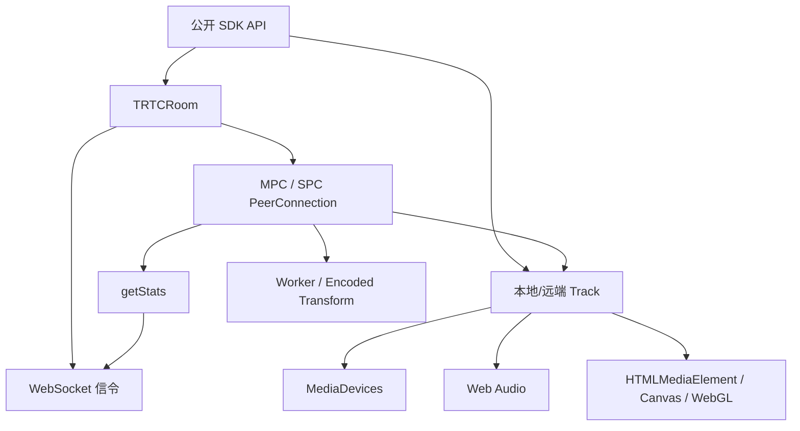

# 00 阅读说明与源码地图

> 本文只解决两个问题：源码分成哪些层，以及后续文档应该按什么顺序阅读。

## 1. 先建立六层结构

| 层 | 大致范围 | 主要内容 | 阅读时最容易犯的错误 |
|---|---:|---|---|
| 运行时兼容 | L1—L6650 | core-js、基础 Polyfill | 把通用运行时代码当成 TRTC 业务 |
| WebRTC Adapter | L6651—L9450 | Chrome、Firefox、Safari Shim | 把原型包装调用计入正式协商次数 |
| 协议与公共工具 | L9450—L17420 | SDP、二进制、浏览器检测、重试、事件 | 只看函数名，不看实际调用方 |
| 媒体资源层 | L17420—L34090 | Track、Player、Audio、Canvas、WebGL、Worker | 混淆资源引用者与真正所有者 |
| SDK 门面层 | L34100—L36520 | 进退房、本地/远端音视频、屏幕共享 | 只看公开方法，不追到 Room/Track |
| 信令与 RTC 房间层 | L36520—L51908 | WebSocket、MPC/SPC、发布订阅、Stats、重连 | 把信令在线等同于媒体连通 |



## 2. 控制面与媒体面必须分开

TRTC 的浏览器侧链路至少包含四个完成阶段：

```text
HTTP 调度成功
  → WebSocket open
    → 应用层信令会话和 join 成功
      → RTCPeerConnection connected
        → 远端 track 到达并完成首帧播放
```

上游阶段成功不保证下游阶段已经完成。例如 `join()` 可以在 SPC 媒体 PC 尚未 connected 时 resolve；发布和订阅会在后续显式等待媒体连接。

## 3. 三种源码出现位置不能混为一谈

以 `RTCPeerConnection` 为例：

| 出现位置 | 实际含义 |
|---|---|
| Adapter 包装 `setRemoteDescription()` | 修改所有后续 PC 的浏览器兼容行为 |
| H.264 回环中的 `addIceCandidate()` | 两个临时本地 PC 验证真实编解码能力 |
| MPC/SPC 中 `setRemoteDescription()` | 正式通话的 SDP 应用 |

因此，文档先说明“这段代码属于哪一层”，再解释参数和调用链。

## 4. 关键对象与资源所有权

| 对象 | 主要责任 | 真正拥有的资源 | 典型释放动作 |
|---|---|---|---|
| SDK 门面实例 | 参数校验、公开事件、实例生命周期 | Room 和 Track 引用 | `exitRoom()`、`destroy()` |
| TRTCRoom | 房间、用户、发布订阅、网络质量 | SignalChannel、MPC/SPC、timer | leave、closeConnections、reset |
| SignalChannel | 信令连接、JSON RPC、恢复 | 主备 WebSocket、等待响应 listener、timer | 解绑、close、拒绝未完成请求 |
| 本地 Track | 采集、处理、播放和发布状态 | source/out MediaStreamTrack、Player、Audio/Video pipeline | stop track、断 AudioNode、停 Player |
| 远端 Track | 接收、播放和订阅状态 | receiver track、Player | unsubscribe、停 Player、解绑事件 |
| MPC Connection | 单方向或单用户媒体连接 | 独立 RTCPeerConnection | 解绑状态事件、`pc.close()` |
| SignalTransport | SPC 房间级媒体传输 | 共享 PC、Worker、encoded pipe | reset/rebuild 或最终 close |
| Player | DOM 或 Canvas 播放 | audio/video/canvas、帧回调 | pause、清 `srcObject`、移除元素 |

一个 `MediaStreamTrack` 可以同时被 Player、Sender 和 Track 包装引用，但通常只有创建它的 Track/Manager 有权决定何时 `stop()`。

## 5. 参数怎样从公开 API 流到浏览器

```text
用户调用参数
  → 参数校验与默认值
    → SDK 本地配置
      → Track / Room 内部配置
        → 浏览器兼容和失败降级
          → Web API 参数
            → settings / capabilities / stats 反向修正状态
```

例如本地视频的 `profile` 最终进入 `getUserMedia` 的 width、height、frameRate，也进入 sender 码率配置；`fillMode`、mirror 和 rotation 则进入 Player/Canvas，不属于采集约束。

参数追踪不能停在“源码调用了某 API”。每个重要字段都继续追四件事：

| 阶段 | 要回答的问题 | 屏幕共享示例 |
|---|---|---|
| 公开配置 | 用户传了什么，未传时谁补默认值 | `startScreenShare(options)` 中的 profile、系统音频和裁剪配置 |
| 首次浏览器调用 | 浏览器第一次实际收到什么对象 | `getDisplayMedia({video, audio, preferCurrentTab, systemAudio, selfBrowserSurface, surfaceSwitching})` |
| 运行时二次配置 | 创建后还改了什么 | `videoTrack.applyConstraints({frameRate, width, height})` |
| 结果与下游 | 什么才是最终生效值，随后交给谁 | `getSettings()`、`ended`，再进入 ScreenTrack、Player 和 Sender |

这四层不能合并成一张“参数表”。第一次调用描述选择器和初始采集意图；第二次调用约束已经选中的 Track；`getSettings()` 才反映浏览器最终采用的值。

## 6. 阅读每个专题时固定回答什么

第一层全景章节固定回答：API 是什么、在哪里、实际参数、使用场景、典型链路、深入阅读入口。

第二层关键 API 专题继续回答：

1. Adapter 是否改写它。
2. 是否存在临时能力检测。
3. 正式业务由谁拥有。
4. 怎样初始化以及初始化后处于什么状态。
5. 首次调用链和后续增量操作。
6. 状态怎样变化。
7. 异常怎样重试、重连或降级。
8. 谁负责关闭和释放。

其中每张“API 参数与本项目实参”卡片固定包含：API 签名、JS 源码片段、标准参数定义、本项目逐字段来源、默认/省略行为、调用阶段、返回值去向。机械搜索命中、全部行号和反向索引仍放在附录。

## 7. 推荐阅读路径

先读 [浏览器 API 使用全景分析](01-Browser-API-Panorama.md)，知道整体用了什么；再读 [`RTCPeerConnection`](02-RTCPeerConnection-usage-analysis.md) 和 [`WebSocket`](03-WebSocket-usage-analysis.md)，建立媒体面和控制面；然后根据问题进入采集、Track、Audio、渲染或 Worker 专题；最后通过 [端到端业务流程](11-End-to-End-Business-Flows.md) 把各层重新串起来。

附录 A—F 只用于核对完整行号和反向查找，不作为学习入口。
