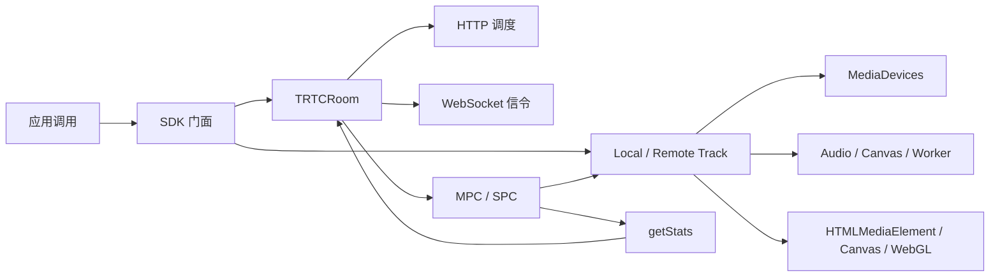

# 11 端到端业务流程

> 前面按浏览器 API 学习；本文反过来从用户动作出发，把公开 API、Room、Track、WebSocket、PeerConnection 和 Player 串成完整链路。

## 1. 总体心智模型



任何流程都要同时回答：

1. 谁拥有资源。
2. 当前 Promise 代表哪个完成点。
3. 失败发生在控制面还是媒体面。
4. 取消、重连和销毁由谁执行。

### 1.1 同一功能的参数必须按阶段追踪

业务功能通常不是只调用一次浏览器 API。阅读下面各流程时，要把参数放回它实际生效的阶段：

| 功能 | 公开配置 | 创建/选择阶段 | 运行时调整 | 最终结果与下游 |
|---|---|---|---|---|
| 摄像头 | profile、cameraId、facingMode | `getUserMedia({video})` | 换设备时 `applyConstraints()` 或重新采集 | `getSettings()` → LocalVideoTrack → Sender/Player |
| 屏幕共享 | profile、系统音频、裁剪目标 | `getDisplayMedia(options)` 决定选择器和初始采集 | `applyConstraints({frameRate,width,height})`，可选 `cropTo()` | `getSettings()` / `ended` → ScreenTrack → 辅流 Sender |
| PeerConnection | ICE、bundle、relay 策略 | `new RTCPeerConnection(configuration)` | `setConfiguration()`、`setParameters()`、`replaceTrack()` | connection state / `getStats()` → Room 重连与质量状态 |
| 播放 | view、fillMode、mirror、音频输出设备 | 创建 media/canvas 元素并绑定 `srcObject` | `setSinkId()`、Canvas/WebGL 变换 | `playing` / frame callback → 首帧与尺寸事件 |

“创建时传过”不等于“最终按该值生效”。约束可能被浏览器降级，Sender 参数也可能受 SDP 和远端能力限制，因此结果读取必须单列。

## 2. 进房

```text
SDK.enterRoom(params)
  → 参数校验和实例状态检查
  → TRTCRoom.join(joinParams)
    → HTTP schedule
      → 主备调度请求
      → signal URL、ICE Server、SPC/MPC 策略
    → Promise.all([
         room.initialize(),
         room.initSinglePC()
       ])
      → SignalChannel 主备 WebSocket 竞速
      → SPC 可用时生成 origin Offer/client ability
    → WebSocket join RPC
    → 保存 tinyId、用户、ICE 和 server ability
    → SPC connect 或准备 MPC
  → 转发 ENTER_ROOM 等公开事件
```

这里至少有五个完成点：调度、WebSocket open、channel setup、join RPC、媒体 PC connected。`enterRoom()`/`join()` 的完成语义不能直接扩展为“所有媒体已经可用”。

## 3. 启动本地麦克风

```text
SDK.startLocalAudio(config)
  → 创建 LocalAudioTrack
  → 构造 audio constraints
  → getUserMedia({audio})
  → source audio track
  → Web Audio pipeline（可选）
  → out audio track
  → 本地 Player/音量检测（可选）
  → Room.publish(track)
  → MPC/SPC sender replaceTrack/addTrack
  → publish/publish_change 信令
```

关键边界：

- gUM 成功只代表采集成功。
- out track 可能不是 source track。
- publish Promise 还要结合 PC connected 和信令响应。
- 停止时先退发布，再断处理图并停止 source/out Track。

## 4. 启动本地摄像头

```text
SDK.startLocalVideo(config)
  → profile/cameraId/facingMode 转采集配置
  → getUserMedia({video})
  → getSettings/getCapabilities
  → LocalVideoTrack.setInputMediaStreamTrack
  → 本地预览
  → 可选 Canvas/处理管线产生 out track
  → Room.publish
  → sender index 1（主流）/2（小流）
```

width/height/frameRate 进入采集；bitrate 进入 sender parameters/SDP；mirror、fillMode、rotation 进入 Player/Canvas。它们不是同一组浏览器参数。

## 5. 屏幕共享

```text
SDK.startScreenShare(options)
  → getDisplayMedia constraints
  → screen video + optional system audio
  → 可选 CropTarget/cropTo
  → 可选额外 getUserMedia 麦克风
  → ScreenTrack / Audio mix
  → 本地预览
  → Room.publish(isAuxiliary=true)
  → sender index 3（辅流）
```

浏览器 UI 的“停止共享”触发 Track ended，SDK 应进入与显式 stopScreenShare 对齐的退发布和释放流程，但要防止重复执行。

这里最容易写错的是把两次约束合成一个 `{video: true}`。下面把源码中的混淆变量 `e`、`i`、`n` 改成可读名称，字段、条件和取值保持不变：

```js
// 第一次：构造选择界面参数并开始采集。
const displayOptions = {
  preferCurrentTab:
    screenOptions.preferDisplaySurface === 'current-tab' ||
    Boolean(screenOptions.captureElement),
  systemAudio: "include",
  selfBrowserSurface: "include",
  surfaceSwitching: "include",
  video: {
    width: isSafari
      ? { max: screenOptions.width }
      : { ideal: screenOptions.width, max: screenOptions.width },
    height: isSafari
      ? { max: screenOptions.height }
      : { ideal: screenOptions.height, max: screenOptions.height },
    frameRate: screenOptions.frameRate,
    displaySurface: screenOptions.preferDisplaySurface || 'monitor'
  }
};

if (screenOptions.systemAudio) {
  displayOptions.audio = {
    echoCancellation: screenOptions.echoCancellation ?? true,
    noiseSuppression: screenOptions.noiseSuppression ?? false,
    autoGainControl: screenOptions.autoGainControl ?? false,
    sampleRate: 48000
  };
}

const displayStream = await navigator.mediaDevices.getDisplayMedia(displayOptions);
const screenVideoTrack = displayStream.getVideoTracks()[0];

// 第二次：已经取得 Track 后，再约束真正用于发布的视频轨道。
if (screenOptions.frameRate) {
  try {
    await screenVideoTrack.applyConstraints({
      frameRate: {
        min: screenOptions.frameRate,
        ideal: screenOptions.frameRate
      },
      width: screenOptions.width,
      height: screenOptions.height
    });
  } catch (error) {
    logger.warn(`screen applyConstraints failed: ${error}`);
  }
}
```

两组参数含义不同：

- `preferCurrentTab`、`selfBrowserSurface`、`surfaceSwitching`、`displaySurface` 影响选择界面或首选共享来源，并不直接保证最终选择结果。
- `systemAudio: "include"` 表示选择器允许或提示共享系统音频；顶层 `audio` 仍决定 SDK 是否请求音频轨道以及请求哪些音频约束。
- 第二次的 `applyConstraints()` 不会重新打开选择器，它只尝试调整已经获得的视频 Track。
- `frameRate.min` 是最低可接受值，无法满足时 Promise 可以 reject；`ideal` 是偏好值。源码把二者都设为 `screenOptions.frameRate`，并把 `width`、`height` 再传一次。
- 第二次约束失败只记录 warning，不丢弃已经获得的屏幕 Track；这是“优化输出规格失败”与“屏幕采集失败”的明确分界。
- 随后还要用 `getSettings()` 看浏览器真正采用的尺寸、帧率和 `displaySurface`，并监听 `ended` 处理用户从浏览器 UI 停止共享。

完整的逐字段来源和条件分支见 [MediaDevices 与媒体采集：`getDisplayMedia()`](04-MediaDevices-and-Capture.md#16-7-getdisplaymedia-options) 及其下一节。

## 6. MPC 首次发布

```text
Room.publish(track)
  → 创建/取得 dJ uplink
  → initialize 独立 PC
  → 建固定 sender/transceiver 槽或 addTrack
  → createOffer
  → setLocalDescription
  → WebSocket publish RPC 携 Offer
  → setRemoteDescription(Answer)
  → waitForPeerConnectionConnected
  → Stats 记录 selected candidate
```

后续同槽换轨通常使用 `replaceTrack()` 和 publish_change；旧兼容路径可能需要更新 Offer。

## 7. SPC 首次发布

SPC 在进房阶段已经预建共享 PC 和四个上行槽：

| index | kind | 语义 |
|---:|---|---|
| 0 | audio | 本地音频 |
| 1 | video | 主视频 |
| 2 | video | 小流 |
| 3 | video | 辅视频/屏幕 |

```text
Room.publish(track)
  → wait SignalTransport connected
  → UplinkTransport.publish
  → sender.replaceTrack(outTrack)
  → setParameters（码率/缩放/降级偏好）
  → publish 状态信令
```

共享 PC 的所有者始终是 SignalTransport，UplinkTransport 关闭不能直接关闭 PC。

## 8. MPC 订阅远端用户

每个远端用户一个下行 PC：

```text
SDK.startRemoteVideo(userId, streamType, view)
  → Room 合并该用户目标 subscribeState
  → aJ.subscribe
  → initialize 独立 PC
  → audio/video/video recvonly transceivers
  → createOffer + SDP 修正
  → subscribe RPC
  → setRemoteDescription(answer)
  → ontrack
  → RemoteTrack.setInputMediaStreamTrack
  → waitHasMediaTrack / Player.play(view)
```

首次 Offer 已声明所需 m-line；后续大/小流或音频状态变化通常走 subscribe_change，完全退订才关闭该用户 PC。

## 9. SPC 订阅远端用户

共享 PC 从 index 4 开始，每个远端用户占 3 个下行槽：

```text
audio + big video + auxiliary video
```

```text
DownlinkTransport.doSubscribe
  → 取得/新增三个 recvonly transceiver
  → 写入 Answer 的 SSRC/MSID/MID
  → 更新 user ↔ MID Map
  → 多用户变更通过 queue 合并
  → SignalTransport.updateSDP
  → ontrack 按 stream/tinyId/MID 还原用户
  → RemoteTrack + Player
```

SPC 的增量订阅会影响共享 SDP，因此失败可能触发整个 SPC 重建，而不只是某个用户连接。

## 10. 远端首帧播放

```text
subscribe response
  → setRemoteDescription
  → PC ontrack
  → RemoteTrack 绑定 native track
  → Player.srcObject / Canvas source
  → play()
  → loadedmetadata / playing / frame callback
  → 首帧和尺寸可用
```

订阅信令成功、PC connected、track 到达和 `playing` 是四个不同阶段。自动播放被阻止时，媒体可能已正常接收，只需用户交互恢复 Player。

## 11. 切换摄像头或麦克风

优先尝试对现有 source track `applyConstraints({deviceId})`；不支持或失败时重新采集：

```text
new getUserMedia
  → 验证 newSourceTrack/settings
  → 接入处理管线得到 newOutTrack
  → sender.replaceTrack(newOutTrack)
  → Player 切换
  → 更新 SDK settings/事件
  → stop old tracks
```

切换成功不必然需要 SDP 重协商，但新 Track 超出现有协商范围时 replaceTrack 可能失败。

## 12. mute、unmute 与停止

三种动作要分开：

| 动作 | 可能实现 | 是否释放设备 |
|---|---|---|
| mute | `enabled=false`、replaceTrack(null)、业务 mute flag | 通常不释放 |
| unmute | enabled 恢复或 replaceTrack(track) | 复用现有 Track |
| stop | unpublish + pipeline close + track.stop | 释放拥有的资源 |

UI 上同样显示“静音”，底层可能是不同状态；重连恢复时必须保存正确的目标发布状态。

## 13. 网络质量与 Stats

```text
周期 timer
  → pc.getStats()
  → 关联 inbound/outbound/remote-inbound/candidate-pair/codec
  → 与上次累计值做差
  → 码率、丢包、RTT、帧率、分辨率、卡顿
  → Room 聚合和上报
```

MPC 分别采样各 PC；SPC 每周期可对共享 PC 采样一次，再按 SSRC/用户过滤。selected candidate pair 才代表真实网络路径，不能仅看配置中的 TURN Server。

## 14. WebSocket 断线恢复

```text
socket close/error
  → SignalChannel 清当前连接
  → 拒绝未完成 RPC
  → 主备地址重新连接
  → 恢复应用层信道
  → Room 判断是否 reJoin
  → 媒体连接等待信令后继续重连
```

已有媒体可能在 WebSocket 刚断时短暂继续，但无法可靠发布、订阅或重建；控制面恢复和媒体面恢复必须分别上报。

## 15. MPC 媒体重连

- 上行 `dJ`：退旧发布、关闭 PC、initialize、新建 Offer、恢复主/辅发布。
- 下行 `aJ`：关闭该用户 PC、initialize、按保存的 subscribeState 重新订阅。
- 各实例独立维护重连次数和 timer。
- 信令不在线时等待 SignalChannel 恢复，不盲目重复建 PC。

## 16. SPC 媒体重连与降级

```text
SignalTransport failed/closed
  → reset shared PC
  → 选择备用 relay
  → initialize
  → REBUILD_PEER_CONNECTION RPC
  → connect(new server ability)
  → UplinkTransport 恢复发布
  → 所有 DownlinkTransport 恢复订阅
```

初始化失败或不可恢复错误时可降级到 MPC：关闭共享 PC，创建 MPC 上行和每用户下行，并尽量复用现有 Track 包装和业务状态。

## 17. 退出房间

`exitRoom()` 主要关闭房间资源：

```text
发送 leave（条件允许时）
  → 停同步/心跳
  → 关闭下行连接和 Player 订阅
  → 关闭上行连接
  → 清 Stats/网络质量/用户
  → 关闭或按策略保留 SignalChannel
  → 关闭 shared SPC
```

本地采集 Track 可以保留，以支持离房后预览或再次进房。这是 `exitRoom()` 与 `destroy()` 的关键区别。

## 18. 销毁实例

`destroy()` 在退房基础上继续：

- 停止本地摄像头、麦克风和屏幕 Track。
- 关闭 Audio/Canvas/Worker pipeline。
- 销毁 Player 和内部 DOM。
- 解绑全局事件、Observer 和页面 listener。
- 清 timer、pending Promise、Object URL 和 Map。

销毁完成后实例不应再接收旧 Track、socket 或 Worker 的晚到事件。

## 19. 四种典型故障组合

| 控制面 | 媒体面 | 现象 | 排查重点 |
|---|---|---|---|
| 正常 | 正常 | 信令和媒体都可用 | 正常 Stats/播放器 |
| 正常 | 失败 | 可以发命令但无媒体 | ICE/DTLS、Candidate、firewall、codec |
| 失败 | 暂时正常 | 音视频可能短暂继续但无法控制 | WebSocket、调度、会话恢复 |
| 失败 | 失败 | 完整掉线 | 先恢复信令，再重建 MPC/SPC |

## 20. 最终检查顺序

排查任意流程时按以下顺序：

```text
公开 API 参数和前置状态
  → HTTP/调度
  → WebSocket open + 应用层会话
  → Room 命令响应
  → PC SDP/ICE/DTLS/connectionState
  → Track 到达/采集
  → Audio/Canvas pipeline
  → Player playing/首帧
  → Stats 真实数据
  → close/reset 是否完整
```

完整公开 API 链见附录 E，集中流程图见附录 F。
