# 附录 F 流程图与时序图

> 本附录集中保留跨对象和跨 Promise 的完整 Mermaid 图；顺序文字解释见主线 `11-End-to-End-Business-Flows.md`。

> 本文把跨对象、跨 Promise 和跨浏览器事件的链路画成 Mermaid 图。图中方法名和 Web API 均来自 `trtc.deobfuscated.js`；细节、参数和异常边界仍以对应专项为准。

## 1. 总体分层：公开 API 怎样走到浏览器

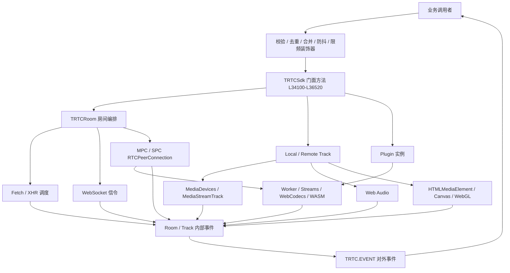
```mermaid
flowchart TB
    Caller["业务调用者"] --> Decorator["校验 / 去重 / 合并 / 防抖 / 限频装饰器"]
    Decorator --> Facade["TRTCSdk 门面方法 L34100-L36520"]
    Facade --> Room["TRTCRoom 房间编排"]
    Facade --> Track["Local / Remote Track"]
    Facade --> Plugin["Plugin 实例"]

    Room --> Schedule["Fetch / XHR 调度"]
    Room --> Signal["WebSocket 信令"]
    Room --> RTC["MPC / SPC RTCPeerConnection"]
    Track --> Capture["MediaDevices / MediaStreamTrack"]
    Track --> Audio["Web Audio"]
    Track --> Player["HTMLMediaElement / Canvas / WebGL"]
    Plugin --> Advanced["Worker / Streams / WebCodecs / WASM"]
    RTC --> Advanced

    Schedule --> InternalEvent["Room / Track 内部事件"]
    Signal --> InternalEvent
    RTC --> InternalEvent
    Capture --> InternalEvent
    Audio --> InternalEvent
    Player --> InternalEvent
    Advanced --> InternalEvent
    InternalEvent --> PublicEvent["TRTC.EVENT 对外事件"]
    PublicEvent --> Caller
```

阅读要点：门面方法往往不直接出现 Web API；它先把参数交给 Room、Track、Player 或 Plugin。浏览器事件又沿相反方向逐级转成 SDK 事件。

## 2. 进入房间：六个不同的完成点

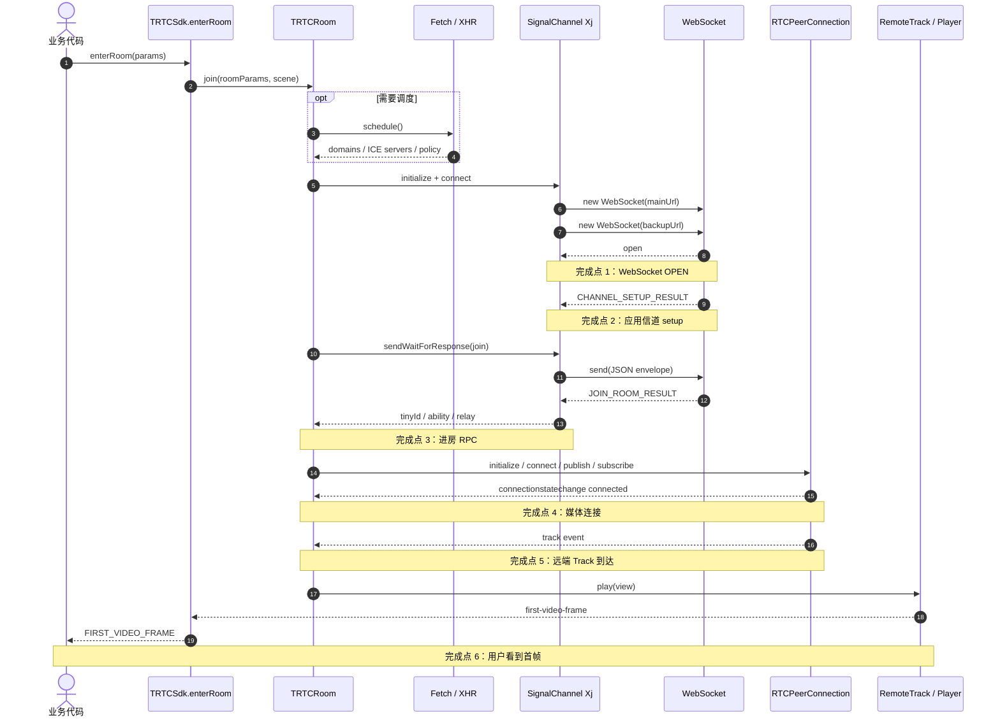
```mermaid
sequenceDiagram
    autonumber
    actor App as 业务代码
    participant SDK as TRTCSdk.enterRoom
    participant Room as TRTCRoom
    participant HTTP as Fetch / XHR
    participant Signal as SignalChannel Xj
    participant WS as WebSocket
    participant PC as RTCPeerConnection
    participant Player as RemoteTrack / Player

    App->>SDK: enterRoom(params)
    SDK->>Room: join(roomParams, scene)
    opt 需要调度
        Room->>HTTP: schedule()
        HTTP-->>Room: domains / ICE servers / policy
    end
    Room->>Signal: initialize + connect
    Signal->>WS: new WebSocket(mainUrl)
    Signal->>WS: new WebSocket(backupUrl)
    WS-->>Signal: open
    Note over Signal,WS: 完成点 1：WebSocket OPEN
    WS-->>Signal: CHANNEL_SETUP_RESULT
    Note over Signal,WS: 完成点 2：应用信道 setup
    Room->>Signal: sendWaitForResponse(join)
    Signal->>WS: send(JSON envelope)
    WS-->>Signal: JOIN_ROOM_RESULT
    Signal-->>Room: tinyId / ability / relay
    Note over Room,Signal: 完成点 3：进房 RPC
    Room->>PC: initialize / connect / publish / subscribe
    PC-->>Room: connectionstatechange connected
    Note over Room,PC: 完成点 4：媒体连接
    PC-->>Room: track event
    Note over Room,PC: 完成点 5：远端 Track 到达
    Room->>Player: play(view)
    Player-->>SDK: first-video-frame
    SDK-->>App: FIRST_VIDEO_FRAME
    Note over App,Player: 完成点 6：用户看到首帧
```

`enterRoom()` 的 Promise 成功不能替代 PC connected 或首帧事件。详细信令阶段见 `03-WebSocket-usage-analysis.md`，媒体阶段见 `02-RTCPeerConnection-usage-analysis.md`。

## 3. WebSocket 主备竞速和清理

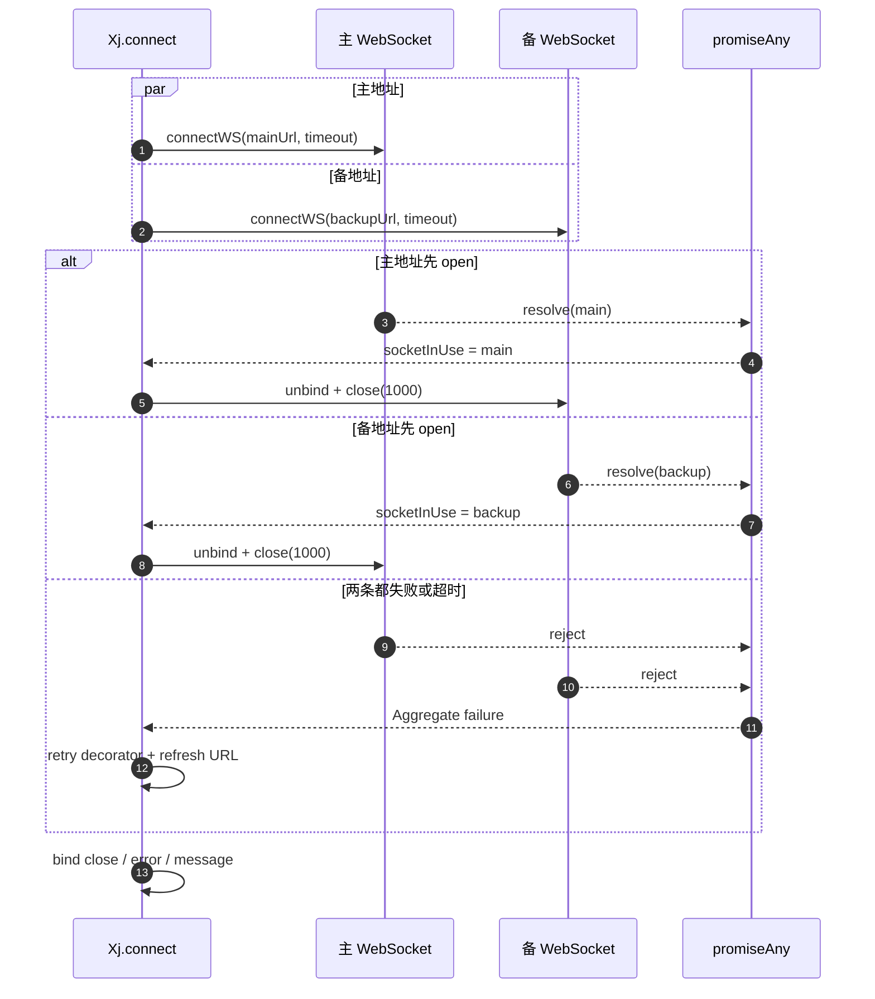
```mermaid
sequenceDiagram
    autonumber
    participant X as Xj.connect
    participant M as 主 WebSocket
    participant B as 备 WebSocket
    participant P as promiseAny

    par 主地址
        X->>M: connectWS(mainUrl, timeout)
    and 备地址
        X->>B: connectWS(backupUrl, timeout)
    end
    alt 主地址先 open
        M-->>P: resolve(main)
        P-->>X: socketInUse = main
        X->>B: unbind + close(1000)
    else 备地址先 open
        B-->>P: resolve(backup)
        P-->>X: socketInUse = backup
        X->>M: unbind + close(1000)
    else 两条都失败或超时
        M-->>P: reject
        B-->>P: reject
        P-->>X: Aggregate failure
        X->>X: retry decorator + refresh URL
    end
    X->>X: bind close / error / message
```

临时 `onopen/onclose/onerror` 只负责单次建连 Promise；选出连接后再换成长生命周期 `addEventListener`，关闭时使用同一绑定函数对称解绑。

## 4. WebSocket RPC：先监听响应，再发送请求

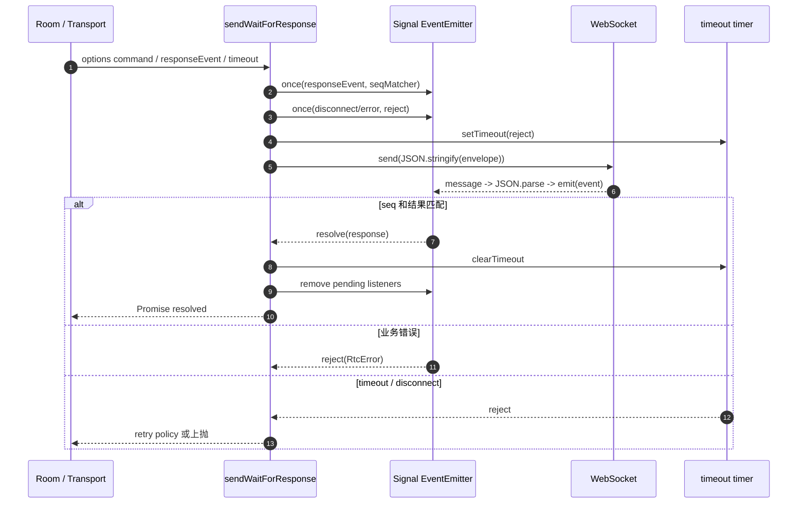
```mermaid
sequenceDiagram
    autonumber
    participant Caller as Room / Transport
    participant RPC as sendWaitForResponse
    participant EE as Signal EventEmitter
    participant WS as WebSocket
    participant Timer as timeout timer

    Caller->>RPC: options command / responseEvent / timeout
    RPC->>EE: once(responseEvent, seqMatcher)
    RPC->>EE: once(disconnect/error, reject)
    RPC->>Timer: setTimeout(reject)
    RPC->>WS: send(JSON.stringify(envelope))
    WS-->>EE: message -> JSON.parse -> emit(event)
    alt seq 和结果匹配
        EE-->>RPC: resolve(response)
        RPC->>Timer: clearTimeout
        RPC->>EE: remove pending listeners
        RPC-->>Caller: Promise resolved
    else 业务错误
        EE-->>RPC: reject(RtcError)
    else timeout / disconnect
        Timer-->>RPC: reject
        RPC-->>Caller: retry policy 或上抛
    end
```

先注册监听再 `send()` 可避免极快响应在 listener 建立前到达。RPC 完成后必须同时清 timer 和事件监听。

## 5. WebSocket 重连、会话恢复和重新进房

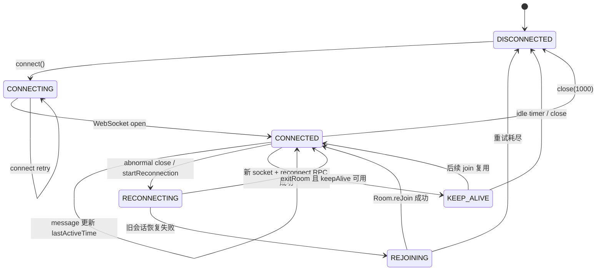
```mermaid
stateDiagram-v2
    [*] --> DISCONNECTED
    DISCONNECTED --> CONNECTING: connect()
    CONNECTING --> CONNECTED: WebSocket open
    CONNECTING --> CONNECTING: connect retry
    CONNECTED --> CONNECTED: message 更新 lastActiveTime
    CONNECTED --> RECONNECTING: abnormal close / startReconnection
    RECONNECTING --> CONNECTED: 新 socket + reconnect RPC 成功
    RECONNECTING --> REJOINING: 旧会话恢复失败
    REJOINING --> CONNECTED: Room.reJoin 成功
    REJOINING --> DISCONNECTED: 重试耗尽
    CONNECTED --> KEEP_ALIVE: exitRoom 且 keepAlive 可用
    KEEP_ALIVE --> CONNECTED: 后续 join 复用
    KEEP_ALIVE --> DISCONNECTED: idle timer / close
    CONNECTED --> DISCONNECTED: close(1000)
```

`isOnline` 不是 Ping/Pong；它要求状态为 CONNECTED 且最近 12 秒内收到过服务端消息。

## 6. 本地麦克风：捕获、处理、播放参考和发布

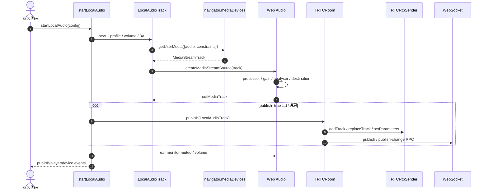
```mermaid
sequenceDiagram
    autonumber
    actor App as 业务代码
    participant SDK as startLocalAudio
    participant LAT as LocalAudioTrack
    participant MD as navigator.mediaDevices
    participant WA as Web Audio
    participant Room as TRTCRoom
    participant Sender as RTCRtpSender
    participant Signal as WebSocket

    App->>SDK: startLocalAudio(config)
    SDK->>LAT: new + profile / volume / 3A
    LAT->>MD: getUserMedia({audio: constraints})
    MD-->>LAT: MediaStreamTrack
    LAT->>WA: createMediaStreamSource(track)
    WA->>WA: processor / gain / analyser / destination
    WA-->>LAT: outMediaTrack
    opt publish=true 且已进房
        SDK->>Room: publish(LocalAudioTrack)
        Room->>Sender: addTrack / replaceTrack / setParameters
        Room->>Signal: publish / publish-change RPC
    end
    SDK->>WA: ear monitor muted / volume
    SDK-->>App: publish/player/device events
```

`microphoneId` 进入 `deviceId` 约束；`audioTrack` 走 custom source；3A 字段进入 getUserMedia 或后续更新分支。

## 7. 本地摄像头更新决策

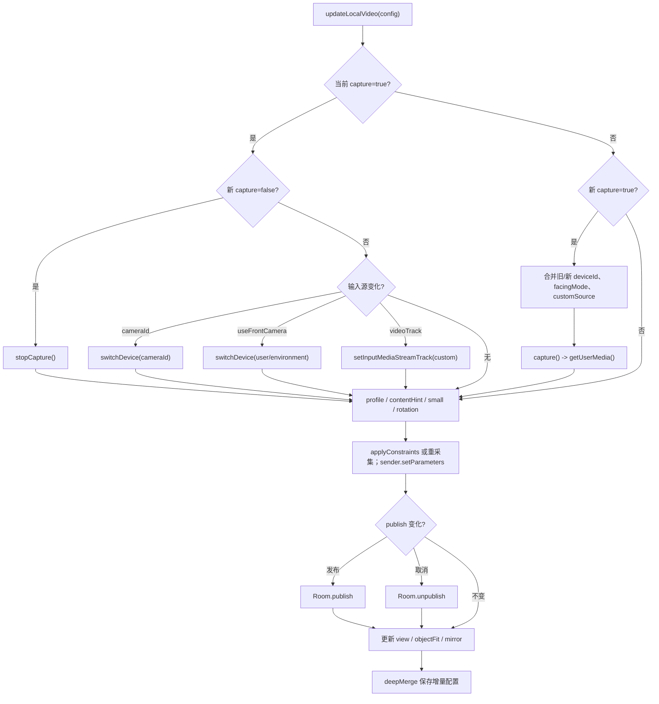
```mermaid
flowchart TD
    Update["updateLocalVideo(config)"] --> Capturing{"当前 capture=true?"}
    Capturing -- 是 --> StopCapture{"新 capture=false?"}
    StopCapture -- 是 --> Stop["stopCapture()"]
    StopCapture -- 否 --> Source{"输入源变化?"}
    Source -- cameraId --> SwitchId["switchDevice(cameraId)"]
    Source -- useFrontCamera --> SwitchFacing["switchDevice(user/environment)"]
    Source -- videoTrack --> Custom["setInputMediaStreamTrack(custom)"]
    Source -- 无 --> Profile
    Capturing -- 否 --> StartCapture{"新 capture=true?"}
    StartCapture -- 是 --> Merge["合并旧/新 deviceId、facingMode、customSource"]
    Merge --> GUM["capture() -> getUserMedia()"]
    StartCapture -- 否 --> Profile["profile / contentHint / small / rotation"]
    SwitchId --> Profile
    SwitchFacing --> Profile
    Custom --> Profile
    Stop --> Profile
    GUM --> Profile
    Profile --> Apply["applyConstraints 或重采集；sender.setParameters"]
    Apply --> Publish{"publish 变化?"}
    Publish -- 发布 --> Pub["Room.publish"]
    Publish -- 取消 --> Unpub["Room.unpublish"]
    Publish -- 不变 --> Play
    Pub --> Play["更新 view / objectFit / mirror"]
    Unpub --> Play
    Play --> Save["deepMerge 保存增量配置"]
```

设备切换、采集约束、编码码率和播放样式是四类不同更新，不应统一理解为 `applyConstraints()`。

## 8. 屏幕共享：浏览器停止按钮也是入口

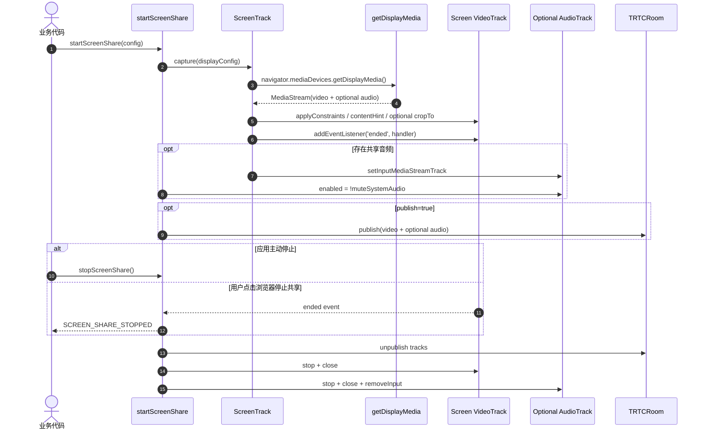
```mermaid
sequenceDiagram
    autonumber
    actor App as 业务代码
    participant SDK as startScreenShare
    participant Screen as ScreenTrack
    participant MD as getDisplayMedia
    participant Video as Screen VideoTrack
    participant Audio as Optional AudioTrack
    participant Room as TRTCRoom

    App->>SDK: startScreenShare(config)
    SDK->>Screen: capture(displayConfig)
    Screen->>MD: navigator.mediaDevices.getDisplayMedia()
    MD-->>Screen: MediaStream(video + optional audio)
    Screen->>Video: applyConstraints / contentHint / optional cropTo
    Screen->>Video: addEventListener('ended', handler)
    opt 存在共享音频
        Screen->>Audio: setInputMediaStreamTrack
        SDK->>Audio: enabled = !muteSystemAudio
    end
    opt publish=true
        SDK->>Room: publish(video + optional audio)
    end
    alt 应用主动停止
        App->>SDK: stopScreenShare()
    else 用户点击浏览器停止共享
        Video-->>SDK: ended event
        SDK-->>App: SCREEN_SHARE_STOPPED
    end
    SDK->>Room: unpublish tracks
    SDK->>Video: stop + close
    SDK->>Audio: stop + close + removeInput
```

共享目标、系统音频是否返回和用户授权由浏览器决定，`preferDisplaySurface` 只是偏好提示。

## 9. 远端视频：订阅成功到首帧之间还有四步

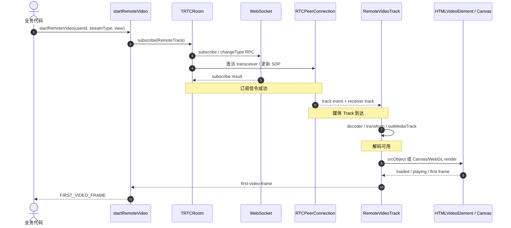
```mermaid
sequenceDiagram
    autonumber
    actor App as 业务代码
    participant SDK as startRemoteVideo
    participant Room as TRTCRoom
    participant Signal as WebSocket
    participant PC as RTCPeerConnection
    participant RT as RemoteVideoTrack
    participant View as HTMLVideoElement / Canvas

    App->>SDK: startRemoteVideo(userId, streamType, view)
    SDK->>Room: subscribe(RemoteTrack)
    Room->>Signal: subscribe / changeType RPC
    Room->>PC: 激活 transceiver / 更新 SDP
    Signal-->>Room: subscribe result
    Note over Room,PC: 订阅信令成功
    PC-->>RT: track event + receiver track
    Note over PC,RT: 媒体 Track 到达
    RT->>RT: decoder / transform / outMediaTrack
    Note over RT: 解码可用
    RT->>View: srcObject 或 Canvas/WebGL render
    View-->>RT: loaded / playing / first frame
    RT-->>SDK: first-video-frame
    SDK-->>App: FIRST_VIDEO_FRAME
```

订阅 RPC、`track` 事件、解码、`play()` 和首帧应分别记录，排障时不能只看一个“subscribe success”。

## 10. 可见性驱动订阅

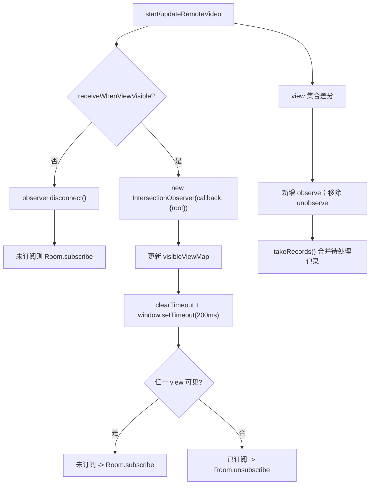
```mermaid
flowchart TD
    Config["start/updateRemoteVideo"] --> Enable{"receiveWhenViewVisible?"}
    Enable -- 否 --> Disconnect["observer.disconnect()"]
    Disconnect --> Ensure["未订阅则 Room.subscribe"]
    Enable -- 是 --> IO["new IntersectionObserver(callback, {root})"]
    IO --> Entries["更新 visibleViewMap"]
    Entries --> Debounce["clearTimeout + window.setTimeout(200ms)"]
    Debounce --> Any{"任一 view 可见?"}
    Any -- 是 --> Sub["未订阅 -> Room.subscribe"]
    Any -- 否 --> Unsub["已订阅 -> Room.unsubscribe"]
    Config --> Diff["view 集合差分"]
    Diff --> Observe["新增 observe；移除 unobserve"]
    Observe --> Records["takeRecords() 合并待处理记录"]
```

200 ms 合并窗口用于降低滚动和布局抖动造成的频繁订阅信令。

## 11. MediaStreamTrack 生命周期

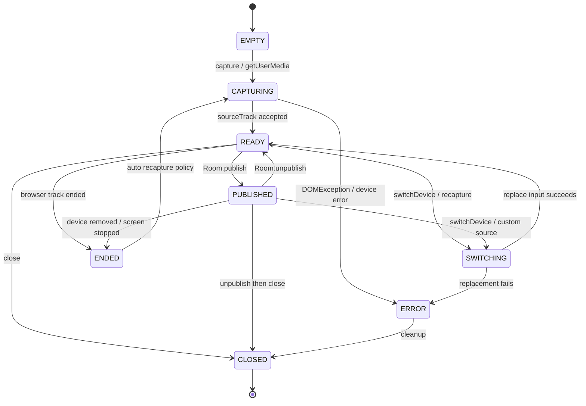
```mermaid
stateDiagram-v2
    [*] --> EMPTY
    EMPTY --> CAPTURING: capture / getUserMedia
    CAPTURING --> READY: sourceTrack accepted
    CAPTURING --> ERROR: DOMException / device error
    READY --> PUBLISHED: Room.publish
    PUBLISHED --> READY: Room.unpublish
    READY --> SWITCHING: switchDevice / recapture
    PUBLISHED --> SWITCHING: switchDevice / custom source
    SWITCHING --> READY: replace input succeeds
    SWITCHING --> ERROR: replacement fails
    READY --> ENDED: browser track ended
    PUBLISHED --> ENDED: device removed / screen stopped
    ENDED --> CAPTURING: auto recapture policy
    READY --> CLOSED: close
    PUBLISHED --> CLOSED: unpublish then close
    ERROR --> CLOSED: cleanup
    CLOSED --> [*]
```

`mute`/`enabled=false` 不等于 `ended`，player stop 不等于 source Track stop，sender `replaceTrack(null)` 也不一定停止原 Track；资源所有者必须分别处理。

## 12. Web Audio 处理图

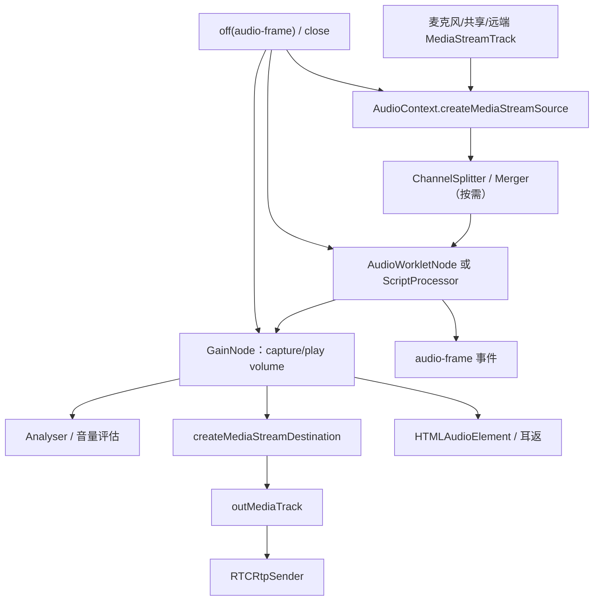
```mermaid
flowchart TB
    SourceTrack["麦克风/共享/远端 MediaStreamTrack"] --> MS["AudioContext.createMediaStreamSource"]
    MS --> Split["ChannelSplitter / Merger（按需）"]
    Split --> Processor["AudioWorkletNode 或 ScriptProcessor"]
    Processor --> Gain["GainNode：capture/play volume"]
    Gain --> Analyse["Analyser / 音量评估"]
    Gain --> Destination["createMediaStreamDestination"]
    Destination --> OutTrack["outMediaTrack"]
    OutTrack --> Sender["RTCRtpSender"]
    Gain --> Element["HTMLAudioElement / 耳返"]
    Processor --> PCM["audio-frame 事件"]
    Abort["off(audio-frame) / close"] --> Processor
    Abort --> Gain
    Abort --> MS
```

实际节点会按浏览器能力、插件和是否需要 processed track 增减；关闭时应解绑 port/message、disconnect nodes，并终止相应 Track。

## 13. 自动播放恢复

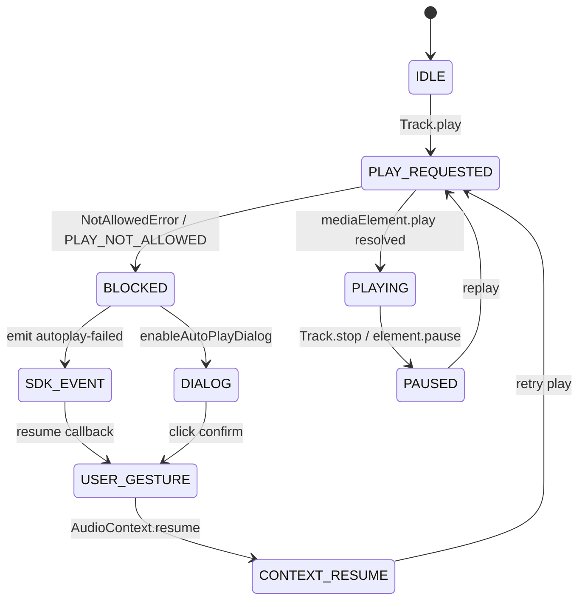
```mermaid
stateDiagram-v2
    [*] --> IDLE
    IDLE --> PLAY_REQUESTED: Track.play
    PLAY_REQUESTED --> PLAYING: mediaElement.play resolved
    PLAY_REQUESTED --> BLOCKED: NotAllowedError / PLAY_NOT_ALLOWED
    BLOCKED --> SDK_EVENT: emit autoplay-failed
    BLOCKED --> DIALOG: enableAutoPlayDialog
    SDK_EVENT --> USER_GESTURE: resume callback
    DIALOG --> USER_GESTURE: click confirm
    USER_GESTURE --> CONTEXT_RESUME: AudioContext.resume
    CONTEXT_RESUME --> PLAY_REQUESTED: retry play
    PLAYING --> PAUSED: Track.stop / element.pause
    PAUSED --> PLAY_REQUESTED: replay
```

恢复动作必须发生在用户手势调用栈中；只用定时器重试通常不能解除浏览器自动播放限制。

## 14. 视频渲染分支

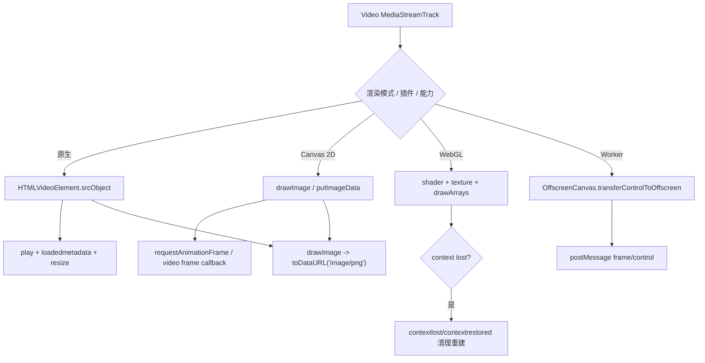
```mermaid
flowchart TD
    Track["Video MediaStreamTrack"] --> Mode{"渲染模式 / 插件 / 能力"}
    Mode -- 原生 --> Video["HTMLVideoElement.srcObject"]
    Video --> Play["play + loadedmetadata + resize"]
    Mode -- Canvas 2D --> Canvas["drawImage / putImageData"]
    Canvas --> RAF["requestAnimationFrame / video frame callback"]
    Mode -- WebGL --> GL["shader + texture + drawArrays"]
    GL --> Context{"context lost?"}
    Context -- 是 --> Restore["contextlost/contextrestored 清理重建"]
    Mode -- Worker --> Offscreen["OffscreenCanvas.transferControlToOffscreen"]
    Offscreen --> Worker["postMessage frame/control"]
    Video --> Snapshot["drawImage -> toDataURL('image/png')"]
    Canvas --> Snapshot
```

镜像、旋转、裁剪、alpha 和多画面组合在不同分支中落到 CSS、Canvas 坐标或 WebGL shader，不能只从 `fillMode` 推断最终实现。

## 15. Encoded Transform 与 Worker

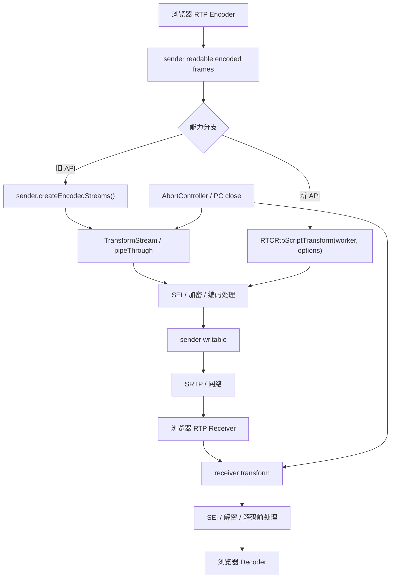
```mermaid
flowchart TB
    Encoder["浏览器 RTP Encoder"] --> Readable["sender readable encoded frames"]
    Readable --> Path{"能力分支"}
    Path -- 旧 API --> CES["sender.createEncodedStreams()"]
    CES --> Transform["TransformStream / pipeThrough"]
    Path -- 新 API --> Script["RTCRtpScriptTransform(worker, options)"]
    Transform --> WorkerLogic["SEI / 加密 / 编码处理"]
    Script --> WorkerLogic
    WorkerLogic --> Writable["sender writable"]
    Writable --> Network["SRTP / 网络"]

    Network --> Receiver["浏览器 RTP Receiver"]
    Receiver --> RTransform["receiver transform"]
    RTransform --> Parse["SEI / 解密 / 解码前处理"]
    Parse --> Decoder["浏览器 Decoder"]

    Abort["AbortController / PC close"] --> Transform
    Abort --> RTransform
```

旧 `createEncodedStreams()` 和新 `RTCRtpScriptTransform` 是两套分支；不能在同一个 sender/receiver 上无条件同时安装。

## 16. WebCodecs / WASM 插件管线

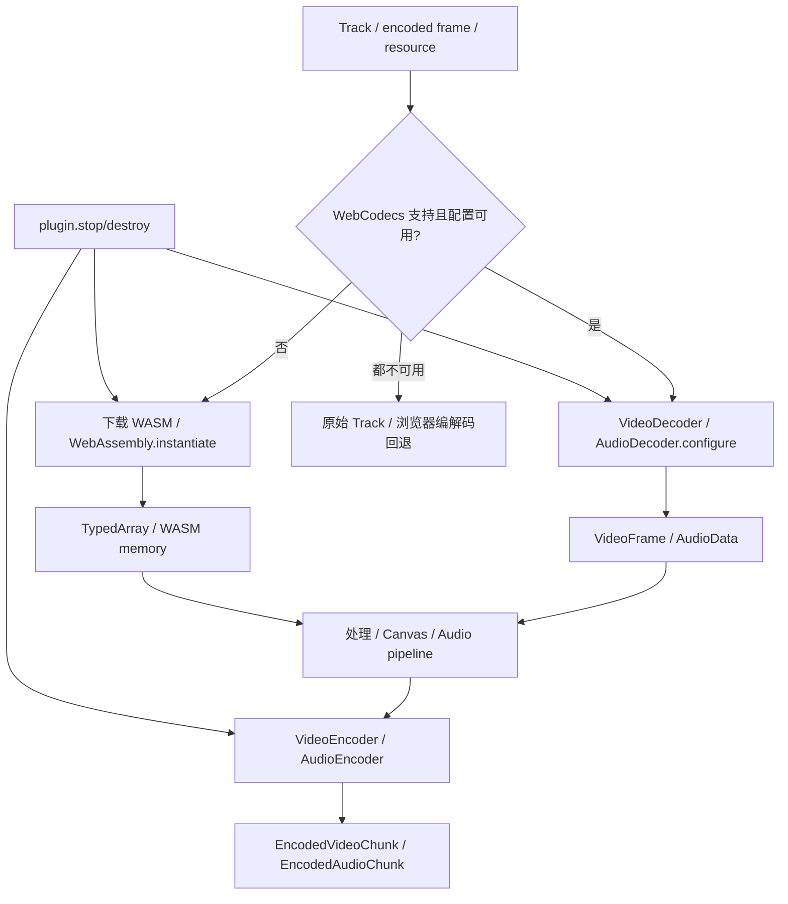
```mermaid
flowchart TB
    Input["Track / encoded frame / resource"] --> Capability{"WebCodecs 支持且配置可用?"}
    Capability -- 是 --> Decoder["VideoDecoder / AudioDecoder.configure"]
    Decoder --> Frame["VideoFrame / AudioData"]
    Frame --> Process["处理 / Canvas / Audio pipeline"]
    Process --> Encoder["VideoEncoder / AudioEncoder"]
    Encoder --> Output["EncodedVideoChunk / EncodedAudioChunk"]
    Capability -- 否 --> WASM["下载 WASM / WebAssembly.instantiate"]
    WASM --> Memory["TypedArray / WASM memory"]
    Memory --> Process
    Capability -- 都不可用 --> Fallback["原始 Track / 浏览器编解码回退"]
    Close["plugin.stop/destroy"] --> Decoder
    Close --> Encoder
    Close --> WASM
```

具体插件是否选 WebCodecs、WASM 或原生 Track 由插件实现、codec、浏览器和 feature flag 共同决定。

## 17. 权限、设备枚举和设备变化

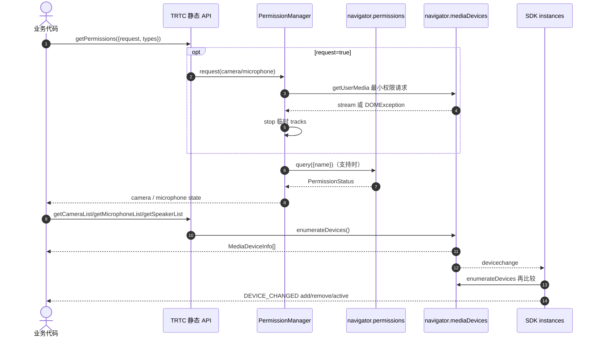
```mermaid
sequenceDiagram
    autonumber
    actor App as 业务代码
    participant TRTC as TRTC 静态 API
    participant PM as PermissionManager
    participant Perm as navigator.permissions
    participant MD as navigator.mediaDevices
    participant SDK as SDK instances

    App->>TRTC: getPermissions({request, types})
    opt request=true
        TRTC->>PM: request(camera/microphone)
        PM->>MD: getUserMedia 最小权限请求
        MD-->>PM: stream 或 DOMException
        PM->>PM: stop 临时 tracks
    end
    PM->>Perm: query({name})（支持时）
    Perm-->>PM: PermissionStatus
    PM-->>App: camera / microphone state
    App->>TRTC: getCameraList/getMicrophoneList/getSpeakerList
    TRTC->>MD: enumerateDevices()
    MD-->>App: MediaDeviceInfo[]
    MD-->>SDK: devicechange
    SDK->>MD: enumerateDevices 再比较
    SDK-->>App: DEVICE_CHANGED add/remove/active
```

授权前设备 label/deviceId 的可见程度受浏览器隐私策略影响；`devicechange` 本身不携带完整差异，需要重新枚举并比较。

## 18. 退出房间与销毁的差异

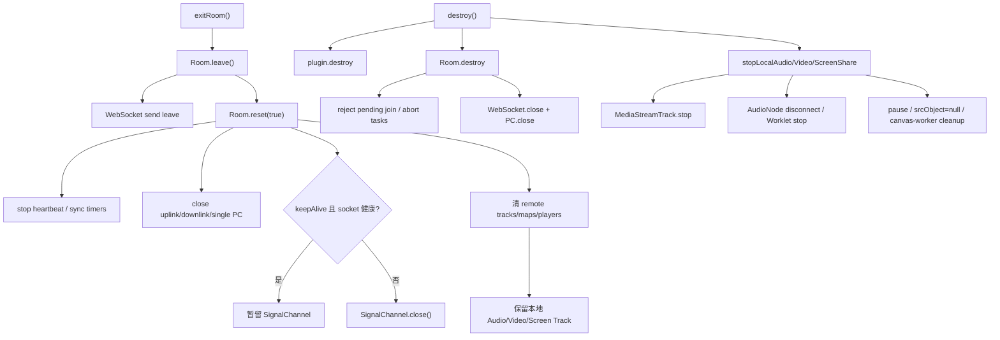
```mermaid
flowchart TD
    Exit["exitRoom()"] --> Leave["Room.leave()"]
    Leave --> LeaveMsg["WebSocket send leave"]
    Leave --> Reset["Room.reset(true)"]
    Reset --> Timers["stop heartbeat / sync timers"]
    Reset --> PCs["close uplink/downlink/single PC"]
    Reset --> SignalKeep{"keepAlive 且 socket 健康?"}
    SignalKeep -- 是 --> Keep["暂留 SignalChannel"]
    SignalKeep -- 否 --> CloseWS["SignalChannel.close()"]
    Reset --> Remote["清 remote tracks/maps/players"]
    Remote --> Preserve["保留本地 Audio/Video/Screen Track"]

    Destroy["destroy()"] --> Plugins["plugin.destroy"]
    Destroy --> RoomDestroy["Room.destroy"]
    RoomDestroy --> Abort["reject pending join / abort tasks"]
    RoomDestroy --> AllConn["WebSocket.close + PC.close"]
    Destroy --> StopLocal["stopLocalAudio/Video/ScreenShare"]
    StopLocal --> TrackStop["MediaStreamTrack.stop"]
    StopLocal --> AudioClose["AudioNode disconnect / Worklet stop"]
    StopLocal --> PlayerClose["pause / srcObject=null / canvas-worker cleanup"]
```

`exitRoom()` 为再次进房保留本地采集；`destroy()` 使实例失效并释放本地资源。门面 `destroy()` 是同步方法，不返回等待所有异步 stop 完成的 Promise。

## 19. 图与详细文档的对应关系

| 图 | 继续阅读 |
|---|---|
| 进入房间、主备信令、RPC、重连 | `03-WebSocket-usage-analysis.md`、`Appendix-E-Public-API-Call-Chains.md` |
| MPC/SPC、订阅、Encoded Transform | `02-RTCPeerConnection-usage-analysis.md` |
| 麦克风、摄像头、权限 | `04-MediaDevices-and-Capture.md` |
| 屏幕共享 | `04-MediaDevices-and-Capture.md` |
| Track 状态和释放 | `05-MediaStreamTrack-Lifecycle.md` |
| Web Audio、自动播放 | `06-Web-Audio-usage-analysis.md`、`07-Media-Playback-and-Rendering.md` |
| Canvas/WebGL | `07-Media-Playback-and-Rendering.md` |
| Worker/Streams、WebCodecs/WASM | `08-Worker-Streams-and-Encoded-Processing.md`、`09-WebCodecs-and-WebAssembly.md` |
| 权限、DOM、计时器 | `10-Auxiliary-Browser-APIs.md` |
